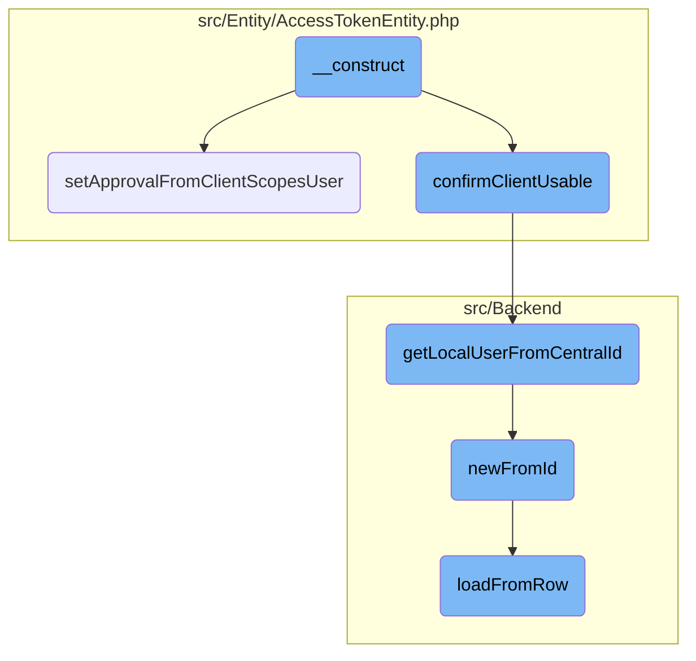
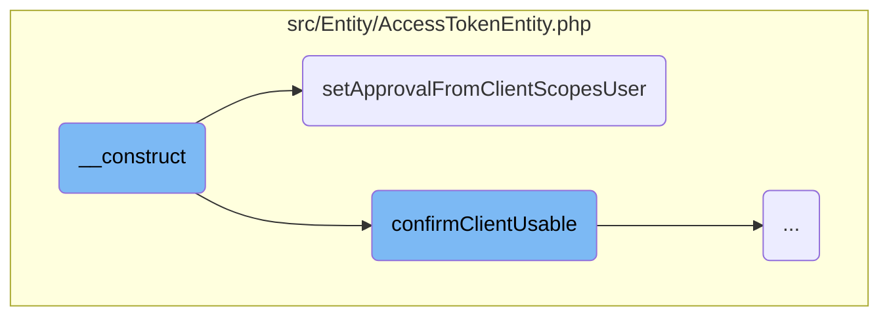
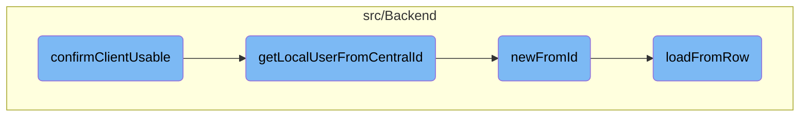

This document explains the process of initializing and validating an access token entity. The process involves setting the approval status, assigning the client and issuer, and confirming the client's usability.

The flow starts with initializing an access token entity, which involves setting the approval status based on the client, scopes, and user identifier. Next, the client and issuer are assigned. The process then confirms if the client is usable by the user by retrieving the local user from the central ID and checking the current authorization. If the client is not usable, an exception is thrown.

Here is a high level diagram of the flow, showing only the most important functions:



# Flow drill down

First, we'll zoom into this section of the flow:



<SwmSnippet path="/src/Entity/AccessTokenEntity.php" line="37">

---

## \__construct

The <SwmToken path="src/Entity/AccessTokenEntity.php" pos="44:5:5" line-data="	public function __construct(">`__construct`</SwmToken> function initializes an access token entity. It sets the approval status by calling <SwmToken path="src/Entity/AccessTokenEntity.php" pos="50:11:11" line-data="		$this-&gt;approval = $this-&gt;setApprovalFromClientScopesUser(">`setApprovalFromClientScopesUser`</SwmToken>, assigns the client and issuer, and validates the user identifier for <SwmToken path="src/Entity/AccessTokenEntity.php" pos="60:5:7" line-data="					&#39; for owner-only clients, &#39; . $userIdentifier . &#39; given&#39;">`owner-only`</SwmToken> clients. It also confirms the client's usability.

```hack
	/**
	 * @param ClientEntity $clientEntity
	 * @param ScopeEntityInterface[] $scopes
	 * @param string $issuer
	 * @param string|int|null $userIdentifier
	 * @throws OAuthServerException
	 */
	public function __construct(
		ClientEntity $clientEntity,
		array $scopes,
		string $issuer,
		$userIdentifier = null
	) {
		$this->approval = $this->setApprovalFromClientScopesUser(
			$clientEntity, $scopes, $userIdentifier
		);

		$this->setClient( $clientEntity );
		$this->setIssuer( $issuer );
		if ( $clientEntity->getOwnerOnly() ) {
			if ( $userIdentifier !== null && $userIdentifier !== $clientEntity->getUserId() ) {
```

---

</SwmSnippet>

<SwmSnippet path="/src/Entity/AccessTokenEntity.php" line="108">

---

## <SwmToken path="src/Entity/AccessTokenEntity.php" pos="114:5:5" line-data="	private function setApprovalFromClientScopesUser(">`setApprovalFromClientScopesUser`</SwmToken>

The <SwmToken path="src/Entity/AccessTokenEntity.php" pos="114:5:5" line-data="	private function setApprovalFromClientScopesUser(">`setApprovalFromClientScopesUser`</SwmToken> function determines the approval status of the access token based on the client entity, scopes, and user identifier. It retrieves the local user from the central ID and checks the current authorization. If the approval is valid and all scopes are approved, it returns the approval; otherwise, it returns false.

```hack
	/**
	 * @param ClientEntity $clientEntity
	 * @param array $scopes
	 * @param string|int|null $userIdentifier
	 * @return ConsumerAcceptance|false
	 */
	private function setApprovalFromClientScopesUser(
		ClientEntity $clientEntity, array $scopes, $userIdentifier = null
	) {
		if ( $clientEntity->getOwnerOnly() && $userIdentifier === null ) {
			$userIdentifier = $clientEntity->getUserId();
			$scopes = $clientEntity->getScopes();
		}
		if ( !$userIdentifier ) {
			return false;
		}
		try {
			$user = Utils::getLocalUserFromCentralId( $userIdentifier );
			$approval = $clientEntity->getCurrentAuthorization( $user, WikiMap::getCurrentWikiId() );
		} catch ( Throwable $ex ) {
			return false;
```

---

</SwmSnippet>

Now, lets zoom into this section of the flow:



<SwmSnippet path="/src/Entity/AccessTokenEntity.php" line="145">

---

## Confirming Client Usability

The function <SwmToken path="src/Entity/AccessTokenEntity.php" pos="145:5:5" line-data="	private function confirmClientUsable() {">`confirmClientUsable`</SwmToken> ensures that the client associated with the access token is usable by the user. It first retrieves the user identifier and then fetches the local user object using <SwmToken path="src/Entity/AccessTokenEntity.php" pos="147:8:8" line-data="		$user = Utils::getLocalUserFromCentralId( $userId );">`getLocalUserFromCentralId`</SwmToken>. If the user is not found, it defaults to a user with ID 0. Finally, it checks if the client is usable by the user and throws an <SwmToken path="src/Entity/AccessTokenEntity.php" pos="153:3:3" line-data="			throw OAuthServerException::accessDenied(">`OAuthServerException`</SwmToken> if it is not.

```hack
	private function confirmClientUsable() {
		$userId = $this->getUserIdentifier() ?? 0;
		$user = Utils::getLocalUserFromCentralId( $userId );
		if ( !$user ) {
			$user = User::newFromId( 0 );
		}

		if ( !$this->getClient()->isUsableBy( $user ) ) {
			throw OAuthServerException::accessDenied(
				'Client ' . $this->getClient()->getIdentifier() .
				' is not usable by user with ID ' . $user->getId()
			);
		}
	}
```

---

</SwmSnippet>

<SwmSnippet path="/src/Backend/Utils.php" line="295">

---

### Fetching Local User

The function <SwmToken path="src/Backend/Utils.php" pos="301:7:7" line-data="	public static function getLocalUserFromCentralId( $userId ) {">`getLocalUserFromCentralId`</SwmToken> retrieves a local user object based on a central wiki user ID. It uses a global ID lookup mechanism to find the user and ensures the user is attached. If the user is not found or not attached, it returns false.

```hack
	/**
	 * Given a central wiki user ID, get a local User object
	 *
	 * @param int $userId
	 * @return User|false False if not found
	 */
	public static function getLocalUserFromCentralId( $userId ) {
		global $wgMWOAuthSharedUserIDs, $wgMWOAuthSharedUserSource;

		// global ID required via hook
		if ( $wgMWOAuthSharedUserIDs ) {
			$lookup = MediaWikiServices::getInstance()
				->getCentralIdLookupFactory()
				->getLookup( $wgMWOAuthSharedUserSource );
			$user = $lookup->localUserFromCentralId( $userId );
			if ( $user === null || !$lookup->isAttached( $user ) ) {
				return false;
			}
			return User::newFromIdentity( $user );
		}

```

---

</SwmSnippet>

<SwmSnippet path="/src/Backend/MWOAuthDAO.php" line="96">

---

### Creating User from ID

The function <SwmToken path="src/Backend/MWOAuthDAO.php" pos="103:9:9" line-data="	final public static function newFromId( IDatabase $db, $id, $flags = 0 ) {">`newFromId`</SwmToken> creates a new user object from a given ID by querying the database. If the user is found, it loads the user data from the database row; otherwise, it returns false.

```hack
	/**
	 * @param IDatabase $db
	 * @param int $id
	 * @param int $flags IDBAccessObject::READ_* bitfield
	 * @return static|bool Returns false if not found
	 * @throws DBError
	 */
	final public static function newFromId( IDatabase $db, $id, $flags = 0 ) {
		$queryBuilder = $db->newSelectQueryBuilder()
			->select( array_values( static::getFieldColumnMap() ) )
			->from( static::getTable() )
			->where( [ static::getIdColumn() => (int)$id ] )
			->caller( __METHOD__ );
		if ( $flags & IDBAccessObject::READ_LOCKING ) {
			$queryBuilder->forUpdate();
		}
		$row = $queryBuilder->fetchRow();

		if ( $row ) {
			$class = static::getConsumerClass( (array)$row );
			$consumer = new $class();
```

---

</SwmSnippet>

<SwmSnippet path="/src/Backend/MWOAuthDAO.php" line="375">

---

### Loading User Data

The function <SwmToken path="src/Backend/MWOAuthDAO.php" pos="380:7:7" line-data="	final protected function loadFromRow( IDatabase $db, $row ) {">`loadFromRow`</SwmToken> loads user data from a database row into the user object. It decodes the row data and maps it to the user object's fields, marking the data as originating from the database.

```hack
	/**
	 * @param IDatabase $db
	 * @param stdClass|array $row
	 * @return void
	 */
	final protected function loadFromRow( IDatabase $db, $row ) {
		$row = $this->decodeRow( $db, (array)$row );
		$values = [];
		foreach ( static::getFieldColumnMap() as $field => $column ) {
			$values[$field] = $row[$column];
		}
		$this->loadFromValues( $values );
		$this->daoOrigin = 'db';
		$this->daoPending = false;
	}
```

---

</SwmSnippet>

&nbsp;

*This is an auto-generated document by Swimm AI 🌊 and has not yet been verified by a human*

<SwmMeta version="3.0.0" repo-id="Z2l0aHViJTNBJTNBbWVkaWF3aWtpLWV4dGVuc2lvbnMtT0F1dGglM0ElM0FTd2ltbS1EZW1v" repo-name="mediawiki-extensions-OAuth"><sup>Powered by [Swimm](/)</sup></SwmMeta>
