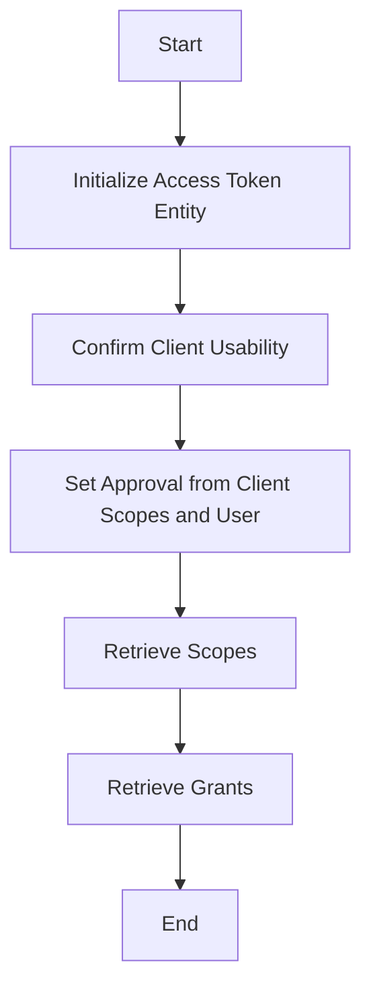

This document will cover the Access Token Initialization Flow, which includes:

1. Initializing the access token entity
2. Confirming client usability
3. Setting approval from client scopes and user
4. Retrieving scopes and grants.

Technical document: <SwmLink doc-title="Access Token Initialization Flow">[Access Token Initialization Flow](/.swm/access-token-initialization-flow.z9j73h48.sw.md)</SwmLink>

# [Initializing the Access Token Entity](https://app.swimm.io/repos/Z2l0aHViJTNBJTNBbWVkaWF3aWtpLWV4dGVuc2lvbnMtT0F1dGglM0ElM0FTd2ltbS1EZW1v/docs/z9j73h48#__construct-initialization)

The initialization of the access token entity involves setting the approval status based on the client, scopes, and user identifier. This step ensures that the access token is correctly associated with the client and user. If the client is owner-only, it verifies that the user identifier matches the client owner user ID. This step is crucial for ensuring that the access token is valid and can be used by the intended client and user.

# [Confirming Client Usability](https://app.swimm.io/repos/Z2l0aHViJTNBJTNBbWVkaWF3aWtpLWV4dGVuc2lvbnMtT0F1dGglM0ElM0FTd2ltbS1EZW1v/docs/z9j73h48#confirming-client-usability)

This step ensures that the client is usable by the user. It retrieves the user based on the user identifier and checks if the client is usable by this user. If the client is not usable by the user, an access denied exception is thrown. This step is important for maintaining security and ensuring that only authorized clients can use the access token.

# [Setting Approval from Client Scopes and User](https://app.swimm.io/repos/Z2l0aHViJTNBJTNBbWVkaWF3aWtpLWV4dGVuc2lvbnMtT0F1dGglM0ElM0FTd2ltbS1EZW1v/docs/z9j73h48#setting-approval-from-client-scopes-and-user)

This step involves checking if the client entity is owner-only and if the user identifier is null. If so, it sets the user identifier to the client's user ID and retrieves the client's scopes. This ensures that owner-only clients are correctly associated with their user IDs and scopes. This step is crucial for ensuring that the access token has the correct permissions and is associated with the correct user.

# [Retrieving Scopes](https://app.swimm.io/repos/Z2l0aHViJTNBJTNBbWVkaWF3aWtpLWV4dGVuc2lvbnMtT0F1dGglM0ElM0FTd2ltbS1EZW1v/docs/z9j73h48#retrieving-scopes)

This step involves retrieving the scopes associated with the client. Scopes define the permissions that the client has. This is done by iterating over the grants and creating new scope entities for each grant. This step is important for determining what actions the client is allowed to perform with the access token.

# [Retrieving Grants](https://app.swimm.io/repos/Z2l0aHViJTNBJTNBbWVkaWF3aWtpLWV4dGVuc2lvbnMtT0F1dGglM0ElM0FTd2ltbS1EZW1v/docs/z9j73h48#retrieving-grants)

This step involves retrieving the list of grants required by the application. Grants define the specific permissions that the application needs. This function calls the get method to fetch the grants, ensuring that the application has the necessary permissions. This step is crucial for ensuring that the access token has the correct permissions to perform the required actions.

&nbsp;

*This is an auto-generated document by Swimm 🌊 and has not yet been verified by a human*

<SwmMeta version="3.0.0" repo-id="Z2l0aHViJTNBJTNBbWVkaWF3aWtpLWV4dGVuc2lvbnMtT0F1dGglM0ElM0FTd2ltbS1EZW1v" repo-name="mediawiki-extensions-OAuth">Powered by [Swimm](/)</SwmMeta>
