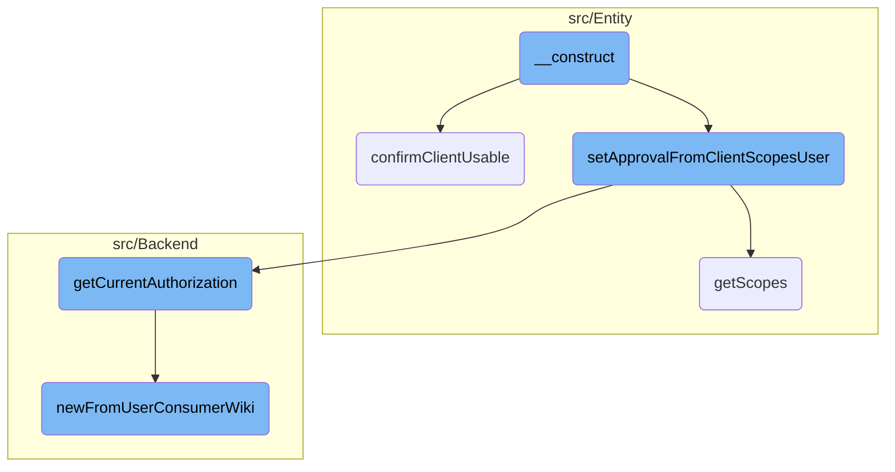
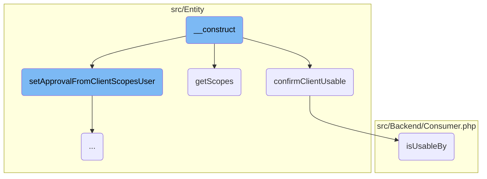
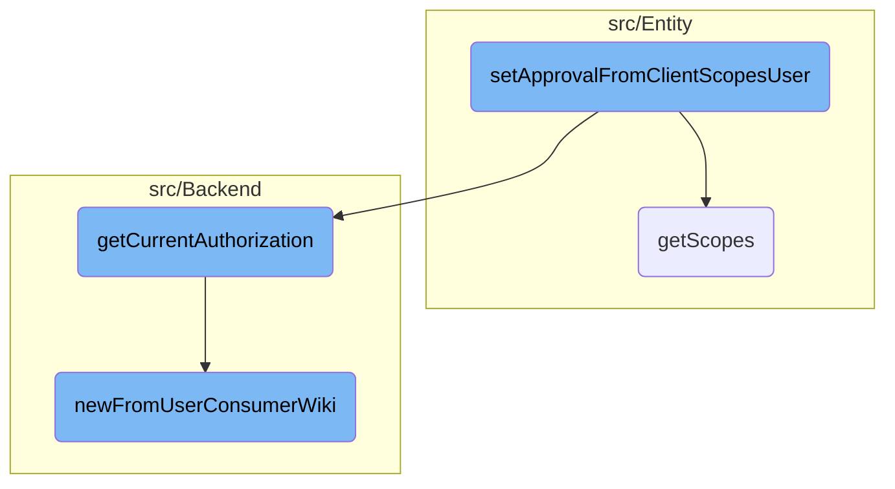

This document explains the initialization process of an access token entity. The process involves setting the client, issuer, and user identifier, as well as confirming the client's usability and setting the approval status based on the client, scopes, and user.

Here is a high level diagram of the flow, showing only the most important functions:



# Flow drill down

First, we'll zoom into this section of the flow:



<SwmSnippet path="/src/Entity/AccessTokenEntity.php" line="44">

---

## \__construct

The <SwmToken path="/src/Entity/AccessTokenEntity.php" pos="44:5:5" line-data="	public function __construct(">`__construct`</SwmToken> function initializes an access token entity by setting the client, issuer, and user identifier. It also sets the approval status based on the client, scopes, and user. If the client is <SwmToken path="/src/Entity/AccessTokenEntity.php" pos="60:5:7" line-data="					&#39; for owner-only clients, &#39; . $userIdentifier . &#39; given&#39;">`owner-only`</SwmToken>, it ensures the user identifier matches the client owner user ID. Finally, it confirms the client is usable.

```hack
	public function __construct(
		ClientEntity $clientEntity,
		array $scopes,
		string $issuer,
		$userIdentifier = null
	) {
		$this->approval = $this->setApprovalFromClientScopesUser(
			$clientEntity, $scopes, $userIdentifier
		);

		$this->setClient( $clientEntity );
		$this->setIssuer( $issuer );
		if ( $clientEntity->getOwnerOnly() ) {
			if ( $userIdentifier !== null && $userIdentifier !== $clientEntity->getUserId() ) {
				throw new InvalidArgumentException(
					'$userIdentifier must be null, or match the client owner user id,' .
					' for owner-only clients, ' . $userIdentifier . ' given'
				);
			}
			foreach ( $clientEntity->getScopes() as $scope ) {
				$this->addScope( $scope );
```

---

</SwmSnippet>

<SwmSnippet path="/src/Entity/AccessTokenEntity.php" line="145">

---

## <SwmToken path="/src/Entity/AccessTokenEntity.php" pos="145:5:5" line-data="	private function confirmClientUsable() {">`confirmClientUsable`</SwmToken>

The <SwmToken path="/src/Entity/AccessTokenEntity.php" pos="145:5:5" line-data="	private function confirmClientUsable() {">`confirmClientUsable`</SwmToken> function checks if the client is usable by the user. It retrieves the user based on the user identifier and verifies if the client <SwmToken path="/src/Backend/Consumer.php" pos="722:5:5" line-data="	public function isUsableBy( User $user ) {">`isUsableBy`</SwmToken> this user. If not, it throws an access denied exception.

```hack
	private function confirmClientUsable() {
		$userId = $this->getUserIdentifier() ?? 0;
		$user = Utils::getLocalUserFromCentralId( $userId );
		if ( !$user ) {
			$user = User::newFromId( 0 );
		}

		if ( !$this->getClient()->isUsableBy( $user ) ) {
			throw OAuthServerException::accessDenied(
				'Client ' . $this->getClient()->getIdentifier() .
				' is not usable by user with ID ' . $user->getId()
			);
		}
	}
```

---

</SwmSnippet>

<SwmSnippet path="/src/Backend/Consumer.php" line="722">

---

The <SwmToken path="/src/Backend/Consumer.php" pos="722:5:5" line-data="	public function isUsableBy( User $user ) {">`isUsableBy`</SwmToken> function checks if the consumer is usable by a given user. It verifies if the consumer is approved for <SwmToken path="/src/Backend/Consumer.php" pos="715:9:11" line-data="	 * - Approved for multi-user use">`multi-user`</SwmToken> use or if it is <SwmToken path="/src/Entity/AccessTokenEntity.php" pos="60:5:7" line-data="					&#39; for owner-only clients, &#39; . $userIdentifier . &#39; given&#39;">`owner-only`</SwmToken> and owned by the user. It also checks if the consumer is still pending approval and owned by the user.

```hack
	public function isUsableBy( User $user ) {
		if ( $this->stage === self::STAGE_APPROVED && !$this->getOwnerOnly() ) {
			return true;
		} elseif ( $this->stage === self::STAGE_PROPOSED || $this->stage === self::STAGE_APPROVED ) {
			$centralId = Utils::getCentralIdFromLocalUser( $user );
			return ( $centralId && $this->userId === $centralId );
		}

		return false;
	}
```

---

</SwmSnippet>

<SwmSnippet path="/src/Entity/ClientEntity.php" line="70">

---

## <SwmToken path="/src/Entity/ClientEntity.php" pos="70:5:5" line-data="	public function getScopes() {">`getScopes`</SwmToken>

The <SwmToken path="/src/Entity/ClientEntity.php" pos="70:5:5" line-data="	public function getScopes() {">`getScopes`</SwmToken> function returns an array of scope entities. It iterates over the grants of the client and creates a new scope entity for each grant.

```hack
	public function getScopes() {
		$scopeEntities = [];
		foreach ( $this->getGrants() as $grant ) {
			$scopeEntities[] = new ScopeEntity( $grant );
		}

		return $scopeEntities;
	}
```

---

</SwmSnippet>

Now, lets zoom into this section of the flow:



<SwmSnippet path="/src/Entity/AccessTokenEntity.php" line="114">

---

## Handling user authorization and scope approval

First, the function <SwmToken path="/src/Entity/AccessTokenEntity.php" pos="114:5:5" line-data="	private function setApprovalFromClientScopesUser(">`setApprovalFromClientScopesUser`</SwmToken> checks if the client entity is <SwmToken path="/src/Entity/AccessTokenEntity.php" pos="60:5:7" line-data="					&#39; for owner-only clients, &#39; . $userIdentifier . &#39; given&#39;">`owner-only`</SwmToken> and if the user identifier is null. If so, it sets the user identifier to the client's user ID and retrieves the scopes from the client entity. This ensures that the correct user and scopes are used for the authorization process.

```hack
	private function setApprovalFromClientScopesUser(
		ClientEntity $clientEntity, array $scopes, $userIdentifier = null
	) {
		if ( $clientEntity->getOwnerOnly() && $userIdentifier === null ) {
			$userIdentifier = $clientEntity->getUserId();
			$scopes = $clientEntity->getScopes();
		}
		if ( !$userIdentifier ) {
			return false;
		}
		try {
			$user = Utils::getLocalUserFromCentralId( $userIdentifier );
			$approval = $clientEntity->getCurrentAuthorization( $user, WikiMap::getCurrentWikiId() );
		} catch ( Throwable $ex ) {
			return false;
		}
		if ( !$approval ) {
			return $approval;
		}

		$approvedScopes = $approval->getGrants();
```

---

</SwmSnippet>

<SwmSnippet path="/src/Entity/AccessTokenEntity.php" line="124">

---

Next, the function attempts to get the local user from the central ID and retrieves the current authorization for the user and the current wiki. If any errors occur during this process, the function returns false, indicating that the authorization could not be retrieved.

```hack
		try {
			$user = Utils::getLocalUserFromCentralId( $userIdentifier );
			$approval = $clientEntity->getCurrentAuthorization( $user, WikiMap::getCurrentWikiId() );
		} catch ( Throwable $ex ) {
			return false;
		}
```

---

</SwmSnippet>

<SwmSnippet path="/src/Entity/AccessTokenEntity.php" line="130">

---

Then, the function checks if the authorization was successfully retrieved. If not, it returns the authorization. If the authorization was retrieved, it compares the approved scopes with the requested scopes and filters out any scopes that were not approved. Finally, it returns the authorization if all requested scopes were approved, otherwise, it returns false.

```hack
		if ( !$approval ) {
			return $approval;
		}

		$approvedScopes = $approval->getGrants();
		$notApproved = array_filter(
			$scopes,
			static function ( ScopeEntityInterface $scope ) use ( $approvedScopes ) {
				return !in_array( $scope->getIdentifier(), $approvedScopes, true );
			}
		);

		return !$notApproved ? $approval : false;
	}
```

---

</SwmSnippet>

<SwmSnippet path="/src/Backend/Consumer.php" line="531">

---

### Retrieving current authorization

Moving to the <SwmToken path="/src/Backend/Consumer.php" pos="531:5:5" line-data="	public function getCurrentAuthorization( User $mwUser, $wikiId ) {">`getCurrentAuthorization`</SwmToken> function, it attempts to find an authorization for the user for the specified consumer. It first retrieves the central user ID from the local user and checks if the consumer is applicable to the current wiki or all wikis. It then calls the <SwmToken path="/src/Backend/ConsumerAcceptance.php" pos="131:7:7" line-data="	public static function newFromUserConsumerWiki(">`newFromUserConsumerWiki`</SwmToken> function to retrieve the authorization.

```hack
	public function getCurrentAuthorization( User $mwUser, $wikiId ) {
		$dbr = Utils::getCentralDB( DB_REPLICA );

		$centralUserId = Utils::getCentralIdFromLocalUser( $mwUser );
		if ( !$centralUserId ) {
			throw new MWOAuthException(
				'mwoauthserver-invalid-user',
				[
					'consumer_name' => $this->getName(),
					Message::rawParam( Linker::makeExternalLink(
						'https://www.mediawiki.org/wiki/Help:OAuth/Errors#E008',
						'E008',
						true
					) ),
					'consumer' => $this->getConsumerKey(),
				]
			);
		}

		$checkWiki = $this->getWiki() !== '*' ? $this->getWiki() : $wikiId;

```

---

</SwmSnippet>

<SwmSnippet path="/src/Backend/ConsumerAcceptance.php" line="131">

---

### Creating authorization from user, consumer, and wiki

Finally, the <SwmToken path="/src/Backend/ConsumerAcceptance.php" pos="131:7:7" line-data="	public static function newFromUserConsumerWiki(">`newFromUserConsumerWiki`</SwmToken> function constructs a query to find the authorization record for the user, consumer, and wiki. If a record is found, it creates a new <SwmToken path="/src/Entity/AccessTokenEntity.php" pos="13:10:10" line-data="use MediaWiki\Extension\OAuth\Backend\ConsumerAcceptance;">`ConsumerAcceptance`</SwmToken> object and loads the data from the row. If no record is found, it returns false, indicating that no authorization exists for the specified parameters.

```hack
	public static function newFromUserConsumerWiki(
		IDatabase $db, $userId, $consumer,
		$wiki, $flags = 0, $oauthVersion = Consumer::OAUTH_VERSION_1
	) {
		$queryBuilder = $db->newSelectQueryBuilder()
			->select( array_values( static::getFieldColumnMap() ) )
			->from( static::getTable() )
			->where( [
				'oaac_user_id' => $userId,
				'oaac_consumer_id' => $consumer->getId(),
				'oaac_oauth_version' => $oauthVersion,
				'oaac_wiki' => (string)$wiki
			] )
			->caller( __METHOD__ );
		if ( $flags & IDBAccessObject::READ_LOCKING ) {
			$queryBuilder->forUpdate();
		}
		$row = $queryBuilder->fetchRow();

		if ( $row ) {
			$consumer = new self();
```

---

</SwmSnippet>

&nbsp;

*This is an auto-generated document by Swimm 🌊 and has not yet been verified by a human*

<SwmMeta version="3.0.0" repo-id="Z2l0aHViJTNBJTNBbWVkaWF3aWtpLWV4dGVuc2lvbnMtT0F1dGglM0ElM0FTd2ltbS1EZW1v" repo-name="mediawiki-extensions-OAuth"><sup>Powered by [Swimm](https://app.swimm.io/)</sup></SwmMeta>
