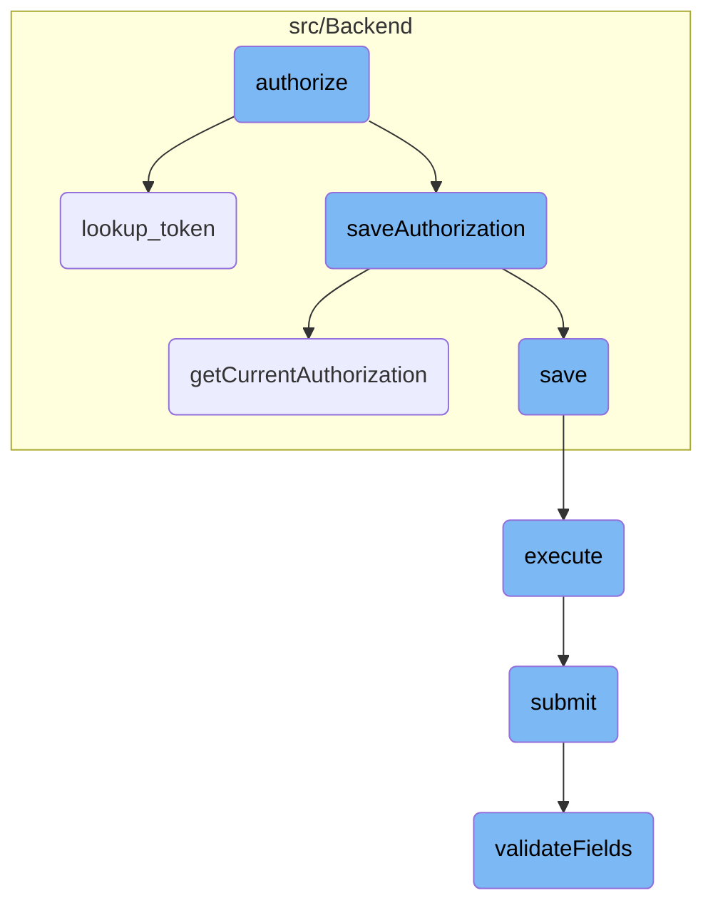
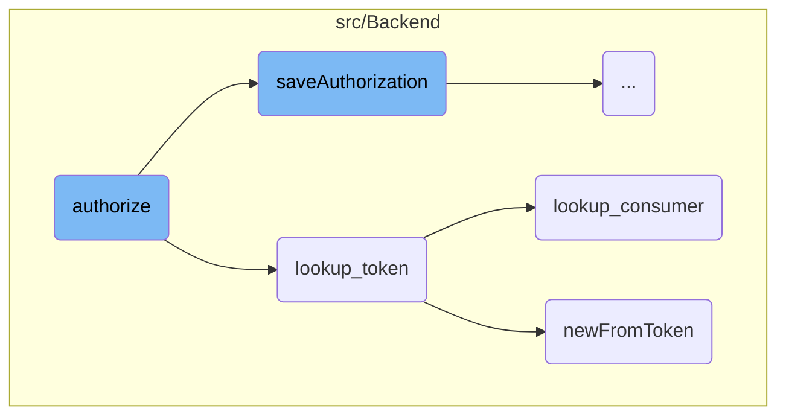
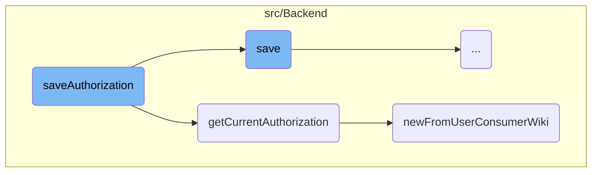
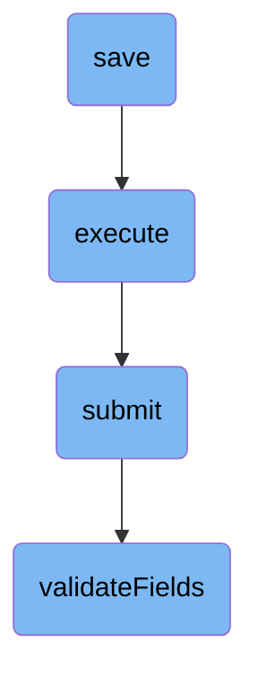

This document explains the authorization process, which involves validating and authorizing a request token provided by a consumer. The process includes several steps such as conducting authorization checks, generating verification codes, updating tokens, and saving authorization data.

The authorization process starts with checking if the user is valid and has the necessary permissions. Then, a verification code is generated and added to the request token. The system checks if the authorization already exists and updates it if necessary. If it's a new authorization, a new access token is generated and saved. Finally, the user is redirected back to the consumer with the updated authorization details.

Here is a high level diagram of the flow, showing only the most important functions:



# Flow drill down

First, we'll zoom into this section of the flow:



<SwmSnippet path="/src/Backend/OAuth1Consumer.php" line="35">

---

## Authorize

The <SwmToken path="src/Backend/OAuth1Consumer.php" pos="47:5:5" line-data="	public function authorize( User $mwUser, $update, $grants, $requestTokenKey = null ) {">`authorize`</SwmToken> function is responsible for authorizing the request token provided by the consumer. It performs several key steps: conducting authorization checks, generating a verification code, updating the request token with this code, saving the authorization, generating a new access token if necessary, and finally generating the callback URL to redirect the user back to the consumer.

```hack
	/**
	 * The user has authorized the request by this consumer, with this request token. Update
	 * everything so that the consumer can swap the request token for an access token. Then
	 * generate the callback URL where we will redirect our user back to the consumer.
	 *
	 * @param User $mwUser
	 * @param bool $update
	 * @param array $grants
	 * @param string|null $requestTokenKey
	 * @return string
	 * @throws MWOAuthException
	 */
	public function authorize( User $mwUser, $update, $grants, $requestTokenKey = null ) {
		$this->conductAuthorizationChecks( $mwUser );

		// Generate and Update the tokens:
		// * Generate a new Verification code, and add it to the request token
		// * Either add or update the authorization
		// ** Generate a new access token if this is a new authorization
		// * Resave request token with the access token
		$verifyCode = MWCryptRand::generateHex( 32 );
```

---

</SwmSnippet>

<SwmSnippet path="/src/Backend/MWOAuthDataStore.php" line="68">

---

## Lookup Token

The <SwmToken path="src/Backend/MWOAuthDataStore.php" pos="77:5:5" line-data="	public function lookup_token( $consumer, $token_type, $token ) {">`lookup_token`</SwmToken> function retrieves either a request or access token from the data store. It checks if the token is already used or not found, and throws appropriate exceptions. For access tokens, it ensures the token's consumer matches the expected consumer.

```hack
	/**
	 * Get either a request or access token from the data store
	 *
	 * @param OAuthConsumer|Consumer $consumer
	 * @param string $token_type
	 * @param string $token String the token
	 * @throws MWOAuthException
	 * @return MWOAuthToken
	 */
	public function lookup_token( $consumer, $token_type, $token ) {
		$this->logger->debug( __METHOD__ . ": Looking up $token_type token '$token'" );

		if ( $token_type === 'request' ) {
			$returnToken = $this->tokenCache->get( Utils::getCacheKey(
				'token',
				$consumer->key,
				$token_type,
				$token
			) );
			if ( $returnToken === '**USED**' ) {
				throw new MWOAuthException( 'mwoauthdatastore-request-token-already-used', [
```

---

</SwmSnippet>

<SwmSnippet path="/src/Backend/MWOAuthDataStore.php" line="58">

---

### Lookup Consumer

The <SwmToken path="src/Backend/MWOAuthDataStore.php" pos="64:5:5" line-data="	public function lookup_consumer( $consumerKey ) {">`lookup_consumer`</SwmToken> function retrieves an <SwmToken path="src/Backend/MWOAuthDataStore.php" pos="59:7:7" line-data="	 * Get an MWOAuthConsumer from the consumer&#39;s key">`MWOAuthConsumer`</SwmToken> object from the consumer's key. This is used to validate that the token's consumer matches the expected consumer.

```hack
	/**
	 * Get an MWOAuthConsumer from the consumer's key
	 *
	 * @param string $consumerKey the string value of the Consumer's key
	 * @return Consumer|false
	 */
	public function lookup_consumer( $consumerKey ) {
		return Consumer::newFromKey( $this->centralReplica, $consumerKey );
	}
```

---

</SwmSnippet>

<SwmSnippet path="/src/Backend/ConsumerAcceptance.php" line="96">

---

### New From Token

The <SwmToken path="src/Backend/ConsumerAcceptance.php" pos="102:7:7" line-data="	public static function newFromToken( IDatabase $db, $token, $flags = 0 ) {">`newFromToken`</SwmToken> function creates a <SwmToken path="src/Backend/ConsumerAcceptance.php" pos="99:11:11" line-data="	 * @param int $flags ConsumerAcceptance::READ_* bitfield">`ConsumerAcceptance`</SwmToken> object from an access token. It queries the database to fetch the relevant row and loads the consumer data from this row.

```hack
	/**
	 * @param IDatabase $db
	 * @param string $token Access token
	 * @param int $flags ConsumerAcceptance::READ_* bitfield
	 * @return ConsumerAcceptance|bool
	 */
	public static function newFromToken( IDatabase $db, $token, $flags = 0 ) {
		$queryBuilder = $db->newSelectQueryBuilder()
			->select( array_values( static::getFieldColumnMap() ) )
			->from( static::getTable() )
			->where( [ 'oaac_access_token' => (string)$token ] )
			->caller( __METHOD__ );
		if ( $flags & IDBAccessObject::READ_LOCKING ) {
			$queryBuilder->forUpdate();
		}
		$row = $queryBuilder->fetchRow();

		if ( $row ) {
			$consumer = new self();
			$consumer->loadFromRow( $db, $row );
			return $consumer;
```

---

</SwmSnippet>

Now, lets zoom into this section of the flow:



<SwmSnippet path="/src/Backend/Consumer.php" line="648">

---

## Handling User Authorization

The <SwmToken path="src/Backend/Consumer.php" pos="655:5:5" line-data="	protected function saveAuthorization( User $mwUser, $update, $grants ) {">`saveAuthorization`</SwmToken> function starts by checking if the user has a global account using <SwmToken path="src/Backend/Consumer.php" pos="657:6:8" line-data="		$centralUserId = Utils::getCentralIdFromLocalUser( $mwUser );">`Utils::getCentralIdFromLocalUser`</SwmToken>. If no global account is found, an <SwmToken path="src/Backend/Consumer.php" pos="653:6:6" line-data="	 * @throws MWOAuthException">`MWOAuthException`</SwmToken> is thrown, indicating an invalid user.

```hack
	/**
	 * @param User $mwUser
	 * @param bool $update
	 * @param string[] $grants
	 * @return ConsumerAcceptance
	 * @throws MWOAuthException
	 */
	protected function saveAuthorization( User $mwUser, $update, $grants ) {
		// CentralAuth may abort here if there is no global account for this user
		$centralUserId = Utils::getCentralIdFromLocalUser( $mwUser );
		if ( !$centralUserId ) {
			throw new MWOAuthException(
				'mwoauthserver-invalid-user',
				[
					'consumer_name' => $this->getName(),
					Message::rawParam( Linker::makeExternalLink(
						'https://www.mediawiki.org/wiki/Help:OAuth/Errors#E008',
						'E008',
						true
					) ),
					'consumer' => $this->getConsumerKey(),
```

---

</SwmSnippet>

<SwmSnippet path="/src/Backend/Consumer.php" line="673">

---

## Checking Existing Authorization

The function then retrieves the current authorization for the user and the current wiki using <SwmToken path="src/Backend/Consumer.php" pos="675:9:9" line-data="		$cmra = $this-&gt;getCurrentAuthorization( $mwUser, WikiMap::getCurrentWikiId() );">`getCurrentAuthorization`</SwmToken>. This step is crucial to determine if the authorization needs to be updated or if a new one should be created.

```hack
		$dbw = Utils::getCentralDB( DB_PRIMARY );
		// Check if this authorization exists
		$cmra = $this->getCurrentAuthorization( $mwUser, WikiMap::getCurrentWikiId() );

```

---

</SwmSnippet>

<SwmSnippet path="/src/Backend/Consumer.php" line="677">

---

### Updating Existing Authorization

If an update is requested and an existing authorization is found, the function updates the authorization fields such as <SwmToken path="src/Backend/Consumer.php" pos="687:2:2" line-data="				&#39;wiki&#39;   =&gt; $this-&gt;getWiki(),">`wiki`</SwmToken> and <SwmToken path="src/Backend/Consumer.php" pos="688:2:2" line-data="				&#39;grants&#39; =&gt; $grants">`grants`</SwmToken>, and then saves the updated authorization to the database.

```hack
		if ( $update ) {
			// This should be an update to an existing authorization
			if ( !$cmra ) {
				// update requested, but no existing key
				throw new MWOAuthException( 'mwoauthserver-invalid-request', [
					'consumer' => $this->getConsumerKey(),
					'consumer_name' => $this->getName(),
				] );
			}
			$cmra->setFields( [
				'wiki'   => $this->getWiki(),
				'grants' => $grants
			] );
			$cmra->save( $dbw );
```

---

</SwmSnippet>

<SwmSnippet path="/src/Backend/Consumer.php" line="691">

---

### Creating New Authorization

If no existing authorization is found, a new authorization is created. The function generates a new access token and sets various fields like <SwmToken path="src/Backend/Consumer.php" pos="697:2:2" line-data="				&#39;userId&#39;       =&gt; $centralUserId,">`userId`</SwmToken>, <SwmToken path="src/Backend/Consumer.php" pos="698:2:2" line-data="				&#39;consumerId&#39;   =&gt; $this-&gt;getId(),">`consumerId`</SwmToken>, <SwmToken path="src/Backend/Consumer.php" pos="693:2:2" line-data="			$accessToken = MWOAuthDataStore::newToken();">`accessToken`</SwmToken>, and <SwmToken path="src/Backend/Consumer.php" pos="701:2:2" line-data="				&#39;grants&#39;       =&gt; $grants,">`grants`</SwmToken>. The new authorization is then saved to the database.

```hack
		} elseif ( !$cmra ) {
			// Add the Authorization to the database
			$accessToken = MWOAuthDataStore::newToken();
			$cmra = ConsumerAcceptance::newFromArray( [
				'id'           => null,
				'wiki'         => $this->getWiki(),
				'userId'       => $centralUserId,
				'consumerId'   => $this->getId(),
				'accessToken'  => $accessToken->key,
				'accessSecret' => $accessToken->secret,
				'grants'       => $grants,
				'accepted'     => wfTimestampNow(),
				'oauth_version' => $this->getOAuthVersion()
			] );
			$cmra->save( $dbw );
```

---

</SwmSnippet>

<SwmSnippet path="/src/Backend/Consumer.php" line="514">

---

## Retrieving Current Authorization

The <SwmToken path="src/Backend/Consumer.php" pos="531:5:5" line-data="	public function getCurrentAuthorization( User $mwUser, $wikiId ) {">`getCurrentAuthorization`</SwmToken> function attempts to find an existing authorization for the user. It checks for authorizations specific to the current wiki and then for all wikis. This function ensures that the most specific authorization is used.

```hack
	/**
	 * Attempts to find an authorization by this user for this consumer. Since a user can
	 * accept a consumer multiple times (once for "*" and once for each specific wiki),
	 * there can several access tokens per-wiki (with varying grants) for a consumer.
	 * This will choose the most wiki-specific access token. The precedence is:
	 * a) The acceptance for wiki X if the consumer is applicable only to wiki X
	 * b) The acceptance for wiki $wikiId (if the consumer is applicable to it)
	 * c) The acceptance for wikis "*" (all wikis)
	 *
	 * Users might want more grants on some wikis than on "*". Note that the reverse would not
	 * make sense, since the consumer could just use the "*" acceptance if it has more grants.
	 *
	 * @param User $mwUser (local wiki user) User who may or may not have authorizations
	 * @param string $wikiId
	 * @throws MWOAuthException
	 * @return ConsumerAcceptance|bool
	 */
	public function getCurrentAuthorization( User $mwUser, $wikiId ) {
		$dbr = Utils::getCentralDB( DB_REPLICA );

		$centralUserId = Utils::getCentralIdFromLocalUser( $mwUser );
```

---

</SwmSnippet>

<SwmSnippet path="/src/Backend/ConsumerAcceptance.php" line="122">

---

## Creating Authorization from User and Consumer

The <SwmToken path="src/Backend/ConsumerAcceptance.php" pos="131:7:7" line-data="	public static function newFromUserConsumerWiki(">`newFromUserConsumerWiki`</SwmToken> function is used to create a <SwmToken path="src/Backend/ConsumerAcceptance.php" pos="127:11:11" line-data="	 * @param int $flags ConsumerAcceptance::READ_* bitfield">`ConsumerAcceptance`</SwmToken> object from the user and consumer details. It queries the database to find an existing authorization and returns it if found, otherwise returns false.

```hack
	/**
	 * @param IDatabase $db
	 * @param int $userId of user who authorized (central wiki's id)
	 * @param Consumer $consumer
	 * @param string $wiki wiki associated with the acceptance
	 * @param int $flags ConsumerAcceptance::READ_* bitfield
	 * @param int $oauthVersion
	 * @return ConsumerAcceptance|bool
	 */
	public static function newFromUserConsumerWiki(
		IDatabase $db, $userId, $consumer,
		$wiki, $flags = 0, $oauthVersion = Consumer::OAUTH_VERSION_1
	) {
		$queryBuilder = $db->newSelectQueryBuilder()
			->select( array_values( static::getFieldColumnMap() ) )
			->from( static::getTable() )
			->where( [
				'oaac_user_id' => $userId,
				'oaac_consumer_id' => $consumer->getId(),
				'oaac_oauth_version' => $oauthVersion,
				'oaac_wiki' => (string)$wiki
```

---

</SwmSnippet>

Now, lets zoom into this section of the flow:



<SwmSnippet path="/src/Backend/MWOAuthDAO.php" line="186">

---

## Handling Database Save Operations

The <SwmToken path="src/Backend/MWOAuthDAO.php" pos="186:5:5" line-data="	public function save( IDatabase $dbw ) {">`save`</SwmToken> function is responsible for saving authorization data to the database. It first checks if the database is in <SwmToken path="src/Backend/MWOAuthDAO.php" pos="192:31:33" line-data="			throw new DBReadOnlyError( $dbw, __CLASS__ . &quot;: tried to save while db is read-only&quot; );">`read-only`</SwmToken> mode and throws an error if it is. If the object originates from the database and has pending changes, it updates the existing record. If the object is new, it inserts a new record into the database. This ensures that the authorization data is correctly stored and updated as needed.

```hack
	public function save( IDatabase $dbw ) {
		global $wgMWOAuthReadOnly;

		$uniqueId = $this->getIdValue();
		$idColumn = static::getIdColumn();
		if ( $wgMWOAuthReadOnly ) {
			throw new DBReadOnlyError( $dbw, __CLASS__ . ": tried to save while db is read-only" );
		}
		if ( $this->daoOrigin === 'db' ) {
			if ( $this->daoPending ) {
				$this->logger->debug( get_class( $this ) . ': performing DB update; object changed.' );
				$dbw->newUpdateQueryBuilder()
					->update( static::getTable() )
					->set( $this->getRowArray( $dbw ) )
					->where( [ $idColumn => $uniqueId ] )
					->caller( __METHOD__ )
					->execute();
				$this->daoPending = false;
				return $dbw->affectedRows() > 0;
			} else {
				$this->logger->debug( get_class( $this ) . ': skipping DB update; object unchanged.' );
```

---

</SwmSnippet>

<SwmSnippet path="/src/Rest/Handler/AbstractClientHandler.php" line="28">

---

## Executing Client Requests

The <SwmToken path="src/Rest/Handler/AbstractClientHandler.php" pos="28:5:5" line-data="	public function execute(): ResponseInterface {">`execute`</SwmToken> function handles client requests by first assuming the user is authenticated. It creates a response factory and retrieves unified parameters. It then initializes a <SwmToken path="src/Rest/Handler/AbstractClientHandler.php" pos="34:8:8" line-data="		$control = new ConsumerSubmitControl(">`ConsumerSubmitControl`</SwmToken> object and calls its <SwmToken path="src/Rest/Handler/AbstractClientHandler.php" pos="40:9:9" line-data="		$status = $control-&gt;submit();">`submit`</SwmToken> method. Depending on the status of the submission, it either returns a JSON response with client data or throws an HTTP exception. This function ensures that client requests are processed and appropriate responses are generated.

```hack
	public function execute(): ResponseInterface {
		// At this point we assume user is authenticated and has valid session
		// Authentication can be achieved over CentralAuth or Access token in authorization header
		$responseFactory = $this->getResponseFactory();
		$params = $this->getUnifiedParams();

		$control = new ConsumerSubmitControl(
			RequestContext::getMain(),
			$params,
			Utils::getCentralDB( DB_PRIMARY )
		);

		$status = $control->submit();
		if ( $status->isGood() ) {
			$value = $status->getValue();
			if ( isset( $value['result']['consumer'] ) ) {
				/** @var ClientEntity $client */
				$client = $value['result']['consumer'];
				$data = [
					'name' => $client->getName(),
					'client_key' => $client->getConsumerKey(),
```

---

</SwmSnippet>

<SwmSnippet path="/src/Control/SubmitControl.php" line="67">

---

## Submitting Data

The <SwmToken path="src/Control/SubmitControl.php" pos="67:5:5" line-data="	public function submit() {">`submit`</SwmToken> function is responsible for validating and submitting data. It first checks basic permissions and validates the action and parameters. If the action is valid, it processes the action and returns the status. If the action is not handled, it throws an exception. This function ensures that data submissions are validated and processed correctly.

```hack
	public function submit() {
		$status = $this->checkBasePermissions();
		if ( !$status->isOK() ) {
			return $status;
		}

		$action = $this->vals['action'];
		$required = $this->getRequiredFields();
		if ( !isset( $required[$action] ) ) {
			// @TODO: check for field-specific message first
			return $this->failure( 'invalid_field_action', 'mwoauth-invalid-field', 'action' );
		}

		$status = $this->validateFields( $required[$action] );
		if ( !$status->isOK() ) {
			return $status;
		}

		$status = $this->processAction( $action );
		if ( $status instanceof Status ) {
			return $status;
```

---

</SwmSnippet>

<SwmSnippet path="/src/Control/SubmitControl.php" line="260">

---

## Validating Fields

The <SwmToken path="src/Control/SubmitControl.php" pos="260:5:5" line-data="	protected function validateFields( array $required ) {">`validateFields`</SwmToken> function checks that the action is valid and that the required fields are present and valid. It iterates over the required fields and performs validation using either a regex or a callback. If a field is missing or invalid, it returns a failure status. This function ensures that all required fields are validated before proceeding with the submission.

```hack
	protected function validateFields( array $required ) {
		foreach ( $required as $field => $validator ) {
			if ( !isset( $this->vals[$field] ) ) {
				return $this->failure( "missing_field_$field", 'mwoauth-missing-field', $field );
			} elseif ( !is_scalar( $this->vals[$field] )
				&& !in_array( $field, [ 'restrictions', 'oauth2GrantTypes' ], true )
			) {
				return $this->failure( "invalid_field_$field", 'mwoauth-invalid-field', $field );
			}
			if ( is_string( $this->vals[$field] ) ) {
				$this->vals[$field] = trim( $this->vals[$field] );
			}
			$validationResult = $this->getValidationResult( $validator, $this->vals[$field], $this->vals );
			if ( $validationResult === false ) {
				$message = $this->getDefaultValidationError( $field, $this->vals[$field] );
				return $this->failure( "invalid_field_$field", $message );
			} elseif ( $validationResult instanceof ApiMessage ) {
				return $this->failure( $validationResult->getApiCode(), $validationResult, $field );
			}
		}
		return $this->success();
```

---

</SwmSnippet>

&nbsp;

*This is an auto-generated document by Swimm AI 🌊 and has not yet been verified by a human*

<SwmMeta version="3.0.0" repo-id="Z2l0aHViJTNBJTNBbWVkaWF3aWtpLWV4dGVuc2lvbnMtT0F1dGglM0ElM0FTd2ltbS1EZW1v" repo-name="mediawiki-extensions-OAuth"><sup>Powered by [Swimm](/)</sup></SwmMeta>
