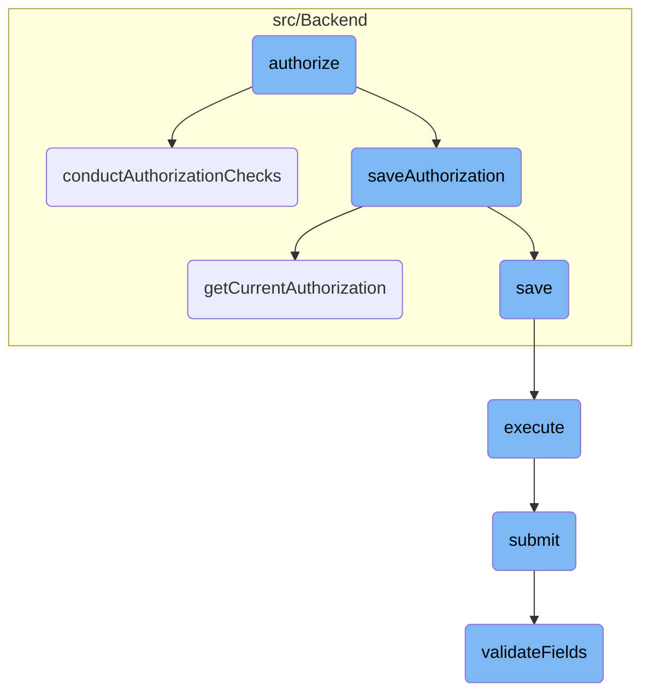
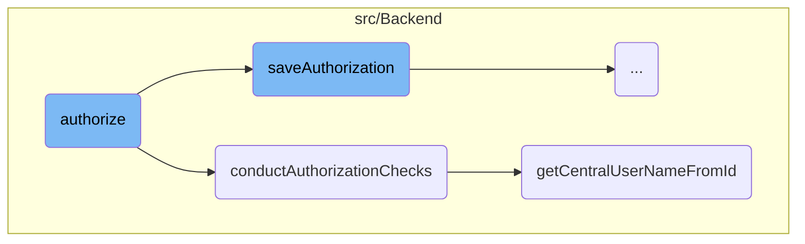
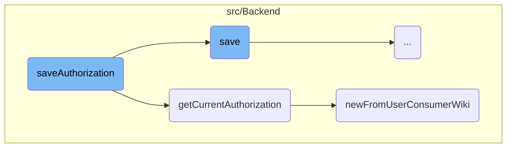
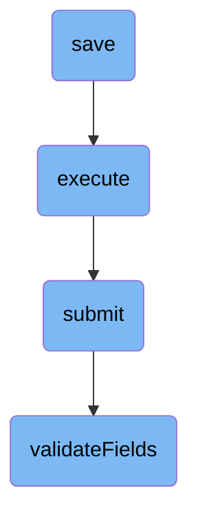

This document provides an overview of the authorization process. It outlines the key steps involved in authorizing a user, including conducting authorization checks, saving authorization details, and handling the submission of authorization data.

The authorization process starts by checking if the user has the necessary permissions. If the user passes these checks, the system verifies the requested permissions (scopes) and saves the authorization details. Finally, the system processes the authorization request and provides feedback to the client.

Here is a high level diagram of the flow, showing only the most important functions:



# Flow drill down

First, we'll zoom into this section of the flow:



<SwmSnippet path="/src/Entity/ClientEntity.php" line="127">

---

## Authorize

The <SwmToken path="src/Entity/ClientEntity.php" pos="135:5:5" line-data="	public function authorize( User $mwUser, $update, $grants, $requestTokenKey = null ) {">`authorize`</SwmToken> function is responsible for initiating the authorization process. It first conducts authorization checks to ensure the user has the necessary permissions. Then, it verifies the scopes (grants) and finally saves the authorization details.

```hack
	/**
	 * @param User $mwUser
	 * @param bool $update
	 * @param string[] $grants
	 * @param null $requestTokenKey
	 * @return bool
	 * @throws MWOAuthException
	 */
	public function authorize( User $mwUser, $update, $grants, $requestTokenKey = null ) {
		$this->conductAuthorizationChecks( $mwUser );

		$grants = $this->getVerifiedScopes( $grants );
		$this->saveAuthorization( $mwUser, $update, $grants );

		return true;
	}
```

---

</SwmSnippet>

<SwmSnippet path="/src/Backend/Consumer.php" line="582">

---

## Conduct Authorization Checks

The <SwmToken path="src/Backend/Consumer.php" pos="588:5:5" line-data="	protected function conductAuthorizationChecks( User $mwUser ) {">`conductAuthorizationChecks`</SwmToken> function verifies if the user can authorize the consumer. It checks if the user is locked or blocked, if the consumer is deleted, and if the consumer is usable by the user. If any of these checks fail, an exception is thrown with a specific error message.

```hack
	/**
	 * Verify that this user can authorize this consumer
	 *
	 * @param User $mwUser
	 * @throws MWOAuthException
	 */
	protected function conductAuthorizationChecks( User $mwUser ) {
		global $wgBlockDisablesLogin;

		// Check that user and consumer are in good standing
		if ( $mwUser->isLocked() || ( $wgBlockDisablesLogin && $mwUser->getBlock() ) ) {
			throw new MWOAuthException( 'mwoauthserver-insufficient-rights', [
				Message::rawParam( Linker::makeExternalLink(
					'https://www.mediawiki.org/wiki/Help:OAuth/Errors#E007',
					'E007',
					true
				) ),
				'consumer' => $this->getConsumerKey(),
				'consumer_name' => $this->getName(),
			] );
		}
```

---

</SwmSnippet>

<SwmSnippet path="/src/Backend/Utils.php" line="254">

---

### Getting Central Username from ID

The <SwmToken path="src/Backend/Utils.php" pos="262:7:7" line-data="	public static function getCentralUserNameFromId( $userId, $audience = false ) {">`getCentralUserNameFromId`</SwmToken> function retrieves the central username based on the user ID. It uses the central ID lookup service to get the username, considering the audience parameter to determine if hidden names should be shown.

```hack
	/**
	 * Given a central wiki user ID, get a central username
	 *
	 * @param int $userId
	 * @param bool|User|string $audience show hidden names based on this user, or false for public
	 * @throws MWException
	 * @return string|bool Username, false if not found, empty string if name is hidden
	 */
	public static function getCentralUserNameFromId( $userId, $audience = false ) {
		global $wgMWOAuthSharedUserIDs, $wgMWOAuthSharedUserSource;

		// global ID required via hook
		if ( $wgMWOAuthSharedUserIDs ) {
			$lookup = MediaWikiServices::getInstance()
				->getCentralIdLookupFactory()
				->getLookup( $wgMWOAuthSharedUserSource );
			$name = $lookup->nameFromCentralId(
				$userId,
				$audience === 'raw'
					? CentralIdLookup::AUDIENCE_RAW
					: ( $audience ?: CentralIdLookup::AUDIENCE_PUBLIC )
```

---

</SwmSnippet>

Now, lets zoom into this section of the flow:



<SwmSnippet path="/src/Backend/Consumer.php" line="648">

---

## Handling User Authorization

The <SwmToken path="src/Backend/Consumer.php" pos="655:5:5" line-data="	protected function saveAuthorization( User $mwUser, $update, $grants ) {">`saveAuthorization`</SwmToken> function is responsible for handling user authorization. It first checks if the user has a global account. If not, it throws an exception. Then, it checks if there is an existing authorization for the user. If an update is requested but no existing authorization is found, it throws an exception. If an update is requested and an existing authorization is found, it updates the authorization with new grants. If no existing authorization is found, it creates a new authorization record in the database.

```hack
	/**
	 * @param User $mwUser
	 * @param bool $update
	 * @param string[] $grants
	 * @return ConsumerAcceptance
	 * @throws MWOAuthException
	 */
	protected function saveAuthorization( User $mwUser, $update, $grants ) {
		// CentralAuth may abort here if there is no global account for this user
		$centralUserId = Utils::getCentralIdFromLocalUser( $mwUser );
		if ( !$centralUserId ) {
			throw new MWOAuthException(
				'mwoauthserver-invalid-user',
				[
					'consumer_name' => $this->getName(),
					Message::rawParam( Linker::makeExternalLink(
						'https://www.mediawiki.org/wiki/Help:OAuth/Errors#E008',
						'E008',
						true
					) ),
					'consumer' => $this->getConsumerKey(),
```

---

</SwmSnippet>

<SwmSnippet path="/src/Backend/Consumer.php" line="514">

---

### Checking for Existing Authorization

The <SwmToken path="src/Backend/Consumer.php" pos="531:5:5" line-data="	public function getCurrentAuthorization( User $mwUser, $wikiId ) {">`getCurrentAuthorization`</SwmToken> function attempts to find an existing authorization for the user. It checks for the most specific authorization available, prioritizing specific wikis over general authorizations. If no specific authorization is found, it checks for a general authorization that applies to all wikis.

```hack
	/**
	 * Attempts to find an authorization by this user for this consumer. Since a user can
	 * accept a consumer multiple times (once for "*" and once for each specific wiki),
	 * there can several access tokens per-wiki (with varying grants) for a consumer.
	 * This will choose the most wiki-specific access token. The precedence is:
	 * a) The acceptance for wiki X if the consumer is applicable only to wiki X
	 * b) The acceptance for wiki $wikiId (if the consumer is applicable to it)
	 * c) The acceptance for wikis "*" (all wikis)
	 *
	 * Users might want more grants on some wikis than on "*". Note that the reverse would not
	 * make sense, since the consumer could just use the "*" acceptance if it has more grants.
	 *
	 * @param User $mwUser (local wiki user) User who may or may not have authorizations
	 * @param string $wikiId
	 * @throws MWOAuthException
	 * @return ConsumerAcceptance|bool
	 */
	public function getCurrentAuthorization( User $mwUser, $wikiId ) {
		$dbr = Utils::getCentralDB( DB_REPLICA );

		$centralUserId = Utils::getCentralIdFromLocalUser( $mwUser );
```

---

</SwmSnippet>

<SwmSnippet path="/src/Backend/ConsumerAcceptance.php" line="122">

---

### Creating New Authorization Record

The <SwmToken path="src/Backend/ConsumerAcceptance.php" pos="131:7:7" line-data="	public static function newFromUserConsumerWiki(">`newFromUserConsumerWiki`</SwmToken> function creates a new authorization record in the database. It constructs a query to find an existing authorization record for the user and consumer. If a record is found, it loads the authorization data. If no record is found, it returns false, indicating that no authorization exists.

```hack
	/**
	 * @param IDatabase $db
	 * @param int $userId of user who authorized (central wiki's id)
	 * @param Consumer $consumer
	 * @param string $wiki wiki associated with the acceptance
	 * @param int $flags ConsumerAcceptance::READ_* bitfield
	 * @param int $oauthVersion
	 * @return ConsumerAcceptance|bool
	 */
	public static function newFromUserConsumerWiki(
		IDatabase $db, $userId, $consumer,
		$wiki, $flags = 0, $oauthVersion = Consumer::OAUTH_VERSION_1
	) {
		$queryBuilder = $db->newSelectQueryBuilder()
			->select( array_values( static::getFieldColumnMap() ) )
			->from( static::getTable() )
			->where( [
				'oaac_user_id' => $userId,
				'oaac_consumer_id' => $consumer->getId(),
				'oaac_oauth_version' => $oauthVersion,
				'oaac_wiki' => (string)$wiki
```

---

</SwmSnippet>

Now, lets zoom into this section of the flow:



<SwmSnippet path="/src/Backend/MWOAuthDAO.php" line="186">

---

## Handling the Save Operation

The <SwmToken path="src/Backend/MWOAuthDAO.php" pos="186:5:5" line-data="	public function save( IDatabase $dbw ) {">`save`</SwmToken> function is responsible for saving the authorization data to the database. It first checks if the database is in <SwmToken path="src/Backend/MWOAuthDAO.php" pos="192:31:33" line-data="			throw new DBReadOnlyError( $dbw, __CLASS__ . &quot;: tried to save while db is read-only&quot; );">`read-only`</SwmToken> mode and throws an error if it is. If the object originates from the database and has pending changes, it performs an update; otherwise, it performs an insert for new objects. This ensures that the authorization data is correctly stored and updated in the database.

```hack
	public function save( IDatabase $dbw ) {
		global $wgMWOAuthReadOnly;

		$uniqueId = $this->getIdValue();
		$idColumn = static::getIdColumn();
		if ( $wgMWOAuthReadOnly ) {
			throw new DBReadOnlyError( $dbw, __CLASS__ . ": tried to save while db is read-only" );
		}
		if ( $this->daoOrigin === 'db' ) {
			if ( $this->daoPending ) {
				$this->logger->debug( get_class( $this ) . ': performing DB update; object changed.' );
				$dbw->newUpdateQueryBuilder()
					->update( static::getTable() )
					->set( $this->getRowArray( $dbw ) )
					->where( [ $idColumn => $uniqueId ] )
					->caller( __METHOD__ )
					->execute();
				$this->daoPending = false;
				return $dbw->affectedRows() > 0;
			} else {
				$this->logger->debug( get_class( $this ) . ': skipping DB update; object unchanged.' );
```

---

</SwmSnippet>

<SwmSnippet path="/src/Rest/Handler/AbstractClientHandler.php" line="28">

---

## Executing the Authorization

The <SwmToken path="src/Rest/Handler/AbstractClientHandler.php" pos="28:5:5" line-data="	public function execute(): ResponseInterface {">`execute`</SwmToken> function handles the execution of the authorization process. It assumes the user is authenticated and has a valid session. It creates a <SwmToken path="src/Rest/Handler/AbstractClientHandler.php" pos="34:8:8" line-data="		$control = new ConsumerSubmitControl(">`ConsumerSubmitControl`</SwmToken> object and calls its <SwmToken path="src/Rest/Handler/AbstractClientHandler.php" pos="40:9:9" line-data="		$status = $control-&gt;submit();">`submit`</SwmToken> method. If the submission is successful, it returns a JSON response with the client data; otherwise, it throws an appropriate HTTP exception. This step is crucial for processing the authorization request and providing feedback to the client.

```hack
	public function execute(): ResponseInterface {
		// At this point we assume user is authenticated and has valid session
		// Authentication can be achieved over CentralAuth or Access token in authorization header
		$responseFactory = $this->getResponseFactory();
		$params = $this->getUnifiedParams();

		$control = new ConsumerSubmitControl(
			RequestContext::getMain(),
			$params,
			Utils::getCentralDB( DB_PRIMARY )
		);

		$status = $control->submit();
		if ( $status->isGood() ) {
			$value = $status->getValue();
			if ( isset( $value['result']['consumer'] ) ) {
				/** @var ClientEntity $client */
				$client = $value['result']['consumer'];
				$data = [
					'name' => $client->getName(),
					'client_key' => $client->getConsumerKey(),
```

---

</SwmSnippet>

<SwmSnippet path="/src/Control/SubmitControl.php" line="67">

---

## Submitting the Data

The <SwmToken path="src/Control/SubmitControl.php" pos="67:5:5" line-data="	public function submit() {">`submit`</SwmToken> function is responsible for validating and submitting the authorization data. It checks the basic permissions, validates the action and parameters, and routes the submission handling to the appropriate internal function. If any validation fails, it returns an error status. This function ensures that the data being submitted meets the required criteria and is processed correctly.

```hack
	public function submit() {
		$status = $this->checkBasePermissions();
		if ( !$status->isOK() ) {
			return $status;
		}

		$action = $this->vals['action'];
		$required = $this->getRequiredFields();
		if ( !isset( $required[$action] ) ) {
			// @TODO: check for field-specific message first
			return $this->failure( 'invalid_field_action', 'mwoauth-invalid-field', 'action' );
		}

		$status = $this->validateFields( $required[$action] );
		if ( !$status->isOK() ) {
			return $status;
		}

		$status = $this->processAction( $action );
		if ( $status instanceof Status ) {
			return $status;
```

---

</SwmSnippet>

<SwmSnippet path="/src/Control/SubmitControl.php" line="260">

---

### Validating Fields

The <SwmToken path="src/Control/SubmitControl.php" pos="260:5:5" line-data="	protected function validateFields( array $required ) {">`validateFields`</SwmToken> function checks that the required fields for the action are present and valid. It iterates over the required fields, ensuring each field is set and meets the validation criteria. If any field is missing or invalid, it returns a failure status. This function is essential for ensuring the integrity and correctness of the submitted data.

```hack
	protected function validateFields( array $required ) {
		foreach ( $required as $field => $validator ) {
			if ( !isset( $this->vals[$field] ) ) {
				return $this->failure( "missing_field_$field", 'mwoauth-missing-field', $field );
			} elseif ( !is_scalar( $this->vals[$field] )
				&& !in_array( $field, [ 'restrictions', 'oauth2GrantTypes' ], true )
			) {
				return $this->failure( "invalid_field_$field", 'mwoauth-invalid-field', $field );
			}
			if ( is_string( $this->vals[$field] ) ) {
				$this->vals[$field] = trim( $this->vals[$field] );
			}
			$validationResult = $this->getValidationResult( $validator, $this->vals[$field], $this->vals );
			if ( $validationResult === false ) {
				$message = $this->getDefaultValidationError( $field, $this->vals[$field] );
				return $this->failure( "invalid_field_$field", $message );
			} elseif ( $validationResult instanceof ApiMessage ) {
				return $this->failure( $validationResult->getApiCode(), $validationResult, $field );
			}
		}
		return $this->success();
```

---

</SwmSnippet>

&nbsp;

*This is an auto-generated document by Swimm AI 🌊 and has not yet been verified by a human*

<SwmMeta version="3.0.0" repo-id="Z2l0aHViJTNBJTNBbWVkaWF3aWtpLWV4dGVuc2lvbnMtT0F1dGglM0ElM0FTd2ltbS1EZW1v" repo-name="mediawiki-extensions-OAuth"><sup>Powered by [Swimm](/)</sup></SwmMeta>
