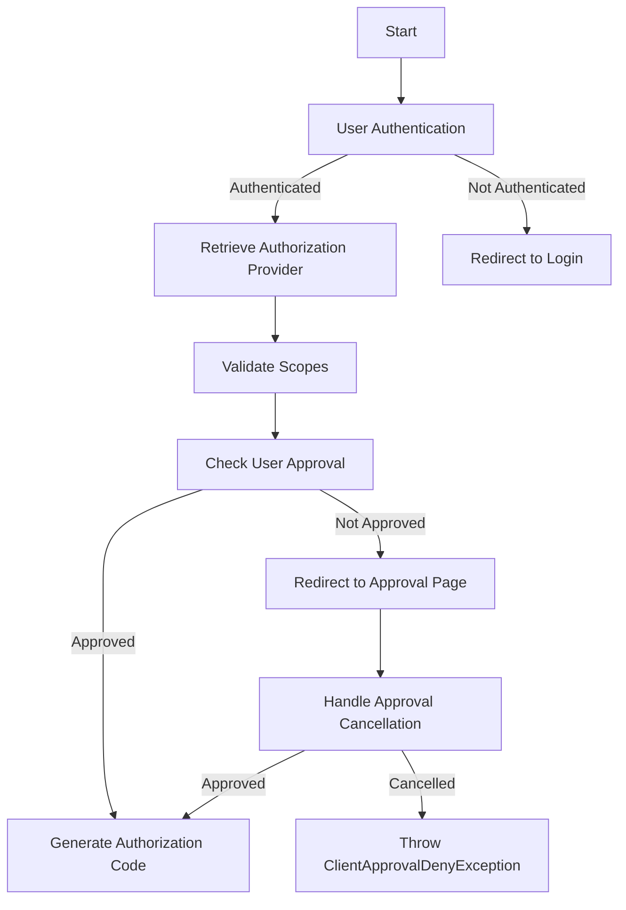

# Intro

This document provides an overview of the authorization process in the `MediaWiki` `OAuth` extension. It covers the key components and steps involved in handling authorization requests, managing user authentication, validating scopes, and generating authorization codes.

<SwmSnippet path="src/Rest/Handler/Authorize.php" line="53">

---

# Overview of <SwmToken path="src/Rest/Handler/Authorize.php" pos="28:2:2" line-data="class Authorize extends AuthenticationHandler {">`Authorize`</SwmToken> class

The <SwmToken path="src/Rest/Handler/Authorize.php" pos="28:2:2" line-data="class Authorize extends AuthenticationHandler {">`Authorize`</SwmToken> class handles the <SwmToken path="src/Rest/Handler/Authorize.php" pos="24:7:9" line-data=" * Handles the oauth2/authorize endpoint, which displays an authorization dialog to the user if">`oauth2/authorize`</SwmToken> endpoint, which displays an authorization dialog to the user if needed and returns an authorization code that can be traded for an access token.

```
			/** @var AuthorizationRequest $authRequest */
			$authRequest = $authProvider->init( $request );
			$this->setValidScopes( $authRequest );
			if ( !$authProvider->needsUserApproval() ) {
				return $authProvider->authorize( $authRequest, $response );
			}
```

---

</SwmSnippet>



<SwmSnippet path="/src/Rest/Handler/Authorize.php" line="184">

---

# Handling User Authentication

If the user is not authenticated, the <SwmToken path="src/Rest/Handler/Authorize.php" pos="184:5:5" line-data="	private function getLoginRedirectResponse() {">`getLoginRedirectResponse`</SwmToken> function is called to redirect the user to the login page.

```hack
	private function getLoginRedirectResponse() {
		return $this->getResponseFactory()->createTemporaryRedirect(
			SpecialPage::getTitleFor( 'Userlogin' )->getFullURL( [
				'returnto' => SpecialPage::getTitleFor( 'OAuth', 'rest_redirect' ),
				'returntoquery' => wfArrayToCgi( [
					'rest_url' => $this->getRequest()->getUri()->__toString(),
				] ),
			] )
		);
	}
```

---

</SwmSnippet>

<SwmSnippet path="/src/Rest/Handler/AuthenticationHandler.php" line="79">

---

# Retrieving Authorization Provider

The <SwmToken path="src/Rest/Handler/AuthenticationHandler.php" pos="83:5:5" line-data="	protected function getAuthorizationProvider() {">`getAuthorizationProvider`</SwmToken> function retrieves the appropriate authorization provider based on the grant type.

```hack
	/**
	 * @throws HttpException
	 * @return AccessTokenProvider|AuthorizationCodeAuthorization
	 */
	protected function getAuthorizationProvider() {
		$grantType = $this->getGrantType();

		$class = $this->getGrantClass( $grantType );
		if ( !$class || !is_callable( [ $class, 'factory' ] ) ) {
			throw new LogicException( 'Could not find grant class factory' );
		}

		/** @var AccessTokenProvider|AuthorizationCodeAuthorization $authProvider */
		$authProvider = $class::factory();
		'@phan-var AccessTokenProvider|AuthorizationCodeAuthorization $authProvider';
		return $authProvider;
	}
```

---

</SwmSnippet>

<SwmSnippet path="/src/Rest/Handler/Authorize.php" line="84">

---

# Validating Scopes

The <SwmToken path="src/Rest/Handler/Authorize.php" pos="84:5:5" line-data="	protected function setValidScopes( AuthorizationRequest &amp;$authRequest ) {">`setValidScopes`</SwmToken> function ensures that the requested scopes are valid and allowed for the client.

```hack
	protected function setValidScopes( AuthorizationRequest &$authRequest ) {
		/** @var ClientEntity $client */
		$client = $authRequest->getClient();
		'@phan-var ClientEntity $client';

		$scopes = $this->getValidatedParams()['scope'];
		if ( !$scopes ) {
			// No scope parameter
			$authRequest->setScopes(
				$client->getScopes()
			);
			return;
		}
		// Trim off any not allowed scopes
		$allowedScopes = $client->getGrants();

		$authRequest->setScopes( array_filter(
			$authRequest->getScopes(),
			static function ( ScopeEntityInterface $scope ) use ( $allowedScopes ) {
				return in_array( $scope->getIdentifier(), $allowedScopes );
			}
```

---

</SwmSnippet>

<SwmSnippet path="/src/Rest/Handler/Authorize.php" line="170">

---

# User Approval

If user approval is required, the user is redirected to the approval page; otherwise, the authorization request is processed immediately.

```hack
	private function getApprovalRedirectResponse( AuthorizationRequest $authRequest ) {
		return $this->getResponseFactory()->createTemporaryRedirect(
			SpecialPage::getTitleFor( 'OAuth', 'approve' )->getFullURL( [
				'returnto' => $this->getRequest()->getUri()->getPath(),
				'returntoquery' => $this->getQueryParamsCgi(),
				'client_id' => $authRequest->getClient()->getIdentifier(),
				'oauth_version' => ClientEntity::OAUTH_VERSION_2,
				'scope' => implode( ' ', array_map( static function ( ScopeEntityInterface $scope ) {
					return $scope->getIdentifier();
				}, $authRequest->getScopes() ) )
			] )
		);
	}
```

---

</SwmSnippet>

<SwmSnippet path="/src/Rest/Handler/Authorize.php" line="215">

---

# Checking Approval

The <SwmToken path="src/Rest/Handler/Authorize.php" pos="221:5:5" line-data="	private function checkApproval( AuthorizationRequest $authRequest ) {">`checkApproval`</SwmToken> function verifies if the user has already approved the client and the requested scopes.

```hack
	/**
	 * Check if user has approved the client, and scopes it requested
	 *
	 * @param AuthorizationRequest $authRequest
	 * @return bool
	 */
	private function checkApproval( AuthorizationRequest $authRequest ) {
		/** @var ClientEntity $client */
		$client = $authRequest->getClient();
		'@phan-var ClientEntity $client';

		/** @var UserEntity $userEntity */
		$userEntity = $authRequest->getUser();
		'@phan-var UserEntity $userEntity';

		try {
			$approval = $client->getCurrentAuthorization(
				$userEntity->getMwUser(),
				WikiMap::getCurrentWikiId()
			);
		} catch ( Exception $ex ) {
```

---

</SwmSnippet>

<SwmSnippet path="/src/Rest/Handler/Authorize.php" line="60">

---

# Handling Approval Cancellation

If the user cancels the approval, a <SwmToken path="src/Rest/Handler/Authorize.php" pos="61:5:5" line-data="				throw new ClientApprovalDenyException( $authRequest-&gt;getRedirectUri() );">`ClientApprovalDenyException`</SwmToken> is thrown, and an error response is generated.

```hack
			if ( $this->getValidatedParams()['approval_cancel'] ) {
				throw new ClientApprovalDenyException( $authRequest->getRedirectUri() );
			}
```

---

</SwmSnippet>

<SwmSnippet path="/src/Rest/Handler/Authorize.php" line="68">

---

# Generating Authorization Code

If the user approves the request, the authorization code is generated and returned to the client.

```hack
				$authRequest->setAuthorizationApproved( true );
				return $authProvider->authorize( $authRequest, $response );
			}
```

---

</SwmSnippet>

&nbsp;

_This is an auto-generated document by Swimm 🌊 and has not yet been verified by a human_

<SwmMeta version="3.0.0" repo-id="Z2l0aHViJTNBJTNBbWVkaWF3aWtpLWV4dGVuc2lvbnMtT0F1dGglM0ElM0FTd2ltbS1EZW1v" repo-name="mediawiki-extensions-OAuth"><sup>Powered by [Swimm](https://app.swimm.io/)</sup></SwmMeta>
