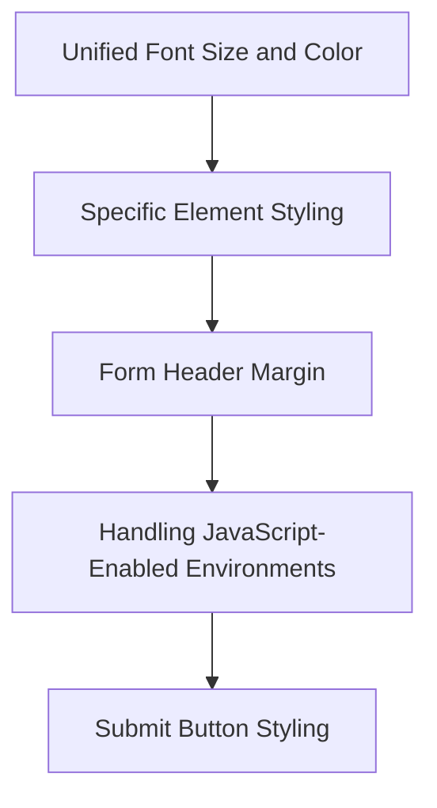

<SwmSnippet path="/resources/modules/ext.MWOAuth.AuthorizeForm.less" line="4">

---

# Unified Font Size and Color

The styles set a unified font size of <SwmToken path="resources/modules/ext.MWOAuth.AuthorizeForm.less" pos="8:6:6" line-data="		font-size: 14px;">`14px`</SwmToken> and a base color for the form text, ensuring readability and consistency.

```less
#mw-mwoauth-authorize-form {
	body:not( .mw-authentication-popup ) & {
		/* Unify font size across various skins */
		/* stylelint-disable-next-line declaration-property-unit-disallowed-list */
		font-size: 14px;
		color: @color-base;
	}
```

---

</SwmSnippet>

<SwmSnippet path="/resources/modules/ext.MWOAuth.AuthorizeForm.less" line="22">

---

# Form Header Margin

The form header's margin is reset to zero to align it properly within the form layout.

```less
	.mw-htmlform-ooui-header {
		margin-top: 0;
	}
```

---

</SwmSnippet>

<SwmSnippet path="/resources/modules/ext.MWOAuth.AuthorizeForm.less" line="26">

---

# Handling JavaScript-Enabled Environments

In JavaScript-enabled environments, the original form is hidden when displayed in an overlaid dialog to prevent flickering.

```less
	html.client-js body:not( .mw-authentication-popup ) .mw-body-content & {
		// Hide the original form if we're about to display it in the overlaid dialog, to avoid flicker.
		// Don't hide it inside the dialog, in popup mode (where there's no dialog) or in no-JS mode.
		display: none;
	}
```

---

</SwmSnippet>

<SwmSnippet path="/resources/modules/ext.MWOAuth.AuthorizeForm.less" line="32">

---

# Submit Button Styling

Submit buttons within the form are styled to be displayed <SwmToken path="resources/modules/ext.MWOAuth.AuthorizeForm.less" pos="33:4:6" line-data="		display: inline-block;">`inline-block`</SwmToken> with a margin for spacing, and their positioning is adjusted within message dialogs.

```less
	.mw-htmlform-submit-buttons {
		display: inline-block;
		margin-right: 1em;
	}

	.oo-ui-messageDialog-text & {
		.mw-htmlform-submit-buttons {
			float: right;
			margin-right: 0;
			margin-top: 0;
		}

		&:after {
			content: '';
			clear: both;
			display: block;
```

---

</SwmSnippet>

&nbsp;

*This is an auto-generated document by Swimm AI 🌊 and has not yet been verified by a human*

<SwmMeta version="3.0.0" repo-id="Z2l0aHViJTNBJTNBbWVkaWF3aWtpLWV4dGVuc2lvbnMtT0F1dGglM0ElM0FTd2ltbS1EZW1v" repo-name="mediawiki-extensions-OAuth"><sup>Powered by [Swimm](/)</sup></SwmMeta>
