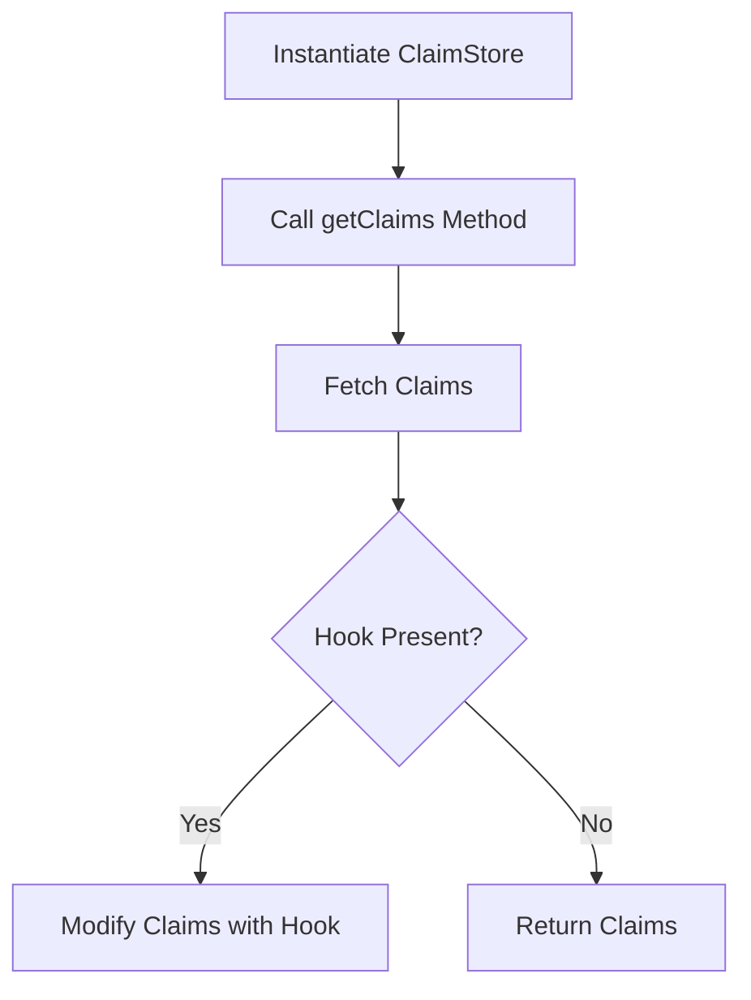

# Overview

<SwmToken path="tests/phpunit/Repository/ClaimStoreTest.php" pos="24:10:10" line-data="		$this-&gt;oAuthClaimStore = new ClaimStore();">`ClaimStore`</SwmToken> is a repository class responsible for managing claims in the <SwmToken path="tests/phpunit/Repository/ClaimStoreTest.php" pos="62:11:11" line-data="	 * @covers \MediaWiki\Extension\OAuth\Repository\ClaimStore::getClaims">`OAuth`</SwmToken> extension. It provides functionality to retrieve claims associated with a specific client and grant type. The class interacts with <SwmToken path="tests/phpunit/Repository/ClaimStoreTest.php" pos="33:20:20" line-data="			[ &#39;str&#39; =&gt; &#39;string&#39; ], [ new ClaimEntity( &#39;str&#39;, &#39;string&#39; ) ]">`ClaimEntity`</SwmToken> objects to encapsulate the name and value of each claim. <SwmToken path="tests/phpunit/Repository/ClaimStoreTest.php" pos="24:10:10" line-data="		$this-&gt;oAuthClaimStore = new ClaimStore();">`ClaimStore`</SwmToken> supports hooks, such as <SwmToken path="tests/phpunit/Repository/ClaimStoreTest.php" pos="69:2:2" line-data="			&#39;OAuthClaimStoreGetClaims&#39;,">`OAuthClaimStoreGetClaims`</SwmToken>, allowing for the modification of claims before they are returned.

# <SwmToken path="tests/phpunit/Repository/ClaimStoreTest.php" pos="24:10:10" line-data="		$this-&gt;oAuthClaimStore = new ClaimStore();">`ClaimStore`</SwmToken> Usage

To use <SwmToken path="tests/phpunit/Repository/ClaimStoreTest.php" pos="24:10:10" line-data="		$this-&gt;oAuthClaimStore = new ClaimStore();">`ClaimStore`</SwmToken>, instantiate it in the setup method or wherever needed in your code.

<SwmSnippet path="/tests/phpunit/Repository/ClaimStoreTest.php" line="23">

---

The <SwmToken path="tests/phpunit/Repository/ClaimStoreTest.php" pos="24:10:10" line-data="		$this-&gt;oAuthClaimStore = new ClaimStore();">`ClaimStore`</SwmToken> is instantiated in the setup method.

```hack
	protected function setUp(): void {
		$this->oAuthClaimStore = new ClaimStore();
	}
```

---

</SwmSnippet>

# Providing Claims

The <SwmToken path="tests/phpunit/Repository/ClaimStoreTest.php" pos="27:7:7" line-data="	public static function provideClaims() {">`provideClaims`</SwmToken> method demonstrates how to yield different sets of claims for testing purposes.

<SwmSnippet path="/tests/phpunit/Repository/ClaimStoreTest.php" line="27">

---

The <SwmToken path="tests/phpunit/Repository/ClaimStoreTest.php" pos="27:7:7" line-data="	public static function provideClaims() {">`provideClaims`</SwmToken> method yields different sets of claims for testing purposes.

```hack
	public static function provideClaims() {
		yield 'empty claims' => [
			[], []
		];

		yield 'string claims' => [
			[ 'str' => 'string' ], [ new ClaimEntity( 'str', 'string' ) ]
		];

		yield 'number claims' => [
			[ 'num' => 9 ], [ new ClaimEntity( 'num', 9 ) ]
		];

		yield 'list of claims' => [
			[
				'class' => 'dummy class',
				'another_str' => [
					'num' => 8,
					'str' => 'mock'
				]
			],
```

---

</SwmSnippet>

# Fetching Claims with Hooks

The <SwmToken path="tests/phpunit/Repository/ClaimStoreTest.php" pos="64:5:5" line-data="	public function testGetClaimsWithHook( $claims, $expectedClaims ) {">`testGetClaimsWithHook`</SwmToken> method shows how to fetch claims using the <SwmToken path="tests/phpunit/Repository/ClaimStoreTest.php" pos="62:17:17" line-data="	 * @covers \MediaWiki\Extension\OAuth\Repository\ClaimStore::getClaims">`getClaims`</SwmToken> method and modify them using the <SwmToken path="tests/phpunit/Repository/ClaimStoreTest.php" pos="69:2:2" line-data="			&#39;OAuthClaimStoreGetClaims&#39;,">`OAuthClaimStoreGetClaims`</SwmToken> hook.

<SwmSnippet path="/tests/phpunit/Repository/ClaimStoreTest.php" line="60">

---

The <SwmToken path="tests/phpunit/Repository/ClaimStoreTest.php" pos="64:5:5" line-data="	public function testGetClaimsWithHook( $claims, $expectedClaims ) {">`testGetClaimsWithHook`</SwmToken> method demonstrates fetching claims using the <SwmToken path="tests/phpunit/Repository/ClaimStoreTest.php" pos="62:17:17" line-data="	 * @covers \MediaWiki\Extension\OAuth\Repository\ClaimStore::getClaims">`getClaims`</SwmToken> method and modifying them using the <SwmToken path="tests/phpunit/Repository/ClaimStoreTest.php" pos="69:2:2" line-data="			&#39;OAuthClaimStoreGetClaims&#39;,">`OAuthClaimStoreGetClaims`</SwmToken> hook.

```hack
	/**
	 * @dataProvider provideClaims
	 * @covers \MediaWiki\Extension\OAuth\Repository\ClaimStore::getClaims
	 */
	public function testGetClaimsWithHook( $claims, $expectedClaims ) {
		$client = MockClientEntity::newMock( $this->getTestUser()->getUser() );
		$hookCalled = false;

		$this->setTemporaryHook(
			'OAuthClaimStoreGetClaims',
			function ( string $grantType, ClientEntityInterface $clientEntity, array &$privateClaims )
			use ( $claims, $client, &$hookCalled ) {
				$this->assertEquals( $clientEntity->getName(), $client->getName() );
				foreach ( $claims as $name => $value ) {
					$privateClaims[] = new ClaimEntity( $name, $value );
				}
				$hookCalled = true;
			}
		);

		$res = $this->oAuthClaimStore->getClaims(
```

---

</SwmSnippet>

# Fetching Claims without Hooks

The <SwmToken path="tests/phpunit/Repository/ClaimStoreTest.php" pos="92:5:5" line-data="	public function testGetClaimsWithoutHook() {">`testGetClaimsWithoutHook`</SwmToken> method demonstrates fetching claims without any hooks, resulting in an empty array.

<SwmSnippet path="/tests/phpunit/Repository/ClaimStoreTest.php" line="92">

---

The <SwmToken path="tests/phpunit/Repository/ClaimStoreTest.php" pos="92:5:5" line-data="	public function testGetClaimsWithoutHook() {">`testGetClaimsWithoutHook`</SwmToken> method demonstrates fetching claims without any hooks, resulting in an empty array.

```hack
	public function testGetClaimsWithoutHook() {
		$res = $this->oAuthClaimStore->getClaims(
			'fake_type',
			MockClientEntity::newMock( $this->getTestUser()->getUser() )
		);

		$this->assertEquals( [], $res );
	}
```

---

</SwmSnippet>

# Main Functions

There are several main functions in this class. Some of them are <SwmToken path="tests/phpunit/Repository/ClaimStoreTest.php" pos="27:7:7" line-data="	public static function provideClaims() {">`provideClaims`</SwmToken>, <SwmToken path="tests/phpunit/Repository/ClaimStoreTest.php" pos="64:5:5" line-data="	public function testGetClaimsWithHook( $claims, $expectedClaims ) {">`testGetClaimsWithHook`</SwmToken>, and <SwmToken path="tests/phpunit/Repository/ClaimStoreTest.php" pos="92:5:5" line-data="	public function testGetClaimsWithoutHook() {">`testGetClaimsWithoutHook`</SwmToken>. We will dive a little into <SwmToken path="tests/phpunit/Repository/ClaimStoreTest.php" pos="64:5:5" line-data="	public function testGetClaimsWithHook( $claims, $expectedClaims ) {">`testGetClaimsWithHook`</SwmToken> and <SwmToken path="tests/phpunit/Repository/ClaimStoreTest.php" pos="92:5:5" line-data="	public function testGetClaimsWithoutHook() {">`testGetClaimsWithoutHook`</SwmToken>.

### <SwmToken path="tests/phpunit/Repository/ClaimStoreTest.php" pos="64:5:5" line-data="	public function testGetClaimsWithHook( $claims, $expectedClaims ) {">`testGetClaimsWithHook`</SwmToken>

The <SwmToken path="tests/phpunit/Repository/ClaimStoreTest.php" pos="64:5:5" line-data="	public function testGetClaimsWithHook( $claims, $expectedClaims ) {">`testGetClaimsWithHook`</SwmToken> function tests the <SwmToken path="tests/phpunit/Repository/ClaimStoreTest.php" pos="62:17:17" line-data="	 * @covers \MediaWiki\Extension\OAuth\Repository\ClaimStore::getClaims">`getClaims`</SwmToken> method of the <SwmToken path="tests/phpunit/Repository/ClaimStoreTest.php" pos="24:10:10" line-data="		$this-&gt;oAuthClaimStore = new ClaimStore();">`ClaimStore`</SwmToken> class when a hook is set. It verifies that the hook is called and that the claims are correctly modified and returned.

<SwmSnippet path="/tests/phpunit/Repository/ClaimStoreTest.php" line="64">

---

The <SwmToken path="tests/phpunit/Repository/ClaimStoreTest.php" pos="64:5:5" line-data="	public function testGetClaimsWithHook( $claims, $expectedClaims ) {">`testGetClaimsWithHook`</SwmToken> function tests the <SwmToken path="tests/phpunit/Repository/ClaimStoreTest.php" pos="80:11:11" line-data="		$res = $this-&gt;oAuthClaimStore-&gt;getClaims(">`getClaims`</SwmToken> method of the <SwmToken path="tests/phpunit/Repository/ClaimStoreTest.php" pos="24:10:10" line-data="		$this-&gt;oAuthClaimStore = new ClaimStore();">`ClaimStore`</SwmToken> class when a hook is set.

```hack
	public function testGetClaimsWithHook( $claims, $expectedClaims ) {
		$client = MockClientEntity::newMock( $this->getTestUser()->getUser() );
		$hookCalled = false;

		$this->setTemporaryHook(
			'OAuthClaimStoreGetClaims',
			function ( string $grantType, ClientEntityInterface $clientEntity, array &$privateClaims )
			use ( $claims, $client, &$hookCalled ) {
				$this->assertEquals( $clientEntity->getName(), $client->getName() );
				foreach ( $claims as $name => $value ) {
					$privateClaims[] = new ClaimEntity( $name, $value );
				}
				$hookCalled = true;
			}
		);

		$res = $this->oAuthClaimStore->getClaims(
			'fake_type',
			$client
		);
```

---

</SwmSnippet>

### <SwmToken path="tests/phpunit/Repository/ClaimStoreTest.php" pos="92:5:5" line-data="	public function testGetClaimsWithoutHook() {">`testGetClaimsWithoutHook`</SwmToken>

The <SwmToken path="tests/phpunit/Repository/ClaimStoreTest.php" pos="92:5:5" line-data="	public function testGetClaimsWithoutHook() {">`testGetClaimsWithoutHook`</SwmToken> function tests the <SwmToken path="tests/phpunit/Repository/ClaimStoreTest.php" pos="62:17:17" line-data="	 * @covers \MediaWiki\Extension\OAuth\Repository\ClaimStore::getClaims">`getClaims`</SwmToken> method of the <SwmToken path="tests/phpunit/Repository/ClaimStoreTest.php" pos="24:10:10" line-data="		$this-&gt;oAuthClaimStore = new ClaimStore();">`ClaimStore`</SwmToken> class when no hook is set. It verifies that the method returns an empty array of claims.

<SwmSnippet path="/tests/phpunit/Repository/ClaimStoreTest.php" line="92">

---

The <SwmToken path="tests/phpunit/Repository/ClaimStoreTest.php" pos="92:5:5" line-data="	public function testGetClaimsWithoutHook() {">`testGetClaimsWithoutHook`</SwmToken> function tests the <SwmToken path="tests/phpunit/Repository/ClaimStoreTest.php" pos="93:11:11" line-data="		$res = $this-&gt;oAuthClaimStore-&gt;getClaims(">`getClaims`</SwmToken> method of the <SwmToken path="tests/phpunit/Repository/ClaimStoreTest.php" pos="24:10:10" line-data="		$this-&gt;oAuthClaimStore = new ClaimStore();">`ClaimStore`</SwmToken> class when no hook is set.

```hack
	public function testGetClaimsWithoutHook() {
		$res = $this->oAuthClaimStore->getClaims(
			'fake_type',
			MockClientEntity::newMock( $this->getTestUser()->getUser() )
		);

		$this->assertEquals( [], $res );
	}
```

---

</SwmSnippet>

&nbsp;

*This is an auto-generated document by Swimm AI 🌊 and has not yet been verified by a human*

<SwmMeta version="3.0.0" repo-id="Z2l0aHViJTNBJTNBbWVkaWF3aWtpLWV4dGVuc2lvbnMtT0F1dGglM0ElM0FTd2ltbS1EZW1v" repo-name="mediawiki-extensions-OAuth"><sup>Powered by [Swimm](/)</sup></SwmMeta>
