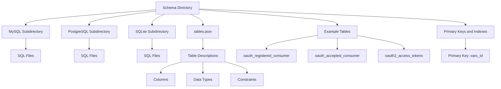

# Schema Directory

The schema directory contains subdirectories for different database systems like MySQL, PostgreSQL, and SQLite. Each subdirectory includes SQL files for creating and updating the database tables specific to that database system.

<SwmSnippet path="/schema/mysql/tables-generated.sql" line="1">

---

This file is automatically generated using <SwmToken path="schema/mysql/tables-generated.sql" pos="1:14:18" line-data="-- This file is automatically generated using maintenance/generateSchemaSql.php.">`maintenance/generateSchemaSql.php`</SwmToken>.

```plsql
-- This file is automatically generated using maintenance/generateSchemaSql.php.
```

---

</SwmSnippet>

# <SwmPath>[schema/tables.json](schema/tables.json)</SwmPath> File

The <SwmPath>[schema/tables.json](schema/tables.json)</SwmPath> file in the schema directory provides a detailed description of the tables, including their columns, data types, and constraints. This file is used to generate the SQL scripts for creating the tables in different database systems.

<SwmSnippet path="/schema/tables.json" line="1">

---

The <SwmPath>[schema/tables.json](schema/tables.json)</SwmPath> file includes detailed descriptions of tables such as <SwmToken path="schema/tables.json" pos="3:7:7" line-data="		&quot;name&quot;: &quot;oauth_registered_consumer&quot;,">`oauth_registered_consumer`</SwmToken>, including columns like <SwmToken path="schema/tables.json" pos="7:7:7" line-data="				&quot;name&quot;: &quot;oarc_id&quot;,">`oarc_id`</SwmToken> and <SwmToken path="schema/tables.json" pos="8:22:22" line-data="				&quot;comment&quot;: &quot;Internal numeric consumer ID (1:1 with oarc_consumer_key)&quot;,">`oarc_consumer_key`</SwmToken>.

```json
[
	{
		"name": "oauth_registered_consumer",
		"comment": "Client consumers (proposed as well as and accepted)",
		"columns": [
			{
				"name": "oarc_id",
				"comment": "Internal numeric consumer ID (1:1 with oarc_consumer_key)",
				"type": "integer",
				"options": { "autoincrement": true, "notnull": true, "unsigned": true }
			},
			{
				"name": "oarc_consumer_key",
				"comment": "External consumer ID (OAuth 1 consumer key, OAuth 2 client ID)",
				"type": "binary",
				"options": { "notnull": true, "length": 32 }
			},
			{
				"name": "oarc_name",
				"comment": "Human-readable name of the application",
				"type": "binary",
```

---

</SwmSnippet>

# Example Tables

The schema includes tables such as <SwmToken path="schema/tables.json" pos="3:7:7" line-data="		&quot;name&quot;: &quot;oauth_registered_consumer&quot;,">`oauth_registered_consumer`</SwmToken>, <SwmToken path="schema/mysql/tables-generated.sql" pos="42:7:7" line-data="CREATE TABLE /*_*/oauth_accepted_consumer (">`oauth_accepted_consumer`</SwmToken>, and <SwmToken path="schema/mysql/tables-generated.sql" pos="62:7:7" line-data="CREATE TABLE /*_*/oauth2_access_tokens (">`oauth2_access_tokens`</SwmToken>, each serving a specific purpose in the <SwmToken path="schema/tables.json" pos="14:14:14" line-data="				&quot;comment&quot;: &quot;External consumer ID (OAuth 1 consumer key, OAuth 2 client ID)&quot;,">`OAuth`</SwmToken> implementation.

<SwmSnippet path="/schema/tables.json" line="3">

---

The <SwmToken path="schema/tables.json" pos="3:7:7" line-data="		&quot;name&quot;: &quot;oauth_registered_consumer&quot;,">`oauth_registered_consumer`</SwmToken> table stores information about client consumers.

```json
		"name": "oauth_registered_consumer",
		"comment": "Client consumers (proposed as well as and accepted)",
```

---

</SwmSnippet>

# Primary Keys and Indexes

The schema also defines indexes and primary keys for the tables to optimize query performance and ensure data integrity. For instance, the primary key for the <SwmToken path="schema/tables.json" pos="3:7:7" line-data="		&quot;name&quot;: &quot;oauth_registered_consumer&quot;,">`oauth_registered_consumer`</SwmToken> table is <SwmToken path="schema/tables.json" pos="7:7:7" line-data="				&quot;name&quot;: &quot;oarc_id&quot;,">`oarc_id`</SwmToken>.

<SwmSnippet path="/schema/tables.json" line="173">

---

The primary key for the <SwmToken path="schema/tables.json" pos="3:7:7" line-data="		&quot;name&quot;: &quot;oauth_registered_consumer&quot;,">`oauth_registered_consumer`</SwmToken> table is <SwmToken path="schema/tables.json" pos="173:9:9" line-data="		&quot;pk&quot;: [ &quot;oarc_id&quot; ]">`oarc_id`</SwmToken>.

```json
		"pk": [ "oarc_id" ]
	},
```

---

</SwmSnippet>

&nbsp;

*This is an auto-generated document by Swimm AI 🌊 and has not yet been verified by a human*

<SwmMeta version="3.0.0" repo-id="Z2l0aHViJTNBJTNBbWVkaWF3aWtpLWV4dGVuc2lvbnMtT0F1dGglM0ElM0FTd2ltbS1EZW1v" repo-name="mediawiki-extensions-OAuth"><sup>Powered by [Swimm](/)</sup></SwmMeta>
