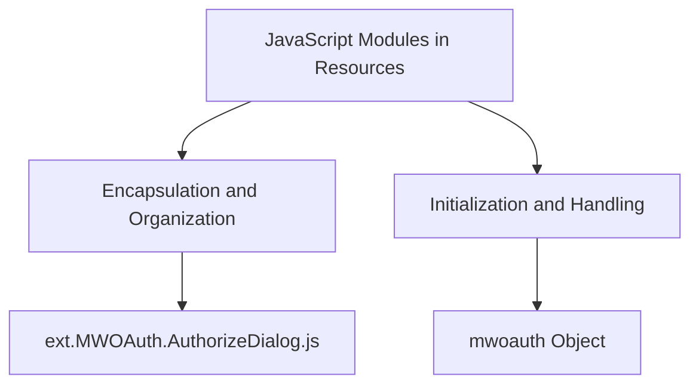

# Encapsulation and Organization

<SwmToken path="resources/modules/ext.MWOAuth.AuthorizeDialog.js" pos="2:5:5" line-data=" * OAuth JavaScript">`JavaScript`</SwmToken> modules in the `resources` directory are used to encapsulate and organize code for the <SwmToken path="resources/modules/ext.MWOAuth.AuthorizeDialog.js" pos="2:3:3" line-data=" * OAuth JavaScript">`OAuth`</SwmToken> extension. These modules help in maintaining a clean and modular codebase by separating different functionalities into distinct files. For example, the file <SwmPath>[resources/modules/ext.MWOAuth.AuthorizeDialog.js](resources/modules/ext.MWOAuth.AuthorizeDialog.js)</SwmPath> contains the logic for initializing and handling the <SwmToken path="resources/modules/ext.MWOAuth.AuthorizeDialog.js" pos="2:3:3" line-data=" * OAuth JavaScript">`OAuth`</SwmToken> authorization dialog. The module pattern used in these files ensures that variables and functions are scoped locally, preventing global namespace pollution. This approach also makes it easier to manage dependencies and load only the necessary code when required.

<SwmSnippet path="/resources/modules/ext.MWOAuth.AuthorizeDialog.js" line="1">

---

The file <SwmPath>[resources/modules/ext.MWOAuth.AuthorizeDialog.js](resources/modules/ext.MWOAuth.AuthorizeDialog.js)</SwmPath> contains the logic for initializing and handling the <SwmToken path="resources/modules/ext.MWOAuth.AuthorizeDialog.js" pos="2:3:3" line-data=" * OAuth JavaScript">`OAuth`</SwmToken> authorization dialog. This module pattern ensures that variables and functions are scoped locally, preventing global namespace pollution.

```javascript
/**
 * OAuth JavaScript
 *
 * @author Aaron Schulz 2013
 */
( function () {
	'use strict';

	var mwoauth = {
		init: function () {
			var $form = $( '#mw-mwoauth-authorize-form' );

			OO.ui.getWindowManager().openWindow( 'message', {
				message: $form,
				size: 'medium',
				actions: []
			} ).opened.then( function () {
				// Appending the <form> to a <label> makes the whole form a click target
				// for 'Allow', so move it out of the <label>
				OO.ui.getWindowManager().getCurrentWindow().text.$element.append( $form );
			} );
```

---

</SwmSnippet>

&nbsp;

*This is an auto-generated document by Swimm AI 🌊 and has not yet been verified by a human*

<SwmMeta version="3.0.0" repo-id="Z2l0aHViJTNBJTNBbWVkaWF3aWtpLWV4dGVuc2lvbnMtT0F1dGglM0ElM0FTd2ltbS1EZW1v" repo-name="mediawiki-extensions-OAuth"><sup>Powered by [Swimm](/)</sup></SwmMeta>
