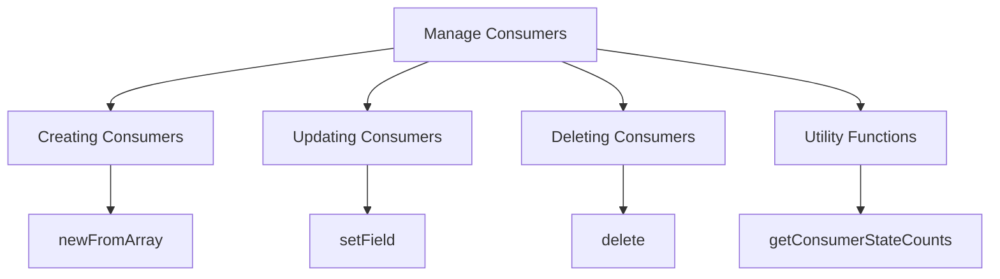

# Manage Consumers

Manage Consumers involves handling the lifecycle of <SwmToken path="src/Backend/MWOAuthDAO.php" pos="3:6:6" line-data="namespace MediaWiki\Extension\OAuth\Backend;">`OAuth`</SwmToken> consumers, which are applications that use <SwmToken path="src/Backend/MWOAuthDAO.php" pos="3:6:6" line-data="namespace MediaWiki\Extension\OAuth\Backend;">`OAuth`</SwmToken> to access resources on behalf of users. This includes creating new consumers, updating existing ones, and deleting consumers that are no longer needed.

<SwmSnippet path="/src/Backend/MWOAuthDAO.php" line="64">

---

The <SwmToken path="src/Backend/MWOAuthDAO.php" pos="64:9:9" line-data="	final public static function newFromArray( array $values ) {">`newFromArray`</SwmToken> method in the <SwmToken path="src/Backend/MWOAuthDAO.php" pos="40:4:4" line-data="abstract class MWOAuthDAO {">`MWOAuthDAO`</SwmToken> class creates a new consumer instance from an array of values, ensuring the correct consumer class is instantiated.

```hack
	final public static function newFromArray( array $values ) {
		$class = static::getConsumerClass( $values );
		$consumer = new $class();

		// Make sure oauth_version is set - for backwards compat
		$values['oauth_version'] ??= Consumer::OAUTH_VERSION_1;
		$consumer->loadFromValues( $values );
		return $consumer;
	}
```

---

</SwmSnippet>

# Updating Consumers

The <SwmToken path="src/Backend/MWOAuthDAO.php" pos="146:7:7" line-data="	final public function setField( $name, $value ) {">`setField`</SwmToken> method allows updating the value of a specific field for a consumer. This method ensures that changes are tracked and can be saved to the database.

# Deleting Consumers

The <SwmToken path="src/Backend/MWOAuthDAO.php" pos="238:5:5" line-data="	public function delete( IDatabase $dbw ) {">`delete`</SwmToken> method is used to remove a consumer from the database. This is essential for managing the lifecycle of consumers and ensuring that outdated or unnecessary consumers are properly cleaned up.

<SwmSnippet path="/src/Backend/MWOAuthDAO.php" line="238">

---

The <SwmToken path="src/Backend/MWOAuthDAO.php" pos="238:5:5" line-data="	public function delete( IDatabase $dbw ) {">`delete`</SwmToken> method in the <SwmToken path="src/Backend/MWOAuthDAO.php" pos="40:4:4" line-data="abstract class MWOAuthDAO {">`MWOAuthDAO`</SwmToken> class removes a consumer from the database, ensuring outdated or unnecessary consumers are properly cleaned up.

```hack
	public function delete( IDatabase $dbw ) {
		global $wgMWOAuthReadOnly;

		$uniqueId = $this->getIdValue();
		$idColumn = static::getIdColumn();
		if ( $wgMWOAuthReadOnly ) {
			throw new DBReadOnlyError( $dbw, __CLASS__ . ": tried to delete while db is read-only" );
		}
		if ( $this->daoOrigin === 'db' ) {
			$dbw->newDeleteQueryBuilder()
				->deleteFrom( static::getTable() )
				->where( [ $idColumn => $uniqueId ] )
				->caller( __METHOD__ )
				->execute();
			$this->daoPending = true;
			return $dbw->affectedRows() > 0;
		} else {
			return false;
		}
	}
```

---

</SwmSnippet>

<SwmSnippet path="/src/Backend/Utils.php" line="94">

---

The <SwmToken path="src/Backend/Utils.php" pos="94:7:7" line-data="	public static function getConsumerStateCounts( IDatabase $db ) {">`getConsumerStateCounts`</SwmToken> method in the <SwmToken path="src/Backend/Utils.php" pos="26:2:2" line-data="class Utils {">`Utils`</SwmToken> class retrieves the state counts of consumers from the database, useful for monitoring and managing the overall state of <SwmToken path="src/Backend/MWOAuthDAO.php" pos="3:6:6" line-data="namespace MediaWiki\Extension\OAuth\Backend;">`OAuth`</SwmToken> consumers.

```hack
	public static function getConsumerStateCounts( IDatabase $db ) {
		$res = $db->newSelectQueryBuilder()
			->select( [ 'oarc_stage', 'count' => 'COUNT(*)' ] )
			->from( 'oauth_registered_consumer' )
			->groupBy( 'oarc_stage' )
			->caller( __METHOD__ )
			->fetchResultSet();
		$table = [
			Consumer::STAGE_APPROVED => 0,
			Consumer::STAGE_DISABLED => 0,
			Consumer::STAGE_EXPIRED  => 0,
			Consumer::STAGE_PROPOSED => 0,
			Consumer::STAGE_REJECTED => 0,
		];
		foreach ( $res as $row ) {
			$table[(int)$row->oarc_stage] = (int)$row->count;
		}
		return $table;
	}
```

---

</SwmSnippet>

&nbsp;

*This is an auto-generated document by Swimm AI 🌊 and has not yet been verified by a human*

<SwmMeta version="3.0.0" repo-id="Z2l0aHViJTNBJTNBbWVkaWF3aWtpLWV4dGVuc2lvbnMtT0F1dGglM0ElM0FTd2ltbS1EZW1v" repo-name="mediawiki-extensions-OAuth"><sup>Powered by [Swimm](/)</sup></SwmMeta>
