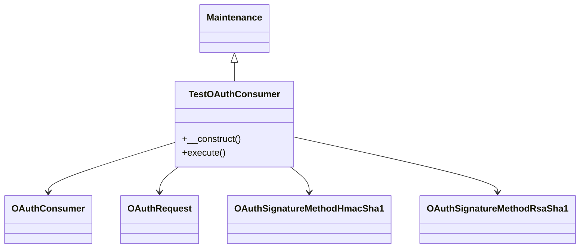

# Overview

The <SwmToken path="maintenance/testOAuthConsumer.php" pos="23:2:2" line-data="class TestOAuthConsumer extends Maintenance {">`TestOAuthConsumer`</SwmToken> is a maintenance script designed to test the functionality of an <SwmToken path="maintenance/testOAuthConsumer.php" pos="26:12:12" line-data="		$this-&gt;addDescription( &quot;Test an OAuth consumer&quot; );">`OAuth`</SwmToken> consumer. It extends the <SwmToken path="maintenance/testOAuthConsumer.php" pos="23:6:6" line-data="class TestOAuthConsumer extends Maintenance {">`Maintenance`</SwmToken> class and provides several options such as <SwmToken path="maintenance/testOAuthConsumer.php" pos="27:8:8" line-data="		$this-&gt;addOption( &#39;consumerKey&#39;, &#39;Consumer key&#39;, true, true );">`consumerKey`</SwmToken>, <SwmToken path="maintenance/testOAuthConsumer.php" pos="28:8:8" line-data="		$this-&gt;addOption( &#39;consumerSecret&#39;, &#39;Consumer secret&#39;, false, true );">`consumerSecret`</SwmToken>, <SwmToken path="maintenance/testOAuthConsumer.php" pos="29:8:8" line-data="		$this-&gt;addOption( &#39;RSAKeyFile&#39;,">`RSAKeyFile`</SwmToken>, <SwmToken path="maintenance/testOAuthConsumer.php" pos="32:8:8" line-data="		$this-&gt;addOption( &#39;useSSL&#39;, &#39;Use SSL&#39; );">`useSSL`</SwmToken>, and <SwmToken path="maintenance/testOAuthConsumer.php" pos="33:8:8" line-data="		$this-&gt;addOption( &#39;verbose&#39;, &#39;Verbose output (e.g. HTTP request/response headers)&#39; );">`verbose`</SwmToken> to configure the test. The script requires the <SwmToken path="maintenance/testOAuthConsumer.php" pos="26:12:12" line-data="		$this-&gt;addDescription( &quot;Test an OAuth consumer&quot; );">`OAuth`</SwmToken> extension to be enabled and uses the <SwmToken path="maintenance/testOAuthConsumer.php" pos="54:8:8" line-data="		$c = new OAuthConsumer( $consumerKey, $consumerSecret );">`OAuthConsumer`</SwmToken>, <SwmToken path="src/Lib/OAuthRequest.php" pos="110:7:7" line-data="			&quot;oauth_version&quot; =&gt; OAuthRequest::$version,">`OAuthRequest`</SwmToken>, and <SwmToken path="maintenance/testOAuthConsumer.php" pos="9:10:10" line-data="use MediaWiki\Extension\OAuth\Lib\OAuthSignatureMethodHmacSha1;">`OAuthSignatureMethodHmacSha1`</SwmToken> or <SwmToken path="maintenance/testOAuthConsumer.php" pos="10:10:10" line-data="use MediaWiki\Extension\OAuth\Lib\OAuthSignatureMethodRsaSha1;">`OAuthSignatureMethodRsaSha1`</SwmToken> classes to perform the <SwmToken path="maintenance/testOAuthConsumer.php" pos="26:12:12" line-data="		$this-&gt;addDescription( &quot;Test an OAuth consumer&quot; );">`OAuth`</SwmToken> operations.

<SwmSnippet path="/maintenance/testOAuthConsumer.php" line="23">

---

# Class Definition

The <SwmToken path="maintenance/testOAuthConsumer.php" pos="23:2:2" line-data="class TestOAuthConsumer extends Maintenance {">`TestOAuthConsumer`</SwmToken> class extends the <SwmToken path="maintenance/testOAuthConsumer.php" pos="23:6:6" line-data="class TestOAuthConsumer extends Maintenance {">`Maintenance`</SwmToken> class and defines several options for configuring the <SwmToken path="maintenance/testOAuthConsumer.php" pos="26:12:12" line-data="		$this-&gt;addDescription( &quot;Test an OAuth consumer&quot; );">`OAuth`</SwmToken> consumer test.

```hack
class TestOAuthConsumer extends Maintenance {
	public function __construct() {
		parent::__construct();
		$this->addDescription( "Test an OAuth consumer" );
		$this->addOption( 'consumerKey', 'Consumer key', true, true );
		$this->addOption( 'consumerSecret', 'Consumer secret', false, true );
		$this->addOption( 'RSAKeyFile',
			'File containing the RSA private key for the consumer', false, true
		);
		$this->addOption( 'useSSL', 'Use SSL' );
		$this->addOption( 'verbose', 'Verbose output (e.g. HTTP request/response headers)' );
		$this->requireExtension( "OAuth" );
	}
```

---

</SwmSnippet>

<SwmSnippet path="/maintenance/testOAuthConsumer.php" line="24">

---

The <SwmToken path="maintenance/testOAuthConsumer.php" pos="24:5:5" line-data="	public function __construct() {">`__construct`</SwmToken> function sets up the description and options for the maintenance script, such as <SwmToken path="maintenance/testOAuthConsumer.php" pos="27:8:8" line-data="		$this-&gt;addOption( &#39;consumerKey&#39;, &#39;Consumer key&#39;, true, true );">`consumerKey`</SwmToken>, <SwmToken path="maintenance/testOAuthConsumer.php" pos="28:8:8" line-data="		$this-&gt;addOption( &#39;consumerSecret&#39;, &#39;Consumer secret&#39;, false, true );">`consumerSecret`</SwmToken>, <SwmToken path="maintenance/testOAuthConsumer.php" pos="29:8:8" line-data="		$this-&gt;addOption( &#39;RSAKeyFile&#39;,">`RSAKeyFile`</SwmToken>, <SwmToken path="maintenance/testOAuthConsumer.php" pos="32:8:8" line-data="		$this-&gt;addOption( &#39;useSSL&#39;, &#39;Use SSL&#39; );">`useSSL`</SwmToken>, and <SwmToken path="maintenance/testOAuthConsumer.php" pos="33:8:8" line-data="		$this-&gt;addOption( &#39;verbose&#39;, &#39;Verbose output (e.g. HTTP request/response headers)&#39; );">`verbose`</SwmToken>. It also ensures that the <SwmToken path="maintenance/testOAuthConsumer.php" pos="26:12:12" line-data="		$this-&gt;addDescription( &quot;Test an OAuth consumer&quot; );">`OAuth`</SwmToken> extension is enabled.

```hack
	public function __construct() {
		parent::__construct();
		$this->addDescription( "Test an OAuth consumer" );
		$this->addOption( 'consumerKey', 'Consumer key', true, true );
		$this->addOption( 'consumerSecret', 'Consumer secret', false, true );
		$this->addOption( 'RSAKeyFile',
			'File containing the RSA private key for the consumer', false, true
		);
		$this->addOption( 'useSSL', 'Use SSL' );
		$this->addOption( 'verbose', 'Verbose output (e.g. HTTP request/response headers)' );
		$this->requireExtension( "OAuth" );
	}
```

---

</SwmSnippet>

# Execute Method

The <SwmToken path="maintenance/testOAuthConsumer.php" pos="37:5:5" line-data="	public function execute() {">`execute`</SwmToken> method handles the main logic of the script, including generating the <SwmToken path="maintenance/testOAuthConsumer.php" pos="26:12:12" line-data="		$this-&gt;addDescription( &quot;Test an OAuth consumer&quot; );">`OAuth`</SwmToken> request, signing it, making the HTTP call, and handling the retrieval of the access token. It also prompts the user to enter the verification code to complete the <SwmToken path="maintenance/testOAuthConsumer.php" pos="26:12:12" line-data="		$this-&gt;addDescription( &quot;Test an OAuth consumer&quot; );">`OAuth`</SwmToken> flow.

<SwmSnippet path="/maintenance/testOAuthConsumer.php" line="37">

---

The <SwmToken path="maintenance/testOAuthConsumer.php" pos="37:5:5" line-data="	public function execute() {">`execute`</SwmToken> function retrieves the options provided, constructs the <SwmToken path="maintenance/testOAuthConsumer.php" pos="44:19:19" line-data="			&quot;{$wgServer}{$wgScriptPath}/index.php?title=Special:OAuth&quot;, PROTO_CANONICAL );">`OAuth`</SwmToken> request, signs it using either HMAC-SHA1 or RSA-SHA1, and makes the HTTP call to the <SwmToken path="maintenance/testOAuthConsumer.php" pos="44:19:19" line-data="			&quot;{$wgServer}{$wgScriptPath}/index.php?title=Special:OAuth&quot;, PROTO_CANONICAL );">`OAuth`</SwmToken> endpoint. It also manages the retrieval of the access token and prompts the user to enter the verification code to complete the <SwmToken path="maintenance/testOAuthConsumer.php" pos="44:19:19" line-data="			&quot;{$wgServer}{$wgScriptPath}/index.php?title=Special:OAuth&quot;, PROTO_CANONICAL );">`OAuth`</SwmToken> flow.

```hack
	public function execute() {
		global $wgServer, $wgScriptPath;

		$consumerKey = $this->getOption( 'consumerKey' );
		$consumerSecret = $this->getOption( 'consumerSecret' );
		$rsaKeyFile = $this->getOption( 'RSAKeyFile' );
		$baseurl = wfExpandUrl(
			"{$wgServer}{$wgScriptPath}/index.php?title=Special:OAuth", PROTO_CANONICAL );
		$endpoint = "{$baseurl}/initiate&format=json&oauth_callback=oob";

		$endpoint_acc = "{$baseurl}/token&format=json";

		if ( !$consumerSecret && !$rsaKeyFile ) {
			$this->error( "Either consumerSecret or RSAKeyFile required!" );
			$this->maybeHelp( true );
		}

		$c = new OAuthConsumer( $consumerKey, $consumerSecret );
		$parsed = parse_url( $endpoint );
		$params = [];
		// @phan-suppress-next-line PhanTypePossiblyInvalidDimOffset
```

---

</SwmSnippet>

# <SwmToken path="maintenance/testOAuthConsumer.php" pos="26:12:12" line-data="		$this-&gt;addDescription( &quot;Test an OAuth consumer&quot; );">`OAuth`</SwmToken> Request Generation

The <SwmToken path="src/Lib/OAuthRequest.php" pos="107:7:7" line-data="	public static function from_consumer_and_token( $consumer, $token, $http_method, $http_url, $parameters = null ) {">`from_consumer_and_token`</SwmToken> function is used to set up the <SwmToken path="maintenance/testOAuthConsumer.php" pos="26:12:12" line-data="		$this-&gt;addDescription( &quot;Test an OAuth consumer&quot; );">`OAuth`</SwmToken> request with the necessary parameters.

<SwmSnippet path="/src/Lib/OAuthRequest.php" line="104">

---

The <SwmToken path="src/Lib/OAuthRequest.php" pos="107:7:7" line-data="	public static function from_consumer_and_token( $consumer, $token, $http_method, $http_url, $parameters = null ) {">`from_consumer_and_token`</SwmToken> function sets up the <SwmToken path="maintenance/testOAuthConsumer.php" pos="26:12:12" line-data="		$this-&gt;addDescription( &quot;Test an OAuth consumer&quot; );">`OAuth`</SwmToken> request with the necessary parameters.

```hack
	/**
	 * pretty much a helper function to set up the request
	 */
	public static function from_consumer_and_token( $consumer, $token, $http_method, $http_url, $parameters = null ) {
		$parameters = $parameters ?: array();
		$defaults = array(
			"oauth_version" => OAuthRequest::$version,
			"oauth_nonce" => OAuthRequest::generate_nonce(),
			"oauth_timestamp" => OAuthRequest::generate_timestamp(),
			"oauth_consumer_key" => $consumer->key
		);
		if ( $token ) {
			$defaults['oauth_token'] = $token->key;
		}

		$parameters = array_merge( $defaults, $parameters );

		return new OAuthRequest( $http_method, $http_url, $parameters );
```

---

</SwmSnippet>

# Signing the Request

The <SwmToken path="src/Lib/OAuthRequest.php" pos="266:5:5" line-data="	public function sign_request( $signature_method, $consumer, $token ) {">`sign_request`</SwmToken> function is used to sign the <SwmToken path="maintenance/testOAuthConsumer.php" pos="26:12:12" line-data="		$this-&gt;addDescription( &quot;Test an OAuth consumer&quot; );">`OAuth`</SwmToken> request with the appropriate signature method.

<SwmSnippet path="/src/Lib/OAuthRequest.php" line="266">

---

The <SwmToken path="src/Lib/OAuthRequest.php" pos="266:5:5" line-data="	public function sign_request( $signature_method, $consumer, $token ) {">`sign_request`</SwmToken> function signs the <SwmToken path="maintenance/testOAuthConsumer.php" pos="26:12:12" line-data="		$this-&gt;addDescription( &quot;Test an OAuth consumer&quot; );">`OAuth`</SwmToken> request with the appropriate signature method.

```hack
	public function sign_request( $signature_method, $consumer, $token ) {
		$this->set_parameter(
			"oauth_signature_method",
			$signature_method->get_name(),
			false
		);
		$signature = $this->build_signature( $signature_method, $consumer, $token );
		$this->set_parameter( "oauth_signature", $signature, false );
	}
```

---

</SwmSnippet>

&nbsp;

*This is an auto-generated document by Swimm AI 🌊 and has not yet been verified by a human*

<SwmMeta version="3.0.0" repo-id="Z2l0aHViJTNBJTNBbWVkaWF3aWtpLWV4dGVuc2lvbnMtT0F1dGglM0ElM0FTd2ltbS1EZW1v" repo-name="mediawiki-extensions-OAuth"><sup>Powered by [Swimm](/)</sup></SwmMeta>
