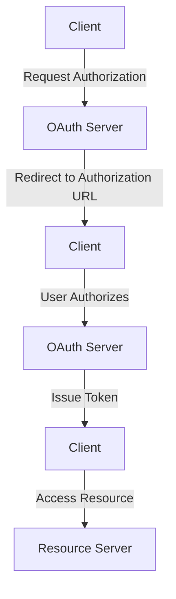

# Overview

The <SwmToken path="tests/phpunit/Backend/MWOAuthServerTest.php" pos="24:6:6" line-data="namespace MediaWiki\Extension\OAuth\Tests\Backend;">`OAuth`</SwmToken> Server is responsible for handling the <SwmToken path="tests/phpunit/Backend/MWOAuthServerTest.php" pos="24:6:6" line-data="namespace MediaWiki\Extension\OAuth\Tests\Backend;">`OAuth`</SwmToken> authentication and authorization process. It manages the issuance of tokens, validates requests, and ensures that the correct permissions are granted to the clients. The server also handles callback URLs to ensure that the redirection after authentication is secure and valid. It interacts with various components such as consumers and tokens to facilitate secure communication between the client and the server.

<SwmSnippet path="/tests/phpunit/Backend/MWOAuthServerTest.php" line="24">

---

# <SwmToken path="tests/phpunit/Backend/MWOAuthServerTest.php" pos="24:6:6" line-data="namespace MediaWiki\Extension\OAuth\Tests\Backend;">`OAuth`</SwmToken> Server Class

The <SwmToken path="tests/phpunit/Backend/MWOAuthServerTest.php" pos="27:10:10" line-data="use MediaWiki\Extension\OAuth\Backend\MWOAuthServer;">`MWOAuthServer`</SwmToken> class is used to manage the <SwmToken path="tests/phpunit/Backend/MWOAuthServerTest.php" pos="24:6:6" line-data="namespace MediaWiki\Extension\OAuth\Tests\Backend;">`OAuth`</SwmToken> authentication and authorization process. It ensures that tokens are issued correctly, requests are validated, and permissions are granted appropriately.

```hack
namespace MediaWiki\Extension\OAuth\Tests\Backend;

use MediaWiki\Extension\OAuth\Backend\MWOAuthException;
use MediaWiki\Extension\OAuth\Backend\MWOAuthServer;
use PHPUnit\Framework\TestCase;
use ReflectionMethod;
```

---

</SwmSnippet>

# Main Functions

There are several main functions in this folder. Some of them are <SwmToken path="tests/phpunit/Backend/MWOAuthServerTest.php" pos="53:16:16" line-data="		$method = new ReflectionMethod( $fixture, &#39;checkCallback&#39; );">`checkCallback`</SwmToken> and <SwmToken path="tests/phpunit/Backend/MWOAuthServerTest.php" pos="65:7:7" line-data="	public static function provideCheckCallback() {">`provideCheckCallback`</SwmToken>. We will dive a little into <SwmToken path="tests/phpunit/Backend/MWOAuthServerTest.php" pos="53:16:16" line-data="		$method = new ReflectionMethod( $fixture, &#39;checkCallback&#39; );">`checkCallback`</SwmToken> and <SwmToken path="tests/phpunit/Backend/MWOAuthServerTest.php" pos="65:7:7" line-data="	public static function provideCheckCallback() {">`provideCheckCallback`</SwmToken>.

<SwmSnippet path="/tests/phpunit/Backend/MWOAuthServerTest.php" line="44">

---

## <SwmToken path="tests/phpunit/Backend/MWOAuthServerTest.php" pos="53:16:16" line-data="		$method = new ReflectionMethod( $fixture, &#39;checkCallback&#39; );">`checkCallback`</SwmToken>

The <SwmToken path="tests/phpunit/Backend/MWOAuthServerTest.php" pos="53:16:16" line-data="		$method = new ReflectionMethod( $fixture, &#39;checkCallback&#39; );">`checkCallback`</SwmToken> function is used to validate the callback URL provided by the client against the registered callback URL. It ensures that the callback URL is secure and matches the expected format.

```hack
	public function testCheckCallback( $expect, $registeredUrl, $got, $isPrefix = true ) {
		$fixture = new MWOAuthServer( null );
		$consumer = new StubConsumer( [
			'consumerKey' => '1234567890abcdef',
			'name' => 'test',
			'callbackIsPrefix' => $isPrefix,
			'callbackUrl' => $registeredUrl,
		] );

		$method = new ReflectionMethod( $fixture, 'checkCallback' );
		$method->setAccessible( true );
		$wasValid = null;
		try {
			$method->invoke( $fixture, $consumer, $got );
			$wasValid = true;
		} catch ( MWOAuthException $e ) {
			$wasValid = false;
		}
		$this->assertSame( $expect, $wasValid );
	}
```

---

</SwmSnippet>

<SwmSnippet path="/tests/phpunit/Backend/MWOAuthServerTest.php" line="65">

---

## <SwmToken path="tests/phpunit/Backend/MWOAuthServerTest.php" pos="65:7:7" line-data="	public static function provideCheckCallback() {">`provideCheckCallback`</SwmToken>

The <SwmToken path="tests/phpunit/Backend/MWOAuthServerTest.php" pos="65:7:7" line-data="	public static function provideCheckCallback() {">`provideCheckCallback`</SwmToken> function is a data provider for the <SwmToken path="tests/phpunit/Backend/MWOAuthServerTest.php" pos="53:16:16" line-data="		$method = new ReflectionMethod( $fixture, &#39;checkCallback&#39; );">`checkCallback`</SwmToken> function. It supplies various test cases to validate different scenarios for callback URL validation.

```hack
	public static function provideCheckCallback() {
		return [
			// [ $expect, $registeredUrl, $got, $isPrefix=true ]
			[ true, '', 'oob', false ],
			[ false, 'https://host', 'https://host', false ],
			[ true, 'https://host', 'oob' ],

			[ true, 'https://host', 'https://host' ],
			[ true, 'http://host', 'https://host' ],
			[ true, 'https://host:1234', 'https://host:1234' ],
			[ true, 'http://host:1234', 'https://host:1234' ],
			[ true, 'https://host:1', 'https://host:1234' ],
			[ true, 'https://host:1', 'https://host' ],
			[ true, 'https://host', 'https://host/path?query' ],
			[ true, 'http://host', 'https://host/path?query' ],
			[ true, 'https://host/path', 'https://host/path?query' ],
			[ true, 'https://host/path?query', 'https://host/path?query' ],
			[ true, 'https://host/path', 'https://host/path/dir2' ],
			[ true, 'https://host/path?query', 'https://host/path?query&more' ],

			[ false, 'https://host/', 'https://host' ],
```

---

</SwmSnippet>

&nbsp;

*This is an auto-generated document by Swimm AI 🌊 and has not yet been verified by a human*

<SwmMeta version="3.0.0" repo-id="Z2l0aHViJTNBJTNBbWVkaWF3aWtpLWV4dGVuc2lvbnMtT0F1dGglM0ElM0FTd2ltbS1EZW1v" repo-name="mediawiki-extensions-OAuth"><sup>Powered by [Swimm](/)</sup></SwmMeta>
