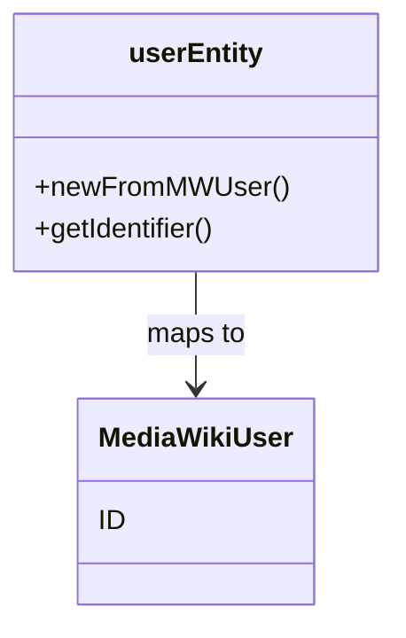

# Overview

The <SwmToken path="tests/phpunit/Entity/UserEntityTest.php" pos="22:2:2" line-data="			$userEntity-&gt;getIdentifier(),">`userEntity`</SwmToken> class represents a user within the <SwmToken path="tests/phpunit/Entity/UserEntityTest.php" pos="3:6:6" line-data="namespace MediaWiki\Extension\OAuth\Tests\Entity;">`OAuth`</SwmToken> extension. It provides methods to interact with user data, ensuring consistency between the <SwmToken path="tests/phpunit/Entity/UserEntityTest.php" pos="22:2:2" line-data="			$userEntity-&gt;getIdentifier(),">`userEntity`</SwmToken> and the <SwmToken path="tests/phpunit/Entity/UserEntityTest.php" pos="3:2:2" line-data="namespace MediaWiki\Extension\OAuth\Tests\Entity;">`MediaWiki`</SwmToken> user object.

# User Creation

A <SwmToken path="tests/phpunit/Entity/UserEntityTest.php" pos="22:2:2" line-data="			$userEntity-&gt;getIdentifier(),">`userEntity`</SwmToken> is created using the <SwmToken path="tests/phpunit/Entity/UserEntityTest.php" pos="16:8:8" line-data="		$userEntity = UserEntity::newFromMWUser(">`newFromMWUser`</SwmToken> method, which initializes a <SwmToken path="tests/phpunit/Entity/UserEntityTest.php" pos="22:2:2" line-data="			$userEntity-&gt;getIdentifier(),">`userEntity`</SwmToken> from a <SwmToken path="tests/phpunit/Entity/UserEntityTest.php" pos="3:2:2" line-data="namespace MediaWiki\Extension\OAuth\Tests\Entity;">`MediaWiki`</SwmToken> user object. This encapsulates the user data within the <SwmToken path="tests/phpunit/Entity/UserEntityTest.php" pos="22:2:2" line-data="			$userEntity-&gt;getIdentifier(),">`userEntity`</SwmToken> class, providing a consistent interface for interacting with user data.

<SwmSnippet path="/tests/phpunit/Entity/UserEntityTest.php" line="20">

---

The <SwmToken path="tests/phpunit/Entity/UserEntityTest.php" pos="16:8:8" line-data="		$userEntity = UserEntity::newFromMWUser(">`newFromMWUser`</SwmToken> method ensures that the user's identifier is mapped to the <SwmToken path="tests/phpunit/Entity/UserEntityTest.php" pos="3:2:2" line-data="namespace MediaWiki\Extension\OAuth\Tests\Entity;">`MediaWiki`</SwmToken> user's ID, maintaining consistency between the two representations.

```hack
		$this->assertSame(
			$this->getTestUser()->getUser()->getId(),
			$userEntity->getIdentifier(),
			'User identifier should be the same as the id of the user it represents'
		);
```

---

</SwmSnippet>

# User Identifier

The <SwmToken path="tests/phpunit/Entity/UserEntityTest.php" pos="22:4:4" line-data="			$userEntity-&gt;getIdentifier(),">`getIdentifier`</SwmToken> function retrieves the identifier of the <SwmToken path="tests/phpunit/Entity/UserEntityTest.php" pos="22:2:2" line-data="			$userEntity-&gt;getIdentifier(),">`userEntity`</SwmToken>, which is mapped to the <SwmToken path="tests/phpunit/Entity/UserEntityTest.php" pos="3:2:2" line-data="namespace MediaWiki\Extension\OAuth\Tests\Entity;">`MediaWiki`</SwmToken> user's ID. This ensures that the <SwmToken path="tests/phpunit/Entity/UserEntityTest.php" pos="22:2:2" line-data="			$userEntity-&gt;getIdentifier(),">`userEntity`</SwmToken> and the <SwmToken path="tests/phpunit/Entity/UserEntityTest.php" pos="3:2:2" line-data="namespace MediaWiki\Extension\OAuth\Tests\Entity;">`MediaWiki`</SwmToken> user object remain consistent in terms of identification.

# Main Functions

The <SwmToken path="tests/phpunit/Entity/UserEntityTest.php" pos="22:2:2" line-data="			$userEntity-&gt;getIdentifier(),">`userEntity`</SwmToken> class includes several main functions, such as <SwmToken path="tests/phpunit/Entity/UserEntityTest.php" pos="16:8:8" line-data="		$userEntity = UserEntity::newFromMWUser(">`newFromMWUser`</SwmToken> and <SwmToken path="tests/phpunit/Entity/UserEntityTest.php" pos="22:4:4" line-data="			$userEntity-&gt;getIdentifier(),">`getIdentifier`</SwmToken>. These functions are essential for creating and managing user entities within the <SwmToken path="tests/phpunit/Entity/UserEntityTest.php" pos="3:6:6" line-data="namespace MediaWiki\Extension\OAuth\Tests\Entity;">`OAuth`</SwmToken> extension.

&nbsp;

*This is an auto-generated document by Swimm AI 🌊 and has not yet been verified by a human*

<SwmMeta version="3.0.0" repo-id="Z2l0aHViJTNBJTNBbWVkaWF3aWtpLWV4dGVuc2lvbnMtT0F1dGglM0ElM0FTd2ltbS1EZW1v" repo-name="mediawiki-extensions-OAuth"><sup>Powered by [Swimm](/)</sup></SwmMeta>
