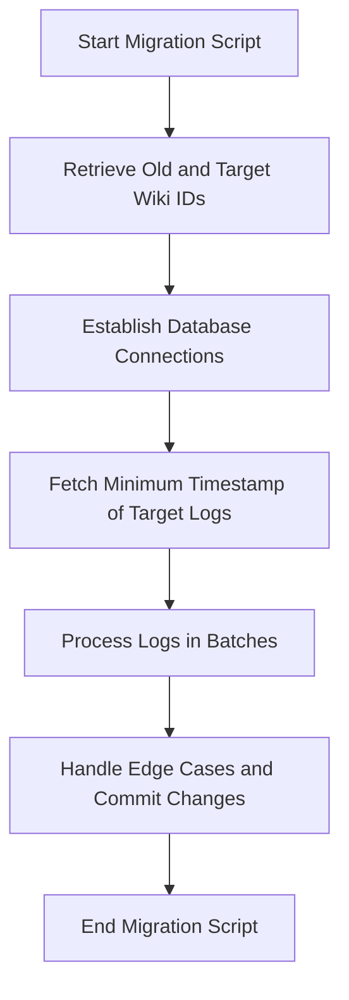

# Overview

Central Wiki Logs Migration is a process designed to transfer <SwmToken path="maintenance/migrateCentralWikiLogs.php" pos="3:29:29" line-data=" * This script should be run as part of migrating to a new central OAuth wiki in your">`OAuth`</SwmToken> logs from an old central wiki to a new central wiki within a cluster. The migration script is intended to be executed on the new central wiki after the necessary tables have been migrated. The script processes logs from the newest to the oldest, ensuring that it can be stopped and restarted without issues. It reads logs from the old database and inserts them into the new database, handling potential edge cases to avoid infinite loops. The script uses a batch size to manage the number of logs processed at a time and ensures that the <SwmToken path="maintenance/migrateCentralWikiLogs.php" pos="3:29:29" line-data=" * This script should be run as part of migrating to a new central OAuth wiki in your">`OAuth`</SwmToken> extension is enabled.

<SwmSnippet path="/maintenance/migrateCentralWikiLogs.php" line="3">

---

# Migration Script Execution

The migration script should be run on the new central wiki after the tables have already been migrated. This ensures that the logs are filled in from newest to oldest and can handle interruptions gracefully.

```hack
 * This script should be run as part of migrating to a new central OAuth wiki in your
 * cluster. See the notes in migrateCentralWikiLogs.php for the complete process.
 * This script is intended to be run on the new central wiki after the tables have already
 * been migrated. This will fill in the logs from newest to oldest, and tries to do sane
 * things if you need to stop it and restart it later.
```

---

</SwmSnippet>

<SwmSnippet path="/maintenance/migrateCentralWikiLogs.php" line="25">

---

# Setting Up the Migration

The constructor of the <SwmToken path="maintenance/migrateCentralWikiLogs.php" pos="4:14:14" line-data=" * cluster. See the notes in migrateCentralWikiLogs.php for the complete process.">`migrateCentralWikiLogs`</SwmToken> class sets up the migration by adding a description, defining the 'old' option for the previous central wiki, setting the batch size, and requiring the <SwmToken path="maintenance/migrateCentralWikiLogs.php" pos="30:8:8" line-data="		$this-&gt;requireExtension( &quot;OAuth&quot; );">`OAuth`</SwmToken> extension.

```hack
	public function __construct() {
		parent::__construct();
		$this->addDescription( "Import central wiki logs to this wiki" );
		$this->addOption( 'old', 'Previous central wiki', true, true );
		$this->setBatchSize( 200 );
		$this->requireExtension( "OAuth" );
	}
```

---

</SwmSnippet>

<SwmSnippet path="/maintenance/migrateCentralWikiLogs.php" line="33">

---

# Executing the Migration

The <SwmToken path="maintenance/migrateCentralWikiLogs.php" pos="33:5:5" line-data="	public function execute() {">`execute`</SwmToken> function retrieves the old and target wiki IDs, outputs the migration status, and establishes database connections for both the old and new wikis.

```hack
	public function execute() {
		$oldWiki = $this->getOption( 'old' );
		$targetWiki = WikiMap::getCurrentWikiId();

		$this->output( "Moving OAuth logs from '$oldWiki' to '$targetWiki'\n" );

		// We only read from $oldDb, but we do want to make sure we get the most recent logs.
		$lbFactory = MediaWikiServices::getInstance()->getDBLoadBalancerFactory();
		$oldDb = $lbFactory->getMainLB( $oldWiki )->getConnection( DB_PRIMARY, [], $oldWiki );
		$targetDb = $lbFactory->getMainLB( $targetWiki )
			->getConnection( DB_PRIMARY, [], $targetWiki );
```

---

</SwmSnippet>

<SwmSnippet path="/maintenance/migrateCentralWikiLogs.php" line="45">

---

# Handling Log Entries

The script fetches the minimum timestamp of the target logs and initializes the last minimum timestamp variable to manage the log entries being processed.

```hack
		$targetMinTS = $targetDb->newSelectQueryBuilder()
			->select( 'MIN(log_timestamp)' )
			->from( 'logging' )
			->where( [ 'log_type' => 'mwoauthconsumer' ] )
			->caller( __METHOD__ )
			->fetchField();

		$lastMinTimestamp = null;
		if ( $targetMinTS !== false ) {
			$lastMinTimestamp = $targetMinTS;
		}
```

---

</SwmSnippet>

<SwmSnippet path="/maintenance/migrateCentralWikiLogs.php" line="60">

---

# Processing Logs in Batches

The script processes logs in batches, ensuring that no more than the batch size of <SwmToken path="maintenance/migrateCentralWikiLogs.php" pos="63:23:23" line-data="			// This assumes that we don&#39;t have more than mBatchSize oauth log entries">`oauth`</SwmToken> log entries have the same timestamp to avoid infinite loops. It reads logs from the old database, processes each log entry, and inserts them into the new database, handling edge cases and committing the changes.

```hack
		do {
			$conds = [ 'log_type' => 'mwoauthconsumer' ];

			// This assumes that we don't have more than mBatchSize oauth log entries
			// with the same timestamp. Otherwise this will go into an infinite loop.
			if ( $lastMinTimestamp !== null ) {
				$conds[] = $oldDb->expr( 'log_timestamp', '<', $oldDb->timestamp( $lastMinTimestamp ) );
			}

			$oldLoggs = $oldDb->newSelectQueryBuilder()
				->select( [
					'log_id', 'log_action', 'log_timestamp', 'log_params', 'log_deleted',
					'actor_id', 'actor_name', 'actor_user'
				] )
				->from( 'logging' )
				->join( 'actor', null, 'actor_id=log_actor' )
				->where( $conds )
				->queryInfo( $commentQuery )
				->orderBy( 'log_timestamp', SelectQueryBuilder::SORT_DESC )
				->limit( $this->mBatchSize + 1 )
				->caller( __METHOD__ )
```

---

</SwmSnippet>

&nbsp;

*This is an auto-generated document by Swimm AI 🌊 and has not yet been verified by a human*

<SwmMeta version="3.0.0" repo-id="Z2l0aHViJTNBJTNBbWVkaWF3aWtpLWV4dGVuc2lvbnMtT0F1dGglM0ElM0FTd2ltbS1EZW1v" repo-name="mediawiki-extensions-OAuth"><sup>Powered by [Swimm](/)</sup></SwmMeta>
