This document explains the process of determining whether a user has the permission to view the app owner's email. The process involves several checks and function calls to ensure that only authorized users can access this information.

The flow starts by checking if the user can see the email, which is treated as a <SwmToken path="src/Backend/Consumer.php" pos="855:13:15" line-data="		// although email is not a security-related field, it&#39;s handled the same way">`security-related`</SwmToken> field. It then checks if the user is the owner of the app, if the app is <SwmToken path="src/Backend/Consumer.php" pos="874:3:5" line-data="			// owner-only apps are essentially personal API tokens, nobody else&#39;s business">`owner-only`</SwmToken>, or if the user has the necessary permissions. If the user passes these checks, they are granted access to view the email. Otherwise, an error message is returned.

# Flow drill down

```mermaid
graph TD;
      subgraph srcBackend["src/Backend"]
39d365b9876ecd9a02f55c862a1f1840e885455011e93061181f98e24812edea(userCanSeeEmail):::mainFlowStyle --> b19e57549fc53a6bf0418987e016b7eb32e20430a5738fc085fefd846a9deb04(userCanSeeSecurity):::mainFlowStyle
end

subgraph srcBackend["src/Backend"]
b19e57549fc53a6bf0418987e016b7eb32e20430a5738fc085fefd846a9deb04(userCanSeeSecurity):::mainFlowStyle --> 97620bd14b6158c395c5baf62514539a57521a02f8cfbbe3b66f7e3efe9a87e3(getLocalUserId):::mainFlowStyle
end

subgraph srcBackend["src/Backend"]
97620bd14b6158c395c5baf62514539a57521a02f8cfbbe3b66f7e3efe9a87e3(getLocalUserId):::mainFlowStyle --> 87ff512c3313ec90ee214019b59efa77cb95e87fae0cf4be4cbc6b33d9e220f0(getLocalUserFromCentralId):::mainFlowStyle
end

subgraph srcBackend["src/Backend"]
87ff512c3313ec90ee214019b59efa77cb95e87fae0cf4be4cbc6b33d9e220f0(getLocalUserFromCentralId):::mainFlowStyle --> 43c48b970d260d7719d066eaf7593ea6943487605518d02f618b78bcb6f08b80(newFromId):::mainFlowStyle
end

subgraph srcBackend["src/Backend"]
43c48b970d260d7719d066eaf7593ea6943487605518d02f618b78bcb6f08b80(newFromId):::mainFlowStyle --> e79256a1bafbf5a265f4f3035dafa462ed7e577d48c1464b0a9d05b3c5babd10(loadFromRow):::mainFlowStyle
end

subgraph srcBackend["src/Backend"]
e79256a1bafbf5a265f4f3035dafa462ed7e577d48c1464b0a9d05b3c5babd10(loadFromRow):::mainFlowStyle --> 9994407af64e72e459c9cff5adf212a0927d1bff56beb11fc47206261f6845b9(loadFromValues):::mainFlowStyle
end


      classDef mainFlowStyle color:#000000,fill:#7CB9F4
classDef rootsStyle color:#000000,fill:#00FFF4
classDef Style1 color:#000000,fill:#00FFAA
classDef Style2 color:#000000,fill:#FFFF00
classDef Style3 color:#000000,fill:#AA7CB9
```



<SwmSnippet path="/src/Backend/Consumer.php" line="848">

---

## Checking Email Visibility

The <SwmToken path="src/Backend/Consumer.php" pos="854:5:5" line-data="	protected function userCanSeeEmail( $name, IContextSource $context ) {">`userCanSeeEmail`</SwmToken> function determines if a user has the permission to view the app owner's email. It delegates the check to the <SwmToken path="src/Backend/Consumer.php" pos="856:6:6" line-data="		return $this-&gt;userCanSeeSecurity( $name, $context );">`userCanSeeSecurity`</SwmToken> function, treating the email field as a <SwmToken path="src/Backend/Consumer.php" pos="855:13:15" line-data="		// although email is not a security-related field, it&#39;s handled the same way">`security-related`</SwmToken> field.

```hack
	/**
	 * Can the user see the app owner's email?
	 * @param string $name Field name
	 * @param IContextSource $context
	 * @return true|Message True if allowed, error message otherwise.
	 */
	protected function userCanSeeEmail( $name, IContextSource $context ) {
		// although email is not a security-related field, it's handled the same way
		return $this->userCanSeeSecurity( $name, $context );
	}
```

---

</SwmSnippet>

<SwmSnippet path="/src/Backend/Consumer.php" line="859">

---

## Evaluating Security Permissions

The <SwmToken path="src/Backend/Consumer.php" pos="866:5:5" line-data="	protected function userCanSeeSecurity( $name, IContextSource $context ) {">`userCanSeeSecurity`</SwmToken> function evaluates whether a user can see fields related to the app's security. It checks if the user is the owner, if the app is <SwmToken path="src/Backend/Consumer.php" pos="874:3:5" line-data="			// owner-only apps are essentially personal API tokens, nobody else&#39;s business">`owner-only`</SwmToken>, or if the user has the necessary permissions. Depending on these checks, it either grants access or returns an error message.

```hack
	/**
	 * Can the user see a field that relates to how the app's owner manages application
	 * security?
	 * @param string $name Field name
	 * @param IContextSource $context
	 * @return true|Message True if allowed, error message otherwise.
	 */
	protected function userCanSeeSecurity( $name, IContextSource $context ) {
		$permissionManager = MediaWikiServices::getInstance()->getPermissionManager();
		$user = $context->getUser();

		if ( $user->getId() === $this->getLocalUserId() ) {
			// owners can always see the details of their apps, unless the app got deleted-suppressed
			return $this->userCanSee( $name, $context );
		} elseif ( $this->getOwnerOnly() ) {
			// owner-only apps are essentially personal API tokens, nobody else's business
			return $context->msg( 'mwoauth-field-private' );
		} elseif ( !$permissionManager->userHasRight( $user, 'mwoauthmanageconsumer' ) ) {
			// if you are not the owner or an admin you definitely shouldn't see security details
			return $context->msg( 'mwoauth-field-private' );
		} else {
```

---

</SwmSnippet>

<SwmSnippet path="/src/Backend/Consumer.php" line="479">

---

### Fetching Local User ID

The <SwmToken path="src/Backend/Consumer.php" pos="483:5:5" line-data="	public function getLocalUserId() {">`getLocalUserId`</SwmToken> function retrieves the local ID of the app owner. If the local user ID is not already cached, it fetches it using the <SwmToken path="src/Backend/Consumer.php" pos="485:8:8" line-data="			$user = Utils::getLocalUserFromCentralId( $this-&gt;getUserId() );">`getLocalUserFromCentralId`</SwmToken> function.

```hack
	/**
	 * Local ID of the owner (or false if there is no local account).
	 * @return int|false
	 */
	public function getLocalUserId() {
		if ( $this->localUserId === null ) {
			$user = Utils::getLocalUserFromCentralId( $this->getUserId() );
			if ( $user ) {
				$this->localUserId = $user->getId();
			} else {
				$this->localUserId = false;
			}
		}
		return $this->localUserId;
	}
```

---

</SwmSnippet>

<SwmSnippet path="/src/Backend/Utils.php" line="295">

---

### Mapping Central ID to Local User

The <SwmToken path="src/Backend/Utils.php" pos="301:7:7" line-data="	public static function getLocalUserFromCentralId( $userId ) {">`getLocalUserFromCentralId`</SwmToken> function maps a central wiki user ID to a local User object. It uses the central ID lookup service to find the corresponding local user.

```hack
	/**
	 * Given a central wiki user ID, get a local User object
	 *
	 * @param int $userId
	 * @return User|false False if not found
	 */
	public static function getLocalUserFromCentralId( $userId ) {
		global $wgMWOAuthSharedUserIDs, $wgMWOAuthSharedUserSource;

		// global ID required via hook
		if ( $wgMWOAuthSharedUserIDs ) {
			$lookup = MediaWikiServices::getInstance()
				->getCentralIdLookupFactory()
				->getLookup( $wgMWOAuthSharedUserSource );
			$user = $lookup->localUserFromCentralId( $userId );
			if ( $user === null || !$lookup->isAttached( $user ) ) {
				return false;
			}
			return User::newFromIdentity( $user );
		}

```

---

</SwmSnippet>

<SwmSnippet path="/src/Backend/MWOAuthDAO.php" line="96">

---

### Creating User Object from ID

The <SwmToken path="src/Backend/MWOAuthDAO.php" pos="103:9:9" line-data="	final public static function newFromId( IDatabase $db, $id, $flags = 0 ) {">`newFromId`</SwmToken> function creates a user object from a given ID by querying the database. If a matching row is found, it initializes the user object and loads its data from the database row.

```hack
	/**
	 * @param IDatabase $db
	 * @param int $id
	 * @param int $flags IDBAccessObject::READ_* bitfield
	 * @return static|bool Returns false if not found
	 * @throws DBError
	 */
	final public static function newFromId( IDatabase $db, $id, $flags = 0 ) {
		$queryBuilder = $db->newSelectQueryBuilder()
			->select( array_values( static::getFieldColumnMap() ) )
			->from( static::getTable() )
			->where( [ static::getIdColumn() => (int)$id ] )
			->caller( __METHOD__ );
		if ( $flags & IDBAccessObject::READ_LOCKING ) {
			$queryBuilder->forUpdate();
		}
		$row = $queryBuilder->fetchRow();

		if ( $row ) {
			$class = static::getConsumerClass( (array)$row );
			$consumer = new $class();
```

---

</SwmSnippet>

<SwmSnippet path="/src/Backend/MWOAuthDAO.php" line="375">

---

### Loading Data from Database Row

The <SwmToken path="src/Backend/MWOAuthDAO.php" pos="380:7:7" line-data="	final protected function loadFromRow( IDatabase $db, $row ) {">`loadFromRow`</SwmToken> function loads user data from a database row. It decodes the row data and populates the user object with the corresponding values.

```hack
	/**
	 * @param IDatabase $db
	 * @param stdClass|array $row
	 * @return void
	 */
	final protected function loadFromRow( IDatabase $db, $row ) {
		$row = $this->decodeRow( $db, (array)$row );
		$values = [];
		foreach ( static::getFieldColumnMap() as $field => $column ) {
			$values[$field] = $row[$column];
		}
		$this->loadFromValues( $values );
		$this->daoOrigin = 'db';
		$this->daoPending = false;
	}
```

---

</SwmSnippet>

<SwmSnippet path="/src/Backend/MWOAuthDAO.php" line="353">

---

### Populating User Object

The <SwmToken path="src/Backend/MWOAuthDAO.php" pos="356:7:7" line-data="	final protected function loadFromValues( array $values ) {">`loadFromValues`</SwmToken> function populates the user object with values from an array. It ensures all required fields are present and normalizes the values.

```hack
	/**
	 * @param array $values
	 */
	final protected function loadFromValues( array $values ) {
		foreach ( static::getFieldColumnMap() as $field => $column ) {
			if ( !array_key_exists( $field, $values ) ) {
				throw new MWException( get_class( $this ) . " requires '$field' field." );
			}
			$this->$field = $values[$field];
		}
		$this->normalizeValues();
		$this->daoOrigin = 'new';
		$this->daoPending = true;
	}
```

---

</SwmSnippet>

&nbsp;

*This is an auto-generated document by Swimm AI 🌊 and has not yet been verified by a human*

<SwmMeta version="3.0.0" repo-id="Z2l0aHViJTNBJTNBbWVkaWF3aWtpLWV4dGVuc2lvbnMtT0F1dGglM0ElM0FTd2ltbS1EZW1v" repo-name="mediawiki-extensions-OAuth"><sup>Powered by [Swimm](/)</sup></SwmMeta>
