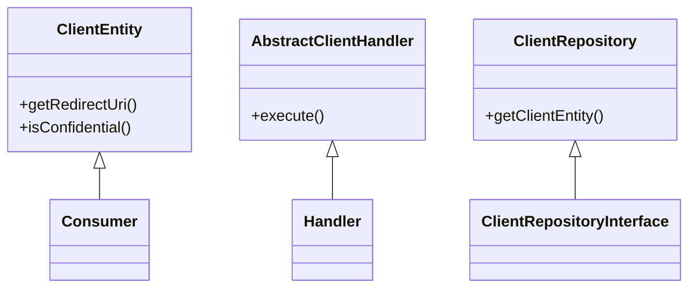

# Overview

Client Management refers to the handling and operations related to <SwmToken path="src/Rest/Handler/AbstractClientHandler.php" pos="18:5:5" line-data=" * on OAuth 2.0 clients over the REST API.">`OAuth`</SwmToken> <SwmToken path="src/Rest/Handler/AbstractClientHandler.php" pos="18:7:9" line-data=" * on OAuth 2.0 clients over the REST API.">`2.0`</SwmToken> clients over the REST API. This document will cover the key classes involved in client management, their functionalities, and how they interact with each other.

# <SwmToken path="src/Entity/ClientEntity.php" pos="19:2:2" line-data="class ClientEntity extends Consumer implements MWClientEntityInterface {">`ClientEntity`</SwmToken> Class

The <SwmToken path="src/Entity/ClientEntity.php" pos="19:2:2" line-data="class ClientEntity extends Consumer implements MWClientEntityInterface {">`ClientEntity`</SwmToken> class is central to client management, providing methods to retrieve client details such as redirect <SwmToken path="src/Entity/ClientEntity.php" pos="24:17:17" line-data="	 * Alternatively return an indexed array of redirect URIs.">`URIs`</SwmToken>, confidentiality status, and allowed grant types. It also includes methods for validating client secrets and managing client scopes.

<SwmSnippet path="/src/Entity/ClientEntity.php" line="19">

---

The <SwmToken path="src/Entity/ClientEntity.php" pos="19:2:2" line-data="class ClientEntity extends Consumer implements MWClientEntityInterface {">`ClientEntity`</SwmToken> class extends the <SwmToken path="src/Entity/ClientEntity.php" pos="19:6:6" line-data="class ClientEntity extends Consumer implements MWClientEntityInterface {">`Consumer`</SwmToken> class and implements the <SwmToken path="src/Entity/ClientEntity.php" pos="19:10:10" line-data="class ClientEntity extends Consumer implements MWClientEntityInterface {">`MWClientEntityInterface`</SwmToken>. It provides methods like <SwmToken path="src/Entity/ClientEntity.php" pos="28:5:5" line-data="	public function getRedirectUri() {">`getRedirectUri`</SwmToken> to return the registered redirect URI and <SwmToken path="src/Entity/ClientEntity.php" pos="37:5:5" line-data="	public function isConfidential() {">`isConfidential`</SwmToken> to check if the client is confidential.

```hack
class ClientEntity extends Consumer implements MWClientEntityInterface {

	/**
	 * Returns the registered redirect URI (as a string).
	 *
	 * Alternatively return an indexed array of redirect URIs.
	 *
	 * @return string|string[]
	 */
	public function getRedirectUri() {
		return $this->getCallbackUrl();
	}

	/**
	 * Returns true if the client is confidential.
	 *
	 * @return bool
	 */
	public function isConfidential() {
		return $this->oauth2IsConfidential;
	}
```

---

</SwmSnippet>

# <SwmToken path="src/Rest/Handler/AbstractClientHandler.php" pos="22:4:4" line-data="abstract class AbstractClientHandler extends Handler {">`AbstractClientHandler`</SwmToken> Class

The <SwmToken path="src/Rest/Handler/AbstractClientHandler.php" pos="22:4:4" line-data="abstract class AbstractClientHandler extends Handler {">`AbstractClientHandler`</SwmToken> class serves as the base for all operations on <SwmToken path="src/Rest/Handler/AbstractClientHandler.php" pos="18:5:5" line-data=" * on OAuth 2.0 clients over the REST API.">`OAuth`</SwmToken> <SwmToken path="src/Rest/Handler/AbstractClientHandler.php" pos="18:7:9" line-data=" * on OAuth 2.0 clients over the REST API.">`2.0`</SwmToken> clients, including client initialization and parameter mapping between <SwmToken path="src/Rest/Handler/AbstractClientHandler.php" pos="18:5:5" line-data=" * on OAuth 2.0 clients over the REST API.">`OAuth`</SwmToken> <SwmToken path="src/Rest/Handler/AbstractClientHandler.php" pos="18:7:9" line-data=" * on OAuth 2.0 clients over the REST API.">`2.0`</SwmToken> and <SwmToken path="src/Rest/Handler/AbstractClientHandler.php" pos="20:25:27" line-data=" * as well as parameter name mapping between OAuth 2.0 and 1.0 terminology">`1.0`</SwmToken> terminology.

<SwmSnippet path="/src/Rest/Handler/AbstractClientHandler.php" line="16">

---

The <SwmToken path="src/Rest/Handler/AbstractClientHandler.php" pos="22:4:4" line-data="abstract class AbstractClientHandler extends Handler {">`AbstractClientHandler`</SwmToken> class extends the <SwmToken path="src/Rest/Handler/AbstractClientHandler.php" pos="22:8:8" line-data="abstract class AbstractClientHandler extends Handler {">`Handler`</SwmToken> class and provides methods for client initialization and basic checks. It also handles parameter name mapping between <SwmToken path="src/Rest/Handler/AbstractClientHandler.php" pos="18:5:5" line-data=" * on OAuth 2.0 clients over the REST API.">`OAuth`</SwmToken> <SwmToken path="src/Rest/Handler/AbstractClientHandler.php" pos="18:7:9" line-data=" * on OAuth 2.0 clients over the REST API.">`2.0`</SwmToken> and <SwmToken path="src/Rest/Handler/AbstractClientHandler.php" pos="20:25:27" line-data=" * as well as parameter name mapping between OAuth 2.0 and 1.0 terminology">`1.0`</SwmToken> terminology.

```hack
/**
 * This class serves as the base class for all operations
 * on OAuth 2.0 clients over the REST API.
 * It provides client initialization and basic checks on it,
 * as well as parameter name mapping between OAuth 2.0 and 1.0 terminology
 */
abstract class AbstractClientHandler extends Handler {

	/**
	 * @return ResponseInterface
	 * @throws HttpException
	 */
	public function execute(): ResponseInterface {
		// At this point we assume user is authenticated and has valid session
		// Authentication can be achieved over CentralAuth or Access token in authorization header
		$responseFactory = $this->getResponseFactory();
		$params = $this->getUnifiedParams();

		$control = new ConsumerSubmitControl(
			RequestContext::getMain(),
			$params,
```

---

</SwmSnippet>

# <SwmToken path="src/Repository/ClientRepository.php" pos="10:2:2" line-data="class ClientRepository implements ClientRepositoryInterface {">`ClientRepository`</SwmToken> Class

The <SwmToken path="src/Repository/ClientRepository.php" pos="10:2:2" line-data="class ClientRepository implements ClientRepositoryInterface {">`ClientRepository`</SwmToken> class is responsible for retrieving and validating client entities from the database. It includes methods for getting a client by identifier or database ID and validating a client's secret.

<SwmSnippet path="/src/Repository/ClientRepository.php" line="10">

---

The <SwmToken path="src/Repository/ClientRepository.php" pos="10:2:2" line-data="class ClientRepository implements ClientRepositoryInterface {">`ClientRepository`</SwmToken> class implements the <SwmToken path="src/Repository/ClientRepository.php" pos="10:6:6" line-data="class ClientRepository implements ClientRepositoryInterface {">`ClientRepositoryInterface`</SwmToken> and provides methods like <SwmToken path="src/Repository/ClientRepository.php" pos="19:5:5" line-data="	public function getClientEntity( $clientIdentifier ) {">`getClientEntity`</SwmToken> to retrieve a client entity by its identifier.

```hack
class ClientRepository implements ClientRepositoryInterface {

	/**
	 * Get a client.
	 *
	 * @param string $clientIdentifier The client's identifier
	 *
	 * @return ClientEntity|bool
	 */
	public function getClientEntity( $clientIdentifier ) {
		$client = ClientEntity::newFromKey(
			Utils::getCentralDB( DB_REPLICA ),
			$clientIdentifier
		);
		if ( !$client instanceof ClientEntity ) {
			return false;
		}

		return $client;
	}
```

---

</SwmSnippet>

&nbsp;

*This is an auto-generated document by Swimm AI 🌊 and has not yet been verified by a human*

<SwmMeta version="3.0.0" repo-id="Z2l0aHViJTNBJTNBbWVkaWF3aWtpLWV4dGVuc2lvbnMtT0F1dGglM0ElM0FTd2ltbS1EZW1v" repo-name="mediawiki-extensions-OAuth"><sup>Powered by [Swimm](/)</sup></SwmMeta>
