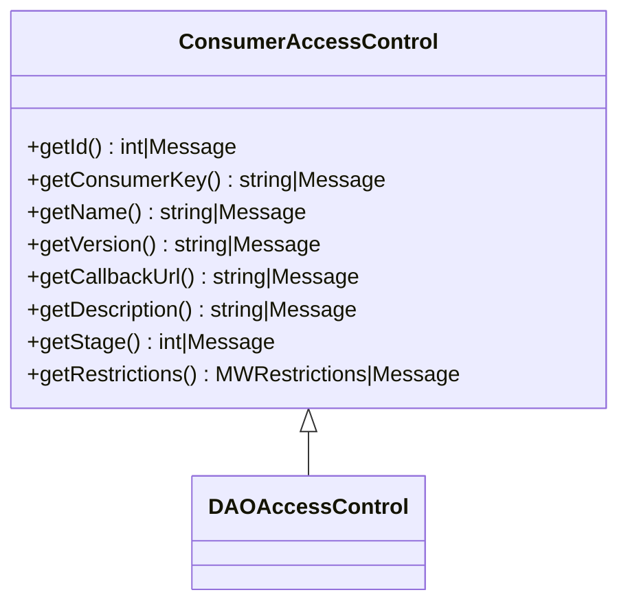

# Overview

Consumer management in control access involves handling various aspects of <SwmToken path="src/Control/ConsumerAccessControl.php" pos="25:26:26" line-data="	 * Consumer key (32-character hexadecimal string that&#39;s used in the OAuth protocol">`OAuth`</SwmToken> consumers, such as their registration, approval, and access control. It includes functionalities to retrieve and manage consumer details like the consumer key, name, version, callback URL, and description. The process also involves checking permissions for accessing these details and ensuring that only authorized users can view or modify them.

# Consumer Details

The class <SwmToken path="src/Control/ConsumerAccessControl.php" pos="12:2:2" line-data="class ConsumerAccessControl extends DAOAccessControl {">`ConsumerAccessControl`</SwmToken> provides methods to retrieve various consumer details such as <SwmToken path="src/Control/ConsumerAccessControl.php" pos="30:5:5" line-data="	public function getConsumerKey() {">`getConsumerKey`</SwmToken>, <SwmToken path="src/Control/ConsumerAccessControl.php" pos="39:5:5" line-data="	public function getName() {">`getName`</SwmToken>, <SwmToken path="src/Control/ConsumerAccessControl.php" pos="65:5:5" line-data="	public function getVersion() {">`getVersion`</SwmToken>, <SwmToken path="src/Control/ConsumerAccessControl.php" pos="75:5:5" line-data="	public function getCallbackUrl() {">`getCallbackUrl`</SwmToken>, and <SwmToken path="src/Control/ConsumerAccessControl.php" pos="96:5:5" line-data="	public function getDescription() {">`getDescription`</SwmToken>. These methods ensure that only authorized users can access these details by returning a <SwmToken path="src/Control/ConsumerAccessControl.php" pos="13:24:24" line-data="	// accessor fields copied from MWOAuthConsumer, except they can return a Message on access error">`Message`</SwmToken> when the user does not have permission.

<SwmSnippet path="/src/Control/ConsumerAccessControl.php" line="12">

---

The <SwmToken path="src/Control/ConsumerAccessControl.php" pos="12:2:2" line-data="class ConsumerAccessControl extends DAOAccessControl {">`ConsumerAccessControl`</SwmToken> class extends <SwmToken path="src/Control/ConsumerAccessControl.php" pos="12:6:6" line-data="class ConsumerAccessControl extends DAOAccessControl {">`DAOAccessControl`</SwmToken> and includes methods to retrieve consumer details while handling permissions.

```hack
class ConsumerAccessControl extends DAOAccessControl {
	// accessor fields copied from MWOAuthConsumer, except they can return a Message on access error

	/**
	 * Internal ID (DB primary key).
	 * Returns a Message when the user does not have permission to see this field.
	 * @return int|Message
	 */
	public function getId() {
		return $this->get( 'id' );
	}

	/**
	 * Consumer key (32-character hexadecimal string that's used in the OAuth protocol
	 * and in URLs). This is used as the consumer ID for most external purposes.
	 * Returns a Message when the user does not have permission to see this field.
	 * @return string|Message
	 */
	public function getConsumerKey() {
		return $this->get( 'consumerKey' );
	}
```

---

</SwmSnippet>

# Workflow Stages

The method <SwmToken path="src/Control/ConsumerAccessControl.php" pos="203:5:5" line-data="	public function getStage() {">`getStage`</SwmToken> retrieves the current stage of the consumer in the review workflow, such as proposed, approved, or rejected. This is crucial for managing the transitions between different stages of the consumer lifecycle.

<SwmSnippet path="/src/Control/ConsumerAccessControl.php" line="198">

---

The <SwmToken path="src/Control/ConsumerAccessControl.php" pos="203:5:5" line-data="	public function getStage() {">`getStage`</SwmToken> method in <SwmToken path="src/Control/ConsumerAccessControl.php" pos="12:2:2" line-data="class ConsumerAccessControl extends DAOAccessControl {">`ConsumerAccessControl`</SwmToken> retrieves the current stage of the consumer in the review workflow.

```hack
	/**
	 * Stage at which the consumer is in the review workflow (proposed, approved etc).
	 * Returns a Message when the user does not have permission to see this field.
	 * @return int|Message One of the STAGE_* constants
	 */
	public function getStage() {
		return $this->get( 'stage' );
	}
```

---

</SwmSnippet>

# Permissions and Validation

The methods in <SwmToken path="src/Control/ConsumerAccessControl.php" pos="12:2:2" line-data="class ConsumerAccessControl extends DAOAccessControl {">`ConsumerAccessControl`</SwmToken> also handle permissions by returning a <SwmToken path="src/Control/ConsumerAccessControl.php" pos="13:24:24" line-data="	// accessor fields copied from MWOAuthConsumer, except they can return a Message on access error">`Message`</SwmToken> when the user does not have permission to access a particular field. This ensures that only authorized users can view or modify consumer details.

# Application Restrictions

The method <SwmToken path="src/Control/ConsumerAccessControl.php" pos="194:5:5" line-data="	public function getRestrictions() {">`getRestrictions`</SwmToken> retrieves application restrictions such as allowed <SwmToken path="src/Control/ConsumerAccessControl.php" pos="190:14:14" line-data="	 * Application restrictions (such as allowed IPs).">`IPs`</SwmToken>. This is important for enforcing security policies and ensuring that consumers adhere to specified restrictions.

<SwmSnippet path="/src/Control/ConsumerAccessControl.php" line="189">

---

The <SwmToken path="src/Control/ConsumerAccessControl.php" pos="194:5:5" line-data="	public function getRestrictions() {">`getRestrictions`</SwmToken> method in <SwmToken path="src/Control/ConsumerAccessControl.php" pos="12:2:2" line-data="class ConsumerAccessControl extends DAOAccessControl {">`ConsumerAccessControl`</SwmToken> retrieves application restrictions such as allowed <SwmToken path="src/Control/ConsumerAccessControl.php" pos="190:14:14" line-data="	 * Application restrictions (such as allowed IPs).">`IPs`</SwmToken>.

```hack
	/**
	 * Application restrictions (such as allowed IPs).
	 * Returns a Message when the user does not have permission to see this field.
	 * @return MWRestrictions|Message
	 */
	public function getRestrictions() {
		return $this->get( 'restrictions' );
	}
```

---

</SwmSnippet>

&nbsp;

*This is an auto-generated document by Swimm AI 🌊 and has not yet been verified by a human*

<SwmMeta version="3.0.0" repo-id="Z2l0aHViJTNBJTNBbWVkaWF3aWtpLWV4dGVuc2lvbnMtT0F1dGglM0ElM0FTd2ltbS1EZW1v" repo-name="mediawiki-extensions-OAuth"><sup>Powered by [Swimm](/)</sup></SwmMeta>
