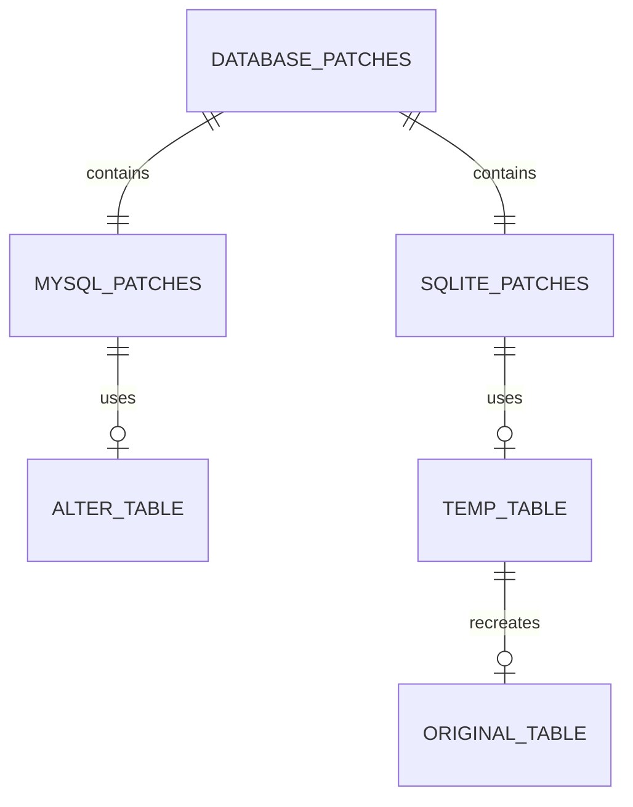

# What are Database Patches in Schema

Database patches are used to modify the schema of existing database tables. They ensure that the database structure is updated to match the application's requirements.

In the schema, database patches for MySQL and SQLite are provided to handle differences in SQL syntax and capabilities between these database systems.

## MySQL Patches

For MySQL, patches typically use the <SwmToken path="schema/mysql/patch-oauth_registered_consumer-timestamp.sql" pos="1:0:2" line-data="ALTER TABLE  /*_*/oauth_registered_consumer">`ALTER TABLE`</SwmToken> statement to change column definitions directly. This ensures that the <SwmToken path="schema/mysql/patch-oauth_registered_consumer-timestamp.sql" pos="1:7:7" line-data="ALTER TABLE  /*_*/oauth_registered_consumer">`oauth_registered_consumer`</SwmToken> table has the correct column types and constraints.

<SwmSnippet path="/schema/mysql/patch-oauth_registered_consumer-timestamp.sql" line="1">

---

The MySQL patch modifies the <SwmToken path="schema/mysql/patch-oauth_registered_consumer-timestamp.sql" pos="1:7:7" line-data="ALTER TABLE  /*_*/oauth_registered_consumer">`oauth_registered_consumer`</SwmToken> table to update column definitions.

```plsql
ALTER TABLE  /*_*/oauth_registered_consumer
CHANGE  oarc_email_authenticated oarc_email_authenticated BINARY(14) NULL,
CHANGE  oarc_registration oarc_registration BINARY(14) NOT NULL,
CHANGE  oarc_stage_timestamp oarc_stage_timestamp BINARY(14) NOT NULL;
```

---

</SwmSnippet>

## SQLite Patches

For SQLite, patches often involve creating a temporary table, copying data to it, dropping the original table, and then recreating the table with the new schema. This approach is necessary due to SQLite's limited support for <SwmToken path="schema/mysql/patch-oauth_registered_consumer-timestamp.sql" pos="1:0:2" line-data="ALTER TABLE  /*_*/oauth_registered_consumer">`ALTER TABLE`</SwmToken> operations.

<SwmSnippet path="/schema/sqlite/patch-oauth_registered_consumer-timestamp.sql" line="1">

---

The SQLite patch involves multiple steps to recreate the <SwmToken path="schema/sqlite/patch-oauth_registered_consumer-timestamp.sql" pos="7:5:5" line-data="FROM  /*_*/oauth_registered_consumer;">`oauth_registered_consumer`</SwmToken> table with the new schema.

```plsql
DROP  INDEX oarc_consumer_key;
DROP  INDEX oarc_name_version_user;
DROP  INDEX oarc_user_id;
DROP  INDEX oarc_stage_timestamp;
CREATE TEMPORARY TABLE /*_*/__temp__oauth_registered_consumer AS
SELECT  oarc_id,  oarc_consumer_key,  oarc_name,  oarc_user_id,  oarc_version,  oarc_callback_url,  oarc_callback_is_prefix,  oarc_description,  oarc_email,  oarc_email_authenticated,  oarc_developer_agreement,  oarc_owner_only,  oarc_wiki,  oarc_grants,  oarc_registration,  oarc_secret_key,  oarc_rsa_key,  oarc_restrictions,  oarc_stage,  oarc_stage_timestamp,  oarc_deleted,  oarc_oauth_version,  oarc_oauth2_allowed_grants,  oarc_oauth2_is_confidential
FROM  /*_*/oauth_registered_consumer;
DROP  TABLE  /*_*/oauth_registered_consumer;
CREATE TABLE  /*_*/oauth_registered_consumer (    oarc_id INTEGER PRIMARY KEY AUTOINCREMENT NOT NULL,    oarc_consumer_key BLOB NOT NULL, oarc_name BLOB NOT NULL,    oarc_user_id INTEGER UNSIGNED NOT NULL,    oarc_version BLOB NOT NULL, oarc_callback_url BLOB NOT NULL,    oarc_callback_is_prefix BLOB DEFAULT NULL,    oarc_description BLOB NOT NULL, oarc_email BLOB NOT NULL,    oarc_email_authenticated BLOB NULL,    oarc_developer_agreement SMALLINT DEFAULT 0 NOT NULL,    oarc_owner_only SMALLINT DEFAULT 0 NOT NULL,    oarc_wiki BLOB NOT NULL, oarc_grants BLOB NOT NULL,    oarc_registration BLOB NOT NULL, oarc_secret_key BLOB DEFAULT NULL,    oarc_rsa_key BLOB DEFAULT NULL, oarc_restrictions BLOB NOT NULL,    oarc_stage SMALLINT UNSIGNED DEFAULT 0 NOT NULL,    oarc_stage_timestamp BLOB NOT NULL,    oarc_deleted SMALLINT UNSIGNED DEFAULT 0 NOT NULL,    oarc_oauth_version SMALLINT DEFAULT 1 NOT NULL,    oarc_oauth2_allowed_grants BLOB DEFAULT NULL,    oarc_oauth2_is_confidential SMALLINT DEFAULT 1 NOT NULL  );
INSERT INTO  /*_*/oauth_registered_consumer (    oarc_id, oarc_consumer_key, oarc_name,    oarc_user_id, oarc_version, oarc_callback_url,    oarc_callback_is_prefix, oarc_description,    oarc_email, oarc_email_authenticated,    oarc_developer_agreement, oarc_owner_only,    oarc_wiki, oarc_grants, oarc_registration,    oarc_secret_key, oarc_rsa_key, oarc_restrictions,    oarc_stage, oarc_stage_timestamp,    oarc_deleted, oarc_oauth_version,    oarc_oauth2_allowed_grants, oarc_oauth2_is_confidential  )
SELECT  oarc_id,  oarc_consumer_key,  oarc_name,  oarc_user_id,  oarc_version,  oarc_callback_url,  oarc_callback_is_prefix,  oarc_description,  oarc_email,  oarc_email_authenticated,  oarc_developer_agreement,  oarc_owner_only,  oarc_wiki,  oarc_grants,  oarc_registration,  oarc_secret_key,  oarc_rsa_key,  oarc_restrictions,  oarc_stage,  oarc_stage_timestamp,  oarc_deleted,  oarc_oauth_version,  oarc_oauth2_allowed_grants,  oarc_oauth2_is_confidential
FROM  /*_*/__temp__oauth_registered_consumer;
DROP  TABLE /*_*/__temp__oauth_registered_consumer;
CREATE UNIQUE INDEX oarc_consumer_key ON  /*_*/oauth_registered_consumer (oarc_consumer_key);
CREATE UNIQUE INDEX oarc_name_version_user ON  /*_*/oauth_registered_consumer (    oarc_name, oarc_user_id, oarc_version  );
CREATE INDEX oarc_user_id ON  /*_*/oauth_registered_consumer (oarc_user_id);
CREATE INDEX oarc_stage_timestamp ON  /*_*/oauth_registered_consumer (    oarc_stage, oarc_stage_timestamp  );
```

---

</SwmSnippet>

&nbsp;

*This is an auto-generated document by Swimm AI 🌊 and has not yet been verified by a human*

<SwmMeta version="3.0.0" repo-id="Z2l0aHViJTNBJTNBbWVkaWF3aWtpLWV4dGVuc2lvbnMtT0F1dGglM0ElM0FTd2ltbS1EZW1v" repo-name="mediawiki-extensions-OAuth"><sup>Powered by [Swimm](/)</sup></SwmMeta>
