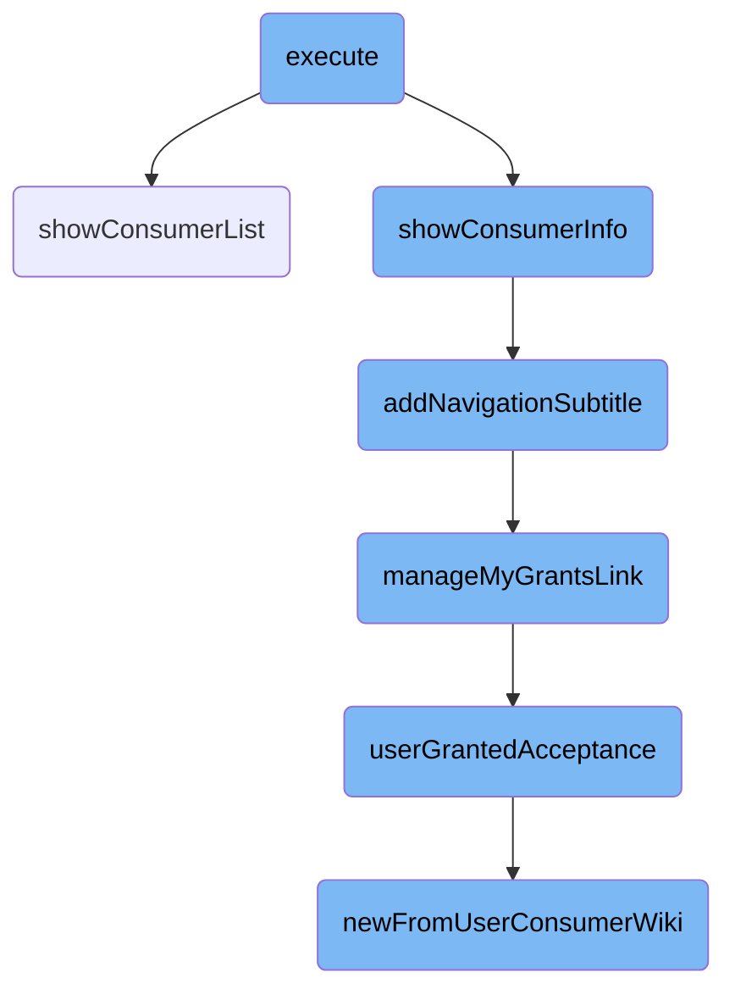
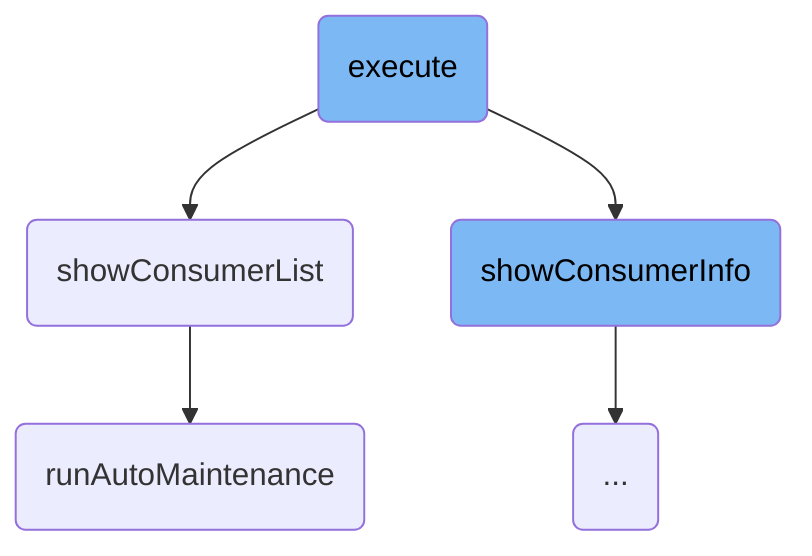
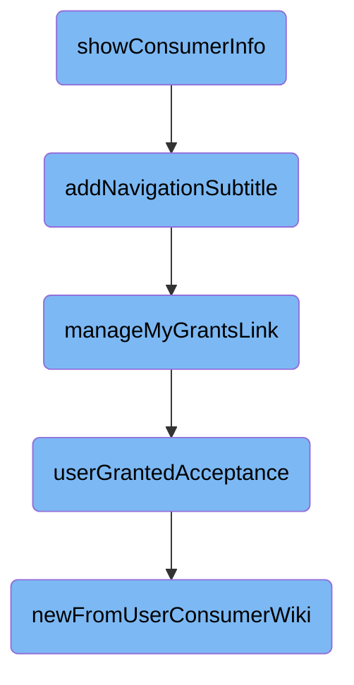

In this document, we will explain the process of executing a function that sets up headers, determines the navigation type, and displays either a list of consumers or detailed consumer information based on the navigation type.

The flow starts by setting up headers and adding a help link. It then checks the navigation type to decide whether to show a list of consumers or detailed information about a specific consumer. If the navigation type is 'view', it displays detailed consumer information; otherwise, it shows the consumer list. The process also includes adding navigation subtitles and managing user grants.

Here is a high level diagram of the flow, showing only the most important functions:



# Flow drill down

First, we'll zoom into this section of the flow:



<SwmSnippet path="/src/Frontend/SpecialPages/SpecialMWOAuthListConsumers.php" line="62">

---

## Execute Function

The <SwmToken path="src/Frontend/SpecialPages/SpecialMWOAuthListConsumers.php" pos="62:5:5" line-data="	public function execute( $par ) {">`execute`</SwmToken> function is responsible for setting up the headers and help link, determining the navigation type, and then either displaying the consumer list or detailed consumer information based on the navigation type.

```hack
	public function execute( $par ) {
		$this->setHeaders();
		$this->addHelpLink( 'Help:OAuth' );

		// Format is Special:OAuthListConsumers[/list|/view/[<consumer key>]]
		$navigation = $par !== null ? explode( '/', $par ) : [];
		$type = $navigation[0] ?? null;
		$consumerKey = $navigation[1] ?? '';

		$this->showConsumerListForm();

		switch ( $type ) {
			case 'view':
				$this->showConsumerInfo( $consumerKey );
				break;
			default:
				$this->showConsumerList();
				break;
		}

		$this->getOutput()->addModuleStyles( 'ext.MWOAuth.styles' );
```

---

</SwmSnippet>

<SwmSnippet path="/src/Frontend/SpecialPages/SpecialMWOAuthListConsumers.php" line="224">

---

### Showing Consumer List

The <SwmToken path="src/Frontend/SpecialPages/SpecialMWOAuthListConsumers.php" pos="227:5:5" line-data="	protected function showConsumerList() {">`showConsumerList`</SwmToken> function retrieves request parameters to filter the list of consumers. It then uses a pager to display the list of consumers, including navigation bars. If no consumers are found, it displays an appropriate message. Additionally, it occasionally triggers the <SwmToken path="src/Backend/Utils.php" pos="165:7:7" line-data="	public static function runAutoMaintenance( IDatabase $dbw ) {">`runAutoMaintenance`</SwmToken> function to prune old deleted items.

```hack
	/**
	 * Show a paged list of consumers with links to details
	 */
	protected function showConsumerList() {
		$request = $this->getRequest();

		$name = $request->getVal( 'name', '' );
		$stage = $request->getInt( 'stage', Consumer::STAGE_APPROVED );
		if ( $request->getVal( 'publisher', '' ) !== '' ) {
			$centralId = Utils::getCentralIdFromUserName( $request->getVal( 'publisher' ) );
		} else {
			$centralId = null;
		}

		$pager = new ListConsumersPager( $this, [], $name, $centralId, $stage );
		if ( $pager->getNumRows() ) {
			$this->getOutput()->addHTML( $pager->getNavigationBar() );
			$this->getOutput()->addHTML( $pager->getBody() );
			$this->getOutput()->addHTML( $pager->getNavigationBar() );
		} else {
			// Messages: mwoauthlistconsumers-none-proposed, mwoauthlistconsumers-none-rejected,
```

---

</SwmSnippet>

<SwmSnippet path="/src/Backend/Utils.php" line="161">

---

### Running Auto Maintenance

The <SwmToken path="src/Backend/Utils.php" pos="165:7:7" line-data="	public static function runAutoMaintenance( IDatabase $dbw ) {">`runAutoMaintenance`</SwmToken> function is responsible for updating the status of expired <SwmToken path="src/Frontend/SpecialPages/SpecialMWOAuthListConsumers.php" pos="64:10:10" line-data="		$this-&gt;addHelpLink( &#39;Help:OAuth&#39; );">`OAuth`</SwmToken> consumer requests. It calculates a cutoff time based on the expiration age and updates the database to mark proposed consumers as expired if they are past the cutoff time.

```hack
	/**
	 * @param IDatabase $dbw
	 * @return void
	 */
	public static function runAutoMaintenance( IDatabase $dbw ) {
		global $wgMWOAuthRequestExpirationAge;

		if ( $wgMWOAuthRequestExpirationAge <= 0 ) {
			return;
		}

		$cutoff = time() - $wgMWOAuthRequestExpirationAge;
		$fname = __METHOD__;
		DeferredUpdates::addUpdate(
			new AutoCommitUpdate(
				$dbw,
				__METHOD__,
				static function ( IDatabase $dbw ) use ( $cutoff, $fname ) {
					$dbw->newUpdateQueryBuilder()
						->update( 'oauth_registered_consumer' )
						->set( [
```

---

</SwmSnippet>

Now, lets zoom into this section of the flow:



<SwmSnippet path="/src/Frontend/SpecialPages/SpecialMWOAuthListConsumers.php" line="85">

---

## Displaying Consumer Information

The <SwmToken path="src/Frontend/SpecialPages/SpecialMWOAuthListConsumers.php" pos="91:5:5" line-data="	protected function showConsumerInfo( $consumerKey ) {">`showConsumerInfo`</SwmToken> function is responsible for displaying detailed information about a consumer. It checks if the consumer key is valid and retrieves the consumer's details from the database. It then prepares and displays various pieces of information such as the consumer's name, version, <SwmToken path="src/Frontend/SpecialPages/SpecialMWOAuthListConsumers.php" pos="64:10:10" line-data="		$this-&gt;addHelpLink( &#39;Help:OAuth&#39; );">`OAuth`</SwmToken> version, user, status, description, and grants. This function ensures that only authorized users can view suppressed consumers and provides a link to recent changes related to the consumer.

```hack
	/**
	 * Show the form to approve/reject/disable/re-enable consumers
	 *
	 * @param string $consumerKey
	 * @throws PermissionsError
	 */
	protected function showConsumerInfo( $consumerKey ) {
		$user = $this->getUser();
		$out = $this->getOutput();

		if ( !$consumerKey ) {
			$out->addWikiMsg( 'mwoauth-missing-consumer-key' );
		}

		$dbr = Utils::getCentralDB( DB_REPLICA );
		$cmrAc = ConsumerAccessControl::wrap(
			Consumer::newFromKey( $dbr, $consumerKey ), $this->getContext() );
		$permissionManager = MediaWikiServices::getInstance()->getPermissionManager();

		if ( !$cmrAc ) {
			$out->addWikiMsg( 'mwoauth-invalid-consumer-key' );
```

---

</SwmSnippet>

<SwmSnippet path="/src/Frontend/SpecialPages/SpecialMWOAuthListConsumers.php" line="333">

---

## Adding Navigation Subtitle

The <SwmToken path="src/Frontend/SpecialPages/SpecialMWOAuthListConsumers.php" pos="337:5:5" line-data="	private function addNavigationSubtitle( ConsumerAccessControl $cmrAc ): void {">`addNavigationSubtitle`</SwmToken> function adds a navigation subtitle to the consumer information page. It generates links for updating the consumer, managing the consumer, and managing the user's grants. These links are displayed as part of the page's subtitle, providing easy navigation options for the user.

```hack
	/**
	 * @param ConsumerAccessControl $cmrAc
	 * @throws MWException
	 */
	private function addNavigationSubtitle( ConsumerAccessControl $cmrAc ): void {
		$user = $this->getUser();
		$centralUserId = Utils::getCentralIdFromLocalUser( $user );
		$linkRenderer = $this->getLinkRenderer();
		$consumer = $cmrAc->getDAO();

		$siteLinks = array_merge(
			$this->updateLink( $cmrAc, $centralUserId, $linkRenderer ),
			$this->manageConsumerLink( $consumer, $user, $linkRenderer ),
			$this->manageMyGrantsLink( $consumer, $centralUserId, $linkRenderer )
		);

		if ( $siteLinks ) {
			$links = $this->getLanguage()->pipeList( $siteLinks );
			$this->getOutput()->setSubtitle(
				"<strong>" . $this->msg( 'mwoauthlistconsumers-navigation' )->escaped() .
				"</strong> [{$links}]" );
```

---

</SwmSnippet>

<SwmSnippet path="/src/Frontend/SpecialPages/SpecialMWOAuthListConsumers.php" line="402">

---

## Managing User Grants Link

The <SwmToken path="src/Frontend/SpecialPages/SpecialMWOAuthListConsumers.php" pos="410:5:5" line-data="	private function manageMyGrantsLink(">`manageMyGrantsLink`</SwmToken> function generates a link for the user to manage their grants for the specified consumer. If the user has granted access to the consumer, a link to update the grants is created and returned. This link allows users to easily manage their permissions for the consumer.

```hack
	/**
	 * @param Consumer $consumer
	 * @param int $centralUserId Add link to manage grants for this user, if they've granted this
	 * consumer
	 * @param LinkRenderer $linkRenderer
	 * @return string[]
	 * @throws MWException
	 */
	private function manageMyGrantsLink(
		Consumer $consumer, $centralUserId, LinkRenderer $linkRenderer
	): array {
		$acceptance = $this->userGrantedAcceptance( $consumer, $centralUserId );
		if ( $acceptance !== false ) {
			return [
				$linkRenderer->makeKnownLink( SpecialPage::getTitleFor( 'OAuthManageMyGrants',
					'update/' . $acceptance->getId() ),
					$this->msg( 'mwoauthlistconsumers-grants-link' )->text() )
			];
		}

		return [];
```

---

</SwmSnippet>

<SwmSnippet path="/src/Frontend/SpecialPages/SpecialMWOAuthListConsumers.php" line="425">

---

## Checking User Granted Acceptance

The <SwmToken path="src/Frontend/SpecialPages/SpecialMWOAuthListConsumers.php" pos="430:5:5" line-data="	private function userGrantedAcceptance( Consumer $consumer, $centralUserId ) {">`userGrantedAcceptance`</SwmToken> function checks if the user has granted acceptance to the consumer for the current wiki or all wikis. It retrieves the relevant acceptance record from the database and returns it. This function is used to determine if the user has already granted permissions to the consumer.

```hack
	/**
	 * @param Consumer $consumer
	 * @param int $centralUserId UserId to retrieve the grants for
	 * @return bool|ConsumerAcceptance
	 */
	private function userGrantedAcceptance( Consumer $consumer, $centralUserId ) {
		$dbr = Utils::getCentralDB( DB_REPLICA );
		$wikiSpecificGrant =
			ConsumerAcceptance::newFromUserConsumerWiki(
				$dbr, $centralUserId, $consumer, WikiMap::getCurrentWikiId() );

		$allWikiGrant = ConsumerAcceptance::newFromUserConsumerWiki(
			$dbr, $centralUserId, $consumer, '*' );

		if ( $wikiSpecificGrant !== false ) {
			return $wikiSpecificGrant;
		}
		if ( $allWikiGrant !== false ) {
			return $allWikiGrant;
		}
		return false;
```

---

</SwmSnippet>

<SwmSnippet path="/src/Backend/ConsumerAcceptance.php" line="122">

---

## Retrieving Consumer Acceptance

The <SwmToken path="src/Backend/ConsumerAcceptance.php" pos="131:7:7" line-data="	public static function newFromUserConsumerWiki(">`newFromUserConsumerWiki`</SwmToken> function retrieves the consumer acceptance record for a specific user and consumer from the database. It constructs a query to fetch the acceptance details and returns the acceptance object if found. This function is crucial for checking if a user has granted permissions to a consumer for a specific wiki.

```hack
	/**
	 * @param IDatabase $db
	 * @param int $userId of user who authorized (central wiki's id)
	 * @param Consumer $consumer
	 * @param string $wiki wiki associated with the acceptance
	 * @param int $flags ConsumerAcceptance::READ_* bitfield
	 * @param int $oauthVersion
	 * @return ConsumerAcceptance|bool
	 */
	public static function newFromUserConsumerWiki(
		IDatabase $db, $userId, $consumer,
		$wiki, $flags = 0, $oauthVersion = Consumer::OAUTH_VERSION_1
	) {
		$queryBuilder = $db->newSelectQueryBuilder()
			->select( array_values( static::getFieldColumnMap() ) )
			->from( static::getTable() )
			->where( [
				'oaac_user_id' => $userId,
				'oaac_consumer_id' => $consumer->getId(),
				'oaac_oauth_version' => $oauthVersion,
				'oaac_wiki' => (string)$wiki
```

---

</SwmSnippet>

&nbsp;

*This is an auto-generated document by Swimm AI 🌊 and has not yet been verified by a human*

<SwmMeta version="3.0.0" repo-id="Z2l0aHViJTNBJTNBbWVkaWF3aWtpLWV4dGVuc2lvbnMtT0F1dGglM0ElM0FTd2ltbS1EZW1v" repo-name="mediawiki-extensions-OAuth"><sup>Powered by [Swimm](/)</sup></SwmMeta>
