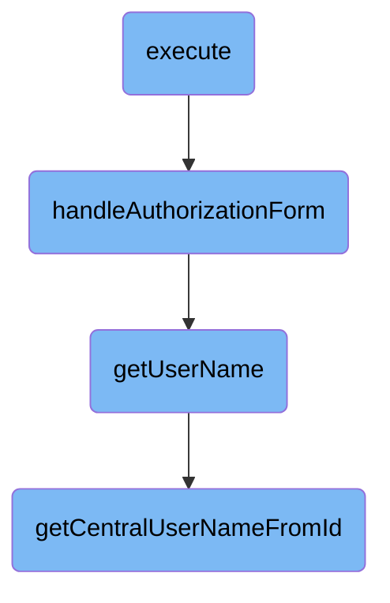

In this document, we will explain the process of executing OAuth-related actions. The process involves determining the requested subpage, performing the corresponding action, and handling exceptions to provide meaningful error messages to the user.

The flow starts by determining which subpage is requested. Based on this, it performs the necessary action, such as starting an <SwmToken path="src/Frontend/SpecialPages/SpecialMWOAuth.php" pos="116:5:5" line-data="		// https://oauth.net/core/1.0a/#response_parameters">`oauth`</SwmToken> handshake, showing an authorization dialog, or returning an access token. It ensures the correct <SwmToken path="src/Frontend/SpecialPages/SpecialMWOAuth.php" pos="116:5:5" line-data="		// https://oauth.net/core/1.0a/#response_parameters">`oauth`</SwmToken> version is used and handles any exceptions to give the user clear error messages.

# Flow drill down



<SwmSnippet path="/src/Frontend/SpecialPages/SpecialMWOAuth.php" line="96">

---

## Execute

The <SwmToken path="src/Frontend/SpecialPages/SpecialMWOAuth.php" pos="96:5:5" line-data="	public function execute( $subpage ) {">`execute`</SwmToken> function is the entry point for handling various OAuth-related actions. It determines the subpage requested and performs the corresponding action, such as initiating an <SwmToken path="src/Frontend/SpecialPages/SpecialMWOAuth.php" pos="116:5:5" line-data="		// https://oauth.net/core/1.0a/#response_parameters">`oauth`</SwmToken> handshake, showing an authorization dialog, or returning an access token. This function ensures that the appropriate <SwmToken path="src/Frontend/SpecialPages/SpecialMWOAuth.php" pos="116:5:5" line-data="		// https://oauth.net/core/1.0a/#response_parameters">`oauth`</SwmToken> version is used and handles exceptions to provide meaningful error messages to the user.

```hack
	public function execute( $subpage ) {
		if ( $this->getRequest()->getRawVal( 'display' ) === 'popup' ) {
			// Replace the default skin with a "micro-skin" that omits most of the interface. (T362706)
			// In the future, we might allow normal skins to serve this mode too, if they advise that
			// they support it by setting a skin option, so that colors and fonts could stay consistent.
			$this->getContext()->setSkin( $this->skinFactory->makeSkin( 'authentication-popup' ) );
		}

		$this->setHeaders();

		$user = $this->getUser();
		$request = $this->getRequest();

		$output = $this->getOutput();
		$output->disallowUserJs();

		$config = $this->getConfig();

		// 'raw' for plaintext, 'html' or 'json'.
		// For the initiate and token endpoints, 'raw' also handles the formatting required by
		// https://oauth.net/core/1.0a/#response_parameters
```

---

</SwmSnippet>

<SwmSnippet path="/src/Frontend/SpecialPages/SpecialMWOAuth.php" line="455">

---

## Handle Authorization Form

The <SwmToken path="src/Frontend/SpecialPages/SpecialMWOAuth.php" pos="460:5:5" line-data="	protected function handleAuthorizationForm( $requestToken, $consumerKey, $authenticate ) {">`handleAuthorizationForm`</SwmToken> function is responsible for displaying the authorization form to the user. It checks if the consumer key is valid and if the user has the necessary permissions. If the user has already authorized the application with the required grants, it skips the form and redirects to the callback URL. Otherwise, it prepares and displays the authorization form, allowing the user to approve or cancel the authorization request.

```hack
	/**
	 * @param string|null $requestToken
	 * @param string|null $consumerKey
	 * @param bool $authenticate
	 */
	protected function handleAuthorizationForm( $requestToken, $consumerKey, $authenticate ) {
		$output = $this->getOutput();

		$output->addSubtitle( $this->msg( 'mwoauth-desc' )->escaped() );
		$user = $this->getUser();

		$oauthServer = Utils::newMWOAuthServer();

		if ( !$consumerKey && $requestToken && $this->oauthVersion === Consumer::OAUTH_VERSION_1 ) {
			$consumerKey = $oauthServer->getConsumerKey( $requestToken );
		}

		$cmrAc = ConsumerAccessControl::wrap(
			Consumer::newFromKey( Utils::getCentralDB( DB_REPLICA ), $consumerKey ),
			$this->getContext()
		);
```

---

</SwmSnippet>

<SwmSnippet path="/src/Control/ConsumerAccessControl.php" line="226">

---

## Get User Name

The <SwmToken path="src/Control/ConsumerAccessControl.php" pos="234:5:5" line-data="	public function getUserName( $audience = false ) {">`getUserName`</SwmToken> function retrieves the username of the owner based on the user ID. It triggers a database lookup to fetch the central username using the <SwmToken path="src/Control/ConsumerAccessControl.php" pos="236:5:5" line-data="			return Utils::getCentralUserNameFromId( $id, $audience );">`getCentralUserNameFromId`</SwmToken> function. This function is crucial for displaying the correct username in the authorization form and ensuring that the user is correctly identified.

```hack
	// accessors for common formatting

	/**
	 * Owner username.
	 * Note that this method triggers a DB lookup.
	 * @param User|bool $audience show hidden names based on this user, or false for public
	 * @return string|Message
	 */
	public function getUserName( $audience = false ) {
		return $this->get( 'userId', static function ( $id ) use ( $audience ) {
			return Utils::getCentralUserNameFromId( $id, $audience );
		} );
	}
```

---

</SwmSnippet>

<SwmSnippet path="/src/Backend/Utils.php" line="254">

---

## Get Central User Name From ID

The <SwmToken path="src/Backend/Utils.php" pos="262:7:7" line-data="	public static function getCentralUserNameFromId( $userId, $audience = false ) {">`getCentralUserNameFromId`</SwmToken> function fetches the central username based on the user ID. It checks if the global ID lookup is enabled and retrieves the username accordingly. If the user is hidden, it ensures that the username is only shown to users with the appropriate permissions. This function is essential for accurately identifying users across different wikis and ensuring that hidden usernames are handled correctly.

```hack
	/**
	 * Given a central wiki user ID, get a central username
	 *
	 * @param int $userId
	 * @param bool|User|string $audience show hidden names based on this user, or false for public
	 * @throws MWException
	 * @return string|bool Username, false if not found, empty string if name is hidden
	 */
	public static function getCentralUserNameFromId( $userId, $audience = false ) {
		global $wgMWOAuthSharedUserIDs, $wgMWOAuthSharedUserSource;

		// global ID required via hook
		if ( $wgMWOAuthSharedUserIDs ) {
			$lookup = MediaWikiServices::getInstance()
				->getCentralIdLookupFactory()
				->getLookup( $wgMWOAuthSharedUserSource );
			$name = $lookup->nameFromCentralId(
				$userId,
				$audience === 'raw'
					? CentralIdLookup::AUDIENCE_RAW
					: ( $audience ?: CentralIdLookup::AUDIENCE_PUBLIC )
```

---

</SwmSnippet>

&nbsp;

*This is an auto-generated document by Swimm AI 🌊 and has not yet been verified by a human*

<SwmMeta version="3.0.0" repo-id="Z2l0aHViJTNBJTNBbWVkaWF3aWtpLWV4dGVuc2lvbnMtT0F1dGglM0ElM0FTd2ltbS1EZW1v" repo-name="mediawiki-extensions-OAuth"><sup>Powered by [Swimm](/)</sup></SwmMeta>
