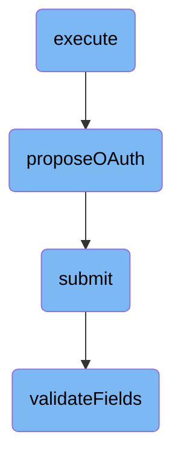

In this document, we will explain the process of executing an <SwmToken path="src/Frontend/SpecialPages/SpecialMWOAuthConsumerRegistration.php" pos="459:11:11" line-data="			throw new InvalidArgumentException( &#39;Invalid OAuth version&#39; );">`OAuth`</SwmToken> consumer registration. The process involves ensuring user authentication and permissions, proposing <SwmToken path="src/Frontend/SpecialPages/SpecialMWOAuthConsumerRegistration.php" pos="459:11:11" line-data="			throw new InvalidArgumentException( &#39;Invalid OAuth version&#39; );">`OAuth`</SwmToken> consumers, submitting data, and validating fields.

The flow starts by making sure the user is authenticated and has the necessary permissions. Then, it sets up a form for the user to propose a new <SwmToken path="src/Frontend/SpecialPages/SpecialMWOAuthConsumerRegistration.php" pos="459:11:11" line-data="			throw new InvalidArgumentException( &#39;Invalid OAuth version&#39; );">`OAuth`</SwmToken> consumer, which includes filling out details like the <SwmToken path="src/Frontend/SpecialPages/SpecialMWOAuthConsumerRegistration.php" pos="459:11:11" line-data="			throw new InvalidArgumentException( &#39;Invalid OAuth version&#39; );">`OAuth`</SwmToken> version and consumer name. After the form is submitted, the data is validated and processed to ensure everything is correct and properly formatted.

# Flow drill down



<SwmSnippet path="/src/Frontend/SpecialPages/SpecialMWOAuthConsumerRegistration.php" line="86">

---

## Handling User Authentication and Permissions

The <SwmToken path="src/Frontend/SpecialPages/SpecialMWOAuthConsumerRegistration.php" pos="86:5:5" line-data="	public function execute( $par ) {">`execute`</SwmToken> function starts by ensuring the user is authenticated and has the necessary permissions. It checks if the user is blocked and verifies if the database is in read-only mode. This ensures that only authorized users can proceed with <SwmToken path="src/Frontend/SpecialPages/SpecialMWOAuthConsumerRegistration.php" pos="459:11:11" line-data="			throw new InvalidArgumentException( &#39;Invalid OAuth version&#39; );">`OAuth`</SwmToken> consumer registration.

```hack
	public function execute( $par ) {
		$this->requireNamedUser( 'mwoauth-named-account-required-reason' );
		$this->checkPermissions();

		$request = $this->getRequest();
		$user = $this->getUser();
		$lang = $this->getLanguage();
		$centralUserId = Utils::getCentralIdFromLocalUser( $user );

		// Redirect to HTTPs if attempting to access this page via HTTP.
		// Proposals and updates to consumers can involve sending new secrets.
		if ( $this->getConfig()->get( 'MWOAuthSecureTokenTransfer' )
			&& $request->detectProtocol() == 'http'
			&& substr( wfExpandUrl( '/', PROTO_HTTPS ), 0, 8 ) === 'https://'
		) {
			$redirUrl = str_replace( 'http://', 'https://', $request->getFullRequestURL() );
			$this->getOutput()->redirect( $redirUrl );
			$this->getOutput()->addVaryHeader( 'X-Forwarded-Proto' );
			return;
		}

```

---

</SwmSnippet>

<SwmSnippet path="/src/Frontend/SpecialPages/SpecialMWOAuthConsumerRegistration.php" line="457">

---

## Proposing <SwmToken path="src/Frontend/SpecialPages/SpecialMWOAuthConsumerRegistration.php" pos="459:11:11" line-data="			throw new InvalidArgumentException( &#39;Invalid OAuth version&#39; );">`OAuth`</SwmToken>

The <SwmToken path="src/Frontend/SpecialPages/SpecialMWOAuthConsumerRegistration.php" pos="457:5:5" line-data="	private function proposeOAuth( int $oauthVersion, User $user, $allWikis, $lang, $showGrants ) {">`proposeOAuth`</SwmToken> function is responsible for handling the proposal of new <SwmToken path="src/Frontend/SpecialPages/SpecialMWOAuthConsumerRegistration.php" pos="459:11:11" line-data="			throw new InvalidArgumentException( &#39;Invalid OAuth version&#39; );">`OAuth`</SwmToken> consumers. It sets up the form for the user to fill out, including fields for <SwmToken path="src/Frontend/SpecialPages/SpecialMWOAuthConsumerRegistration.php" pos="459:11:11" line-data="			throw new InvalidArgumentException( &#39;Invalid OAuth version&#39; );">`OAuth`</SwmToken> version, consumer name, description, and other relevant details. It also handles the submission of this form and processes the data accordingly.

```hack
	private function proposeOAuth( int $oauthVersion, User $user, $allWikis, $lang, $showGrants ) {
		if ( !in_array( $oauthVersion, [ Consumer::OAUTH_VERSION_1, Consumer::OAUTH_VERSION_2 ] ) ) {
			throw new InvalidArgumentException( 'Invalid OAuth version' );
		}
		$dbw = Utils::getCentralDB( DB_PRIMARY );
		$control = new ConsumerSubmitControl( $this->getContext(), [], $dbw );

		$grantNames = $this->grantsLocalization->getGrantDescriptionsWithClasses(
			$showGrants, $this->getLanguage() );
		$formDescriptor = [
			'oauthVersion' => [
				'class' => HTMLHiddenField::class,
				'default' => $oauthVersion,
			],
			'name' => [
				'type' => 'text',
				'label-message' => 'mwoauth-consumer-name',
				'size' => '45',
				'required' => true
			],
			'version' => [
```

---

</SwmSnippet>

<SwmSnippet path="/src/Control/SubmitControl.php" line="58">

---

## Submitting Data

The <SwmToken path="src/Control/SubmitControl.php" pos="59:11:11" line-data="	 * Attempt to validate and submit this data">`submit`</SwmToken> function validates and processes the submitted data. It checks for basic permissions, validates the action and parameters, and routes the submission to the appropriate internal function. This ensures that the data submitted by the user is correctly handled and stored.

```hack
	/**
	 * Attempt to validate and submit this data
	 *
	 * This will check basic permissions, validate the action and parameters
	 * and route the submission handling to the internal subclass function.
	 *
	 * @throws MWException
	 * @return Status
	 */
	public function submit() {
		$status = $this->checkBasePermissions();
		if ( !$status->isOK() ) {
			return $status;
		}

		$action = $this->vals['action'];
		$required = $this->getRequiredFields();
		if ( !isset( $required[$action] ) ) {
			// @TODO: check for field-specific message first
			return $this->failure( 'invalid_field_action', 'mwoauth-invalid-field', 'action' );
		}
```

---

</SwmSnippet>

<SwmSnippet path="/src/Control/SubmitControl.php" line="253">

---

### Validating Fields

The <SwmToken path="src/Control/SubmitControl.php" pos="260:5:5" line-data="	protected function validateFields( array $required ) {">`validateFields`</SwmToken> function checks that the required fields are present and valid. It iterates over the required fields, trims any string values, and validates each field using the specified validator. This step ensures that all necessary data is correctly formatted and valid before processing.

```hack
	/**
	 * Check that the action is valid and that the required fields are valid
	 *
	 * @param array $required (field => regex or callback)
	 * @phan-param array<string,string|callable(mixed,array):bool|StatusValue> $required
	 * @return Status
	 */
	protected function validateFields( array $required ) {
		foreach ( $required as $field => $validator ) {
			if ( !isset( $this->vals[$field] ) ) {
				return $this->failure( "missing_field_$field", 'mwoauth-missing-field', $field );
			} elseif ( !is_scalar( $this->vals[$field] )
				&& !in_array( $field, [ 'restrictions', 'oauth2GrantTypes' ], true )
			) {
				return $this->failure( "invalid_field_$field", 'mwoauth-invalid-field', $field );
			}
			if ( is_string( $this->vals[$field] ) ) {
				$this->vals[$field] = trim( $this->vals[$field] );
			}
			$validationResult = $this->getValidationResult( $validator, $this->vals[$field], $this->vals );
			if ( $validationResult === false ) {
```

---

</SwmSnippet>

&nbsp;

*This is an auto-generated document by Swimm AI 🌊 and has not yet been verified by a human*

<SwmMeta version="3.0.0" repo-id="Z2l0aHViJTNBJTNBbWVkaWF3aWtpLWV4dGVuc2lvbnMtT0F1dGglM0ElM0FTd2ltbS1EZW1v" repo-name="mediawiki-extensions-OAuth"><sup>Powered by [Swimm](/)</sup></SwmMeta>
