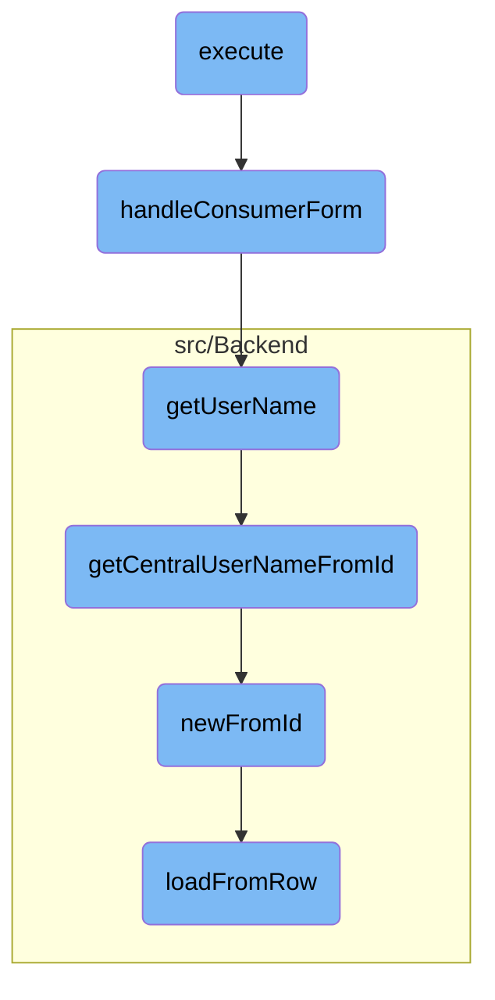

This document explains the flow of the <SwmToken path="src/Frontend/SpecialPages/SpecialMWOAuthManageMyGrants.php" pos="76:5:5" line-data="	public function execute( $par ) {">`execute`</SwmToken> function, which is responsible for setting up the environment, checking user permissions, and determining the action to be taken based on URL parameters. It either handles consumer form actions or displays the consumer list.

The flow starts with the <SwmToken path="src/Frontend/SpecialPages/SpecialMWOAuthManageMyGrants.php" pos="76:5:5" line-data="	public function execute( $par ) {">`execute`</SwmToken> function setting up the environment and checking if the user has the necessary permissions. Depending on the URL parameters, it decides whether to handle consumer form actions or show the consumer list. If handling consumer forms, it verifies user permissions, retrieves relevant consumer data, and displays a form for user actions. The flow involves multiple steps, including retrieving the username, fetching the central username from the ID, creating a consumer from the ID, and loading data from a database row into the consumer object.

# Flow drill down



<SwmSnippet path="/src/Frontend/SpecialPages/SpecialMWOAuthManageMyGrants.php" line="76">

---

## Executing the Main Flow

The <SwmToken path="src/Frontend/SpecialPages/SpecialMWOAuthManageMyGrants.php" pos="76:5:5" line-data="	public function execute( $par ) {">`execute`</SwmToken> function sets up the environment, checks user permissions, and determines the action to be taken based on the URL parameters. It either handles the consumer form actions or shows the consumer list.

```hack
	public function execute( $par ) {
		$this->setHeaders();
		$this->getOutput()->disallowUserJs();
		$this->addHelpLink( 'Help:OAuth' );
		$this->requireNamedUser( 'mwoauth-available-only-to-registered' );

		$user = $this->getUser();
		$permissionManager = MediaWikiServices::getInstance()->getPermissionManager();
		if ( !$permissionManager->userHasRight( $user, 'mwoauthmanagemygrants' ) ) {
			throw new PermissionsError( 'mwoauthmanagemygrants' );
		}

		// Format is Special:OAuthManageMyGrants[/list|/manage/<accesstoken>]
		$navigation = $par !== null ? explode( '/', $par ) : [];
		$typeKey = $navigation[0] ?? null;
		$acceptanceId = $navigation[1] ?? null;

		if ( $this->getConfig()->get( 'MWOAuthReadOnly' )
				&& in_array( $typeKey, [ 'update', 'revoke' ] )
		) {
			throw new ErrorPageError( 'mwoauth-error', 'mwoauth-db-readonly' );
```

---

</SwmSnippet>

<SwmSnippet path="/src/Frontend/SpecialPages/SpecialMWOAuthManageMyGrants.php" line="150">

---

## Handling Consumer Form Actions

The <SwmToken path="src/Frontend/SpecialPages/SpecialMWOAuthManageMyGrants.php" pos="157:5:5" line-data="	protected function handleConsumerForm( $acceptanceId, $type ) {">`handleConsumerForm`</SwmToken> function manages the approval, rejection, disabling, or re-enabling of <SwmToken path="src/Frontend/SpecialPages/SpecialMWOAuthManageMyGrants.php" pos="79:10:10" line-data="		$this-&gt;addHelpLink( &#39;Help:OAuth&#39; );">`OAuth`</SwmToken> consumers. It verifies user permissions, retrieves the relevant consumer data, and displays a form for the user to take action.

```hack
	/**
	 * Show the form to approve/reject/disable/re-enable consumers
	 *
	 * @param int $acceptanceId
	 * @param string $type One of (update,revoke)
	 * @throws PermissionsError
	 */
	protected function handleConsumerForm( $acceptanceId, $type ) {
		$user = $this->getUser();
		$dbr = Utils::getCentralDB( DB_REPLICA );
		$permissionManager = MediaWikiServices::getInstance()->getPermissionManager();

		$centralUserId = Utils::getCentralIdFromLocalUser( $user );
		if ( !$centralUserId ) {
			$this->getOutput()->addWikiMsg( 'badaccess-group0' );
			return;
		}

		$cmraAc = ConsumerAcceptanceAccessControl::wrap(
			ConsumerAcceptance::newFromId( $dbr, $acceptanceId ), $this->getContext() );
		if ( !$cmraAc || $cmraAc->getUserId() !== $centralUserId ) {
```

---

</SwmSnippet>

<SwmSnippet path="/src/Control/ConsumerAccessControl.php" line="234">

---

### Retrieving User Name

The <SwmToken path="src/Control/ConsumerAccessControl.php" pos="234:5:5" line-data="	public function getUserName( $audience = false ) {">`getUserName`</SwmToken> function retrieves the username of the consumer owner by triggering a database lookup.

```hack
	public function getUserName( $audience = false ) {
		return $this->get( 'userId', static function ( $id ) use ( $audience ) {
			return Utils::getCentralUserNameFromId( $id, $audience );
		} );
```

---

</SwmSnippet>

<SwmSnippet path="/src/Backend/Utils.php" line="262">

---

### Getting Central User Name from ID

The <SwmToken path="src/Backend/Utils.php" pos="262:7:7" line-data="	public static function getCentralUserNameFromId( $userId, $audience = false ) {">`getCentralUserNameFromId`</SwmToken> function fetches the central username based on the user ID. It handles different audience types and checks if the user is hidden.

```hack
	public static function getCentralUserNameFromId( $userId, $audience = false ) {
		global $wgMWOAuthSharedUserIDs, $wgMWOAuthSharedUserSource;

		// global ID required via hook
		if ( $wgMWOAuthSharedUserIDs ) {
			$lookup = MediaWikiServices::getInstance()
				->getCentralIdLookupFactory()
				->getLookup( $wgMWOAuthSharedUserSource );
			$name = $lookup->nameFromCentralId(
				$userId,
				$audience === 'raw'
					? CentralIdLookup::AUDIENCE_RAW
					: ( $audience ?: CentralIdLookup::AUDIENCE_PUBLIC )
			);
			if ( $name === null ) {
				$name = false;
			}
		} else {
			$name = '';
			$user = User::newFromId( $userId );
			$permissionManager = MediaWikiServices::getInstance()->getPermissionManager();
```

---

</SwmSnippet>

<SwmSnippet path="/src/Backend/MWOAuthDAO.php" line="103">

---

### Creating Consumer from ID

The <SwmToken path="src/Backend/MWOAuthDAO.php" pos="103:9:9" line-data="	final public static function newFromId( IDatabase $db, $id, $flags = 0 ) {">`newFromId`</SwmToken> function creates a new consumer object from the database using the provided ID. It fetches the row data and initializes the consumer object.

```hack
	final public static function newFromId( IDatabase $db, $id, $flags = 0 ) {
		$queryBuilder = $db->newSelectQueryBuilder()
			->select( array_values( static::getFieldColumnMap() ) )
			->from( static::getTable() )
			->where( [ static::getIdColumn() => (int)$id ] )
			->caller( __METHOD__ );
		if ( $flags & IDBAccessObject::READ_LOCKING ) {
			$queryBuilder->forUpdate();
		}
		$row = $queryBuilder->fetchRow();

		if ( $row ) {
			$class = static::getConsumerClass( (array)$row );
			$consumer = new $class();
			$consumer->loadFromRow( $db, $row );
			return $consumer;
		} else {
			return false;
		}
	}
```

---

</SwmSnippet>

<SwmSnippet path="/src/Backend/MWOAuthDAO.php" line="380">

---

### Loading Data from Row

The <SwmToken path="src/Backend/MWOAuthDAO.php" pos="380:7:7" line-data="	final protected function loadFromRow( IDatabase $db, $row ) {">`loadFromRow`</SwmToken> function loads the consumer data from a database row into the consumer object. It decodes the row data and sets the object's values accordingly.

```hack
	final protected function loadFromRow( IDatabase $db, $row ) {
		$row = $this->decodeRow( $db, (array)$row );
		$values = [];
		foreach ( static::getFieldColumnMap() as $field => $column ) {
			$values[$field] = $row[$column];
		}
		$this->loadFromValues( $values );
		$this->daoOrigin = 'db';
		$this->daoPending = false;
	}
```

---

</SwmSnippet>

&nbsp;

*This is an auto-generated document by Swimm AI 🌊 and has not yet been verified by a human*

<SwmMeta version="3.0.0" repo-id="Z2l0aHViJTNBJTNBbWVkaWF3aWtpLWV4dGVuc2lvbnMtT0F1dGglM0ElM0FTd2ltbS1EZW1v" repo-name="mediawiki-extensions-OAuth"><sup>Powered by [Swimm](/)</sup></SwmMeta>
