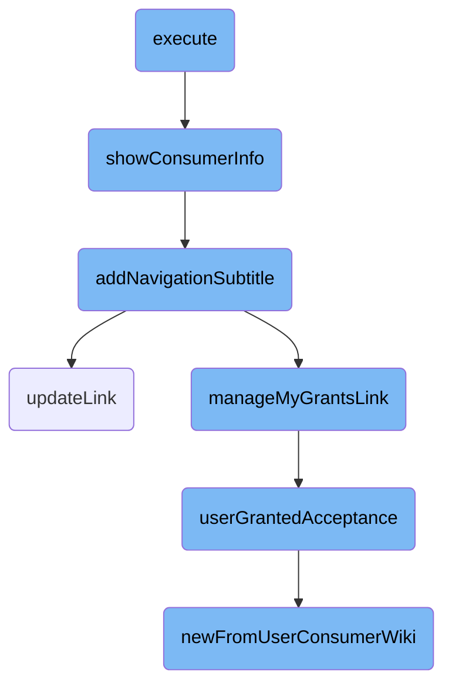

In this document, we will explain the process of executing the main flow. The process involves setting up headers, determining navigation types, displaying consumer information, and managing user grants.

# Flow drill down



<SwmSnippet path="/src/Frontend/SpecialPages/SpecialMWOAuthListConsumers.php" line="62">

---

## Executing the Main Flow

First, the <SwmToken path="src/Frontend/SpecialPages/SpecialMWOAuthListConsumers.php" pos="62:5:5" line-data="	public function execute( $par ) {">`execute`</SwmToken> function sets up the headers and help link, then determines the navigation type and consumer key. It displays the consumer list form and, based on the navigation type, either shows detailed consumer information or a list of consumers.

```hack
	public function execute( $par ) {
		$this->setHeaders();
		$this->addHelpLink( 'Help:OAuth' );

		// Format is Special:OAuthListConsumers[/list|/view/[<consumer key>]]
		$navigation = $par !== null ? explode( '/', $par ) : [];
		$type = $navigation[0] ?? null;
		$consumerKey = $navigation[1] ?? '';

		$this->showConsumerListForm();

		switch ( $type ) {
			case 'view':
				$this->showConsumerInfo( $consumerKey );
				break;
			default:
				$this->showConsumerList();
				break;
		}

		$this->getOutput()->addModuleStyles( 'ext.MWOAuth.styles' );
```

---

</SwmSnippet>

<SwmSnippet path="/src/Frontend/SpecialPages/SpecialMWOAuthListConsumers.php" line="85">

---

## Showing Consumer Information

It calls the <SwmToken path="src/Frontend/SpecialPages/SpecialMWOAuthListConsumers.php" pos="91:5:5" line-data="	protected function showConsumerInfo( $consumerKey ) {">`showConsumerInfo`</SwmToken> function to retrieve and display detailed information about a specific `OAuth` consumer. This function checks for a valid consumer key, retrieves the consumer's grants, and displays various details such as the consumer's name, version, status, and description. It also adds a navigation subtitle and shows status updates if applicable.

```hack
	/**
	 * Show the form to approve/reject/disable/re-enable consumers
	 *
	 * @param string $consumerKey
	 * @throws PermissionsError
	 */
	protected function showConsumerInfo( $consumerKey ) {
		$user = $this->getUser();
		$out = $this->getOutput();

		if ( !$consumerKey ) {
			$out->addWikiMsg( 'mwoauth-missing-consumer-key' );
		}

		$dbr = Utils::getCentralDB( DB_REPLICA );
		$cmrAc = ConsumerAccessControl::wrap(
			Consumer::newFromKey( $dbr, $consumerKey ), $this->getContext() );
		$permissionManager = MediaWikiServices::getInstance()->getPermissionManager();

		if ( !$cmrAc ) {
			$out->addWikiMsg( 'mwoauth-invalid-consumer-key' );
```

---

</SwmSnippet>

<SwmSnippet path="/src/Frontend/SpecialPages/SpecialMWOAuthListConsumers.php" line="333">

---

## Adding Navigation Subtitle

Then, the <SwmToken path="src/Frontend/SpecialPages/SpecialMWOAuthListConsumers.php" pos="337:5:5" line-data="	private function addNavigationSubtitle( ConsumerAccessControl $cmrAc ): void {">`addNavigationSubtitle`</SwmToken> function adds a subtitle with navigation links related to the consumer. It generates links for updating the consumer, managing the consumer, and managing the user's grants.

```hack
	/**
	 * @param ConsumerAccessControl $cmrAc
	 * @throws MWException
	 */
	private function addNavigationSubtitle( ConsumerAccessControl $cmrAc ): void {
		$user = $this->getUser();
		$centralUserId = Utils::getCentralIdFromLocalUser( $user );
		$linkRenderer = $this->getLinkRenderer();
		$consumer = $cmrAc->getDAO();

		$siteLinks = array_merge(
			$this->updateLink( $cmrAc, $centralUserId, $linkRenderer ),
			$this->manageConsumerLink( $consumer, $user, $linkRenderer ),
			$this->manageMyGrantsLink( $consumer, $centralUserId, $linkRenderer )
		);

		if ( $siteLinks ) {
			$links = $this->getLanguage()->pipeList( $siteLinks );
			$this->getOutput()->setSubtitle(
				"<strong>" . $this->msg( 'mwoauthlistconsumers-navigation' )->escaped() .
				"</strong> [{$links}]" );
```

---

</SwmSnippet>

<SwmSnippet path="/src/Frontend/SpecialPages/SpecialMWOAuthListConsumers.php" line="357">

---

### Updating Consumer Link

The <SwmToken path="src/Frontend/SpecialPages/SpecialMWOAuthListConsumers.php" pos="364:5:5" line-data="	private function updateLink(">`updateLink`</SwmToken> function generates a link for updating the consumer if the user has the necessary permissions.

```hack
	/**
	 * @param ConsumerAccessControl $cmrAc
	 * @param int $centralUserId Add update link for this user id, if they can update the consumer
	 * @param LinkRenderer $linkRenderer
	 * @return string[]
	 * @throws MWException
	 */
	private function updateLink(
		ConsumerAccessControl $cmrAc, $centralUserId,
		LinkRenderer $linkRenderer
	): array {
		if ( Utils::isCentralWiki() && $cmrAc->getDAO()->getUserId() === $centralUserId ) {
			return [
				$linkRenderer->makeKnownLink( SpecialPage::getTitleFor( 'OAuthConsumerRegistration',
					'update/' . $cmrAc->getDAO()->getConsumerKey() ),
					$this->msg( 'mwoauthlistconsumers-update-link' )->text() )
			];
		}

		return [];
	}
```

---

</SwmSnippet>

<SwmSnippet path="/src/Frontend/SpecialPages/SpecialMWOAuthListConsumers.php" line="402">

---

### Managing User Grants Link

The <SwmToken path="src/Frontend/SpecialPages/SpecialMWOAuthListConsumers.php" pos="410:5:5" line-data="	private function manageMyGrantsLink(">`manageMyGrantsLink`</SwmToken> function generates a link for managing the user's grants for the consumer if the user has granted acceptance.

```hack
	/**
	 * @param Consumer $consumer
	 * @param int $centralUserId Add link to manage grants for this user, if they've granted this
	 * consumer
	 * @param LinkRenderer $linkRenderer
	 * @return string[]
	 * @throws MWException
	 */
	private function manageMyGrantsLink(
		Consumer $consumer, $centralUserId, LinkRenderer $linkRenderer
	): array {
		$acceptance = $this->userGrantedAcceptance( $consumer, $centralUserId );
		if ( $acceptance !== false ) {
			return [
				$linkRenderer->makeKnownLink( SpecialPage::getTitleFor( 'OAuthManageMyGrants',
					'update/' . $acceptance->getId() ),
					$this->msg( 'mwoauthlistconsumers-grants-link' )->text() )
			];
		}

		return [];
```

---

</SwmSnippet>

<SwmSnippet path="/src/Frontend/SpecialPages/SpecialMWOAuthListConsumers.php" line="425">

---

## Checking User Granted Acceptance

The <SwmToken path="src/Frontend/SpecialPages/SpecialMWOAuthListConsumers.php" pos="430:5:5" line-data="	private function userGrantedAcceptance( Consumer $consumer, $centralUserId ) {">`userGrantedAcceptance`</SwmToken> function checks if the user has granted acceptance for the consumer, either for the current wiki or for all wikis.

```hack
	/**
	 * @param Consumer $consumer
	 * @param int $centralUserId UserId to retrieve the grants for
	 * @return bool|ConsumerAcceptance
	 */
	private function userGrantedAcceptance( Consumer $consumer, $centralUserId ) {
		$dbr = Utils::getCentralDB( DB_REPLICA );
		$wikiSpecificGrant =
			ConsumerAcceptance::newFromUserConsumerWiki(
				$dbr, $centralUserId, $consumer, WikiMap::getCurrentWikiId() );

		$allWikiGrant = ConsumerAcceptance::newFromUserConsumerWiki(
			$dbr, $centralUserId, $consumer, '*' );

		if ( $wikiSpecificGrant !== false ) {
			return $wikiSpecificGrant;
		}
		if ( $allWikiGrant !== false ) {
			return $allWikiGrant;
		}
		return false;
```

---

</SwmSnippet>

<SwmSnippet path="/src/Backend/ConsumerAcceptance.php" line="122">

---

## Retrieving User Consumer Wiki Acceptance

Finally, the <SwmToken path="src/Backend/ConsumerAcceptance.php" pos="131:7:7" line-data="	public static function newFromUserConsumerWiki(">`newFromUserConsumerWiki`</SwmToken> function retrieves the acceptance record for the user and consumer for a specific wiki. It queries the database and returns the acceptance record if found.

```hack
	/**
	 * @param IDatabase $db
	 * @param int $userId of user who authorized (central wiki's id)
	 * @param Consumer $consumer
	 * @param string $wiki wiki associated with the acceptance
	 * @param int $flags ConsumerAcceptance::READ_* bitfield
	 * @param int $oauthVersion
	 * @return ConsumerAcceptance|bool
	 */
	public static function newFromUserConsumerWiki(
		IDatabase $db, $userId, $consumer,
		$wiki, $flags = 0, $oauthVersion = Consumer::OAUTH_VERSION_1
	) {
		$queryBuilder = $db->newSelectQueryBuilder()
			->select( array_values( static::getFieldColumnMap() ) )
			->from( static::getTable() )
			->where( [
				'oaac_user_id' => $userId,
				'oaac_consumer_id' => $consumer->getId(),
				'oaac_oauth_version' => $oauthVersion,
				'oaac_wiki' => (string)$wiki
```

---

</SwmSnippet>

&nbsp;

*This is an auto-generated document by Swimm 🌊 and has not yet been verified by a human*

<SwmMeta version="3.0.0" repo-id="Z2l0aHViJTNBJTNBbWVkaWF3aWtpLWV4dGVuc2lvbnMtT0F1dGglM0ElM0FTd2ltbS1EZW1v" repo-name="mediawiki-extensions-OAuth"><sup>Powered by [Swimm](https://app.swimm.io/)</sup></SwmMeta>
