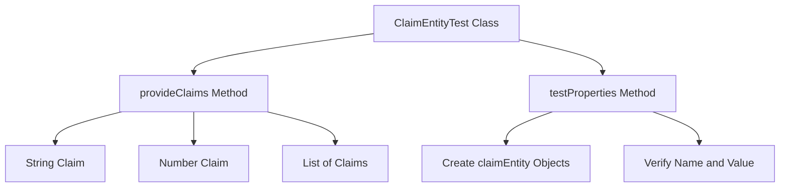

## Introduction

A claim refers to a key-value pair that represents a piece of information. Claims are used to store and retrieve specific attributes or properties. In the <SwmToken path="tests/phpunit/Entity/ClaimEntityTest.php" pos="11:2:2" line-data="class ClaimEntityTest extends MediaWikiIntegrationTestCase {">`ClaimEntityTest`</SwmToken> class, claims are tested to ensure they correctly store and return their name and value.

## Generating Claims

The <SwmToken path="tests/phpunit/Entity/ClaimEntityTest.php" pos="12:7:7" line-data="	public static function provideClaims() {">`provideClaims`</SwmToken> method generates different types of claims, such as string claims, number claims, and lists of claims.

<SwmSnippet path="/tests/phpunit/Entity/ClaimEntityTest.php" line="12">

---

The <SwmToken path="tests/phpunit/Entity/ClaimEntityTest.php" pos="12:7:7" line-data="	public static function provideClaims() {">`provideClaims`</SwmToken> method generates different types of claims, such as string claims, number claims, and lists of claims. This method uses the `yield` keyword to return different types of claims.

```hack
	public static function provideClaims() {
		yield 'string claim' => [
			[ 'str' => 'string' ]
		];

		yield 'number claim' => [
			[ 'num' => 9 ]
		];

		yield 'list of claims' => [
			[
				'class' => 'dummy class',
				'another_item' => [
					'num' => 8,
					'str' => 'mock'
				]
			]
		];
	}
```

---

</SwmSnippet>

## Testing Claim Properties

The <SwmToken path="tests/phpunit/Entity/ClaimEntityTest.php" pos="37:5:5" line-data="	public function testProperties( $claims ) {">`testProperties`</SwmToken> method iterates through these claims, creating <SwmToken path="tests/phpunit/Entity/ClaimEntityTest.php" pos="39:2:2" line-data="			$claimEntity = new ClaimEntity( $name, $value );">`claimEntity`</SwmToken> objects and verifying that the name and value are correctly set and retrieved.

<SwmSnippet path="/tests/phpunit/Entity/ClaimEntityTest.php" line="37">

---

The <SwmToken path="tests/phpunit/Entity/ClaimEntityTest.php" pos="37:5:5" line-data="	public function testProperties( $claims ) {">`testProperties`</SwmToken> method iterates through the claims generated by <SwmToken path="tests/phpunit/Entity/ClaimEntityTest.php" pos="12:7:7" line-data="	public static function provideClaims() {">`provideClaims`</SwmToken>, creates <SwmToken path="tests/phpunit/Entity/ClaimEntityTest.php" pos="39:2:2" line-data="			$claimEntity = new ClaimEntity( $name, $value );">`claimEntity`</SwmToken> objects, and verifies that the name and value are correctly set and retrieved.

```hack
	public function testProperties( $claims ) {
		foreach ( $claims as $name => $value ) {
			$claimEntity = new ClaimEntity( $name, $value );
			$this->assertEquals( $name, $claimEntity->getName() );
			$this->assertEquals( $value, $claimEntity->getValue() );
		}
```

---

</SwmSnippet>

&nbsp;

*This is an auto-generated document by Swimm AI 🌊 and has not yet been verified by a human*

<SwmMeta version="3.0.0" repo-id="Z2l0aHViJTNBJTNBbWVkaWF3aWtpLWV4dGVuc2lvbnMtT0F1dGglM0ElM0FTd2ltbS1EZW1v" repo-name="mediawiki-extensions-OAuth"><sup>Powered by [Swimm](/)</sup></SwmMeta>
