```mermaid
classDiagram
 ClientEntity <|-- MockClientEntity
 ClientEntity : +string consumerKey
 ClientEntity : +string callbackUrl
 ClientEntity : +string name
 ClientEntity : +timestamp emailAuthenticated
 ClientEntity : +timestamp registration
 ClientEntity : +timestamp stageTimestamp
 ClientEntity : +array oauth2GrantTypes
 ClientEntity : +bool isConfidential()
 ClientEntity : +AccessTokenEntity getOwnerOnlyAccessToken(ConsumerAcceptance approval)
 MockClientEntity : +static newMock(User user, array values)

%% Swimm:
%% classDiagram
%%  <SwmToken path="tests/phpunit/Entity/MockClientEntity.php" pos="10:6:6" line-data="class MockClientEntity extends ClientEntity {">`ClientEntity`</SwmToken> <|-- <SwmToken path="tests/phpunit/Entity/ClientEntityTest.php" pos="19:6:6" line-data="		$client = MockClientEntity::newMock( $this-&gt;getTestUser()-&gt;getUser(), [">`MockClientEntity`</SwmToken>
%%  <SwmToken path="tests/phpunit/Entity/MockClientEntity.php" pos="10:6:6" line-data="class MockClientEntity extends ClientEntity {">`ClientEntity`</SwmToken> : +string <SwmToken path="tests/phpunit/Entity/ClientEntityTest.php" pos="20:2:2" line-data="			&#39;consumerKey&#39; =&gt; &#39;123456789&#39;,">`consumerKey`</SwmToken>
%%  <SwmToken path="tests/phpunit/Entity/MockClientEntity.php" pos="10:6:6" line-data="class MockClientEntity extends ClientEntity {">`ClientEntity`</SwmToken> : +string <SwmToken path="tests/phpunit/Entity/ClientEntityTest.php" pos="21:2:2" line-data="			&#39;callbackUrl&#39; =&gt; $domain,">`callbackUrl`</SwmToken>
%%  <SwmToken path="tests/phpunit/Entity/MockClientEntity.php" pos="10:6:6" line-data="class MockClientEntity extends ClientEntity {">`ClientEntity`</SwmToken> : +string name
%%  <SwmToken path="tests/phpunit/Entity/MockClientEntity.php" pos="10:6:6" line-data="class MockClientEntity extends ClientEntity {">`ClientEntity`</SwmToken> : +timestamp <SwmToken path="tests/phpunit/Entity/ClientEntityTest.php" pos="23:2:2" line-data="			&#39;emailAuthenticated&#39;   =&gt; $now,">`emailAuthenticated`</SwmToken>
%%  <SwmToken path="tests/phpunit/Entity/MockClientEntity.php" pos="10:6:6" line-data="class MockClientEntity extends ClientEntity {">`ClientEntity`</SwmToken> : +timestamp registration
%%  <SwmToken path="tests/phpunit/Entity/MockClientEntity.php" pos="10:6:6" line-data="class MockClientEntity extends ClientEntity {">`ClientEntity`</SwmToken> : +timestamp <SwmToken path="tests/phpunit/Entity/ClientEntityTest.php" pos="25:2:2" line-data="			&#39;stageTimestamp&#39;       =&gt; $now,">`stageTimestamp`</SwmToken>
%%  <SwmToken path="tests/phpunit/Entity/MockClientEntity.php" pos="10:6:6" line-data="class MockClientEntity extends ClientEntity {">`ClientEntity`</SwmToken> : +array <SwmToken path="tests/phpunit/Entity/ClientEntityTest.php" pos="27:2:2" line-data="			&#39;oauth2GrantTypes&#39; =&gt; [ &#39;client_credentials&#39; ]">`oauth2GrantTypes`</SwmToken>
%%  <SwmToken path="tests/phpunit/Entity/MockClientEntity.php" pos="10:6:6" line-data="class MockClientEntity extends ClientEntity {">`ClientEntity`</SwmToken> : +bool <SwmToken path="tests/phpunit/Entity/ClientEntityTest.php" pos="35:4:6" line-data="			$client-&gt;isConfidential(),">`isConfidential()`</SwmToken>
%%  <SwmToken path="tests/phpunit/Entity/MockClientEntity.php" pos="10:6:6" line-data="class MockClientEntity extends ClientEntity {">`ClientEntity`</SwmToken> : +AccessTokenEntity getOwnerOnlyAccessToken(ConsumerAcceptance approval)
%%  <SwmToken path="tests/phpunit/Entity/ClientEntityTest.php" pos="19:6:6" line-data="		$client = MockClientEntity::newMock( $this-&gt;getTestUser()-&gt;getUser(), [">`MockClientEntity`</SwmToken> : +static newMock(User user, array values)
```

# Exploring Client Entity

Client refers to an entity that represents an application or service that interacts with the <SwmToken path="tests/phpunit/Entity/ClientEntityTest.php" pos="3:6:6" line-data="namespace MediaWiki\Extension\OAuth\Tests\Entity;">`OAuth`</SwmToken> system. It is used to store and manage information about the application, such as its consumer key, callback URL, name, and other relevant details.

# Client Properties

Client's properties include the consumer key, callback URL, name, email authentication timestamp, registration timestamp, stage timestamp, and allowed grant types. These properties are essential for identifying and managing the client.

<SwmSnippet path="/tests/phpunit/Entity/ClientEntityTest.php" line="16">

---

The test <SwmToken path="tests/phpunit/Entity/ClientEntityTest.php" pos="16:5:5" line-data="	public function testProperties() {">`testProperties`</SwmToken> demonstrates how to create a <SwmToken path="tests/phpunit/Entity/ClientEntityTest.php" pos="19:2:2" line-data="		$client = MockClientEntity::newMock( $this-&gt;getTestUser()-&gt;getUser(), [">`client`</SwmToken> with various properties such as <SwmToken path="tests/phpunit/Entity/ClientEntityTest.php" pos="20:2:2" line-data="			&#39;consumerKey&#39; =&gt; &#39;123456789&#39;,">`consumerKey`</SwmToken>, <SwmToken path="tests/phpunit/Entity/ClientEntityTest.php" pos="21:2:2" line-data="			&#39;callbackUrl&#39; =&gt; $domain,">`callbackUrl`</SwmToken>, <SwmToken path="tests/phpunit/Entity/ClientEntityTest.php" pos="22:2:2" line-data="			&#39;name&#39; =&gt; &#39;Test client&#39;,">`name`</SwmToken>, <SwmToken path="tests/phpunit/Entity/ClientEntityTest.php" pos="23:2:2" line-data="			&#39;emailAuthenticated&#39;   =&gt; $now,">`emailAuthenticated`</SwmToken>, <SwmToken path="tests/phpunit/Entity/ClientEntityTest.php" pos="24:2:2" line-data="			&#39;registration&#39;         =&gt; $now,">`registration`</SwmToken>, <SwmToken path="tests/phpunit/Entity/ClientEntityTest.php" pos="25:2:2" line-data="			&#39;stageTimestamp&#39;       =&gt; $now,">`stageTimestamp`</SwmToken>, and <SwmToken path="tests/phpunit/Entity/ClientEntityTest.php" pos="27:2:2" line-data="			&#39;oauth2GrantTypes&#39; =&gt; [ &#39;client_credentials&#39; ]">`oauth2GrantTypes`</SwmToken>. These properties are essential for identifying and managing the client.

```hack
	public function testProperties() {
		$domain = 'http://domain.com/oauth2';
		$now = wfTimestampNow();
		$client = MockClientEntity::newMock( $this->getTestUser()->getUser(), [
			'consumerKey' => '123456789',
			'callbackUrl' => $domain,
			'name' => 'Test client',
			'emailAuthenticated'   => $now,
			'registration'         => $now,
			'stageTimestamp'       => $now,
			'oauth2IsConfidential' => false,
			'oauth2GrantTypes' => [ 'client_credentials' ]
		] );

		$this->assertSame(
			$domain, $client->getRedirectUri(),
			'Redirect URI should match the one given on registration'
		);
		$this->assertFalse(
			$client->isConfidential(),
			'Client should not be confidential'
```

---

</SwmSnippet>

# Confidential and Non-Confidential Clients

Client can be confidential or non-confidential, which determines how it handles sensitive information. The test checks if the client is confidential or not using the <SwmToken path="tests/phpunit/Entity/ClientEntityTest.php" pos="35:4:4" line-data="			$client-&gt;isConfidential(),">`isConfidential`</SwmToken> method.

<SwmSnippet path="/tests/phpunit/Entity/ClientEntityTest.php" line="34">

---

The test checks if the client is confidential or not using the <SwmToken path="tests/phpunit/Entity/ClientEntityTest.php" pos="35:4:4" line-data="			$client-&gt;isConfidential(),">`isConfidential`</SwmToken> method. This determines how the client handles sensitive information.

```hack
		$this->assertFalse(
			$client->isConfidential(),
			'Client should not be confidential'
		);
```

---

</SwmSnippet>

# Generating Access Tokens

Client can generate access tokens for users, which are used to authenticate and authorize API requests. The test <SwmToken path="tests/phpunit/Entity/ClientEntityTest.php" pos="16:5:5" line-data="	public function testProperties() {">`testProperties`</SwmToken> also shows how to generate an access token for a user using the <SwmToken path="tests/phpunit/Entity/ClientEntityTest.php" pos="82:9:9" line-data="		$accessToken = $client-&gt;getOwnerOnlyAccessToken( $approval );">`getOwnerOnlyAccessToken`</SwmToken> method.

# <SwmToken path="tests/phpunit/Entity/ClientEntityTest.php" pos="19:6:6" line-data="		$client = MockClientEntity::newMock( $this-&gt;getTestUser()-&gt;getUser(), [">`MockClientEntity`</SwmToken>

The <SwmToken path="tests/phpunit/Entity/ClientEntityTest.php" pos="19:6:6" line-data="		$client = MockClientEntity::newMock( $this-&gt;getTestUser()-&gt;getUser(), [">`MockClientEntity`</SwmToken> class extends <SwmToken path="tests/phpunit/Entity/MockClientEntity.php" pos="10:6:6" line-data="class MockClientEntity extends ClientEntity {">`ClientEntity`</SwmToken> and provides a method <SwmToken path="tests/phpunit/Entity/ClientEntityTest.php" pos="19:8:8" line-data="		$client = MockClientEntity::newMock( $this-&gt;getTestUser()-&gt;getUser(), [">`newMock`</SwmToken> to create a mock client with default values. This is useful for testing purposes.

<SwmSnippet path="/tests/phpunit/Entity/MockClientEntity.php" line="10">

---

The <SwmToken path="tests/phpunit/Entity/MockClientEntity.php" pos="10:2:2" line-data="class MockClientEntity extends ClientEntity {">`MockClientEntity`</SwmToken> class extends <SwmToken path="tests/phpunit/Entity/MockClientEntity.php" pos="10:6:6" line-data="class MockClientEntity extends ClientEntity {">`ClientEntity`</SwmToken> and provides a method <SwmToken path="tests/phpunit/Entity/MockClientEntity.php" pos="11:7:7" line-data="	public static function newMock( User $user, $values = [] ) {">`newMock`</SwmToken> to create a mock client with default values. This is useful for testing purposes.

```hack
class MockClientEntity extends ClientEntity {
	public static function newMock( User $user, $values = [] ) {
		$now = wfTimestampNow();
		return ClientEntity::newFromArray( array_merge( [
			'id'                   => null,
			'consumerKey'          => '123456789',
			'userId'               => $user->getId(),
			'name'                 => 'Test client',
			'description'          => 'Test application',
			'wiki'                 => 'TestWiki',
			'version'              => '1.0',
			'email'                => $user->getEmail(),
			'emailAuthenticated'   => $now,
			'callbackUrl'          => 'https://example.com',
			'callbackIsPrefix'     => true,
			'developerAgreement'   => 1,
			'secretKey'            => 'secretKey',
			'registration'         => $now,
			'stage'                => Consumer::STAGE_APPROVED,
			'stageTimestamp'       => $now,
			'grants'               => [ 'editpage', 'highvolume' ],
```

---

</SwmSnippet>

&nbsp;

*This is an auto-generated document by Swimm AI 🌊 and has not yet been verified by a human*

<SwmMeta version="3.0.0" repo-id="Z2l0aHViJTNBJTNBbWVkaWF3aWtpLWV4dGVuc2lvbnMtT0F1dGglM0ElM0FTd2ltbS1EZW1v" repo-name="mediawiki-extensions-OAuth"><sup>Powered by [Swimm](/)</sup></SwmMeta>
