```mermaid
classDiagram
    direction TB
    class UserEntityTest {
        +provideClaims()
    }
    class ClaimEntityTest {
        +provideClaims()
    }
    class ClientEntityTest {
        +testClientProperties()
    }
    class AccessTokenEntityTest {
        +testAccessTokenProperties()
    }
    class MockClientEntity {
        +createMockClient()
    }

%% Swimm:
%% classDiagram
%%     direction TB
%%     class <SwmToken path="tests/phpunit/Entity/UserEntityTest.php" pos="13:2:2" line-data="class UserEntityTest extends MediaWikiIntegrationTestCase {">`UserEntityTest`</SwmToken> {
%%         +provideClaims()
%%     }
%%     class <SwmToken path="tests/phpunit/Entity/ClaimEntityTest.php" pos="11:2:2" line-data="class ClaimEntityTest extends MediaWikiIntegrationTestCase {">`ClaimEntityTest`</SwmToken> {
%%         +provideClaims()
%%     }
%%     class <SwmToken path="tests/phpunit/Entity/ClientEntityTest.php" pos="14:2:2" line-data="class ClientEntityTest extends MediaWikiIntegrationTestCase {">`ClientEntityTest`</SwmToken> {
%%         +testClientProperties()
%%     }
%%     class <SwmToken path="tests/phpunit/Entity/AccessTokenEntityTest.php" pos="16:2:2" line-data="class AccessTokenEntityTest extends MediaWikiIntegrationTestCase {">`AccessTokenEntityTest`</SwmToken> {
%%         +testAccessTokenProperties()
%%     }
%%     class <SwmToken path="tests/phpunit/Entity/ClientEntityTest.php" pos="19:6:6" line-data="		$client = MockClientEntity::newMock( $this-&gt;getTestUser()-&gt;getUser(), [">`MockClientEntity`</SwmToken> {
%%         +createMockClient()
%%     }
```

# Exploring Entity Tests

Entities are used to represent various objects within the <SwmToken path="tests/phpunit/Entity/UserEntityTest.php" pos="3:6:6" line-data="namespace MediaWiki\Extension\OAuth\Tests\Entity;">`OAuth`</SwmToken> extension, such as users, clients, claims, and access tokens. In the tests, entities are instantiated and their properties are verified to ensure they behave as expected.

<SwmSnippet path="/tests/phpunit/Entity/UserEntityTest.php" line="3">

---

The <SwmToken path="tests/phpunit/Entity/UserEntityTest.php" pos="13:2:2" line-data="class UserEntityTest extends MediaWikiIntegrationTestCase {">`UserEntityTest`</SwmToken> file sets up the namespace and imports necessary classes for testing the <SwmToken path="tests/phpunit/Entity/UserEntityTest.php" pos="5:10:10" line-data="use MediaWiki\Extension\OAuth\Entity\UserEntity;">`UserEntity`</SwmToken>.

```hack
namespace MediaWiki\Extension\OAuth\Tests\Entity;

use MediaWiki\Extension\OAuth\Entity\UserEntity;
use MediaWikiIntegrationTestCase;

/**
 * @covers \MediaWiki\Extension\OAuth\Entity\UserEntity
```

---

</SwmSnippet>

## <SwmToken path="tests/phpunit/Entity/ClaimEntityTest.php" pos="11:2:2" line-data="class ClaimEntityTest extends MediaWikiIntegrationTestCase {">`ClaimEntityTest`</SwmToken>

<SwmToken path="tests/phpunit/Entity/ClaimEntityTest.php" pos="11:2:2" line-data="class ClaimEntityTest extends MediaWikiIntegrationTestCase {">`ClaimEntityTest`</SwmToken> verifies that claims have the correct name and value.

<SwmSnippet path="/tests/phpunit/Entity/ClaimEntityTest.php" line="3">

---

The <SwmToken path="tests/phpunit/Entity/ClaimEntityTest.php" pos="11:2:2" line-data="class ClaimEntityTest extends MediaWikiIntegrationTestCase {">`ClaimEntityTest`</SwmToken> file sets up the namespace, imports necessary classes, and provides various test cases for different types of claims.

```hack
namespace MediaWiki\Extension\OAuth\Tests\Entity;

use MediaWiki\Extension\OAuth\Entity\ClaimEntity;
use MediaWikiIntegrationTestCase;

/**
 * @group OAuth
 */
class ClaimEntityTest extends MediaWikiIntegrationTestCase {
	public static function provideClaims() {
		yield 'string claim' => [
			[ 'str' => 'string' ]
		];

		yield 'number claim' => [
			[ 'num' => 9 ]
		];

		yield 'list of claims' => [
			[
				'class' => 'dummy class',
```

---

</SwmSnippet>

## <SwmToken path="tests/phpunit/Entity/ClientEntityTest.php" pos="14:2:2" line-data="class ClientEntityTest extends MediaWikiIntegrationTestCase {">`ClientEntityTest`</SwmToken>

<SwmToken path="tests/phpunit/Entity/ClientEntityTest.php" pos="14:2:2" line-data="class ClientEntityTest extends MediaWikiIntegrationTestCase {">`ClientEntityTest`</SwmToken> ensures that client properties like redirect URI, confidentiality, and consumer key are correctly set and retrieved.

<SwmSnippet path="/tests/phpunit/Entity/ClientEntityTest.php" line="3">

---

The <SwmToken path="tests/phpunit/Entity/ClientEntityTest.php" pos="14:2:2" line-data="class ClientEntityTest extends MediaWikiIntegrationTestCase {">`ClientEntityTest`</SwmToken> file sets up the namespace and imports necessary classes for testing the <SwmToken path="tests/phpunit/Entity/ClientEntityTest.php" pos="10:15:15" line-data=" * @covers \MediaWiki\Extension\OAuth\Entity\ClientEntity">`ClientEntity`</SwmToken>.

```hack
namespace MediaWiki\Extension\OAuth\Tests\Entity;

use MediaWiki\Extension\OAuth\Backend\ConsumerAcceptance;
use MediaWiki\Extension\OAuth\Entity\AccessTokenEntity;
use MediaWikiIntegrationTestCase;

/**
 * @covers \MediaWiki\Extension\OAuth\Entity\ClientEntity
```

---

</SwmSnippet>

## <SwmToken path="tests/phpunit/Entity/AccessTokenEntityTest.php" pos="16:2:2" line-data="class AccessTokenEntityTest extends MediaWikiIntegrationTestCase {">`AccessTokenEntityTest`</SwmToken>

<SwmToken path="tests/phpunit/Entity/AccessTokenEntityTest.php" pos="16:2:2" line-data="class AccessTokenEntityTest extends MediaWikiIntegrationTestCase {">`AccessTokenEntityTest`</SwmToken> checks that access tokens have the correct identifier, user identifier, client identifier, scopes, and claims.

<SwmSnippet path="/tests/phpunit/Entity/AccessTokenEntityTest.php" line="3">

---

The <SwmToken path="tests/phpunit/Entity/AccessTokenEntityTest.php" pos="16:2:2" line-data="class AccessTokenEntityTest extends MediaWikiIntegrationTestCase {">`AccessTokenEntityTest`</SwmToken> file sets up the namespace and imports necessary classes for testing the <SwmToken path="tests/phpunit/Entity/AccessTokenEntityTest.php" pos="6:10:10" line-data="use MediaWiki\Extension\OAuth\Entity\AccessTokenEntity;">`AccessTokenEntity`</SwmToken>.

```hack
namespace MediaWiki\Extension\OAuth\Tests\Entity;

use League\OAuth2\Server\Entities\ScopeEntityInterface;
use MediaWiki\Extension\OAuth\Entity\AccessTokenEntity;
use MediaWiki\Extension\OAuth\Entity\ClaimEntity;
use MediaWiki\Extension\OAuth\Entity\ScopeEntity;
```

---

</SwmSnippet>

## <SwmToken path="tests/phpunit/Entity/ClientEntityTest.php" pos="19:6:6" line-data="		$client = MockClientEntity::newMock( $this-&gt;getTestUser()-&gt;getUser(), [">`MockClientEntity`</SwmToken>

Mock entities, like <SwmToken path="tests/phpunit/Entity/ClientEntityTest.php" pos="19:6:6" line-data="		$client = MockClientEntity::newMock( $this-&gt;getTestUser()-&gt;getUser(), [">`MockClientEntity`</SwmToken>, are used to create test instances with predefined values for testing purposes.

<SwmSnippet path="/tests/phpunit/Entity/MockClientEntity.php" line="3">

---

The <SwmToken path="tests/phpunit/Entity/ClientEntityTest.php" pos="19:6:6" line-data="		$client = MockClientEntity::newMock( $this-&gt;getTestUser()-&gt;getUser(), [">`MockClientEntity`</SwmToken> file sets up the namespace and imports necessary classes for creating mock client entities.

```hack
namespace MediaWiki\Extension\OAuth\Tests\Entity;

use MediaWiki\Extension\OAuth\Backend\Consumer;
use MediaWiki\Extension\OAuth\Entity\ClientEntity;
use MediaWiki\User\User;
use MWRestrictions;
```

---

</SwmSnippet>

&nbsp;

*This is an auto-generated document by Swimm AI 🌊 and has not yet been verified by a human*

<SwmMeta version="3.0.0" repo-id="Z2l0aHViJTNBJTNBbWVkaWF3aWtpLWV4dGVuc2lvbnMtT0F1dGglM0ElM0FTd2ltbS1EZW1v" repo-name="mediawiki-extensions-OAuth"><sup>Powered by [Swimm](/)</sup></SwmMeta>
