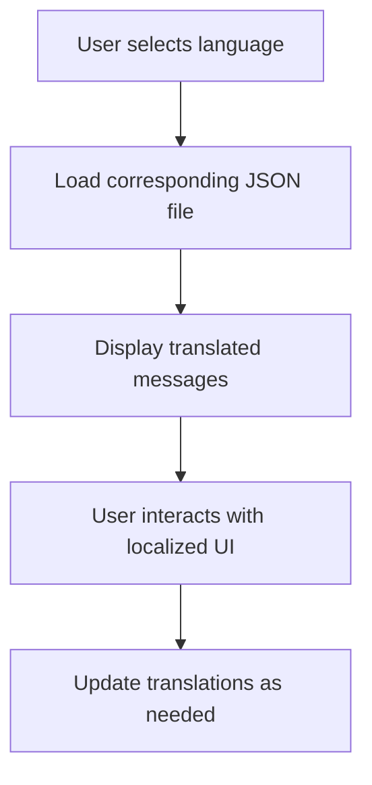

# Introduction

Localization refers to the adaptation of the extension to different languages and regions. This involves translating the user interface and messages into various languages to ensure that users from different linguistic backgrounds can use the extension effectively.

# Translation Files

The `i18n` directory contains JSON files for each supported language. Each file includes key-value pairs where the key is the message identifier and the value is the translated message. For example, <SwmPath>[i18n/en.json](i18n/en.json)</SwmPath> contains translations for English, while <SwmPath>[i18n/es.json](i18n/es.json)</SwmPath> contains translations for Spanish.

<SwmSnippet path="/i18n/es.json" line="241">

---

The <SwmPath>[i18n/es.json](i18n/es.json)</SwmPath> file contains translations for Spanish, ensuring that Spanish-speaking users can understand the messages.

```json
	"mwoauth-tag-reserved": "Las etiquetas que comienzan con <code>OAuth CID:</code> están reservadas para que las use OAuth.",
```

---

</SwmSnippet>

<SwmSnippet path="/i18n/pt-br.json" line="45">

---

The <SwmPath>[i18n/pt-br.json](i18n/pt-br.json)</SwmPath> file provides translations for Brazilian Portuguese, adapting the extension for users in Brazil.

```json
	"mwoauth-consumer-callbackisprefix": "Permitir que o consumidor especifique um retorno nos pedidos e use o URL \"callback\" acima como um prefixo necessário.",
	"mwoauth-consumer-granttypes": "Tipos de permissões sendo solicitadas:",
	"mwoauth-consumer-grantsneeded": "Permissões aplicáveis:",
	"mwoauth-consumer-required-grant": "Aplicável ao consumidor",
	"mwoauth-consumer-wiki": "Projeto aplicável:",
	"mwoauth-consumer-wiki-thiswiki": "Projeto atual ($1)",
	"mwoauth-consumer-restrictions": "Restrições de uso:",
	"mwoauth-consumer-restrictions-json": "Restrições de uso (JSON):",
	"mwoauth-consumer-rsakey": "Chave RSA pública (opcional):",
	"mwoauth-consumer-rsakey-help": "Digite uma chave pública para usar o método de assinatura RSA-SHA1. Deixe vazio para usar HMAC-SHA1 com um segredo aleatório. Se você não tem certeza, deixe-o vazio.",
	"mwoauth-consumer-secretkey": "Chave secreta do consumidor:",
	"mwoauth-consumer-accesstoken": "Chave de acesso:",
	"mwoauth-consumer-reason": "Motivo:",
	"mwoauth-consumer-developer-agreement": "Ao enviar este aplicativo, você reconhece que nos reservamos o direito de desativar seu aplicativo, removê-lo ou restringir o acesso de você ou o seu aplicativo a este site e seguir qualquer outro curso de ação que consideremos apropriado se acreditarmos, a nosso juízo, que você ou sua aplicação está violando qualquer política, diretriz e princípio orientador deste site. Podemos alterar esta Política de Aplicação a qualquer momento sem aviso prévio, a nosso exclusivo critério e, como julgamos necessário. O seu uso contínuo de OAuth constitui aceitação dessas mudanças.",
	"mwoauth-consumer-email-unconfirmed": "O seu endereço de e-mail ainda não foi confirmado.",
	"mwoauth-consumer-email-mismatched": "O endereço de e-mail fornecido deve coincidir com o da sua conta.",
	"mwoauth-consumer-alreadyexists": "Um consumidor com essa combinação de nome/versão/editor já existe",
	"mwoauth-consumer-alreadyexistsversion": "Um consumidor com essa combinação de nome/editor já existe com uma versão igual ou superior (\"$1\")",
	"mwoauth-consumer-not-accepted": "Não é possível atualizar informações para um pedido de consumidor pendente",
	"mwoauth-consumer-not-proposed": "O consumidor não está proposto atualmente",
	"mwoauth-consumer-not-disabled": "O consumidor não está desativado",
```

---

</SwmSnippet>

<SwmSnippet path="/i18n/qqq.json" line="52">

---

The <SwmPath>[i18n/qqq.json](i18n/qqq.json)</SwmPath> file includes descriptions and context for each message identifier, aiding translators in understanding the purpose of each message.

```json
	"mwoauth-consumer-callbackisprefix": "Used as a label for the check box where user can decide if their consumer should use \"Callback URL\" as a string prefix (checked), or if the consumer cannot customize the callback URL in its requests as is required to specify \"oob\" (unchecked, default).",
	"mwoauth-consumer-granttypes": "Used as label to select between authorization-only (with or without private info) and normal API access",
	"mwoauth-consumer-grantsneeded": "Used as label.\n\nFollowed by the list of grants.\n{{Identical|Applicable grant}}",
	"mwoauth-consumer-required-grant": "Used as table column header.",
	"mwoauth-consumer-wiki": "Used as label for the input box. The default value for the input box is \"*\".\n{{Identical|Applicable project}}",
	"mwoauth-consumer-wiki-thiswiki": "Label for selection-list option, indicating the wiki this user is currently visiting.\n\nParameters:\n* $1 - wiki ID",
	"mwoauth-consumer-restrictions": "Used as label for the textarea. (The value is written in JSON format.)\n\nFollowed by the textarea or the message {{msg-mw|Mwoauthmanageconsumers-field-hidden}}.\n{{Identical|Usage restriction}}",
	"mwoauth-consumer-restrictions-json": "Used as label for the \"Restrictions\" textarea.\n{{Identical|Usage restriction}}",
	"mwoauth-consumer-rsakey": "Used as label for the textarea.\n\nFollowed by the textarea or the message {{msg-mw|Mwoauthmanageconsumers-field-hidden}}.",
	"mwoauth-consumer-rsakey-help": "Used as help message for the textarea, on the consumer registration form.",
	"mwoauth-consumer-secretkey": "Used as label for the textarea.",
	"mwoauth-consumer-accesstoken": "Unused at this time.",
	"mwoauth-consumer-reason": "Used as label for the \"Reason\" value.\n{{Identical|Reason}}",
	"mwoauth-consumer-developer-agreement": "Agreement shown on application form, indicating that the app author understands their responsibilities by submitting this form.\n\n\"Application\" means \"app, software application\".",
	"mwoauth-consumer-email-unconfirmed": "Used as failure message when taking some action which requires email-confirmation.",
	"mwoauth-consumer-email-mismatched": "Used as failure message when taking some action.",
	"mwoauth-consumer-alreadyexists": "Used as failure message.",
	"mwoauth-consumer-alreadyexistsversion": "Used as failure message. Parameters:\n* $1 - current consumer version number",
	"mwoauth-consumer-not-accepted": "Unused at this time.",
	"mwoauth-consumer-not-proposed": "Used as failure message when approving or rejecting the consumer.\n\nSee also:\n* {{msg-mw|Mwoauth-consumer-not-disabled}}",
	"mwoauth-consumer-not-disabled": "Used as failure message when re-enabling the consumer.\n\nSee also:\n* {{msg-mw|Mwoauth-consumer-not-proposed}}",
```

---

</SwmSnippet>

# Localization Endpoints

Localization endpoints provide specific descriptions and explanations for various <SwmToken path="i18n/es.json" pos="241:24:24" line-data="	&quot;mwoauth-tag-reserved&quot;: &quot;Las etiquetas que comienzan con &lt;code&gt;OAuth CID:&lt;/code&gt; están reservadas para que las use OAuth.&quot;,">`OAuth`</SwmToken> mechanisms and messages.

## <SwmToken path="i18n/nb.json" pos="11:2:4" line-data="	&quot;mwoauth-desc&quot;: &quot;Muliggjør bruk av OAuth 1.0a og OAuth 2.0 for API-autorisering&quot;,">`mwoauth-desc`</SwmToken>

The <SwmToken path="i18n/nb.json" pos="11:2:4" line-data="	&quot;mwoauth-desc&quot;: &quot;Muliggjør bruk av OAuth 1.0a og OAuth 2.0 for API-autorisering&quot;,">`mwoauth-desc`</SwmToken> endpoint provides a description of the <SwmToken path="i18n/es.json" pos="241:24:24" line-data="	&quot;mwoauth-tag-reserved&quot;: &quot;Las etiquetas que comienzan con &lt;code&gt;OAuth CID:&lt;/code&gt; están reservadas para que las use OAuth.&quot;,">`OAuth`</SwmToken> extension, indicating that it enables the use of <SwmToken path="i18n/es.json" pos="241:24:24" line-data="	&quot;mwoauth-tag-reserved&quot;: &quot;Las etiquetas que comienzan con &lt;code&gt;OAuth CID:&lt;/code&gt; están reservadas para que las use OAuth.&quot;,">`OAuth`</SwmToken> <SwmToken path="i18n/nb.json" pos="11:17:19" line-data="	&quot;mwoauth-desc&quot;: &quot;Muliggjør bruk av OAuth 1.0a og OAuth 2.0 for API-autorisering&quot;,">`1.0a`</SwmToken> and <SwmToken path="i18n/es.json" pos="241:24:24" line-data="	&quot;mwoauth-tag-reserved&quot;: &quot;Las etiquetas que comienzan con &lt;code&gt;OAuth CID:&lt;/code&gt; están reservadas para que las use OAuth.&quot;,">`OAuth`</SwmToken> <SwmToken path="i18n/nb.json" pos="11:25:27" line-data="	&quot;mwoauth-desc&quot;: &quot;Muliggjør bruk av OAuth 1.0a og OAuth 2.0 for API-autorisering&quot;,">`2.0`</SwmToken> for API authorization.

<SwmSnippet path="/i18n/nb.json" line="11">

---

The <SwmToken path="i18n/nb.json" pos="11:2:4" line-data="	&quot;mwoauth-desc&quot;: &quot;Muliggjør bruk av OAuth 1.0a og OAuth 2.0 for API-autorisering&quot;,">`mwoauth-desc`</SwmToken> endpoint in Norwegian.

```json
	"mwoauth-desc": "Muliggjør bruk av OAuth 1.0a og OAuth 2.0 for API-autorisering",
```

---

</SwmSnippet>

## <SwmToken path="i18n/nb.json" pos="12:2:6" line-data="	&quot;mwoauth-nosubpage-explanation&quot;: &quot;OAuth er en mekanisme som lar eksterne applikasjoner identifisere en {{SITENAME}}-bruker eller handle på deres vegne, etter at tillatelse er gitt av brukeren.\n\nFor at denne siden skal gjøre noe må flere parametere angis. Hvis du ble sendt hit av en ekstern applikasjon var det trolig på grunn av en feil i applikasjonen; du burde kontakte opphavspersonen dens.&quot;,">`mwoauth-nosubpage-explanation`</SwmToken>

The <SwmToken path="i18n/nb.json" pos="12:2:6" line-data="	&quot;mwoauth-nosubpage-explanation&quot;: &quot;OAuth er en mekanisme som lar eksterne applikasjoner identifisere en {{SITENAME}}-bruker eller handle på deres vegne, etter at tillatelse er gitt av brukeren.\n\nFor at denne siden skal gjøre noe må flere parametere angis. Hvis du ble sendt hit av en ekstern applikasjon var det trolig på grunn av en feil i applikasjonen; du burde kontakte opphavspersonen dens.&quot;,">`mwoauth-nosubpage-explanation`</SwmToken> endpoint explains the <SwmToken path="i18n/es.json" pos="241:24:24" line-data="	&quot;mwoauth-tag-reserved&quot;: &quot;Las etiquetas que comienzan con &lt;code&gt;OAuth CID:&lt;/code&gt; están reservadas para que las use OAuth.&quot;,">`OAuth`</SwmToken> mechanism, which allows external applications to identify a user or act on their behalf after receiving permission from the user.

<SwmSnippet path="/i18n/nb.json" line="12">

---

The <SwmToken path="i18n/nb.json" pos="12:2:6" line-data="	&quot;mwoauth-nosubpage-explanation&quot;: &quot;OAuth er en mekanisme som lar eksterne applikasjoner identifisere en {{SITENAME}}-bruker eller handle på deres vegne, etter at tillatelse er gitt av brukeren.\n\nFor at denne siden skal gjøre noe må flere parametere angis. Hvis du ble sendt hit av en ekstern applikasjon var det trolig på grunn av en feil i applikasjonen; du burde kontakte opphavspersonen dens.&quot;,">`mwoauth-nosubpage-explanation`</SwmToken> endpoint in Norwegian.

```json
	"mwoauth-nosubpage-explanation": "OAuth er en mekanisme som lar eksterne applikasjoner identifisere en {{SITENAME}}-bruker eller handle på deres vegne, etter at tillatelse er gitt av brukeren.\n\nFor at denne siden skal gjøre noe må flere parametere angis. Hvis du ble sendt hit av en ekstern applikasjon var det trolig på grunn av en feil i applikasjonen; du burde kontakte opphavspersonen dens.",
```

---

</SwmSnippet>

&nbsp;

*This is an auto-generated document by Swimm AI 🌊 and has not yet been verified by a human*

<SwmMeta version="3.0.0" repo-id="Z2l0aHViJTNBJTNBbWVkaWF3aWtpLWV4dGVuc2lvbnMtT0F1dGglM0ElM0FTd2ltbS1EZW1v" repo-name="mediawiki-extensions-OAuth"><sup>Powered by [Swimm](/)</sup></SwmMeta>
