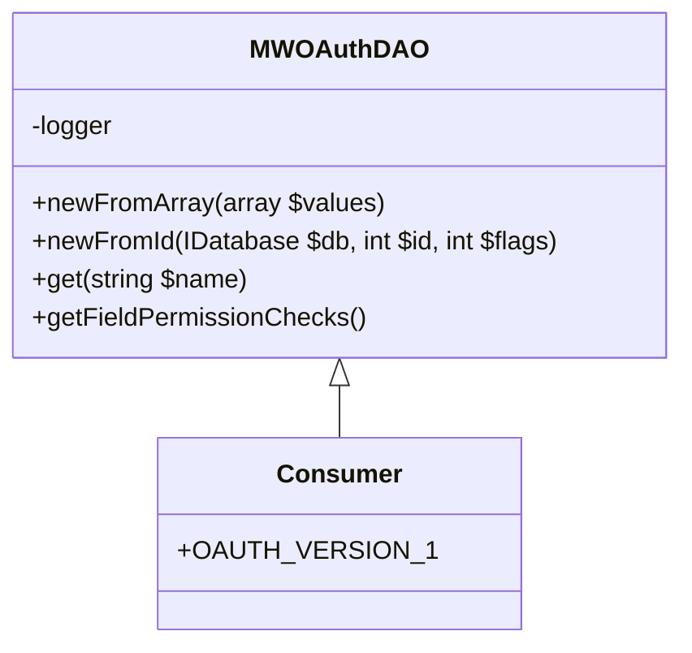

# Overview

<SwmToken path="src/Backend/MWOAuthDAO.php" pos="283:6:6" line-data="	 * @see MWOAuthDAO::userCanAccess()">`MWOAuthDAO`</SwmToken> is an abstract class that represents a Data Access Object (DAO) in the backend services. It provides a structured way to interact with the database, ensuring that data operations are consistent and secure. The class includes methods for creating new instances from arrays or database rows, retrieving data by ID, and managing field values. It also handles access control checks, ensuring that only authorized users can view or modify certain fields. The class uses a logger to record significant events, which helps in monitoring and debugging. Subclasses are expected to implement specific methods for normalizing, encoding, and decoding data fields.

<SwmSnippet path="/src/Backend/MWOAuthDAO.php" line="60">

---

# Creating Instances

The <SwmToken path="src/Backend/MWOAuthDAO.php" pos="64:9:9" line-data="	final public static function newFromArray( array $values ) {">`newFromArray`</SwmToken> method allows you to create a new instance of a subclass from an array of field values. This method ensures that the <SwmToken path="src/Backend/MWOAuthDAO.php" pos="68:7:7" line-data="		// Make sure oauth_version is set - for backwards compat">`oauth_version`</SwmToken> is set for backward compatibility and loads the values into the new instance.

```hack
	/**
	 * @param array $values (field => value) map
	 * @return static
	 */
	final public static function newFromArray( array $values ) {
		$class = static::getConsumerClass( $values );
		$consumer = new $class();

		// Make sure oauth_version is set - for backwards compat
		$values['oauth_version'] ??= Consumer::OAUTH_VERSION_1;
		$consumer->loadFromValues( $values );
		return $consumer;
	}
```

---

</SwmSnippet>

<SwmSnippet path="/src/Backend/MWOAuthDAO.php" line="125">

---

# Managing Field Values

The <SwmToken path="src/Backend/MWOAuthDAO.php" pos="125:3:3" line-data="	 * Get the value of a field">`Get`</SwmToken> method retrieves the value of a specified field. It checks if the field exists and throws a <SwmToken path="src/Backend/MWOAuthDAO.php" pos="129:6:6" line-data="	 * @throws LogicException">`LogicException`</SwmToken> if it does not.

```hack
	 * Get the value of a field
	 *
	 * @param string $name
	 * @return mixed
	 * @throws LogicException
	 */
	final public function get( $name ) {
		if ( !static::hasField( $name ) ) {
			throw new LogicException( "Object has no '$name' field." );
		}
		return $this->$name;
	}
```

---

</SwmSnippet>

<SwmSnippet path="/src/Backend/MWOAuthDAO.php" line="275">

---

# Access Control Checks

The <SwmToken path="src/Backend/MWOAuthDAO.php" pos="289:7:7" line-data="	protected static function getFieldPermissionChecks() {">`getFieldPermissionChecks`</SwmToken> method returns a map of field names to method names that check if a context user has access to the field. Subclasses must override this method to define the access control checks.

```hack
	/**
	 * Get the access control check methods for this object type
	 *
	 * This returns a map of field names to method names.
	 * The methods check if a context user has access to the field,
	 * returning true if they do and a Message object otherwise.
	 * The methods take (field name, IContextSource) as arguments.
	 *
	 * @see MWOAuthDAO::userCanAccess()
	 * @see MWOAuthDAOAccessControl
	 *
	 * @throws LogicException Subclasses must override
	 * @return array<string,string> Map of (field name => name of method that checks access)
	 */
	protected static function getFieldPermissionChecks() {
		// Note: declaring this abstract raises E_STRICT
		throw new LogicException( "getFieldPermissionChecks() not defined in " . self::class );
	}
```

---

</SwmSnippet>

<SwmSnippet path="/src/Backend/MWOAuthDAO.php" line="46">

---

# Logging

The <SwmToken path="src/Backend/MWOAuthDAO.php" pos="47:4:4" line-data="	protected $logger;">`logger`</SwmToken> field is used to record significant events, which helps in monitoring and debugging. It is initialized in the constructor using the <SwmToken path="src/Backend/MWOAuthDAO.php" pos="9:6:6" line-data="use MediaWiki\Logger\LoggerFactory;">`LoggerFactory`</SwmToken>.

```hack
	/** @var LoggerInterface */
	protected $logger;
```

---

</SwmSnippet>

&nbsp;

*This is an auto-generated document by Swimm AI 🌊 and has not yet been verified by a human*

<SwmMeta version="3.0.0" repo-id="Z2l0aHViJTNBJTNBbWVkaWF3aWtpLWV4dGVuc2lvbnMtT0F1dGglM0ElM0FTd2ltbS1EZW1v" repo-name="mediawiki-extensions-OAuth"><sup>Powered by [Swimm](/)</sup></SwmMeta>
