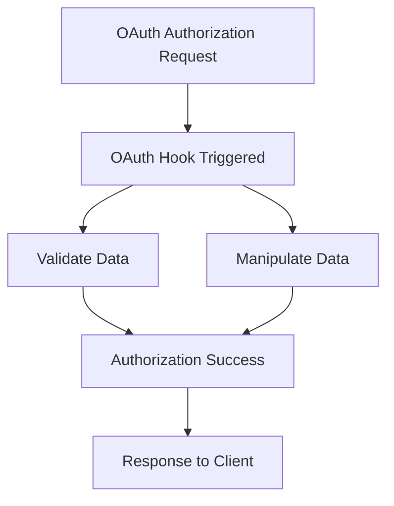

````mermaid

````

## Introduction

<SwmToken path="tests/phpunit/Backend/MWOAuthHooksTest.php" pos="3:6:6" line-data="namespace MediaWiki\Extension\OAuth\Tests\Backend;">`OAuth`</SwmToken> Hooks are used to extend the functionality of the <SwmToken path="tests/phpunit/Backend/MWOAuthHooksTest.php" pos="3:6:6" line-data="namespace MediaWiki\Extension\OAuth\Tests\Backend;">`OAuth`</SwmToken> extension by allowing custom actions to be performed at specific points in the <SwmToken path="tests/phpunit/Backend/MWOAuthHooksTest.php" pos="3:6:6" line-data="namespace MediaWiki\Extension\OAuth\Tests\Backend;">`OAuth`</SwmToken> workflow. They provide a way to interact with the <SwmToken path="tests/phpunit/Backend/MWOAuthHooksTest.php" pos="3:6:6" line-data="namespace MediaWiki\Extension\OAuth\Tests\Backend;">`OAuth`</SwmToken> process without modifying the core code, making it easier to maintain and upgrade.

## Usage of <SwmToken path="tests/phpunit/Backend/MWOAuthHooksTest.php" pos="3:6:6" line-data="namespace MediaWiki\Extension\OAuth\Tests\Backend;">`OAuth`</SwmToken> Hooks

In the backend, <SwmToken path="tests/phpunit/Backend/MWOAuthHooksTest.php" pos="3:6:6" line-data="namespace MediaWiki\Extension\OAuth\Tests\Backend;">`OAuth`</SwmToken> Hooks can be used to validate and manipulate data during the <SwmToken path="tests/phpunit/Backend/MWOAuthHooksTest.php" pos="3:6:6" line-data="namespace MediaWiki\Extension\OAuth\Tests\Backend;">`OAuth`</SwmToken> authorization process. For example, the <SwmToken path="tests/phpunit/Backend/MWOAuthHooksTest.php" pos="24:4:4" line-data="		$hooks-&gt;onChangeTagCanCreate( $tagName, new User, $status );">`onChangeTagCanCreate`</SwmToken> hook is used to determine if a specific tag can be created, ensuring that only valid tags are allowed.

<SwmSnippet path="/tests/phpunit/Backend/MWOAuthHooksTest.php" line="19">

---

## Example of <SwmToken path="tests/phpunit/Backend/MWOAuthHooksTest.php" pos="3:6:6" line-data="namespace MediaWiki\Extension\OAuth\Tests\Backend;">`OAuth`</SwmToken> Hook Usage

The <SwmToken path="tests/phpunit/Backend/MWOAuthHooksTest.php" pos="24:4:4" line-data="		$hooks-&gt;onChangeTagCanCreate( $tagName, new User, $status );">`onChangeTagCanCreate`</SwmToken> hook is used to determine if a specific tag can be created, ensuring that only valid tags are allowed. This example shows how the hook is tested using <SwmToken path="src/Backend/Hooks.php" pos="51:20:20" line-data="		// Set $wgOAuth2PrivateKey and $wgOAuth2PublicKey for Wikimedia Jenkins, PHPUnit.">`PHPUnit`</SwmToken>.

```hack
	public function testOnChangeTagCanCreate( $tagName, $statusOk ) {
		$status = Status::newGood();
		$services = $this->getServiceContainer();

		$hooks = new Hooks( $services->getChangeTagDefStore(), $services->getConnectionProvider() );
		$hooks->onChangeTagCanCreate( $tagName, new User, $status );
		$this->assertSame( $statusOk, $status->isOK() );
	}
```

---

</SwmSnippet>

## Testing <SwmToken path="tests/phpunit/Backend/MWOAuthHooksTest.php" pos="3:6:6" line-data="namespace MediaWiki\Extension\OAuth\Tests\Backend;">`OAuth`</SwmToken> Hooks

These hooks are typically tested using <SwmToken path="src/Backend/Hooks.php" pos="51:20:20" line-data="		// Set $wgOAuth2PrivateKey and $wgOAuth2PublicKey for Wikimedia Jenkins, PHPUnit.">`PHPUnit`</SwmToken> to ensure they behave as expected under various conditions. The following example demonstrates how the <SwmToken path="tests/phpunit/Backend/MWOAuthHooksTest.php" pos="19:5:5" line-data="	public function testOnChangeTagCanCreate( $tagName, $statusOk ) {">`testOnChangeTagCanCreate`</SwmToken> function tests the <SwmToken path="tests/phpunit/Backend/MWOAuthHooksTest.php" pos="24:4:4" line-data="		$hooks-&gt;onChangeTagCanCreate( $tagName, new User, $status );">`onChangeTagCanCreate`</SwmToken> hook.

<SwmSnippet path="/tests/phpunit/Backend/MWOAuthHooksTest.php" line="1">

---

This code snippet shows the setup for testing the <SwmToken path="tests/phpunit/Backend/MWOAuthHooksTest.php" pos="24:4:4" line-data="		$hooks-&gt;onChangeTagCanCreate( $tagName, new User, $status );">`onChangeTagCanCreate`</SwmToken> hook using <SwmToken path="src/Backend/Hooks.php" pos="51:20:20" line-data="		// Set $wgOAuth2PrivateKey and $wgOAuth2PublicKey for Wikimedia Jenkins, PHPUnit.">`PHPUnit`</SwmToken>.

```hack
<?php

namespace MediaWiki\Extension\OAuth\Tests\Backend;

use MediaWiki\Extension\OAuth\Backend\Hooks;
use MediaWiki\Status\Status;
use MediaWiki\User\User;
use MediaWikiIntegrationTestCase;

/**
 * @covers \MediaWiki\Extension\OAuth\Backend\MWOAuthServer
 * @group OAuth
 */
class MWOAuthHooksTest extends MediaWikiIntegrationTestCase {

	/**
	 * @dataProvider provideOnChangeTagCanCreate
	 */
	public function testOnChangeTagCanCreate( $tagName, $statusOk ) {
		$status = Status::newGood();
		$services = $this->getServiceContainer();
```

---

</SwmSnippet>

## Main Functions

There are several main functions in <SwmToken path="tests/phpunit/Backend/MWOAuthHooksTest.php" pos="3:6:6" line-data="namespace MediaWiki\Extension\OAuth\Tests\Backend;">`OAuth`</SwmToken> Hooks. Some of them are <SwmToken path="tests/phpunit/Backend/MWOAuthHooksTest.php" pos="24:4:4" line-data="		$hooks-&gt;onChangeTagCanCreate( $tagName, new User, $status );">`onChangeTagCanCreate`</SwmToken>, `onUserLogout`, and `onBeforePageDisplay`. We will dive a little into <SwmToken path="tests/phpunit/Backend/MWOAuthHooksTest.php" pos="24:4:4" line-data="		$hooks-&gt;onChangeTagCanCreate( $tagName, new User, $status );">`onChangeTagCanCreate`</SwmToken>.

## <SwmToken path="tests/phpunit/Backend/MWOAuthHooksTest.php" pos="24:4:4" line-data="		$hooks-&gt;onChangeTagCanCreate( $tagName, new User, $status );">`onChangeTagCanCreate`</SwmToken>

The <SwmToken path="tests/phpunit/Backend/MWOAuthHooksTest.php" pos="24:4:4" line-data="		$hooks-&gt;onChangeTagCanCreate( $tagName, new User, $status );">`onChangeTagCanCreate`</SwmToken> function is used to determine if a specific tag can be created, ensuring that only valid tags are allowed. This function takes the tag name, user, and status as parameters and updates the status based on the validity of the tag.

<SwmSnippet path="/src/Backend/Hooks.php" line="1">

---

This code snippet shows the implementation of the <SwmToken path="tests/phpunit/Backend/MWOAuthHooksTest.php" pos="24:4:4" line-data="		$hooks-&gt;onChangeTagCanCreate( $tagName, new User, $status );">`onChangeTagCanCreate`</SwmToken> function in the <SwmToken path="src/Backend/Hooks.php" pos="21:2:2" line-data="class Hooks implements">`Hooks`</SwmToken> class.

```hack
<?php

namespace MediaWiki\Extension\OAuth\Backend;

use MediaWiki\Api\Hook\ApiRsdServiceApisHook;
use MediaWiki\ChangeTags\Hook\ChangeTagCanCreateHook;
use MediaWiki\ChangeTags\Hook\ChangeTagsListActiveHook;
use MediaWiki\ChangeTags\Hook\ListDefinedTagsHook;
use MediaWiki\Extension\OAuth\Frontend\OAuthLogFormatter;
use MediaWiki\Hook\SetupAfterCacheHook;
use MediaWiki\Status\Status;
use MediaWiki\Storage\NameTableAccessException;
use MediaWiki\Storage\NameTableStore;
use MediaWiki\User\User;
use MediaWiki\WikiMap\WikiMap;
use Wikimedia\Rdbms\IConnectionProvider;

/**
 * Class containing hooked functions for an OAuth environment
 */
class Hooks implements
```

---

</SwmSnippet>

## Testing <SwmToken path="tests/phpunit/Backend/MWOAuthHooksTest.php" pos="24:4:4" line-data="		$hooks-&gt;onChangeTagCanCreate( $tagName, new User, $status );">`onChangeTagCanCreate`</SwmToken>

The <SwmToken path="tests/phpunit/Backend/MWOAuthHooksTest.php" pos="19:5:5" line-data="	public function testOnChangeTagCanCreate( $tagName, $statusOk ) {">`testOnChangeTagCanCreate`</SwmToken> function tests the <SwmToken path="tests/phpunit/Backend/MWOAuthHooksTest.php" pos="24:4:4" line-data="		$hooks-&gt;onChangeTagCanCreate( $tagName, new User, $status );">`onChangeTagCanCreate`</SwmToken> hook to ensure it behaves as expected under various conditions. It uses a data provider to supply different tag names and expected outcomes, verifying that the status is correctly updated.

<SwmSnippet path="/tests/phpunit/Backend/MWOAuthHooksTest.php" line="16">

---

This code snippet shows the <SwmToken path="tests/phpunit/Backend/MWOAuthHooksTest.php" pos="19:5:5" line-data="	public function testOnChangeTagCanCreate( $tagName, $statusOk ) {">`testOnChangeTagCanCreate`</SwmToken> function, which tests the <SwmToken path="tests/phpunit/Backend/MWOAuthHooksTest.php" pos="24:4:4" line-data="		$hooks-&gt;onChangeTagCanCreate( $tagName, new User, $status );">`onChangeTagCanCreate`</SwmToken> hook using <SwmToken path="src/Backend/Hooks.php" pos="51:20:20" line-data="		// Set $wgOAuth2PrivateKey and $wgOAuth2PublicKey for Wikimedia Jenkins, PHPUnit.">`PHPUnit`</SwmToken>.

```hack
	/**
	 * @dataProvider provideOnChangeTagCanCreate
	 */
	public function testOnChangeTagCanCreate( $tagName, $statusOk ) {
		$status = Status::newGood();
		$services = $this->getServiceContainer();

		$hooks = new Hooks( $services->getChangeTagDefStore(), $services->getConnectionProvider() );
		$hooks->onChangeTagCanCreate( $tagName, new User, $status );
		$this->assertSame( $statusOk, $status->isOK() );
	}
```

---

</SwmSnippet>

&nbsp;

*This is an auto-generated document by Swimm AI 🌊 and has not yet been verified by a human*

<SwmMeta version="3.0.0" repo-id="Z2l0aHViJTNBJTNBbWVkaWF3aWtpLWV4dGVuc2lvbnMtT0F1dGglM0ElM0FTd2ltbS1EZW1v" repo-name="mediawiki-extensions-OAuth"><sup>Powered by [Swimm](/)</sup></SwmMeta>
