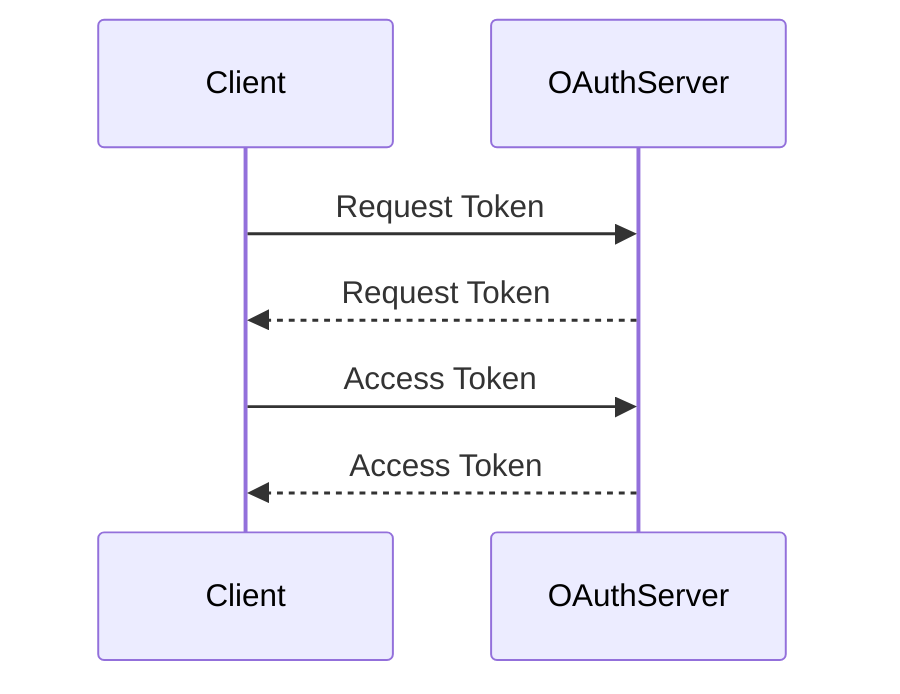

# Overview

The <SwmToken path="src/Lib/OAuthServer.php" pos="48:14:14" line-data="		$this-&gt;logger = LoggerFactory::getInstance( &#39;OAuth&#39; );">`OAuth`</SwmToken> Library is a collection of classes and utilities designed to handle <SwmToken path="src/Lib/OAuthServer.php" pos="48:14:14" line-data="		$this-&gt;logger = LoggerFactory::getInstance( &#39;OAuth&#39; );">`OAuth`</SwmToken> authentication and authorization processes. It includes classes such as <SwmToken path="src/Lib/OAuthRequest.php" pos="34:2:2" line-data="class OAuthRequest {">`OAuthRequest`</SwmToken>, <SwmToken path="src/Lib/OAuthRequest.php" pos="49:1:1" line-data="			OAuthUtil::parse_parameters( parse_url( $http_url, PHP_URL_QUERY ) ),">`OAuthUtil`</SwmToken>, <SwmToken path="src/Lib/OAuthServer.php" pos="35:2:2" line-data="class OAuthServer {">`OAuthServer`</SwmToken>, <SwmToken path="src/Lib/OAuthConsumer.php" pos="29:2:2" line-data="class OAuthConsumer {">`OAuthConsumer`</SwmToken>, and <SwmToken path="src/Lib/OAuthToken.php" pos="29:2:2" line-data="class OAuthToken {">`OAuthToken`</SwmToken>, each serving specific roles in the <SwmToken path="src/Lib/OAuthServer.php" pos="48:14:14" line-data="		$this-&gt;logger = LoggerFactory::getInstance( &#39;OAuth&#39; );">`OAuth`</SwmToken> workflow.

# <SwmToken path="src/Lib/OAuthRequest.php" pos="34:2:2" line-data="class OAuthRequest {">`OAuthRequest`</SwmToken> Class

The <SwmToken path="src/Lib/OAuthRequest.php" pos="34:2:2" line-data="class OAuthRequest {">`OAuthRequest`</SwmToken> class is responsible for constructing and managing <SwmToken path="src/Lib/OAuthServer.php" pos="48:14:14" line-data="		$this-&gt;logger = LoggerFactory::getInstance( &#39;OAuth&#39; );">`OAuth`</SwmToken> requests, including setting and retrieving parameters, and generating signature base strings.

<SwmSnippet path="/src/Lib/OAuthRequest.php" line="34">

---

The <SwmToken path="src/Lib/OAuthRequest.php" pos="34:2:2" line-data="class OAuthRequest {">`OAuthRequest`</SwmToken> class handles the construction and management of <SwmToken path="src/Lib/OAuthServer.php" pos="48:14:14" line-data="		$this-&gt;logger = LoggerFactory::getInstance( &#39;OAuth&#39; );">`OAuth`</SwmToken> requests. It sets and retrieves parameters and generates signature base strings.

```hack
class OAuthRequest {
	protected $parameters;
	protected $http_method;
	protected $http_url;
	// for debug purposes
	public $base_string;
	public static $version = '1.0';
	public static $POST_INPUT = 'php://input';

	/** @var LoggerInterface */
	protected $logger;

	function __construct( $http_method, $http_url, $parameters = null ) {
		$parameters = $parameters ?: array();
		$parameters = array_merge(
			OAuthUtil::parse_parameters( parse_url( $http_url, PHP_URL_QUERY ) ),
			$parameters
		);
		$this->parameters = $parameters;
		$this->http_method = $http_method;
		$this->http_url = $http_url;
```

---

</SwmSnippet>

# <SwmToken path="src/Lib/OAuthRequest.php" pos="49:1:1" line-data="			OAuthUtil::parse_parameters( parse_url( $http_url, PHP_URL_QUERY ) ),">`OAuthUtil`</SwmToken> Class

The <SwmToken path="src/Lib/OAuthRequest.php" pos="49:1:1" line-data="			OAuthUtil::parse_parameters( parse_url( $http_url, PHP_URL_QUERY ) ),">`OAuthUtil`</SwmToken> class provides utility functions for encoding, decoding, and parsing OAuth-related data, such as headers and parameters.

<SwmSnippet path="/src/Lib/OAuthUtil.php" line="31">

---

The <SwmToken path="src/Lib/OAuthUtil.php" pos="31:2:2" line-data="class OAuthUtil {">`OAuthUtil`</SwmToken> class offers utility functions for encoding, decoding, and parsing OAuth-related data.

```hack
class OAuthUtil {
	public static function urlencode_rfc3986( $input ) {
		if ( is_array( $input ) ) {
			return array_map(
				array(
					self::class,
					'urlencode_rfc3986'
				),
				$input
			);
		} else {
			if ( is_scalar( $input ) ) {
				return str_replace(
					'+',
					' ',
					str_replace( '%7E', '~', rawurlencode( $input ) )
				);
			} else {
				return '';
			}
		}
```

---

</SwmSnippet>

# <SwmToken path="src/Lib/OAuthServer.php" pos="35:2:2" line-data="class OAuthServer {">`OAuthServer`</SwmToken> Class

The <SwmToken path="src/Lib/OAuthServer.php" pos="35:2:2" line-data="class OAuthServer {">`OAuthServer`</SwmToken> class handles the server-side logic of <SwmToken path="src/Lib/OAuthServer.php" pos="48:14:14" line-data="		$this-&gt;logger = LoggerFactory::getInstance( &#39;OAuth&#39; );">`OAuth`</SwmToken>, including processing request tokens, access tokens, and verifying API calls.

<SwmSnippet path="/src/Lib/OAuthServer.php" line="35">

---

The <SwmToken path="src/Lib/OAuthServer.php" pos="35:2:2" line-data="class OAuthServer {">`OAuthServer`</SwmToken> class manages server-side <SwmToken path="src/Lib/OAuthServer.php" pos="48:14:14" line-data="		$this-&gt;logger = LoggerFactory::getInstance( &#39;OAuth&#39; );">`OAuth`</SwmToken> logic, processing request tokens, access tokens, and verifying API calls.

```hack
class OAuthServer {
	protected $timestamp_threshold = 300; // in seconds, five minutes
	protected $version = '1.0'; // hi blaine
	protected $signature_methods = array();

	/** @var OAuthDataStore */
	protected $data_store;

	/** @var LoggerInterface */
	protected $logger;

	function __construct( $data_store ) {
		$this->data_store = $data_store;
		$this->logger = LoggerFactory::getInstance( 'OAuth' );
	}

	public function add_signature_method( $signature_method ) {
		$this->signature_methods[$signature_method->get_name()] = $signature_method;
	}

	// high level functions
```

---

</SwmSnippet>

# <SwmToken path="src/Lib/OAuthConsumer.php" pos="29:2:2" line-data="class OAuthConsumer {">`OAuthConsumer`</SwmToken> Class

The <SwmToken path="src/Lib/OAuthConsumer.php" pos="29:2:2" line-data="class OAuthConsumer {">`OAuthConsumer`</SwmToken> class represents an <SwmToken path="src/Lib/OAuthServer.php" pos="48:14:14" line-data="		$this-&gt;logger = LoggerFactory::getInstance( &#39;OAuth&#39; );">`OAuth`</SwmToken> consumer, holding the consumer key, secret, and callback URL.

<SwmSnippet path="/src/Lib/OAuthConsumer.php" line="27">

---

The <SwmToken path="src/Lib/OAuthConsumer.php" pos="29:2:2" line-data="class OAuthConsumer {">`OAuthConsumer`</SwmToken> class represents an <SwmToken path="src/Lib/OAuthConsumer.php" pos="27:6:6" line-data="namespace MediaWiki\Extension\OAuth\Lib;">`OAuth`</SwmToken> consumer, storing the consumer key, secret, and callback URL.

```hack
namespace MediaWiki\Extension\OAuth\Lib;

class OAuthConsumer {
	public $key;
	public $secret;
	public $callback_url;

	function __construct( $key, $secret, $callback_url = NULL ) {
		$this->key = $key;
		$this->secret = $secret;
		$this->callback_url = $callback_url;
	}

	function __toString() {
		return "OAuthConsumer[key=$this->key,secret=$this->secret]";
	}
}
```

---

</SwmSnippet>

# <SwmToken path="src/Lib/OAuthToken.php" pos="29:2:2" line-data="class OAuthToken {">`OAuthToken`</SwmToken> Class

The <SwmToken path="src/Lib/OAuthToken.php" pos="29:2:2" line-data="class OAuthToken {">`OAuthToken`</SwmToken> class represents <SwmToken path="src/Lib/OAuthServer.php" pos="48:14:14" line-data="		$this-&gt;logger = LoggerFactory::getInstance( &#39;OAuth&#39; );">`OAuth`</SwmToken> tokens, including access tokens and request tokens, and provides methods for serializing these tokens.

<SwmSnippet path="/src/Lib/OAuthToken.php" line="29">

---

The <SwmToken path="src/Lib/OAuthToken.php" pos="29:2:2" line-data="class OAuthToken {">`OAuthToken`</SwmToken> class represents <SwmToken path="src/Lib/OAuthServer.php" pos="48:14:14" line-data="		$this-&gt;logger = LoggerFactory::getInstance( &#39;OAuth&#39; );">`OAuth`</SwmToken> tokens and provides methods for serializing them.

```hack
class OAuthToken {
	// access tokens and request tokens
	public $key;
	public $secret;

	/**
	 * key = the token
	 * secret = the token secret
	 */
	function __construct( $key, $secret ) {
		$this->key = $key;
		$this->secret = $secret;
	}

	/**
	 * generates the basic string serialization of a token that a server
	 * would respond to request_token and access_token calls with
	 */
	function to_string() {
		return "oauth_token=" . OAuthUtil::urlencode_rfc3986(
			$this->key
```

---

</SwmSnippet>

# Main Functions

There are several main functions in this folder. Some of them are <SwmToken path="src/Lib/OAuthServer.php" pos="61:5:5" line-data="	public function fetch_request_token( &amp;$request ) {">`fetch_request_token`</SwmToken>, <SwmToken path="src/Lib/OAuthServer.php" pos="82:5:5" line-data="	public function fetch_access_token( &amp;$request ) {">`fetch_access_token`</SwmToken>, <SwmToken path="src/Lib/OAuthRequest.php" pos="272:9:9" line-data="		$signature = $this-&gt;build_signature( $signature_method, $consumer, $token );">`build_signature`</SwmToken>, and <SwmToken path="src/Lib/OAuthServer.php" pos="69:4:4" line-data="		$this-&gt;check_signature( $request, $consumer, $token );">`check_signature`</SwmToken>. We will dive a little into <SwmToken path="src/Lib/OAuthServer.php" pos="61:5:5" line-data="	public function fetch_request_token( &amp;$request ) {">`fetch_request_token`</SwmToken> and <SwmToken path="src/Lib/OAuthServer.php" pos="82:5:5" line-data="	public function fetch_access_token( &amp;$request ) {">`fetch_access_token`</SwmToken>.

## <SwmToken path="src/Lib/OAuthServer.php" pos="61:5:5" line-data="	public function fetch_request_token( &amp;$request ) {">`fetch_request_token`</SwmToken>

The <SwmToken path="src/Lib/OAuthServer.php" pos="61:5:5" line-data="	public function fetch_request_token( &amp;$request ) {">`fetch_request_token`</SwmToken> function processes a request token request and returns the request token on success. It verifies the <SwmToken path="src/Lib/OAuthServer.php" pos="48:14:14" line-data="		$this-&gt;logger = LoggerFactory::getInstance( &#39;OAuth&#39; );">`OAuth`</SwmToken> version, retrieves the consumer, checks the signature, and generates a new request token.

<SwmSnippet path="/src/Lib/OAuthServer.php" line="61">

---

The <SwmToken path="src/Lib/OAuthServer.php" pos="61:5:5" line-data="	public function fetch_request_token( &amp;$request ) {">`fetch_request_token`</SwmToken> function processes a request token request, verifies the <SwmToken path="src/Lib/OAuthServer.php" pos="48:14:14" line-data="		$this-&gt;logger = LoggerFactory::getInstance( &#39;OAuth&#39; );">`OAuth`</SwmToken> version, retrieves the consumer, checks the signature, and generates a new request token.

```hack
	public function fetch_request_token( &$request ) {
		$this->get_version( $request );

		$consumer = $this->get_consumer( $request );

		// no token required for the initial token request
		$token = null;

		$this->check_signature( $request, $consumer, $token );

		// Rev A change
		$callback = $request->get_parameter( 'oauth_callback' );
		$new_token = $this->data_store->new_request_token( $consumer, $callback );

		return $new_token;
```

---

</SwmSnippet>

## <SwmToken path="src/Lib/OAuthServer.php" pos="82:5:5" line-data="	public function fetch_access_token( &amp;$request ) {">`fetch_access_token`</SwmToken>

The <SwmToken path="src/Lib/OAuthServer.php" pos="82:5:5" line-data="	public function fetch_access_token( &amp;$request ) {">`fetch_access_token`</SwmToken> function processes an access token request and returns the access token on success. It verifies the <SwmToken path="src/Lib/OAuthServer.php" pos="48:14:14" line-data="		$this-&gt;logger = LoggerFactory::getInstance( &#39;OAuth&#39; );">`OAuth`</SwmToken> version, retrieves the consumer and token, checks the signature, and generates a new access token.

<SwmSnippet path="/src/Lib/OAuthServer.php" line="82">

---

The <SwmToken path="src/Lib/OAuthServer.php" pos="82:5:5" line-data="	public function fetch_access_token( &amp;$request ) {">`fetch_access_token`</SwmToken> function processes an access token request, verifies the <SwmToken path="src/Lib/OAuthServer.php" pos="48:14:14" line-data="		$this-&gt;logger = LoggerFactory::getInstance( &#39;OAuth&#39; );">`OAuth`</SwmToken> version, retrieves the consumer and token, checks the signature, and generates a new access token.

```hack
	public function fetch_access_token( &$request ) {
		$this->get_version( $request );

		$consumer = $this->get_consumer( $request );

		// requires authorized request token
		$token = $this->get_token( $request, $consumer, "request" );

		$this->check_signature( $request, $consumer, $token );

		// Rev A change
		$verifier = $request->get_parameter( 'oauth_verifier' );
		$new_token = $this->data_store->new_access_token( $token, $consumer, $verifier );

		return $new_token;
```

---

</SwmSnippet>

&nbsp;

*This is an auto-generated document by Swimm AI 🌊 and has not yet been verified by a human*

<SwmMeta version="3.0.0" repo-id="Z2l0aHViJTNBJTNBbWVkaWF3aWtpLWV4dGVuc2lvbnMtT0F1dGglM0ElM0FTd2ltbS1EZW1v" repo-name="mediawiki-extensions-OAuth"><sup>Powered by [Swimm](/)</sup></SwmMeta>
