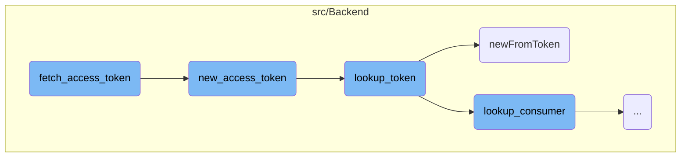
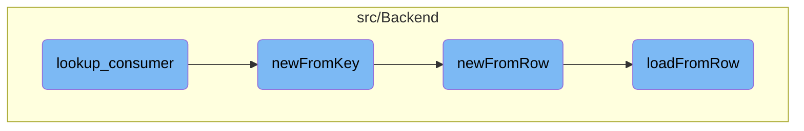

This document explains the process of fetching an access token. The process involves validating the consumer, checking the request token, generating a new access token, and retrieving the access token from the data store.

The flow starts by validating the consumer to ensure it is authorized. Then, it checks the request token to make sure it is valid. After that, a new access token is generated, which allows the user to access protected resources. Finally, the access token is retrieved from the data store, ensuring it is valid and unused.

Here is a high level diagram of the flow, showing only the most important functions:

```mermaid
graph TD;
      subgraph srcBackend["src/Backend"]
8c1b6b309f942d10a5f8bbaf7780d28df9eb31073d81f721e0c8556f05b7349a(fetch_access_token):::mainFlowStyle --> 4cad224fa32510b5399290218db57ff22f4b082e4f92ee8c06420933525574a0(new_access_token):::mainFlowStyle
end

subgraph srcBackend["src/Backend"]
4cad224fa32510b5399290218db57ff22f4b082e4f92ee8c06420933525574a0(new_access_token):::mainFlowStyle --> 8220c8e63ca4692ae36e0a6a5b4a7fd0b649f9e2ecee549ff0f829c8b555c87e(lookup_token):::mainFlowStyle
end

subgraph srcBackend["src/Backend"]
8220c8e63ca4692ae36e0a6a5b4a7fd0b649f9e2ecee549ff0f829c8b555c87e(lookup_token):::mainFlowStyle --> 00516e6990679e8ca3d7fa363b043b067e4301754bfc07fb1e1f463bff86affc(newFromToken)
end

subgraph srcBackend["src/Backend"]
8220c8e63ca4692ae36e0a6a5b4a7fd0b649f9e2ecee549ff0f829c8b555c87e(lookup_token):::mainFlowStyle --> 963aba63c6c2a34187d5173bda740424969633e9dc77e8000600fb34a7a2578f(lookup_consumer):::mainFlowStyle
end

subgraph srcBackend["src/Backend"]
963aba63c6c2a34187d5173bda740424969633e9dc77e8000600fb34a7a2578f(lookup_consumer):::mainFlowStyle --> 451647ef9ebfd1f58cceb2ded443b2db4873bbf05879b5c5c4c987ba3fc88b14(newFromKey):::mainFlowStyle
end

subgraph srcBackend["src/Backend"]
451647ef9ebfd1f58cceb2ded443b2db4873bbf05879b5c5c4c987ba3fc88b14(newFromKey):::mainFlowStyle --> 459239aeab04ff7fb4b00c59d28bbd05f8d8aad58d7fcb9d6217141199db8bf3(newFromRow):::mainFlowStyle
end

subgraph srcBackend["src/Backend"]
459239aeab04ff7fb4b00c59d28bbd05f8d8aad58d7fcb9d6217141199db8bf3(newFromRow):::mainFlowStyle --> e79256a1bafbf5a265f4f3035dafa462ed7e577d48c1464b0a9d05b3c5babd10(loadFromRow):::mainFlowStyle
end


      classDef mainFlowStyle color:#000000,fill:#7CB9F4
classDef rootsStyle color:#000000,fill:#00FFF4
classDef Style1 color:#000000,fill:#00FFAA
classDef Style2 color:#000000,fill:#FFFF00
classDef Style3 color:#000000,fill:#AA7CB9
```



# Flow drill down

First, we'll zoom into this section of the flow:



<SwmSnippet path="/src/Backend/MWOAuthServer.php" line="239">

---

## Validating the Consumer

The <SwmToken path="src/Backend/MWOAuthServer.php" pos="239:5:5" line-data="	public function fetch_access_token( &amp;$request ) {">`fetch_access_token`</SwmToken> function starts by validating the consumer associated with the request. It checks if the consumer is <SwmToken path="src/Backend/MWOAuthServer.php" pos="245:11:13" line-data="		// Consumer must not be owner-only">`owner-only`</SwmToken> and if it has a secret or RSA key. If any of these conditions fail, an exception is thrown, ensuring that only valid consumers can proceed.

```hack
	public function fetch_access_token( &$request ) {
		$this->get_version( $request );

		/** @var Consumer $consumer */
		$consumer = $this->get_consumer( $request );

		// Consumer must not be owner-only
		if ( $consumer->getOwnerOnly() ) {
			throw new MWOAuthException( 'mwoauthserver-consumer-owner-only', [
				'consumer_name' => $consumer->getName(),
				'update_url' => SpecialPage::getTitleFor(
					'OAuthConsumerRegistration', 'update/' . $consumer->getConsumerKey()
				),
				Message::rawParam( Linker::makeExternalLink(
					'https://www.mediawiki.org/wiki/Help:OAuth/Errors#E010',
					'E010',
					true
				) ),
				'consumer' => $consumer->getConsumerKey(),
			] );
		}
```

---

</SwmSnippet>

<SwmSnippet path="/src/Backend/MWOAuthServer.php" line="276">

---

## Checking the Request Token

The function then retrieves and validates the request token. It ensures that the token has a secret and is not blank. If the token is invalid, an exception is thrown, preventing unauthorized access.

```hack
		// requires authorized request token
		/** @var MWOAuthToken $token */
		$token = $this->get_token( $request, $consumer, 'request' );

		if ( !$token->secret ) {
			// This token has a blank secret.. something is wrong
			throw new MWOAuthException( 'mwoauthdatastore-bad-token', [
				'consumer' => $consumer->getConsumerKey(),
				'consumer_name' => $consumer->getName(),
				'token' => $token->key,
			] );
		}
```

---

</SwmSnippet>

<SwmSnippet path="/src/Backend/MWOAuthServer.php" line="289">

---

## Generating a New Access Token

After validating the request token, the function calls <SwmToken path="src/Backend/MWOAuthServer.php" pos="294:8:8" line-data="		return $this-&gt;data_store-&gt;new_access_token( $token, $consumer, $verifier );">`new_access_token`</SwmToken> to generate a new access token. This step is crucial as it transitions the user from a request token to an access token, allowing them to access protected resources.

```hack
		$this->check_signature( $request, $consumer, $token );

		// Rev A change
		$verifier = $request->get_parameter( 'oauth_verifier' );
		$this->logger->debug( __METHOD__ . ": verify code is '$verifier'" );
		return $this->data_store->new_access_token( $token, $consumer, $verifier );
	}
```

---

</SwmSnippet>

<SwmSnippet path="/src/Backend/MWOAuthDataStore.php" line="253">

---

### Validating the Request Token

The <SwmToken path="src/Backend/MWOAuthServer.php" pos="294:8:8" line-data="		return $this-&gt;data_store-&gt;new_access_token( $token, $consumer, $verifier );">`new_access_token`</SwmToken> function first validates the request token by checking its verification code and access key. If the token is invalid or the verifier does not match, an exception is thrown, ensuring that only authorized tokens are converted to access tokens.

```hack
		if ( !$token->getVerifyCode() || !$token->getAccessKey() ) {
			throw new MWOAuthException( 'mwoauthdatastore-bad-token', [
				'consumer' => $consumer->getConsumerKey(),
				'consumer_name' => $consumer->getName(),
				'token' => $token->key,
			] );
		} elseif ( $token->getVerifyCode() !== $verifier ) {
			throw new MWOAuthException( 'mwoauthdatastore-bad-verifier', [
				'consumer' => $consumer->getConsumerKey(),
				'consumer_name' => $consumer->getName(),
				'token' => $token->key,
			] );
		}
```

---

</SwmSnippet>

<SwmSnippet path="/src/Backend/MWOAuthDataStore.php" line="267">

---

### Looking Up the Access Token

The function then looks up the access token associated with the consumer and request token. It also marks the request token as used, preventing it from being reused. This step ensures that each request token can only be used once, enhancing security.

```hack
		$cacheKey = Utils::getCacheKey( 'token',
			$consumer->getConsumerKey(), 'request', $token->key );
		$accessToken = $this->lookup_token( $consumer, 'access', $token->getAccessKey() );
		$this->tokenCache->set( $cacheKey, '**USED**', 600 );
		$this->logger->debug( __METHOD__ .
			": New access token {$accessToken->key} for {$consumer->key}" );
		return $accessToken;
```

---

</SwmSnippet>

<SwmSnippet path="/src/Backend/MWOAuthDataStore.php" line="77">

---

### Retrieving the Access Token

The <SwmToken path="src/Backend/MWOAuthDataStore.php" pos="77:5:5" line-data="	public function lookup_token( $consumer, $token_type, $token ) {">`lookup_token`</SwmToken> function retrieves the access token from the data store. It checks if the token is already used or invalid and throws an exception if necessary. This function ensures that only valid and unused tokens are retrieved.

```hack
	public function lookup_token( $consumer, $token_type, $token ) {
		$this->logger->debug( __METHOD__ . ": Looking up $token_type token '$token'" );

		if ( $token_type === 'request' ) {
			$returnToken = $this->tokenCache->get( Utils::getCacheKey(
				'token',
				$consumer->key,
				$token_type,
				$token
			) );
			if ( $returnToken === '**USED**' ) {
				throw new MWOAuthException( 'mwoauthdatastore-request-token-already-used', [
					Message::rawParam( Linker::makeExternalLink(
						'https://www.mediawiki.org/wiki/Help:OAuth/Errors#E009',
						'E009',
						true
					) ),
					'consumer' => $consumer->key,
				] );
			}
			if ( $token === null || !( $returnToken instanceof MWOAuthToken ) ) {
```

---

</SwmSnippet>

<SwmSnippet path="/src/Backend/ConsumerAcceptance.php" line="102">

---

### Creating a Consumer Acceptance Object

The <SwmToken path="src/Backend/ConsumerAcceptance.php" pos="102:7:7" line-data="	public static function newFromToken( IDatabase $db, $token, $flags = 0 ) {">`newFromToken`</SwmToken> function creates a <SwmToken path="src/Backend/MWOAuthServer.php" pos="359:6:6" line-data="	 * @return ConsumerAcceptance">`ConsumerAcceptance`</SwmToken> object from the access token. It queries the database to fetch the token details and returns a new <SwmToken path="src/Backend/MWOAuthServer.php" pos="359:6:6" line-data="	 * @return ConsumerAcceptance">`ConsumerAcceptance`</SwmToken> object if the token is valid. This step is essential for linking the access token to the consumer.

```hack
	public static function newFromToken( IDatabase $db, $token, $flags = 0 ) {
		$queryBuilder = $db->newSelectQueryBuilder()
			->select( array_values( static::getFieldColumnMap() ) )
			->from( static::getTable() )
			->where( [ 'oaac_access_token' => (string)$token ] )
			->caller( __METHOD__ );
		if ( $flags & IDBAccessObject::READ_LOCKING ) {
			$queryBuilder->forUpdate();
		}
		$row = $queryBuilder->fetchRow();

		if ( $row ) {
			$consumer = new self();
			$consumer->loadFromRow( $db, $row );
			return $consumer;
		} else {
			return false;
		}
	}
```

---

</SwmSnippet>

Now, lets zoom into this section of the flow:



<SwmSnippet path="/src/Backend/MWOAuthDataStore.php" line="58">

---

## Fetching Consumer Data

The <SwmToken path="src/Backend/MWOAuthDataStore.php" pos="64:5:5" line-data="	public function lookup_consumer( $consumerKey ) {">`lookup_consumer`</SwmToken> function is responsible for retrieving consumer information using a provided consumer key. It calls the <SwmToken path="src/Backend/MWOAuthDataStore.php" pos="65:5:5" line-data="		return Consumer::newFromKey( $this-&gt;centralReplica, $consumerKey );">`newFromKey`</SwmToken> function to fetch the consumer data from the database.

```hack
	/**
	 * Get an MWOAuthConsumer from the consumer's key
	 *
	 * @param string $consumerKey the string value of the Consumer's key
	 * @return Consumer|false
	 */
	public function lookup_consumer( $consumerKey ) {
		return Consumer::newFromKey( $this->centralReplica, $consumerKey );
	}
```

---

</SwmSnippet>

<SwmSnippet path="/src/Backend/Consumer.php" line="215">

---

## Validating Consumer Key

The <SwmToken path="src/Backend/Consumer.php" pos="221:7:7" line-data="	public static function newFromKey( IDatabase $db, $key, $flags = 0 ) {">`newFromKey`</SwmToken> function constructs a database query to find the consumer record that matches the provided key. If a matching record is found, it calls <SwmToken path="src/Backend/Consumer.php" pos="233:5:5" line-data="			return static::newFromRow( $db, $row );">`newFromRow`</SwmToken> to create a consumer object from the database row.

```hack
	/**
	 * @param IDatabase $db
	 * @param string|null $key
	 * @param int $flags IDBAccessObject::READ_* bitfield
	 * @return Consumer|false
	 */
	public static function newFromKey( IDatabase $db, $key, $flags = 0 ) {
		$queryBuilder = $db->newSelectQueryBuilder()
			->select( array_values( static::getFieldColumnMap() ) )
			->from( static::getTable() )
			->where( [ 'oarc_consumer_key' => (string)$key ] )
			->caller( __METHOD__ );
		if ( $flags & IDBAccessObject::READ_LOCKING ) {
			$queryBuilder->forUpdate();
		}
		$row = $queryBuilder->fetchRow();

		if ( $row ) {
			return static::newFromRow( $db, $row );
		} else {
			return false;
```

---

</SwmSnippet>

<SwmSnippet path="/src/Backend/MWOAuthDAO.php" line="84">

---

## Creating Consumer Object

The <SwmToken path="src/Backend/MWOAuthDAO.php" pos="89:9:9" line-data="	final public static function newFromRow( IDatabase $db, $row ) {">`newFromRow`</SwmToken> function initializes a new consumer object using the data retrieved from the database row. It then calls <SwmToken path="src/Backend/MWOAuthDAO.php" pos="92:4:4" line-data="		$consumer-&gt;loadFromRow( $db, $row );">`loadFromRow`</SwmToken> to populate the consumer object with the row data.

```hack
	/**
	 * @param IDatabase $db
	 * @param array|stdClass $row
	 * @return static
	 */
	final public static function newFromRow( IDatabase $db, $row ) {
		$class = static::getConsumerClass( (array)$row );
		$consumer = new $class();
		$consumer->loadFromRow( $db, $row );
		return $consumer;
	}
```

---

</SwmSnippet>

<SwmSnippet path="/src/Backend/MWOAuthDAO.php" line="375">

---

## Populating Consumer Object

The <SwmToken path="src/Backend/MWOAuthDAO.php" pos="380:7:7" line-data="	final protected function loadFromRow( IDatabase $db, $row ) {">`loadFromRow`</SwmToken> function populates the consumer object with values from the database row. It decodes the row data and maps it to the consumer object's fields.

```hack
	/**
	 * @param IDatabase $db
	 * @param stdClass|array $row
	 * @return void
	 */
	final protected function loadFromRow( IDatabase $db, $row ) {
		$row = $this->decodeRow( $db, (array)$row );
		$values = [];
		foreach ( static::getFieldColumnMap() as $field => $column ) {
			$values[$field] = $row[$column];
		}
		$this->loadFromValues( $values );
		$this->daoOrigin = 'db';
		$this->daoPending = false;
	}
```

---

</SwmSnippet>

&nbsp;

*This is an auto-generated document by Swimm AI 🌊 and has not yet been verified by a human*

<SwmMeta version="3.0.0" repo-id="Z2l0aHViJTNBJTNBbWVkaWF3aWtpLWV4dGVuc2lvbnMtT0F1dGglM0ElM0FTd2ltbS1EZW1v" repo-name="mediawiki-extensions-OAuth"><sup>Powered by [Swimm](/)</sup></SwmMeta>
