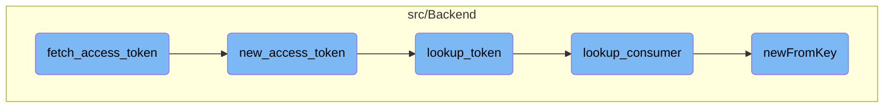

This document explains the process of fetching an access token. It covers the steps involved in validating the access token request, creating a new access token, looking up tokens, and retrieving consumer information.

# Flow drill down



<SwmSnippet path="/src/Backend/MWOAuthServer.php" line="239">

---

## Fetching and Validating the Access Token

First, the <SwmToken path="src/Backend/MWOAuthServer.php" pos="239:5:5" line-data="	public function fetch_access_token( &amp;$request ) {">`fetch_access_token`</SwmToken> function processes an access token request. It starts by getting the version of the request and then retrieves the consumer associated with the request. It ensures that the consumer is not <SwmToken path="src/Backend/MWOAuthServer.php" pos="245:11:13" line-data="		// Consumer must not be owner-only">`owner-only`</SwmToken> and has a valid key for verification. The function then checks the source IP and retrieves the authorized request token. If the token has a blank secret, an exception is thrown. Finally, it checks the signature and returns a new access token by calling <SwmToken path="src/Backend/MWOAuthDataStore.php" pos="249:5:5" line-data="	public function new_access_token( $token, $consumer, $verifier = null ) {">`new_access_token`</SwmToken>.

```hack
	public function fetch_access_token( &$request ) {
		$this->get_version( $request );

		/** @var Consumer $consumer */
		$consumer = $this->get_consumer( $request );

		// Consumer must not be owner-only
		if ( $consumer->getOwnerOnly() ) {
			throw new MWOAuthException( 'mwoauthserver-consumer-owner-only', [
				'consumer_name' => $consumer->getName(),
				'update_url' => SpecialPage::getTitleFor(
					'OAuthConsumerRegistration', 'update/' . $consumer->getConsumerKey()
				),
				Message::rawParam( Linker::makeExternalLink(
					'https://www.mediawiki.org/wiki/Help:OAuth/Errors#E010',
					'E010',
					true
				) ),
				'consumer' => $consumer->getConsumerKey(),
			] );
		}
```

---

</SwmSnippet>

<SwmSnippet path="/src/Backend/MWOAuthDataStore.php" line="249">

---

### Creating a New Access Token

At the end of the <SwmToken path="src/Backend/MWOAuthServer.php" pos="239:5:5" line-data="	public function fetch_access_token( &amp;$request ) {">`fetch_access_token`</SwmToken> function, anew access token is created using the <SwmToken path="src/Backend/MWOAuthDataStore.php" pos="249:5:5" line-data="	public function new_access_token( $token, $consumer, $verifier = null ) {">`new_access_token`</SwmToken> function. It first verifies the token and the verifier code. If the token is valid, it looks up the access token and invalidates the request token. The new access token is then returned.

```hack
	public function new_access_token( $token, $consumer, $verifier = null ) {
		$this->logger->debug( __METHOD__ .
			": Getting new access token for token {$token->key}, consumer {$consumer->key}" );

		if ( !$token->getVerifyCode() || !$token->getAccessKey() ) {
			throw new MWOAuthException( 'mwoauthdatastore-bad-token', [
				'consumer' => $consumer->getConsumerKey(),
				'consumer_name' => $consumer->getName(),
				'token' => $token->key,
			] );
		} elseif ( $token->getVerifyCode() !== $verifier ) {
			throw new MWOAuthException( 'mwoauthdatastore-bad-verifier', [
				'consumer' => $consumer->getConsumerKey(),
				'consumer_name' => $consumer->getName(),
				'token' => $token->key,
			] );
		}

		$cacheKey = Utils::getCacheKey( 'token',
			$consumer->getConsumerKey(), 'request', $token->key );
		$accessToken = $this->lookup_token( $consumer, 'access', $token->getAccessKey() );
```

---

</SwmSnippet>

<SwmSnippet path="/src/Backend/MWOAuthDataStore.php" line="77">

---

### Looking Up Tokens

The <SwmToken path="src/Backend/MWOAuthDataStore.php" pos="77:5:5" line-data="	public function lookup_token( $consumer, $token_type, $token ) {">`lookup_token`</SwmToken> function retrieves either a request or access token from the data store. It checks if the token is already used or not found and throws an exception if necessary. For access tokens, it ensures the token matches the expected consumer and returns the token.

```hack
	public function lookup_token( $consumer, $token_type, $token ) {
		$this->logger->debug( __METHOD__ . ": Looking up $token_type token '$token'" );

		if ( $token_type === 'request' ) {
			$returnToken = $this->tokenCache->get( Utils::getCacheKey(
				'token',
				$consumer->key,
				$token_type,
				$token
			) );
			if ( $returnToken === '**USED**' ) {
				throw new MWOAuthException( 'mwoauthdatastore-request-token-already-used', [
					Message::rawParam( Linker::makeExternalLink(
						'https://www.mediawiki.org/wiki/Help:OAuth/Errors#E009',
						'E009',
						true
					) ),
					'consumer' => $consumer->key,
				] );
			}
			if ( $token === null || !( $returnToken instanceof MWOAuthToken ) ) {
```

---

</SwmSnippet>

<SwmSnippet path="/src/Backend/MWOAuthDataStore.php" line="64">

---

### Looking Up Consumers

Moving to the <SwmToken path="src/Backend/MWOAuthDataStore.php" pos="64:5:5" line-data="	public function lookup_consumer( $consumerKey ) {">`lookup_consumer`</SwmToken> function, it retrieves an <SwmToken path="src/Backend/MWOAuthServer.php" pos="329:8:8" line-data="	 * @deprecated User MWOAuthConsumer::authorize(...)">`MWOAuthConsumer`</SwmToken> from the consumer's key by calling <SwmToken path="src/Backend/MWOAuthDataStore.php" pos="65:5:5" line-data="		return Consumer::newFromKey( $this-&gt;centralReplica, $consumerKey );">`newFromKey`</SwmToken>.

```hack
	public function lookup_consumer( $consumerKey ) {
		return Consumer::newFromKey( $this->centralReplica, $consumerKey );
	}
```

---

</SwmSnippet>

<SwmSnippet path="/src/Backend/Consumer.php" line="221">

---

### Creating Consumer from Key

The <SwmToken path="src/Backend/Consumer.php" pos="221:7:7" line-data="	public static function newFromKey( IDatabase $db, $key, $flags = 0 ) {">`newFromKey`</SwmToken> function creates a consumer object from the database using the consumer key. It constructs a query to fetch the consumer data and calls <SwmToken path="src/Backend/Consumer.php" pos="233:5:5" line-data="			return static::newFromRow( $db, $row );">`newFromRow`</SwmToken> to create the consumer object.

```hack
	public static function newFromKey( IDatabase $db, $key, $flags = 0 ) {
		$queryBuilder = $db->newSelectQueryBuilder()
			->select( array_values( static::getFieldColumnMap() ) )
			->from( static::getTable() )
			->where( [ 'oarc_consumer_key' => (string)$key ] )
			->caller( __METHOD__ );
		if ( $flags & IDBAccessObject::READ_LOCKING ) {
			$queryBuilder->forUpdate();
		}
		$row = $queryBuilder->fetchRow();

		if ( $row ) {
			return static::newFromRow( $db, $row );
		} else {
			return false;
		}
	}
```

---

</SwmSnippet>

&nbsp;

_This is an auto-generated document by Swimm 🌊 and has not yet been verified by a human_

<SwmMeta version="3.0.0" repo-id="Z2l0aHViJTNBJTNBbWVkaWF3aWtpLWV4dGVuc2lvbnMtT0F1dGglM0ElM0FTd2ltbS1EZW1v" repo-name="mediawiki-extensions-OAuth"><sup>Powered by [Swimm](https://app.swimm.io/)</sup></SwmMeta>
