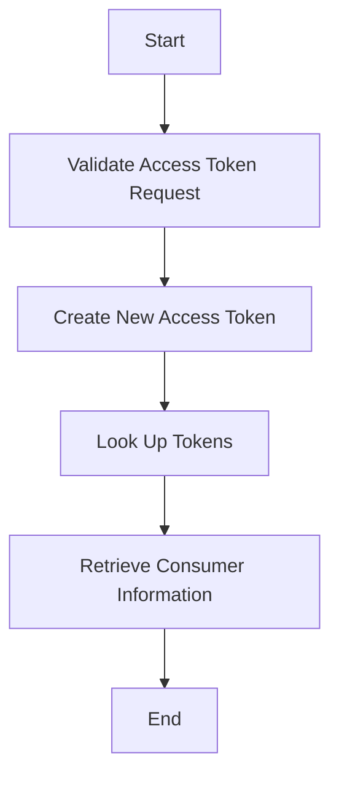

The process of fetching an access token involves several steps to ensure the security and validity of the token request. This document will cover:

1. Validating the access token request
2. Creating a new access token
3. Looking up tokens
4. Retrieving consumer information.

Technical document: <SwmLink doc-title="Fetching Access Token Flow">[Fetching Access Token Flow](/.swm/fetching-access-token-flow.8r4p0vp3.sw.md)</SwmLink>

# [Validating the Access Token Request](https://app.swimm.io/repos/Z2l0aHViJTNBJTNBbWVkaWF3aWtpLWV4dGVuc2lvbnMtT0F1dGglM0ElM0FTd2ltbS1EZW1v/docs/8r4p0vp3#fetching-and-validating-the-access-token)

The process begins with validating the access token request. This involves checking the version of the request and retrieving the associated consumer. The consumer must be valid and not restricted to owner-only access. Additionally, the source IP is verified, and the authorized request token is retrieved. If the token has a blank secret, an exception is thrown. Finally, the signature is checked to ensure the request's authenticity.

# [Creating a New Access Token](https://app.swimm.io/repos/Z2l0aHViJTNBJTNBbWVkaWF3aWtpLWV4dGVuc2lvbnMtT0F1dGglM0ElM0FTd2ltbS1EZW1v/docs/8r4p0vp3#creating-a-new-access-token)

Once the request is validated, a new access token is created for the user associated with the request token. This step involves verifying the token and the verifier code. If the token is valid, the access token is looked up, and the request token is invalidated. The new access token is then returned to the user.

# [Looking Up Tokens](https://app.swimm.io/repos/Z2l0aHViJTNBJTNBbWVkaWF3aWtpLWV4dGVuc2lvbnMtT0F1dGglM0ElM0FTd2ltbS1EZW1v/docs/8r4p0vp3#looking-up-tokens)

The next step is to look up the tokens. This involves retrieving either a request or access token from the data store. The system checks if the token is already used or not found and throws an exception if necessary. For access tokens, it ensures the token matches the expected consumer and returns the token.

# [Retrieving Consumer Information](https://app.swimm.io/repos/Z2l0aHViJTNBJTNBbWVkaWF3aWtpLWV4dGVuc2lvbnMtT0F1dGglM0ElM0FTd2ltbS1EZW1v/docs/8r4p0vp3#looking-up-consumers)

Finally, the consumer information is retrieved. This involves getting the consumer's key and creating a consumer object from the database using the consumer key. The consumer data is fetched, and the consumer object is created and returned.

&nbsp;

*This is an auto-generated document by Swimm 🌊 and has not yet been verified by a human*

<SwmMeta version="3.0.0" repo-id="Z2l0aHViJTNBJTNBbWVkaWF3aWtpLWV4dGVuc2lvbnMtT0F1dGglM0ElM0FTd2ltbS1EZW1v" repo-name="mediawiki-extensions-OAuth">Powered by [Swimm](/)</SwmMeta>
