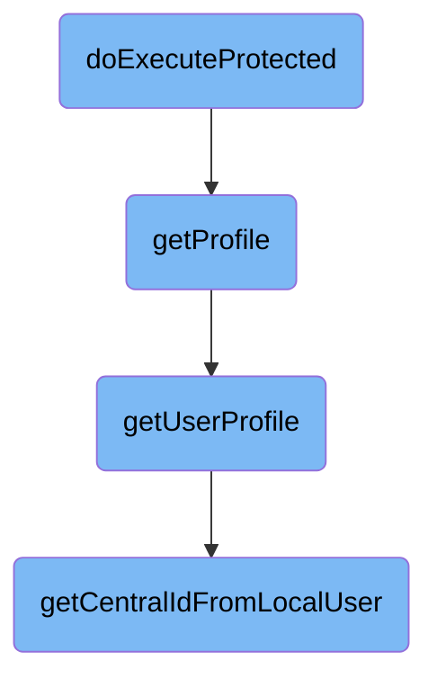

In this document, we will explain the process of fetching and constructing user profile information. The process involves determining the type of resource requested, fetching the user's profile information, and constructing the user's profile data.

The flow starts by determining the type of resource requested. If the type is 'profile', it fetches the user's profile information. Then, it constructs the user's profile data, including various details such as the user's central ID, username, edit count, email status, block status, registration date, groups, rights, and grants. If the user has specific grants, additional private information like real name and email is included.

# Flow drill down



<SwmSnippet path="/src/Rest/Handler/Resource.php" line="90">

---

## Fetching and constructing user profile information

The <SwmToken path="src/Rest/Handler/Resource.php" pos="90:5:5" line-data="	public function doExecuteProtected( $request, $response ) {">`doExecuteProtected`</SwmToken> function determines the type of resource requested and delegates to the appropriate method. If the type is 'profile', it calls <SwmToken path="src/Rest/Handler/Resource.php" pos="95:6:6" line-data="				return $this-&gt;getProfile( $response );">`getProfile`</SwmToken> to fetch the user's profile information.

```hack
	public function doExecuteProtected( $request, $response ) {
		$type = $this->getRequest()->getPathParam( 'type' );

		switch ( $type ) {
			case self::TYPE_PROFILE:
				return $this->getProfile( $response );
			case self::TYPE_SCOPES:
				return $this->getScopes( $response );
		}

		throw new HttpException( 'Invalid resource type', 400 );
	}
```

---

</SwmSnippet>

<SwmSnippet path="/src/Rest/Handler/Resource.php" line="111">

---

The <SwmToken path="src/Rest/Handler/Resource.php" pos="111:5:5" line-data="	private function getProfile( $response ) {">`getProfile`</SwmToken> function retrieves the approved scopes and uses them to create a <SwmToken path="src/Rest/Handler/Resource.php" pos="114:2:2" line-data="		$userStatementProvider = UserStatementProvider::factory(">`userStatementProvider`</SwmToken> instance. It then calls <SwmToken path="src/Rest/Handler/Resource.php" pos="121:9:9" line-data="			$profile = $userStatementProvider-&gt;getUserProfile();">`getUserProfile`</SwmToken> to fetch the user's profile data and returns it in the response.

```hack
	private function getProfile( $response ) {
		// Intersection between approved and requested scopes
		$scopes = array_keys( $this->resourceServer->getScopes() );
		$userStatementProvider = UserStatementProvider::factory(
			$this->resourceServer->getUser(),
			$this->resourceServer->getClient(),
			$scopes
		);

		try {
			$profile = $userStatementProvider->getUserProfile();
		} catch ( MWException $ex ) {
			throw new HttpException( $ex->getMessage(), $ex->getCode() );
		}

		return $this->respond( $response, $profile );
	}
```

---

</SwmSnippet>

<SwmSnippet path="/src/UserStatementProvider.php" line="105">

---

The <SwmToken path="src/UserStatementProvider.php" pos="105:5:5" line-data="	public function getUserProfile() {">`getUserProfile`</SwmToken> function constructs the user's profile information. It includes various details such as the user's central ID, username, edit count, email status, block status, registration date, groups, rights, and grants. If the user has specific grants, additional private information like real name and email is included.

```hack
	public function getUserProfile() {
		$profile = [
			'sub' => Utils::getCentralIdFromLocalUser( $this->user ),
		];
		// Include some MediaWiki info about the user
		if ( !$this->user->isHidden() ) {
			$profile['username'] = $this->user->getName();
			$profile['editcount'] = intval( $this->user->getEditCount() );
			// Use confirmed_email for B/C and email_verified because it's in the OIDC spec
			$profile['confirmed_email'] = $profile['email_verified'] = $this->user->isEmailConfirmed();
			$profile['blocked'] = $this->user->getBlock() !== null;
			$profile['registered'] = $this->user->getRegistration();
			$profile['groups'] = $this->userGroupManager->getUserEffectiveGroups( $this->user );
			$profile['rights'] = array_values( array_unique(
				MediaWikiServices::getInstance()->getPermissionManager()->getUserPermissions( $this->user )
			) );
			$profile['grants'] = $this->grants;

			if ( in_array( 'mwoauth-authonlyprivate', $this->grants ) ||
				in_array( 'viewmyprivateinfo', $this->grantsInfo->getGrantRights( $profile['grants'] ) )
			) {
```

---

</SwmSnippet>

<SwmSnippet path="/src/Backend/Utils.php" line="325">

---

The <SwmToken path="src/Backend/Utils.php" pos="325:7:7" line-data="	public static function getCentralIdFromLocalUser( User $user ) {">`getCentralIdFromLocalUser`</SwmToken> function retrieves the central ID for a given local user. It checks if the ID is already cached; if not, it looks it up using the central ID lookup service and caches the result.

```hack
	public static function getCentralIdFromLocalUser( User $user ) {
		global $wgMWOAuthSharedUserIDs, $wgMWOAuthSharedUserSource;

		// global ID required via hook
		if ( $wgMWOAuthSharedUserIDs ) {
			// T227688 do not rely on array auto-creation for non-stdClass
			if ( !isset( $user->oAuthUserData ) ) {
				$user->oAuthUserData = [];
			}

			if ( isset( $user->oAuthUserData['centralId'] ) ) {
				$id = $user->oAuthUserData['centralId'];
			} else {
				$lookup = MediaWikiServices::getInstance()
					->getCentralIdLookupFactory()
					->getLookup( $wgMWOAuthSharedUserSource );
				if ( !$lookup->isAttached( $user ) ) {
					$id = false;
				} else {
					$id = $lookup->centralIdFromLocalUser( $user );
					if ( $id === 0 ) {
```

---

</SwmSnippet>

&nbsp;

*This is an auto-generated document by Swimm AI 🌊 and has not yet been verified by a human*

<SwmMeta version="3.0.0" repo-id="Z2l0aHViJTNBJTNBbWVkaWF3aWtpLWV4dGVuc2lvbnMtT0F1dGglM0ElM0FTd2ltbS1EZW1v" repo-name="mediawiki-extensions-OAuth"><sup>Powered by [Swimm](/)</sup></SwmMeta>
