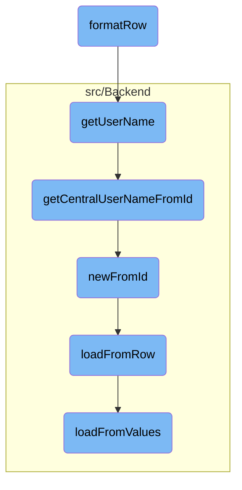

In this document, we will explain the process of formatting consumer data into a user-friendly HTML list item. The process involves retrieving the consumer's key, stage, and other relevant details, and then constructing HTML elements to display this information.

The flow starts by retrieving the consumer's key and stage. Then, it constructs HTML elements to display the consumer's information, such as name, <SwmToken path="src/Frontend/SpecialPages/SpecialMWOAuthListConsumers.php" pos="3:6:6" line-data="namespace MediaWiki\Extension\OAuth\Frontend\SpecialPages;">`OAuth`</SwmToken> version, user, description, wiki, and status. Links for viewing and managing the consumer are also created and included in the HTML list item.

# Flow drill down



<SwmSnippet path="/src/Frontend/SpecialPages/SpecialMWOAuthListConsumers.php" line="260">

---

## Formatting Consumer Data

The <SwmToken path="src/Frontend/SpecialPages/SpecialMWOAuthListConsumers.php" pos="260:5:5" line-data="	public function formatRow( IDatabase $db, $row ) {">`formatRow`</SwmToken> function is responsible for formatting the consumer data into a user-friendly HTML list item. It retrieves the consumer's key, stage, and other relevant details, and then constructs HTML elements to display this information. This includes creating links for viewing and managing the consumer, as well as displaying the consumer's name, <SwmToken path="src/Frontend/SpecialPages/SpecialMWOAuthListConsumers.php" pos="3:6:6" line-data="namespace MediaWiki\Extension\OAuth\Frontend\SpecialPages;">`OAuth`</SwmToken> version, user, description, wiki, and status.

```hack
	public function formatRow( IDatabase $db, $row ) {
		$cmrAc = ConsumerAccessControl::wrap(
			Consumer::newFromRow( $db, $row ), $this->getContext() );
		$cmrKey = $cmrAc->getConsumerKey();
		$stageKey = Consumer::$stageNames[$cmrAc->getStage()];
		$permMgr = MediaWikiServices::getInstance()->getPermissionManager();

		$links = [];
		$links[] = $this->getLinkRenderer()->makeKnownLink(
			$this->getPageTitle( "view/{$cmrKey}" ),
			$this->msg( 'mwoauthlistconsumers-view' )->text(),
			[],
			$this->getRequest()->getValues( 'name', 'publisher', 'stage' )
		);
		if ( $permMgr->userHasRight( $this->getUser(), 'mwoauthmanageconsumer' ) ) {
			$links[] = $this->getLinkRenderer()->makeKnownLink(
				SpecialPage::getTitleFor( 'OAuthManageConsumers', $cmrKey ),
				$this->msg( 'mwoauthmanageconsumers-review' )->text()
			);
		}
		$links = $this->getLanguage()->pipeList( $links );
```

---

</SwmSnippet>

<SwmSnippet path="/src/Control/ConsumerAccessControl.php" line="234">

---

### Retrieving User Name

The <SwmToken path="src/Control/ConsumerAccessControl.php" pos="234:5:5" line-data="	public function getUserName( $audience = false ) {">`getUserName`</SwmToken> function retrieves the username of the consumer's owner. It triggers a database lookup to fetch the central username based on the user ID.

```hack
	public function getUserName( $audience = false ) {
		return $this->get( 'userId', static function ( $id ) use ( $audience ) {
			return Utils::getCentralUserNameFromId( $id, $audience );
		} );
```

---

</SwmSnippet>

<SwmSnippet path="/src/Backend/Utils.php" line="262">

---

### Fetching Central Username

The <SwmToken path="src/Backend/Utils.php" pos="262:7:7" line-data="	public static function getCentralUserNameFromId( $userId, $audience = false ) {">`getCentralUserNameFromId`</SwmToken> function fetches the central username from the user ID. It checks if the user ID is shared across multiple wikis and retrieves the username accordingly. If the user is hidden, it handles the visibility based on the audience parameter.

```hack
	public static function getCentralUserNameFromId( $userId, $audience = false ) {
		global $wgMWOAuthSharedUserIDs, $wgMWOAuthSharedUserSource;

		// global ID required via hook
		if ( $wgMWOAuthSharedUserIDs ) {
			$lookup = MediaWikiServices::getInstance()
				->getCentralIdLookupFactory()
				->getLookup( $wgMWOAuthSharedUserSource );
			$name = $lookup->nameFromCentralId(
				$userId,
				$audience === 'raw'
					? CentralIdLookup::AUDIENCE_RAW
					: ( $audience ?: CentralIdLookup::AUDIENCE_PUBLIC )
			);
			if ( $name === null ) {
				$name = false;
			}
		} else {
			$name = '';
			$user = User::newFromId( $userId );
			$permissionManager = MediaWikiServices::getInstance()->getPermissionManager();
```

---

</SwmSnippet>

<SwmSnippet path="/src/Backend/MWOAuthDAO.php" line="103">

---

### Creating Consumer Object

The <SwmToken path="src/Backend/MWOAuthDAO.php" pos="103:9:9" line-data="	final public static function newFromId( IDatabase $db, $id, $flags = 0 ) {">`newFromId`</SwmToken> function creates a new consumer object from the database using the consumer ID. It fetches the row data from the database and initializes the consumer object with this data.

```hack
	final public static function newFromId( IDatabase $db, $id, $flags = 0 ) {
		$queryBuilder = $db->newSelectQueryBuilder()
			->select( array_values( static::getFieldColumnMap() ) )
			->from( static::getTable() )
			->where( [ static::getIdColumn() => (int)$id ] )
			->caller( __METHOD__ );
		if ( $flags & IDBAccessObject::READ_LOCKING ) {
			$queryBuilder->forUpdate();
		}
		$row = $queryBuilder->fetchRow();

		if ( $row ) {
			$class = static::getConsumerClass( (array)$row );
			$consumer = new $class();
			$consumer->loadFromRow( $db, $row );
			return $consumer;
		} else {
			return false;
		}
	}
```

---

</SwmSnippet>

<SwmSnippet path="/src/Backend/MWOAuthDAO.php" line="380">

---

### Loading Data from Row

The <SwmToken path="src/Backend/MWOAuthDAO.php" pos="380:7:7" line-data="	final protected function loadFromRow( IDatabase $db, $row ) {">`loadFromRow`</SwmToken> function loads the consumer data from a database row. It decodes the row data and populates the consumer object with the relevant values.

```hack
	final protected function loadFromRow( IDatabase $db, $row ) {
		$row = $this->decodeRow( $db, (array)$row );
		$values = [];
		foreach ( static::getFieldColumnMap() as $field => $column ) {
			$values[$field] = $row[$column];
		}
		$this->loadFromValues( $values );
		$this->daoOrigin = 'db';
		$this->daoPending = false;
	}
```

---

</SwmSnippet>

<SwmSnippet path="/src/Backend/MWOAuthDAO.php" line="356">

---

### Loading Data from Values

The <SwmToken path="src/Backend/MWOAuthDAO.php" pos="356:7:7" line-data="	final protected function loadFromValues( array $values ) {">`loadFromValues`</SwmToken> function loads the consumer data from an array of values. It ensures that all required fields are present and normalizes the values for the consumer object.

```hack
	final protected function loadFromValues( array $values ) {
		foreach ( static::getFieldColumnMap() as $field => $column ) {
			if ( !array_key_exists( $field, $values ) ) {
				throw new MWException( get_class( $this ) . " requires '$field' field." );
			}
			$this->$field = $values[$field];
		}
		$this->normalizeValues();
		$this->daoOrigin = 'new';
		$this->daoPending = true;
	}
```

---

</SwmSnippet>

&nbsp;

*This is an auto-generated document by Swimm AI 🌊 and has not yet been verified by a human*

<SwmMeta version="3.0.0" repo-id="Z2l0aHViJTNBJTNBbWVkaWF3aWtpLWV4dGVuc2lvbnMtT0F1dGglM0ElM0FTd2ltbS1EZW1v" repo-name="mediawiki-extensions-OAuth"><sup>Powered by [Swimm](/)</sup></SwmMeta>
