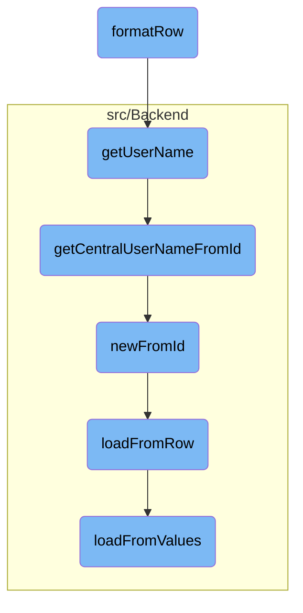

In this document, we will explain the process of formatting consumer data into an HTML structure for display. The process involves retrieving various pieces of information about the consumer, such as the consumer key, registration time, and user details, and then constructing an HTML list item containing this information.

The flow is straightforward and involves several steps: retrieving the consumer data, getting the consumer key and registration time, creating an HTML link for the consumer, and finally constructing an HTML list item that includes all this information.

# Flow drill down



<SwmSnippet path="/src/Frontend/SpecialPages/SpecialMWOAuthManageConsumers.php" line="494">

---

## Formatting Consumer Data

The <SwmToken path="src/Frontend/SpecialPages/SpecialMWOAuthManageConsumers.php" pos="494:5:5" line-data="	public function formatRow( IDatabase $db, $row ) {">`formatRow`</SwmToken> function is responsible for formatting the consumer data into an HTML structure for display. It retrieves various pieces of information about the consumer, such as the consumer key, registration time, and user details, and then constructs an HTML list item containing this information.

```hack
	public function formatRow( IDatabase $db, $row ) {
		$cmrAc = ConsumerAccessControl::wrap(
			Consumer::newFromRow( $db, $row ), $this->getContext()
		);

		$cmrKey = $cmrAc->getConsumerKey();
		$stageKey = Consumer::$stageNames[$cmrAc->getStage()];

		$link = $this->getLinkRenderer()->makeKnownLink(
			$this->getPageTitle( $cmrKey ),
			$this->msg( 'mwoauthmanageconsumers-review' )->text()
		);

		$time = $this->getLanguage()->timeanddate(
			wfTimestamp( TS_MW, $cmrAc->getRegistration() ), true );

		$encStageKey = htmlspecialchars( $stageKey );
		$r = "<li class='mw-mwoauthmanageconsumers-{$encStageKey}'>";

		$r .= $time . " (<strong>{$link}</strong>)";

```

---

</SwmSnippet>

<SwmSnippet path="/src/Control/ConsumerAccessControl.php" line="234">

---

### Retrieving User Name

The <SwmToken path="src/Control/ConsumerAccessControl.php" pos="234:5:5" line-data="	public function getUserName( $audience = false ) {">`getUserName`</SwmToken> function retrieves the username of the consumer's owner. It triggers a database lookup to get the central username based on the user ID.

```hack
	public function getUserName( $audience = false ) {
		return $this->get( 'userId', static function ( $id ) use ( $audience ) {
			return Utils::getCentralUserNameFromId( $id, $audience );
		} );
```

---

</SwmSnippet>

<SwmSnippet path="/src/Backend/Utils.php" line="262">

---

### Getting Central User Name

The <SwmToken path="src/Backend/Utils.php" pos="262:7:7" line-data="	public static function getCentralUserNameFromId( $userId, $audience = false ) {">`getCentralUserNameFromId`</SwmToken> function fetches the central username for a given user ID. It checks if the user ID is globally recognized and retrieves the username accordingly, considering whether the name should be hidden based on the audience.

```hack
	public static function getCentralUserNameFromId( $userId, $audience = false ) {
		global $wgMWOAuthSharedUserIDs, $wgMWOAuthSharedUserSource;

		// global ID required via hook
		if ( $wgMWOAuthSharedUserIDs ) {
			$lookup = MediaWikiServices::getInstance()
				->getCentralIdLookupFactory()
				->getLookup( $wgMWOAuthSharedUserSource );
			$name = $lookup->nameFromCentralId(
				$userId,
				$audience === 'raw'
					? CentralIdLookup::AUDIENCE_RAW
					: ( $audience ?: CentralIdLookup::AUDIENCE_PUBLIC )
			);
			if ( $name === null ) {
				$name = false;
			}
		} else {
			$name = '';
			$user = User::newFromId( $userId );
			$permissionManager = MediaWikiServices::getInstance()->getPermissionManager();
```

---

</SwmSnippet>

<SwmSnippet path="/src/Backend/MWOAuthDAO.php" line="103">

---

### Creating Consumer Object

The <SwmToken path="src/Backend/MWOAuthDAO.php" pos="103:9:9" line-data="	final public static function newFromId( IDatabase $db, $id, $flags = 0 ) {">`newFromId`</SwmToken> function creates a new consumer object from a given ID. It queries the database to fetch the row corresponding to the ID and then loads the consumer data from this row.

```hack
	final public static function newFromId( IDatabase $db, $id, $flags = 0 ) {
		$queryBuilder = $db->newSelectQueryBuilder()
			->select( array_values( static::getFieldColumnMap() ) )
			->from( static::getTable() )
			->where( [ static::getIdColumn() => (int)$id ] )
			->caller( __METHOD__ );
		if ( $flags & IDBAccessObject::READ_LOCKING ) {
			$queryBuilder->forUpdate();
		}
		$row = $queryBuilder->fetchRow();

		if ( $row ) {
			$class = static::getConsumerClass( (array)$row );
			$consumer = new $class();
			$consumer->loadFromRow( $db, $row );
			return $consumer;
		} else {
			return false;
		}
	}
```

---

</SwmSnippet>

<SwmSnippet path="/src/Backend/MWOAuthDAO.php" line="380">

---

### Loading Data from Row

The <SwmToken path="src/Backend/MWOAuthDAO.php" pos="380:7:7" line-data="	final protected function loadFromRow( IDatabase $db, $row ) {">`loadFromRow`</SwmToken> function loads consumer data from a database row. It decodes the row and maps the data to the consumer object's fields.

```hack
	final protected function loadFromRow( IDatabase $db, $row ) {
		$row = $this->decodeRow( $db, (array)$row );
		$values = [];
		foreach ( static::getFieldColumnMap() as $field => $column ) {
			$values[$field] = $row[$column];
		}
		$this->loadFromValues( $values );
		$this->daoOrigin = 'db';
		$this->daoPending = false;
	}
```

---

</SwmSnippet>

<SwmSnippet path="/src/Backend/MWOAuthDAO.php" line="356">

---

### Loading Data from Values

The <SwmToken path="src/Backend/MWOAuthDAO.php" pos="356:7:7" line-data="	final protected function loadFromValues( array $values ) {">`loadFromValues`</SwmToken> function loads consumer data from an array of values. It ensures that all required fields are present and normalizes the values for the consumer object.

```hack
	final protected function loadFromValues( array $values ) {
		foreach ( static::getFieldColumnMap() as $field => $column ) {
			if ( !array_key_exists( $field, $values ) ) {
				throw new MWException( get_class( $this ) . " requires '$field' field." );
			}
			$this->$field = $values[$field];
		}
		$this->normalizeValues();
		$this->daoOrigin = 'new';
		$this->daoPending = true;
	}
```

---

</SwmSnippet>

&nbsp;

*This is an auto-generated document by Swimm AI 🌊 and has not yet been verified by a human*

<SwmMeta version="3.0.0" repo-id="Z2l0aHViJTNBJTNBbWVkaWF3aWtpLWV4dGVuc2lvbnMtT0F1dGglM0ElM0FTd2ltbS1EZW1v" repo-name="mediawiki-extensions-OAuth"><sup>Powered by [Swimm](/)</sup></SwmMeta>
