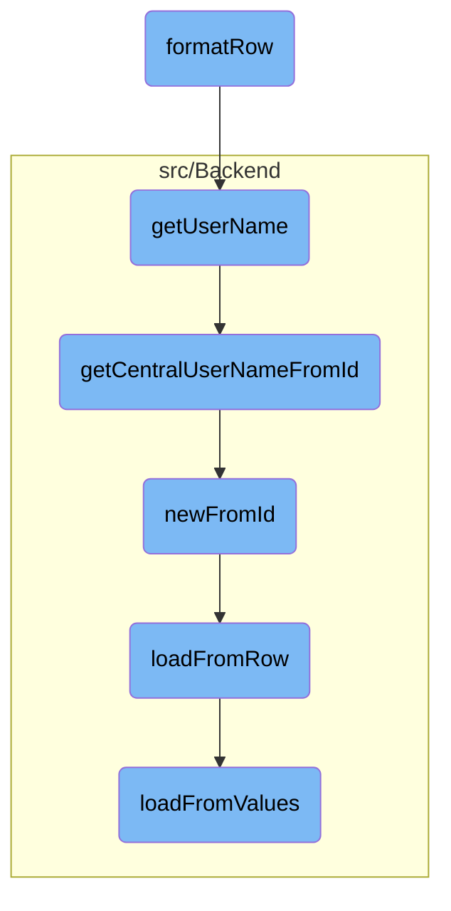

In this document, we will explain the process of formatting a row of data related to user grants. The process involves creating a list item with the grant's name and version, including links for reviewing and revoking the grant, and adding additional information such as the user's name and wiki allowed status.

The flow starts by wrapping the consumer and consumer acceptance objects. Then, it retrieves the necessary links for reviewing and revoking the grant. Finally, it formats the row by including the grant's name, version, and additional information like the user's name and wiki allowed status.

# Flow drill down



<SwmSnippet path="/src/Frontend/SpecialPages/SpecialMWOAuthManageMyGrants.php" line="311">

---

## Formatting the Row

The <SwmToken path="src/Frontend/SpecialPages/SpecialMWOAuthManageMyGrants.php" pos="311:5:5" line-data="	public function formatRow( IDatabase $db, $row ) {">`formatRow`</SwmToken> function is responsible for formatting a row of data related to user grants. It creates a list item with the grant's name and version, and includes links for reviewing and revoking the grant. The function also adds additional information such as the user's name and wiki allowed status.

```hack
	public function formatRow( IDatabase $db, $row ) {
		$cmrAc = ConsumerAccessControl::wrap(
			Consumer::newFromRow( $db, $row ), $this->getContext() );
		$cmraAc = ConsumerAcceptanceAccessControl::wrap(
			ConsumerAcceptance::newFromRow( $db, $row ), $this->getContext() );

		$linkRenderer = $this->getLinkRenderer();

		$links = [];
		if ( array_diff( $cmrAc->getGrants(), self::irrevocableGrants() ) ) {
			$links[] = $linkRenderer->makeKnownLink(
				$this->getPageTitle( 'update/' . $cmraAc->getId() ),
				$this->msg( 'mwoauthmanagemygrants-review' )->text()
			);
		}
		$links[] = $linkRenderer->makeKnownLink(
			$this->getPageTitle( 'revoke/' . $cmraAc->getId() ),
			$this->msg( 'mwoauthmanagemygrants-revoke' )->text()
		);
		$reviewLinks = $this->getLanguage()->pipeList( $links );

```

---

</SwmSnippet>

<SwmSnippet path="/src/Control/ConsumerAccessControl.php" line="234">

---

## Retrieving the User Name

The <SwmToken path="src/Control/ConsumerAccessControl.php" pos="234:5:5" line-data="	public function getUserName( $audience = false ) {">`getUserName`</SwmToken> function retrieves the username of the grant owner. It triggers a database lookup to get the central username based on the user ID.

```hack
	public function getUserName( $audience = false ) {
		return $this->get( 'userId', static function ( $id ) use ( $audience ) {
			return Utils::getCentralUserNameFromId( $id, $audience );
		} );
	}
```

---

</SwmSnippet>

<SwmSnippet path="/src/Backend/Utils.php" line="262">

---

### Getting Central User Name from ID

The <SwmToken path="src/Backend/Utils.php" pos="262:7:7" line-data="	public static function getCentralUserNameFromId( $userId, $audience = false ) {">`getCentralUserNameFromId`</SwmToken> function fetches the central username given a user ID. It checks if the user ID is globally shared and retrieves the name accordingly. If the user is hidden, it handles the visibility based on the audience parameter.

```hack
	public static function getCentralUserNameFromId( $userId, $audience = false ) {
		global $wgMWOAuthSharedUserIDs, $wgMWOAuthSharedUserSource;

		// global ID required via hook
		if ( $wgMWOAuthSharedUserIDs ) {
			$lookup = MediaWikiServices::getInstance()
				->getCentralIdLookupFactory()
				->getLookup( $wgMWOAuthSharedUserSource );
			$name = $lookup->nameFromCentralId(
				$userId,
				$audience === 'raw'
					? CentralIdLookup::AUDIENCE_RAW
					: ( $audience ?: CentralIdLookup::AUDIENCE_PUBLIC )
			);
			if ( $name === null ) {
				$name = false;
			}
		} else {
			$name = '';
			$user = User::newFromId( $userId );
			$permissionManager = MediaWikiServices::getInstance()->getPermissionManager();
```

---

</SwmSnippet>

<SwmSnippet path="/src/Backend/MWOAuthDAO.php" line="103">

---

### Creating a New Consumer from ID

The <SwmToken path="src/Backend/MWOAuthDAO.php" pos="103:9:9" line-data="	final public static function newFromId( IDatabase $db, $id, $flags = 0 ) {">`newFromId`</SwmToken> function creates a new consumer object from a given ID. It queries the database to fetch the row corresponding to the ID and then loads the consumer data from that row.

```hack
	final public static function newFromId( IDatabase $db, $id, $flags = 0 ) {
		$queryBuilder = $db->newSelectQueryBuilder()
			->select( array_values( static::getFieldColumnMap() ) )
			->from( static::getTable() )
			->where( [ static::getIdColumn() => (int)$id ] )
			->caller( __METHOD__ );
		if ( $flags & IDBAccessObject::READ_LOCKING ) {
			$queryBuilder->forUpdate();
		}
		$row = $queryBuilder->fetchRow();

		if ( $row ) {
			$class = static::getConsumerClass( (array)$row );
			$consumer = new $class();
			$consumer->loadFromRow( $db, $row );
			return $consumer;
		} else {
			return false;
		}
	}
```

---

</SwmSnippet>

<SwmSnippet path="/src/Backend/MWOAuthDAO.php" line="380">

---

### Loading Data from Row

The <SwmToken path="src/Backend/MWOAuthDAO.php" pos="380:7:7" line-data="	final protected function loadFromRow( IDatabase $db, $row ) {">`loadFromRow`</SwmToken> function loads data from a database row into the consumer object. It decodes the row and maps the values to the object's fields.

```hack
	final protected function loadFromRow( IDatabase $db, $row ) {
		$row = $this->decodeRow( $db, (array)$row );
		$values = [];
		foreach ( static::getFieldColumnMap() as $field => $column ) {
			$values[$field] = $row[$column];
		}
		$this->loadFromValues( $values );
		$this->daoOrigin = 'db';
		$this->daoPending = false;
	}
```

---

</SwmSnippet>

<SwmSnippet path="/src/Backend/MWOAuthDAO.php" line="356">

---

### Loading Data from Values

The <SwmToken path="src/Backend/MWOAuthDAO.php" pos="356:7:7" line-data="	final protected function loadFromValues( array $values ) {">`loadFromValues`</SwmToken> function loads data from an array of values into the consumer object. It ensures that all required fields are present and normalizes the values.

```hack
	final protected function loadFromValues( array $values ) {
		foreach ( static::getFieldColumnMap() as $field => $column ) {
			if ( !array_key_exists( $field, $values ) ) {
				throw new MWException( get_class( $this ) . " requires '$field' field." );
			}
			$this->$field = $values[$field];
		}
		$this->normalizeValues();
		$this->daoOrigin = 'new';
		$this->daoPending = true;
	}
```

---

</SwmSnippet>

&nbsp;

*This is an auto-generated document by Swimm AI 🌊 and has not yet been verified by a human*

<SwmMeta version="3.0.0" repo-id="Z2l0aHViJTNBJTNBbWVkaWF3aWtpLWV4dGVuc2lvbnMtT0F1dGglM0ElM0FTd2ltbS1EZW1v" repo-name="mediawiki-extensions-OAuth"><sup>Powered by [Swimm](/)</sup></SwmMeta>
