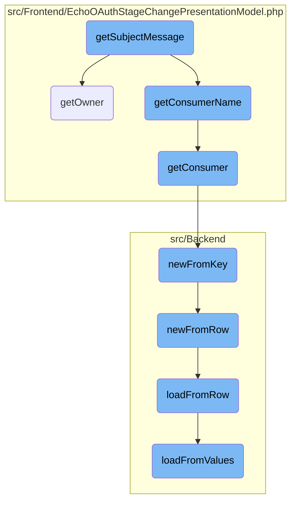
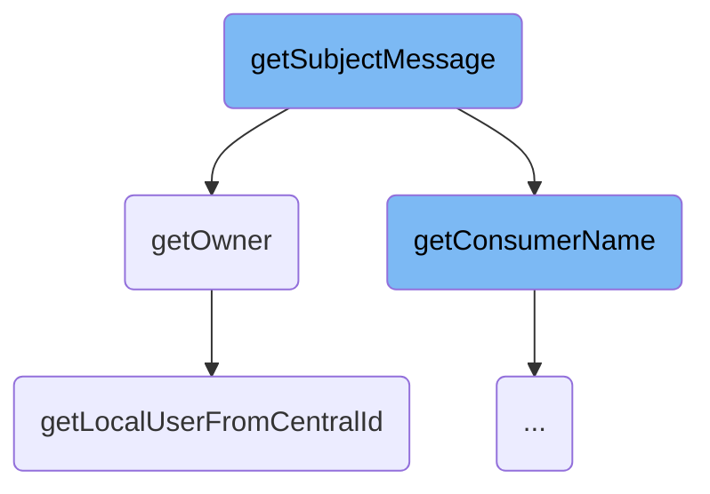
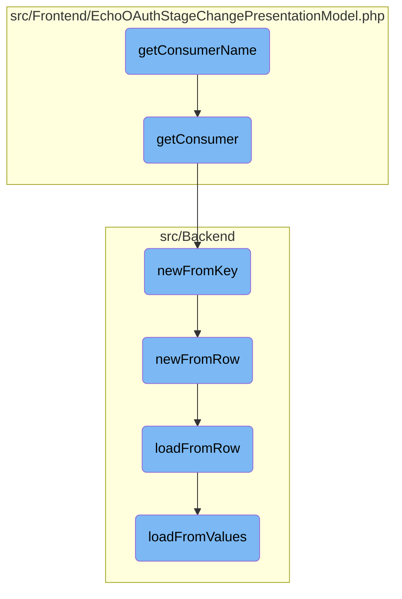

This document explains the process of generating the subject line for OAuth-related notifications. It involves retrieving the action from the event parameters and constructing the message using the agent, consumer name, and owner.

The flow starts with generating the subject line for <SwmToken path="src/Frontend/EchoOAuthStageChangePresentationModel.php" pos="64:12:12" line-data="		return $this-&gt;msg( &quot;notification-oauth-app-$action-subject&quot;,">`oauth`</SwmToken> notifications. First, the action is retrieved from the event parameters. Then, the agent, consumer name, and owner are used to construct the message. The consumer name is fetched by calling the <SwmToken path="src/Frontend/EchoOAuthStageChangePresentationModel.php" pos="105:5:5" line-data="	protected function getConsumer() {">`getConsumer`</SwmToken> function, which retrieves the consumer object from the database using the consumer key. If the consumer object is not cached, it is fetched from the database. The owner is retrieved using the <SwmToken path="src/Frontend/EchoOAuthStageChangePresentationModel.php" pos="119:10:10" line-data="			$this-&gt;owner = Utils::getLocalUserFromCentralId(">`getLocalUserFromCentralId`</SwmToken> function, which fetches a local user object based on a central user ID.

Here is a high level diagram of the flow, showing only the most important functions:



# Flow drill down

First, we'll zoom into this section of the flow:



<SwmSnippet path="/src/Frontend/EchoOAuthStageChangePresentationModel.php" line="62">

---

## Generating the Subject Line

The <SwmToken path="src/Frontend/EchoOAuthStageChangePresentationModel.php" pos="62:5:5" line-data="	public function getSubjectMessage() {">`getSubjectMessage`</SwmToken> function generates the subject line for OAuth-related notifications. It retrieves the action from the event parameters and constructs the message using the agent, consumer name, and owner.

```hack
	public function getSubjectMessage() {
		$action = $this->event->getExtraParam( 'action' );
		return $this->msg( "notification-oauth-app-$action-subject",
			$this->event->getAgent(), $this->getConsumerName(), $this->getOwner() );
	}
```

---

</SwmSnippet>

<SwmSnippet path="/src/Frontend/EchoOAuthStageChangePresentationModel.php" line="114">

---

### Retrieving the Owner

The <SwmToken path="src/Frontend/EchoOAuthStageChangePresentationModel.php" pos="117:5:5" line-data="	protected function getOwner() {">`getOwner`</SwmToken> function retrieves the owner of the <SwmToken path="src/Frontend/EchoOAuthStageChangePresentationModel.php" pos="64:12:12" line-data="		return $this-&gt;msg( &quot;notification-oauth-app-$action-subject&quot;,">`oauth`</SwmToken> event. If the owner is not already set, it uses the <SwmToken path="src/Frontend/EchoOAuthStageChangePresentationModel.php" pos="119:10:10" line-data="			$this-&gt;owner = Utils::getLocalUserFromCentralId(">`getLocalUserFromCentralId`</SwmToken> function to fetch the local user object based on the central user ID provided in the event parameters.

```hack
	/**
	 * @return User|false
	 */
	protected function getOwner() {
		if ( $this->owner === null ) {
			$this->owner = Utils::getLocalUserFromCentralId(
				$this->event->getExtraParam( 'owner-id' ) );
		}
		return $this->owner;
	}
```

---

</SwmSnippet>

<SwmSnippet path="/src/Backend/Utils.php" line="295">

---

### Fetching Local User from Central ID

The <SwmToken path="src/Backend/Utils.php" pos="301:7:7" line-data="	public static function getLocalUserFromCentralId( $userId ) {">`getLocalUserFromCentralId`</SwmToken> function fetches a local user object based on a central wiki user ID. It checks if the global ID lookup is enabled and uses the appropriate service to find and return the local user. If the user is not found or not attached, it returns false.

```hack
	/**
	 * Given a central wiki user ID, get a local User object
	 *
	 * @param int $userId
	 * @return User|false False if not found
	 */
	public static function getLocalUserFromCentralId( $userId ) {
		global $wgMWOAuthSharedUserIDs, $wgMWOAuthSharedUserSource;

		// global ID required via hook
		if ( $wgMWOAuthSharedUserIDs ) {
			$lookup = MediaWikiServices::getInstance()
				->getCentralIdLookupFactory()
				->getLookup( $wgMWOAuthSharedUserSource );
			$user = $lookup->localUserFromCentralId( $userId );
			if ( $user === null || !$lookup->isAttached( $user ) ) {
				return false;
			}
			return User::newFromIdentity( $user );
		}

```

---

</SwmSnippet>

Now, lets zoom into this section of the flow:



<SwmSnippet path="/src/Frontend/EchoOAuthStageChangePresentationModel.php" line="125">

---

## Retrieving Consumer Name

The <SwmToken path="src/Frontend/EchoOAuthStageChangePresentationModel.php" pos="128:5:5" line-data="	protected function getConsumerName() {">`getConsumerName`</SwmToken> function retrieves the consumer's name associated with an <SwmToken path="src/Frontend/EchoOAuthStageChangePresentationModel.php" pos="64:12:12" line-data="		return $this-&gt;msg( &quot;notification-oauth-app-$action-subject&quot;,">`oauth`</SwmToken> event. It calls the <SwmToken path="src/Frontend/EchoOAuthStageChangePresentationModel.php" pos="129:9:9" line-data="		$consumer = $this-&gt;getConsumer();">`getConsumer`</SwmToken> function to get the consumer object and then returns the consumer's name if available.

```hack
	/**
	 * @return string|false
	 */
	protected function getConsumerName() {
		$consumer = $this->getConsumer();
		return $consumer ? $consumer->getName() : false;
	}
```

---

</SwmSnippet>

<SwmSnippet path="/src/Frontend/EchoOAuthStageChangePresentationModel.php" line="102">

---

## Getting Consumer Object

The <SwmToken path="src/Frontend/EchoOAuthStageChangePresentationModel.php" pos="105:5:5" line-data="	protected function getConsumer() {">`getConsumer`</SwmToken> function retrieves the consumer object from the database using the consumer key. If the consumer object is not already cached, it fetches it from the database using the <SwmToken path="src/Frontend/EchoOAuthStageChangePresentationModel.php" pos="109:3:3" line-data="				Consumer::newFromKey( $dbr, $this-&gt;event-&gt;getExtraParam( &#39;app-key&#39; ) );">`newFromKey`</SwmToken> function.

```hack
	/**
	 * @return Consumer|false
	 */
	protected function getConsumer() {
		if ( $this->consumer === null ) {
			$dbr = Utils::getCentralDB( DB_REPLICA );
			$this->consumer =
				Consumer::newFromKey( $dbr, $this->event->getExtraParam( 'app-key' ) );
		}
		return $this->consumer;
	}
```

---

</SwmSnippet>

<SwmSnippet path="/src/Backend/Consumer.php" line="215">

---

## Creating Consumer from Key

The <SwmToken path="src/Backend/Consumer.php" pos="221:7:7" line-data="	public static function newFromKey( IDatabase $db, $key, $flags = 0 ) {">`newFromKey`</SwmToken> function creates a consumer object from the database using the provided consumer key. It constructs a query to fetch the consumer data and then calls <SwmToken path="src/Backend/Consumer.php" pos="233:5:5" line-data="			return static::newFromRow( $db, $row );">`newFromRow`</SwmToken> to create the consumer object from the retrieved row.

```hack
	/**
	 * @param IDatabase $db
	 * @param string|null $key
	 * @param int $flags IDBAccessObject::READ_* bitfield
	 * @return Consumer|false
	 */
	public static function newFromKey( IDatabase $db, $key, $flags = 0 ) {
		$queryBuilder = $db->newSelectQueryBuilder()
			->select( array_values( static::getFieldColumnMap() ) )
			->from( static::getTable() )
			->where( [ 'oarc_consumer_key' => (string)$key ] )
			->caller( __METHOD__ );
		if ( $flags & IDBAccessObject::READ_LOCKING ) {
			$queryBuilder->forUpdate();
		}
		$row = $queryBuilder->fetchRow();

		if ( $row ) {
			return static::newFromRow( $db, $row );
		} else {
			return false;
```

---

</SwmSnippet>

<SwmSnippet path="/src/Backend/MWOAuthDAO.php" line="84">

---

## Creating Consumer from Row

The <SwmToken path="src/Backend/MWOAuthDAO.php" pos="89:9:9" line-data="	final public static function newFromRow( IDatabase $db, $row ) {">`newFromRow`</SwmToken> function creates a consumer object from a database row. It initializes the consumer object and loads its data using the <SwmToken path="src/Backend/MWOAuthDAO.php" pos="92:4:4" line-data="		$consumer-&gt;loadFromRow( $db, $row );">`loadFromRow`</SwmToken> function.

```hack
	/**
	 * @param IDatabase $db
	 * @param array|stdClass $row
	 * @return static
	 */
	final public static function newFromRow( IDatabase $db, $row ) {
		$class = static::getConsumerClass( (array)$row );
		$consumer = new $class();
		$consumer->loadFromRow( $db, $row );
		return $consumer;
	}
```

---

</SwmSnippet>

<SwmSnippet path="/src/Backend/MWOAuthDAO.php" line="375">

---

## Loading Data from Row

The <SwmToken path="src/Backend/MWOAuthDAO.php" pos="380:7:7" line-data="	final protected function loadFromRow( IDatabase $db, $row ) {">`loadFromRow`</SwmToken> function loads consumer data from a database row. It decodes the row data and maps it to the consumer object's fields using the <SwmToken path="src/Backend/MWOAuthDAO.php" pos="386:4:4" line-data="		$this-&gt;loadFromValues( $values );">`loadFromValues`</SwmToken> function.

```hack
	/**
	 * @param IDatabase $db
	 * @param stdClass|array $row
	 * @return void
	 */
	final protected function loadFromRow( IDatabase $db, $row ) {
		$row = $this->decodeRow( $db, (array)$row );
		$values = [];
		foreach ( static::getFieldColumnMap() as $field => $column ) {
			$values[$field] = $row[$column];
		}
		$this->loadFromValues( $values );
		$this->daoOrigin = 'db';
		$this->daoPending = false;
	}
```

---

</SwmSnippet>

<SwmSnippet path="/src/Backend/MWOAuthDAO.php" line="353">

---

## Loading Values into Consumer

The <SwmToken path="src/Backend/MWOAuthDAO.php" pos="356:7:7" line-data="	final protected function loadFromValues( array $values ) {">`loadFromValues`</SwmToken> function loads values into the consumer object. It ensures all required fields are present and normalizes the values before marking the object as pending.

```hack
	/**
	 * @param array $values
	 */
	final protected function loadFromValues( array $values ) {
		foreach ( static::getFieldColumnMap() as $field => $column ) {
			if ( !array_key_exists( $field, $values ) ) {
				throw new MWException( get_class( $this ) . " requires '$field' field." );
			}
			$this->$field = $values[$field];
		}
		$this->normalizeValues();
		$this->daoOrigin = 'new';
		$this->daoPending = true;
	}
```

---

</SwmSnippet>

&nbsp;

*This is an auto-generated document by Swimm AI 🌊 and has not yet been verified by a human*

<SwmMeta version="3.0.0" repo-id="Z2l0aHViJTNBJTNBbWVkaWF3aWtpLWV4dGVuc2lvbnMtT0F1dGglM0ElM0FTd2ltbS1EZW1v" repo-name="mediawiki-extensions-OAuth"><sup>Powered by [Swimm](/)</sup></SwmMeta>
