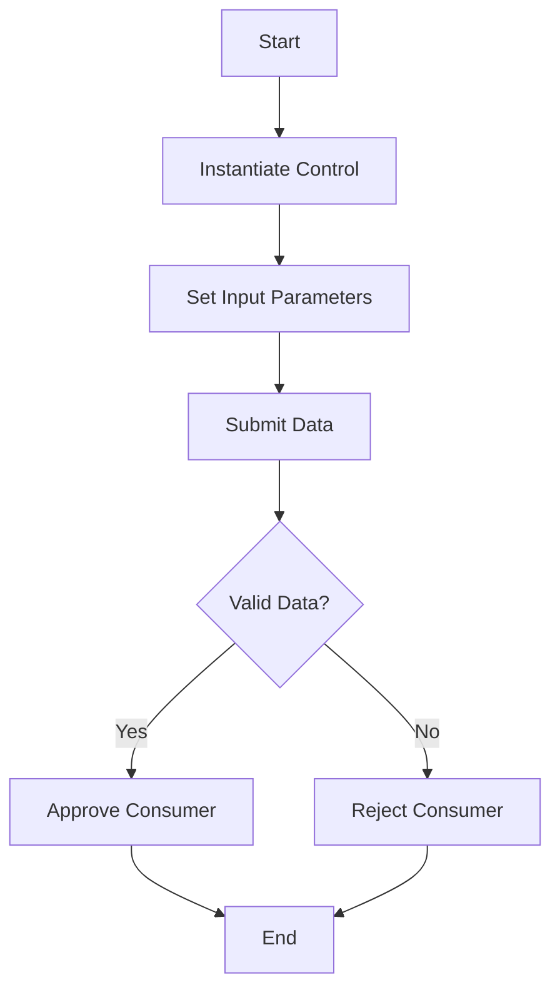

# Introduction

Control refers to the mechanisms and logic used to manage and validate the submission of <SwmToken path="tests/phpunit/Control/ConsumerSubmitControlTest.php" pos="18:11:11" line-data=" * @covers \MediaWiki\Extension\OAuth\Control\ConsumerSubmitControl">`OAuth`</SwmToken> consumers. It ensures that the data provided for <SwmToken path="tests/phpunit/Control/ConsumerSubmitControlTest.php" pos="18:11:11" line-data=" * @covers \MediaWiki\Extension\OAuth\Control\ConsumerSubmitControl">`OAuth`</SwmToken> consumer registration meets the required criteria and follows the necessary workflows. This document will guide you through getting started with Consumer Control, including setting up tests, validating submissions, handling different scenarios, and enforcing restrictions.

# Control Mechanisms

Control mechanisms are tested to ensure that the <SwmToken path="tests/phpunit/Control/ConsumerSubmitControlTest.php" pos="18:11:11" line-data=" * @covers \MediaWiki\Extension\OAuth\Control\ConsumerSubmitControl">`OAuth`</SwmToken> consumer submission process is robust and behaves as expected under different conditions. By testing Control, developers can ensure that the <SwmToken path="tests/phpunit/Control/ConsumerSubmitControlTest.php" pos="18:11:11" line-data=" * @covers \MediaWiki\Extension\OAuth\Control\ConsumerSubmitControl">`OAuth`</SwmToken> consumer submission process is robust and behaves as expected under different conditions.

<SwmSnippet path="/tests/phpunit/Control/ConsumerSubmitControlTest.php" line="17">

---

The <SwmToken path="tests/phpunit/Control/ConsumerSubmitControlTest.php" pos="21:2:2" line-data="class ConsumerSubmitControlTest extends MediaWikiIntegrationTestCase {">`ConsumerSubmitControlTest`</SwmToken> class is used to test the Control mechanisms. It covers various scenarios to validate the submission process.

```hack
/**
 * @covers \MediaWiki\Extension\OAuth\Control\ConsumerSubmitControl
 * @group Database
 */
class ConsumerSubmitControlTest extends MediaWikiIntegrationTestCase {
```

---

</SwmSnippet>

# Validating Submissions

The function <SwmToken path="tests/phpunit/Control/ConsumerSubmitControlTest.php" pos="26:5:5" line-data="	private function doSubmit( array $data, StatusValue $expectedStatus ) {">`doSubmit`</SwmToken> is used to validate the submission of <SwmToken path="tests/phpunit/Control/ConsumerSubmitControlTest.php" pos="18:11:11" line-data=" * @covers \MediaWiki\Extension\OAuth\Control\ConsumerSubmitControl">`OAuth`</SwmToken> consumers by setting up the necessary configurations and checking the expected outcomes.

<SwmSnippet path="/tests/phpunit/Control/ConsumerSubmitControlTest.php" line="26">

---

The <SwmToken path="tests/phpunit/Control/ConsumerSubmitControlTest.php" pos="26:5:5" line-data="	private function doSubmit( array $data, StatusValue $expectedStatus ) {">`doSubmit`</SwmToken> function sets up the necessary configurations and checks the expected outcomes for the submission of <SwmToken path="tests/phpunit/Control/ConsumerSubmitControlTest.php" pos="18:11:11" line-data=" * @covers \MediaWiki\Extension\OAuth\Control\ConsumerSubmitControl">`OAuth`</SwmToken> consumers.

```hack
	private function doSubmit( array $data, StatusValue $expectedStatus ) {
		$this->overrideConfigValues( [
			'MWOAuthCentralWiki' => WikiMap::getCurrentWikiId(),
			'OAuthAutoApprove' => [ [
				'grants' => [ 'mwoauth-authonly', 'mwoauth-authonlyprivate', 'basic' ],
			] ],
		] );
		$this->setGroupPermissions( [
			'user' => [ 'mwoauthproposeconsumer' => true ]
		] );

		$context = RequestContext::getMain();
		$user = $this->getMutableTestUser()->getUser();
		$user->setEmail( 'owner@wiki.domain' );
		$user->confirmEmail();
		$user->saveSettings();
		$context->setUser( $user );
		$this->owner = $user;

		$dbw = $this->getDb();
		$control = new ConsumerSubmitControl( $context, [], $dbw );
```

---

</SwmSnippet>

# Handling Different Scenarios

Different test cases such as <SwmToken path="tests/phpunit/Control/ConsumerSubmitControlTest.php" pos="88:5:5" line-data="	public function testSubmit_OAuth1_good() {">`testSubmit_OAuth1_good`</SwmToken> and <SwmToken path="tests/phpunit/Control/ConsumerSubmitControlTest.php" pos="97:5:5" line-data="	public function testSubmit_OAuth1_autoApproved() {">`testSubmit_OAuth1_autoApproved`</SwmToken> are used to handle various scenarios and ensure that the Control correctly processes valid and invalid data.

<SwmSnippet path="/tests/phpunit/Control/ConsumerSubmitControlTest.php" line="88">

---

The test cases <SwmToken path="tests/phpunit/Control/ConsumerSubmitControlTest.php" pos="88:5:5" line-data="	public function testSubmit_OAuth1_good() {">`testSubmit_OAuth1_good`</SwmToken> and <SwmToken path="tests/phpunit/Control/ConsumerSubmitControlTest.php" pos="97:5:5" line-data="	public function testSubmit_OAuth1_autoApproved() {">`testSubmit_OAuth1_autoApproved`</SwmToken> validate the handling of valid and auto-approved <SwmToken path="tests/phpunit/Control/ConsumerSubmitControlTest.php" pos="18:11:11" line-data=" * @covers \MediaWiki\Extension\OAuth\Control\ConsumerSubmitControl">`OAuth`</SwmToken> consumers.

```hack
	public function testSubmit_OAuth1_good() {
		$consumer = $this->doSubmit( $this->getBaseForOAuth1(), StatusValue::newGood() );
		$this->assertInstanceOf( OAuth1Consumer::class, $consumer );
		$this->assertSame( $this->owner->getId(), $consumer->getUserId() );
		$this->assertFalse( $consumer->getOwnerOnly() );
		$this->assertSame( [ 'basic', 'editpage' ], $consumer->getGrants() );
		$this->assertSame( Consumer::STAGE_PROPOSED, $consumer->getStage() );
	}

	public function testSubmit_OAuth1_autoApproved() {
		$consumer = $this->doSubmit(
			[
				'grants' => json_encode( [ 'basic' ] ),
			] + $this->getBaseForOAuth1(),
			StatusValue::newGood()
		);
		$this->assertSame( [ 'basic' ], $consumer->getGrants() );
		$this->assertSame( Consumer::STAGE_APPROVED, $consumer->getStage() );
```

---

</SwmSnippet>

# Enforcing Restrictions

Tests like <SwmToken path="tests/phpunit/Control/ConsumerSubmitControlTest.php" pos="108:5:5" line-data="	public function testSubmit_OAuth1_invalidVersionString() {">`testSubmit_OAuth1_invalidVersionString`</SwmToken> and <SwmToken path="tests/phpunit/Control/ConsumerSubmitControlTest.php" pos="117:5:5" line-data="	public function testSubmit_OAuth1_bareDomain() {">`testSubmit_OAuth1_bareDomain`</SwmToken> enforce restrictions such as valid version strings and proper callback URL formats.

<SwmSnippet path="/tests/phpunit/Control/ConsumerSubmitControlTest.php" line="108">

---

The test cases <SwmToken path="tests/phpunit/Control/ConsumerSubmitControlTest.php" pos="108:5:5" line-data="	public function testSubmit_OAuth1_invalidVersionString() {">`testSubmit_OAuth1_invalidVersionString`</SwmToken> and <SwmToken path="tests/phpunit/Control/ConsumerSubmitControlTest.php" pos="117:5:5" line-data="	public function testSubmit_OAuth1_bareDomain() {">`testSubmit_OAuth1_bareDomain`</SwmToken> enforce restrictions on version strings and callback URL formats.

```hack
	public function testSubmit_OAuth1_invalidVersionString() {
		$this->doSubmit(
			[
				'version' => 'foo',
			] + $this->getBaseForOAuth1(),
			StatusValue::newFatal( 'mwoauth-invalid-field', 'version' )
		);
	}

	public function testSubmit_OAuth1_bareDomain() {
		$this->doSubmit(
			[
				'callbackUrl' => 'https://example.com/',
			] + $this->getBaseForOAuth1(),
			StatusValue::newFatal( 'mwoauth-error-callback-bare-domain-oauth1' ),
		);
	}
```

---

</SwmSnippet>

&nbsp;

*This is an auto-generated document by Swimm AI 🌊 and has not yet been verified by a human*

<SwmMeta version="3.0.0" repo-id="Z2l0aHViJTNBJTNBbWVkaWF3aWtpLWV4dGVuc2lvbnMtT0F1dGglM0ElM0FTd2ltbS1EZW1v" repo-name="mediawiki-extensions-OAuth"><sup>Powered by [Swimm](/)</sup></SwmMeta>
