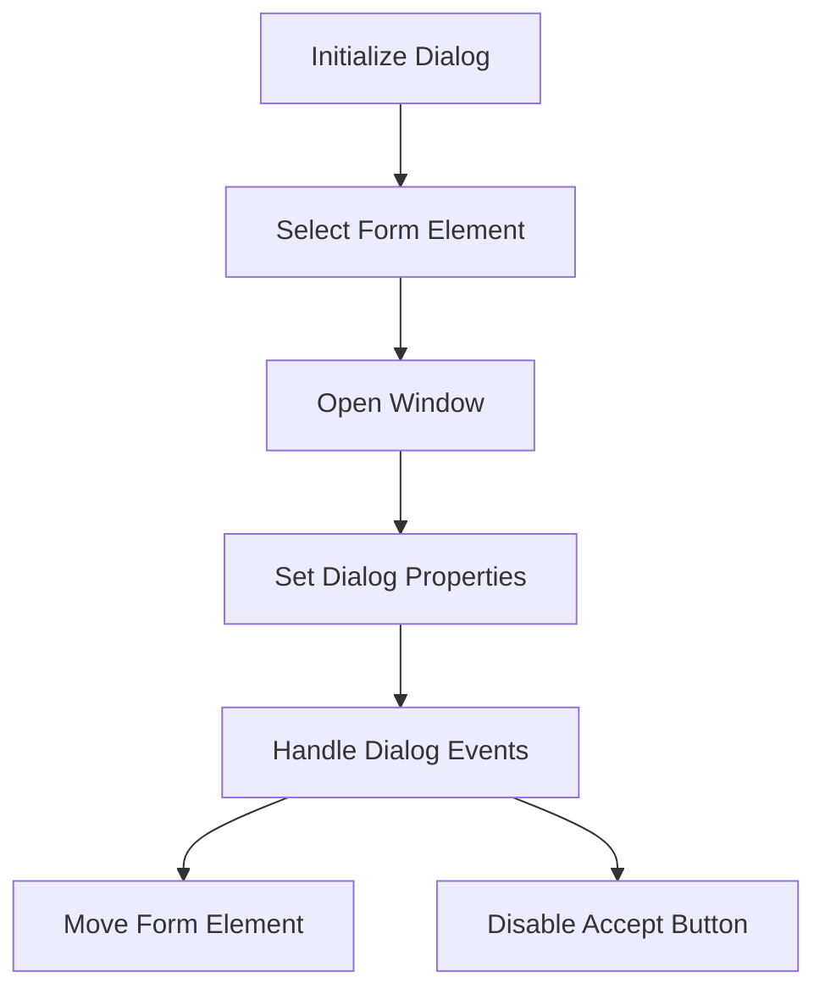

# Dialog Initialization

Dialogs are used to present information or gather input from the user in a modal window. The <SwmToken path="resources/modules/ext.MWOAuth.AuthorizeDialog.js" pos="10:1:1" line-data="		init: function () {">`init`</SwmToken> function initializes the dialog by selecting the form element with the ID <SwmToken path="resources/modules/ext.MWOAuth.AuthorizeDialog.js" pos="11:13:19" line-data="			var $form = $( &#39;#mw-mwoauth-authorize-form&#39; );">`mw-mwoauth-authorize-form`</SwmToken> and opening a window using the <SwmToken path="resources/modules/ext.MWOAuth.AuthorizeDialog.js" pos="13:1:9" line-data="			OO.ui.getWindowManager().openWindow( &#39;message&#39;, {">`OO.ui.getWindowManager().openWindow`</SwmToken> method.

<SwmSnippet path="/resources/modules/ext.MWOAuth.AuthorizeDialog.js" line="10">

---

The <SwmToken path="resources/modules/ext.MWOAuth.AuthorizeDialog.js" pos="10:1:1" line-data="		init: function () {">`init`</SwmToken> function initializes the dialog by selecting the form element with the ID <SwmToken path="resources/modules/ext.MWOAuth.AuthorizeDialog.js" pos="11:13:19" line-data="			var $form = $( &#39;#mw-mwoauth-authorize-form&#39; );">`mw-mwoauth-authorize-form`</SwmToken> and opening a window using the <SwmToken path="resources/modules/ext.MWOAuth.AuthorizeDialog.js" pos="13:1:9" line-data="			OO.ui.getWindowManager().openWindow( &#39;message&#39;, {">`OO.ui.getWindowManager().openWindow`</SwmToken> method.

```javascript
		init: function () {
			var $form = $( '#mw-mwoauth-authorize-form' );

			OO.ui.getWindowManager().openWindow( 'message', {
```

---

</SwmSnippet>

# Setting Dialog Properties

The <SwmToken path="resources/modules/ext.MWOAuth.AuthorizeDialog.js" pos="13:13:13" line-data="			OO.ui.getWindowManager().openWindow( &#39;message&#39;, {">`message`</SwmToken> property of the dialog is set to the form element, which will be displayed within the dialog. The <SwmToken path="resources/modules/ext.MWOAuth.AuthorizeDialog.js" pos="16:1:1" line-data="				actions: []">`actions`</SwmToken> property is an empty array, indicating that no additional actions are provided for the dialog.

<SwmSnippet path="/resources/modules/ext.MWOAuth.AuthorizeDialog.js" line="13">

---

The <SwmToken path="resources/modules/ext.MWOAuth.AuthorizeDialog.js" pos="13:13:13" line-data="			OO.ui.getWindowManager().openWindow( &#39;message&#39;, {">`message`</SwmToken> property is set to the form element, and the <SwmToken path="resources/modules/ext.MWOAuth.AuthorizeDialog.js" pos="16:1:1" line-data="				actions: []">`actions`</SwmToken> property is an empty array.

```javascript
			OO.ui.getWindowManager().openWindow( 'message', {
				message: $form,
				size: 'medium',
				actions: []
			} ).opened.then( function () {
```

---

</SwmSnippet>

# Handling Dialog Events

Once the dialog is opened, the form element is moved out of the label to ensure the entire form is not a click target for the 'Allow' button. The form's submit event is handled to disable the 'Accept' button upon submission, preventing multiple submissions.

<SwmSnippet path="/resources/modules/ext.MWOAuth.AuthorizeDialog.js" line="17">

---

The form element is moved out of the label, and the form's submit event is handled to disable the 'Accept' button upon submission.

```javascript
			} ).opened.then( function () {
				// Appending the <form> to a <label> makes the whole form a click target
				// for 'Allow', so move it out of the <label>
				OO.ui.getWindowManager().getCurrentWindow().text.$element.append( $form );
			} );

			$form.on( 'submit', function () {
				$( '#mw-mwoauth-accept' ).prop( 'disabled', true );
			} );
```

---

</SwmSnippet>

&nbsp;

*This is an auto-generated document by Swimm AI 🌊 and has not yet been verified by a human*

<SwmMeta version="3.0.0" repo-id="Z2l0aHViJTNBJTNBbWVkaWF3aWtpLWV4dGVuc2lvbnMtT0F1dGglM0ElM0FTd2ltbS1EZW1v" repo-name="mediawiki-extensions-OAuth"><sup>Powered by [Swimm](/)</sup></SwmMeta>
