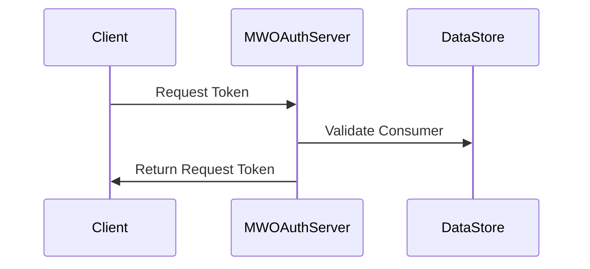

# Getting Started with <SwmToken path="src/Backend/MWOAuthServer.php" pos="11:2:2" line-data="class MWOAuthServer extends OAuthServer {">`MWOAuthServer`</SwmToken>

The <SwmToken path="src/Backend/MWOAuthServer.php" pos="11:2:2" line-data="class MWOAuthServer extends OAuthServer {">`MWOAuthServer`</SwmToken> class extends the <SwmToken path="src/Backend/MWOAuthServer.php" pos="27:18:18" line-data="	 * also checks the IP restriction, which the OAuthServer method did not.">`OAuthServer`</SwmToken> class, providing additional functionality specific to MediaWiki's `OAuth` implementation. It manages the `OAuth` flow by handling request tokens, access tokens, and verifying requests.

## Why <SwmToken path="src/Backend/MWOAuthServer.php" pos="11:2:2" line-data="class MWOAuthServer extends OAuthServer {">`MWOAuthServer`</SwmToken> is Used

<SwmToken path="src/Backend/MWOAuthServer.php" pos="11:2:2" line-data="class MWOAuthServer extends OAuthServer {">`MWOAuthServer`</SwmToken> is used to manage the `OAuth` flow by handling request tokens, access tokens, and verifying requests. It provides additional functionality specific to MediaWiki's `OAuth` implementation, ensuring that the `OAuth` process is secure and follows the required protocols.

## Where <SwmToken path="src/Backend/MWOAuthServer.php" pos="11:2:2" line-data="class MWOAuthServer extends OAuthServer {">`MWOAuthServer`</SwmToken> is Used

<SwmSnippet path="/src/Backend/Utils.php" line="238">

---

In <SwmPath>[src/Backend/Utils.php](/src/Backend/Utils.php)</SwmPath> there is a wrapper function that creates a new instance of the <SwmToken path="src/Backend/MWOAuthServer.php" pos="11:2:2" line-data="class MWOAuthServer extends OAuthServer {">`MWOAuthServer`</SwmToken> class with default configurations.

This function is used in <SwmPath>[src/Frontend/SpecialPages/SpecialMWOAuth.php](/src/Frontend/SpecialPages/SpecialMWOAuth.php)</SwmPath> <SwmToken path="/src/Frontend/SpecialPages/SpecialMWOAuth.php" pos="96:5:5" line-data="	public function execute( $subpage ) {">`execute`</SwmToken> function to get the new instance.

```hack
	public static function newMWOAuthServer() {
		$store = static::newMWOAuthDataStore();
		$server = new MWOAuthServer( $store );
		$server->add_signature_method( new OAuthSignatureMethodHmacSha1() );
		$server->add_signature_method( new MWOAuthSignatureMethodRsaSha1( $store ) );

		return $server;
	}
```

---

</SwmSnippet>

## Main Functions

There are several main functions in this class. Some of them are <SwmToken path="src/Backend/MWOAuthServer.php" pos="33:5:5" line-data="	public function fetch_request_token( &amp;$request ) {">`fetch_request_token`</SwmToken>, <SwmToken path="src/Backend/MWOAuthServer.php" pos="77:4:4" line-data="		$this-&gt;checkCallback( $consumer, $callback );">`checkCallback`</SwmToken>, and <SwmToken path="src/Backend/MWOAuthServer.php" pos="239:5:5" line-data="	public function fetch_access_token( &amp;$request ) {">`fetch_access_token`</SwmToken>. We will dive a little into these methods.

<SwmSnippet path="src/Backend/MWOAuthServer.php" line="33">

---

### <SwmToken path="src/Backend/MWOAuthServer.php" pos="33:5:5" line-data="	public function fetch_request_token( &amp;$request ) {">`fetch_request_token`</SwmToken>

The <SwmToken path="src/Backend/MWOAuthServer.php" pos="33:5:5" line-data="	public function fetch_request_token( &amp;$request ) {">`fetch_request_token`</SwmToken> method processes a request token request, ensuring the consumer is valid and checking IP restrictions. It also verifies the consumer's key and callback URL, and generates a new request token.

```
	public function fetch_request_token( &$request ) {
		$this->get_version( $request );

		/** @var Consumer $consumer */
		$consumer = $this->get_consumer( $request );

		// Consumer must not be owner-only
		if ( $consumer->getOwnerOnly() ) {
			throw new MWOAuthException( 'mwoauthserver-consumer-owner-only', [
				'consumer_name' => $consumer->getName(),
				'update_url' => SpecialPage::getTitleFor(
					'OAuthConsumerRegistration', 'update/' . $consumer->getConsumerKey()
				),
				Message::rawParam( Linker::makeExternalLink(
					'https://www.mediawiki.org/wiki/Help:OAuth/Errors#E010',
					'E010',
					true
				) ),
				'consumer' => $consumer->getConsumerKey(),
```

---

</SwmSnippet>

<SwmSnippet path="src/Backend/MWOAuthServer.php" line="239">

---

### <SwmToken path="src/Backend/MWOAuthServer.php" pos="239:5:5" line-data="	public function fetch_access_token( &amp;$request ) {">`fetch_access_token`</SwmToken>

The <SwmToken path="src/Backend/MWOAuthServer.php" pos="239:5:5" line-data="	public function fetch_access_token( &amp;$request ) {">`fetch_access_token`</SwmToken> method processes an access token request, verifying the consumer and the request token. It ensures the request comes from an approved IP address and checks the signature of the request.

```
	public function fetch_access_token( &$request ) {
		$this->get_version( $request );

		/** @var Consumer $consumer */
		$consumer = $this->get_consumer( $request );

		// Consumer must not be owner-only
		if ( $consumer->getOwnerOnly() ) {
			throw new MWOAuthException( 'mwoauthserver-consumer-owner-only', [
				'consumer_name' => $consumer->getName(),
				'update_url' => SpecialPage::getTitleFor(
					'OAuthConsumerRegistration', 'update/' . $consumer->getConsumerKey()
				),
				Message::rawParam( Linker::makeExternalLink(
					'https://www.mediawiki.org/wiki/Help:OAuth/Errors#E010',
					'E010',
					true
				) ),
				'consumer' => $consumer->getConsumerKey(),
```

---

</SwmSnippet>



&nbsp;

_This is an auto-generated document by Swimm 🌊 and has not yet been verified by a human_

<SwmMeta version="3.0.0" repo-id="Z2l0aHViJTNBJTNBbWVkaWF3aWtpLWV4dGVuc2lvbnMtT0F1dGglM0ElM0FTd2ltbS1EZW1v" repo-name="mediawiki-extensions-OAuth"><sup>Powered by [Swimm](https://app.swimm.io/)</sup></SwmMeta>
