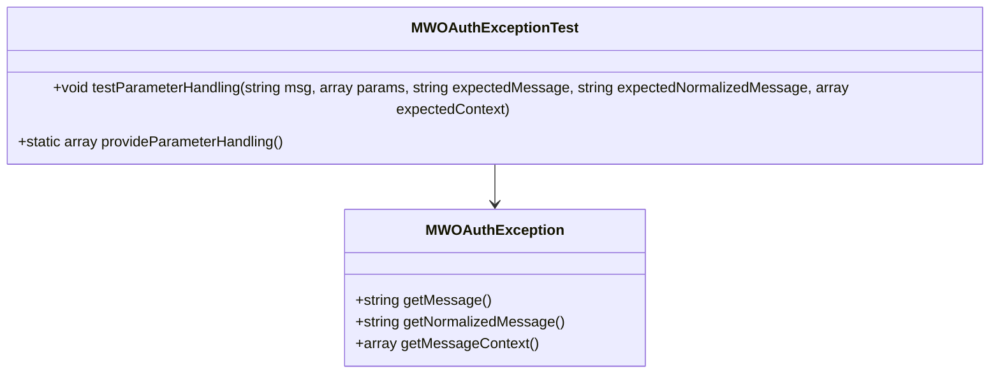

# Getting Started with <SwmToken path="src/Backend/MWOAuthException.php" pos="3:6:6" line-data="namespace MediaWiki\Extension\OAuth\Backend;">`OAuth`</SwmToken> Exception Handling

<SwmToken path="src/Backend/MWOAuthException.php" pos="3:6:6" line-data="namespace MediaWiki\Extension\OAuth\Backend;">`OAuth`</SwmToken> Exceptions are custom exceptions used to handle error scenarios specific to the <SwmToken path="src/Backend/MWOAuthException.php" pos="3:6:6" line-data="namespace MediaWiki\Extension\OAuth\Backend;">`OAuth`</SwmToken> extension. These exceptions provide detailed error messages and context to help identify and resolve issues during the <SwmToken path="src/Backend/MWOAuthException.php" pos="3:6:6" line-data="namespace MediaWiki\Extension\OAuth\Backend;">`OAuth`</SwmToken> authentication and authorization processes.

## <SwmToken path="tests/phpunit/Backend/MWOAuthExceptionTest.php" pos="24:8:8" line-data="		$exception = new MWOAuthException( $msg, $params );">`MWOAuthException`</SwmToken> Class

The <SwmToken path="tests/phpunit/Backend/MWOAuthExceptionTest.php" pos="24:8:8" line-data="		$exception = new MWOAuthException( $msg, $params );">`MWOAuthException`</SwmToken> class is a key component, encapsulating error messages and parameters to generate meaningful error responses. It is used to handle error scenarios specific to the <SwmToken path="src/Backend/MWOAuthException.php" pos="3:6:6" line-data="namespace MediaWiki\Extension\OAuth\Backend;">`OAuth`</SwmToken> extension.

<SwmSnippet path="/src/Backend/MWOAuthException.php" line="1">

---

The <SwmToken path="tests/phpunit/Backend/MWOAuthExceptionTest.php" pos="24:8:8" line-data="		$exception = new MWOAuthException( $msg, $params );">`MWOAuthException`</SwmToken> class encapsulates error messages and parameters to generate meaningful error responses. It is a key component in handling error scenarios specific to the <SwmToken path="src/Backend/MWOAuthException.php" pos="3:6:6" line-data="namespace MediaWiki\Extension\OAuth\Backend;">`OAuth`</SwmToken> extension.

```hack
<?php

namespace MediaWiki\Extension\OAuth\Backend;

use ILocalizedException;
use MediaWiki\Extension\OAuth\Lib\OAuthException;
use MediaWiki\Message\Message;
use Wikimedia\NormalizedException\INormalizedException;

/**
```

---

</SwmSnippet>

<SwmSnippet path="/tests/phpunit/Backend/MWOAuthExceptionTest.php" line="12">

---

The <SwmToken path="tests/phpunit/Backend/MWOAuthExceptionTest.php" pos="17:5:5" line-data="	public function testParameterHandling(">`testParameterHandling`</SwmToken> function verifies that the <SwmToken path="tests/phpunit/Backend/MWOAuthExceptionTest.php" pos="24:8:8" line-data="		$exception = new MWOAuthException( $msg, $params );">`MWOAuthException`</SwmToken> correctly handles different error messages and contexts. It ensures that the exception handling works as expected by comparing the generated messages and context with the expected values.

```hack
class MWOAuthExceptionTest extends MediaWikiIntegrationTestCase {

	/**
	 * @dataProvider provideParameterHandling
	 */
	public function testParameterHandling(
		string $msg,
		array $params,
		string $expectedMessage,
		string $expectedNormalizedMessage,
		array $expectedContext
	) {
		$exception = new MWOAuthException( $msg, $params );
		$this->assertSame( $expectedMessage, $exception->getMessage() );
		$this->assertSame( $expectedNormalizedMessage, $exception->getNormalizedMessage() );
		$this->assertSame( $expectedContext, $exception->getMessageContext() );
	}
```

---

</SwmSnippet>

## Data Provider for Parameter Handling

The <SwmToken path="tests/phpunit/Backend/MWOAuthExceptionTest.php" pos="15:6:6" line-data="	 * @dataProvider provideParameterHandling">`provideParameterHandling`</SwmToken> function provides various test cases for the <SwmToken path="tests/phpunit/Backend/MWOAuthExceptionTest.php" pos="17:5:5" line-data="	public function testParameterHandling(">`testParameterHandling`</SwmToken> function. It includes different scenarios with empty parameters, numeric keys, named keys, and mixed keys to ensure comprehensive testing of the <SwmToken path="tests/phpunit/Backend/MWOAuthExceptionTest.php" pos="24:8:8" line-data="		$exception = new MWOAuthException( $msg, $params );">`MWOAuthException`</SwmToken>.

<SwmSnippet path="/tests/phpunit/Backend/MWOAuthExceptionTest.php" line="30">

---

The <SwmToken path="tests/phpunit/Backend/MWOAuthExceptionTest.php" pos="30:7:7" line-data="	public static function provideParameterHandling() {">`provideParameterHandling`</SwmToken> method supplies various scenarios to test the <SwmToken path="tests/phpunit/Backend/MWOAuthExceptionTest.php" pos="24:8:8" line-data="		$exception = new MWOAuthException( $msg, $params );">`MWOAuthException`</SwmToken> class, ensuring it handles different error messages and contexts appropriately.

```hack
	public static function provideParameterHandling() {
		return [
			'empty' => [
				'msg' => 'mwoauth-invalid-field-generic',
				'params' => [],
				'expectedMessage' => 'Invalid value provided',
				'expectedNormalizedMessage' => 'Invalid value provided',
				'expectedContext' => [],
			],
			'numeric key' => [
				'msg' => 'mwoauth-missing-field',
				'params' => [ 'name' ],
				'expectedMessage' => 'Missing value for "name" field',
				'expectedNormalizedMessage' => 'Missing value for "name" field',
				'expectedContext' => [],
			],
			'named key' => [
				'msg' => 'mwoauth-missing-field',
				'params' => [ 'fieldname' => 'name' ],
				'expectedMessage' => 'Missing value for "name" field',
				'expectedNormalizedMessage' => 'Missing value for "{fieldname}" field',
```

---

</SwmSnippet>

&nbsp;

*This is an auto-generated document by Swimm AI 🌊 and has not yet been verified by a human*

<SwmMeta version="3.0.0" repo-id="Z2l0aHViJTNBJTNBbWVkaWF3aWtpLWV4dGVuc2lvbnMtT0F1dGglM0ElM0FTd2ltbS1EZW1v" repo-name="mediawiki-extensions-OAuth"><sup>Powered by [Swimm](/)</sup></SwmMeta>
