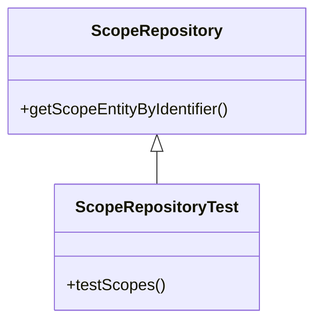

## Overview

The <SwmToken path="tests/phpunit/Repository/ScopeRepositoryTest.php" pos="15:8:8" line-data="		$repo = new ScopeRepository();">`ScopeRepository`</SwmToken> is responsible for managing <SwmToken path="src/Repository/ScopeRepository.php" pos="3:6:6" line-data="namespace MediaWiki\Extension\OAuth\Repository;">`OAuth`</SwmToken> scopes within the <SwmToken path="src/Repository/ScopeRepository.php" pos="3:2:2" line-data="namespace MediaWiki\Extension\OAuth\Repository;">`MediaWiki`</SwmToken> extension. It provides methods to retrieve scope entities based on their identifiers. The primary function of <SwmToken path="tests/phpunit/Repository/ScopeRepositoryTest.php" pos="15:8:8" line-data="		$repo = new ScopeRepository();">`ScopeRepository`</SwmToken> is to validate and fetch scope entities, ensuring that only valid scopes are used in <SwmToken path="src/Repository/ScopeRepository.php" pos="3:6:6" line-data="namespace MediaWiki\Extension\OAuth\Repository;">`OAuth`</SwmToken> operations.

## <SwmToken path="tests/phpunit/Repository/ScopeRepositoryTest.php" pos="15:8:8" line-data="		$repo = new ScopeRepository();">`ScopeRepository`</SwmToken> Usage

In the test file <SwmPath>[tests/phpunit/Repository/ScopeRepositoryTest.php](tests/phpunit/Repository/ScopeRepositoryTest.php)</SwmPath>, <SwmToken path="tests/phpunit/Repository/ScopeRepositoryTest.php" pos="15:8:8" line-data="		$repo = new ScopeRepository();">`ScopeRepository`</SwmToken> is instantiated and its method <SwmToken path="tests/phpunit/Repository/ScopeRepositoryTest.php" pos="18:9:9" line-data="			ScopeEntity::class, $repo-&gt;getScopeEntityByIdentifier( &#39;editpage&#39; ),">`getScopeEntityByIdentifier`</SwmToken> is tested to verify that it correctly identifies valid and invalid scopes.

<SwmSnippet path="/tests/phpunit/Repository/ScopeRepositoryTest.php" line="14">

---

The test function <SwmToken path="tests/phpunit/Repository/ScopeRepositoryTest.php" pos="14:5:5" line-data="	public function testScopes() {">`testScopes`</SwmToken> demonstrates how to instantiate <SwmToken path="tests/phpunit/Repository/ScopeRepositoryTest.php" pos="15:8:8" line-data="		$repo = new ScopeRepository();">`ScopeRepository`</SwmToken> and test its <SwmToken path="tests/phpunit/Repository/ScopeRepositoryTest.php" pos="18:9:9" line-data="			ScopeEntity::class, $repo-&gt;getScopeEntityByIdentifier( &#39;editpage&#39; ),">`getScopeEntityByIdentifier`</SwmToken> method. This ensures that valid scope identifiers return a <SwmToken path="tests/phpunit/Repository/ScopeRepositoryTest.php" pos="18:1:1" line-data="			ScopeEntity::class, $repo-&gt;getScopeEntityByIdentifier( &#39;editpage&#39; ),">`ScopeEntity`</SwmToken> object, while invalid identifiers do not.

```hack
	public function testScopes() {
		$repo = new ScopeRepository();

		$this->assertInstanceOf(
			ScopeEntity::class, $repo->getScopeEntityByIdentifier( 'editpage' ),
			'Scope \"editpage\" should be a valid scope'
		);
		$this->assertInstanceOf(
			ScopeEntity::class, $repo->getScopeEntityByIdentifier( 'mwoauth-authonlyprivate' ),
			'Scope \"mwoauth-authonlyprivate\" should be a valid scope'
		);

		$this->assertNotInstanceOf(
			ScopeEntity::class, $repo->getScopeEntityByIdentifier( 'dummynonexistent' ),
			'Scope \"dummynonexistent\" should not be a valid scope'
		);
	}
```

---

</SwmSnippet>

## Main Functions

There are several main functions in <SwmToken path="tests/phpunit/Repository/ScopeRepositoryTest.php" pos="15:8:8" line-data="		$repo = new ScopeRepository();">`ScopeRepository`</SwmToken>. One of the key functions is <SwmToken path="tests/phpunit/Repository/ScopeRepositoryTest.php" pos="18:9:9" line-data="			ScopeEntity::class, $repo-&gt;getScopeEntityByIdentifier( &#39;editpage&#39; ),">`getScopeEntityByIdentifier`</SwmToken>.

### <SwmToken path="tests/phpunit/Repository/ScopeRepositoryTest.php" pos="18:9:9" line-data="			ScopeEntity::class, $repo-&gt;getScopeEntityByIdentifier( &#39;editpage&#39; ),">`getScopeEntityByIdentifier`</SwmToken>

The <SwmToken path="tests/phpunit/Repository/ScopeRepositoryTest.php" pos="18:9:9" line-data="			ScopeEntity::class, $repo-&gt;getScopeEntityByIdentifier( &#39;editpage&#39; ),">`getScopeEntityByIdentifier`</SwmToken> function is used to retrieve a scope entity based on its identifier. This function ensures that only valid scopes are used in <SwmToken path="src/Repository/ScopeRepository.php" pos="3:6:6" line-data="namespace MediaWiki\Extension\OAuth\Repository;">`OAuth`</SwmToken> operations by returning a <SwmToken path="tests/phpunit/Repository/ScopeRepositoryTest.php" pos="18:1:1" line-data="			ScopeEntity::class, $repo-&gt;getScopeEntityByIdentifier( &#39;editpage&#39; ),">`ScopeEntity`</SwmToken> object if the identifier is valid, or null if it is not. This is essential for maintaining the integrity and security of <SwmToken path="src/Repository/ScopeRepository.php" pos="3:6:6" line-data="namespace MediaWiki\Extension\OAuth\Repository;">`OAuth`</SwmToken> scopes within the <SwmToken path="src/Repository/ScopeRepository.php" pos="3:2:2" line-data="namespace MediaWiki\Extension\OAuth\Repository;">`MediaWiki`</SwmToken> extension.

<SwmSnippet path="/src/Repository/ScopeRepository.php" line="1">

---

The <SwmToken path="src/Repository/ScopeRepository.php" pos="16:2:2" line-data="class ScopeRepository implements ScopeRepositoryInterface {">`ScopeRepository`</SwmToken> class implements the <SwmToken path="src/Repository/ScopeRepository.php" pos="7:10:10" line-data="use League\OAuth2\Server\Repositories\ScopeRepositoryInterface;">`ScopeRepositoryInterface`</SwmToken> and defines the <SwmToken path="tests/phpunit/Repository/ScopeRepositoryTest.php" pos="18:9:9" line-data="			ScopeEntity::class, $repo-&gt;getScopeEntityByIdentifier( &#39;editpage&#39; ),">`getScopeEntityByIdentifier`</SwmToken> method. This method is crucial for validating and fetching scope entities.

```hack
<?php

namespace MediaWiki\Extension\OAuth\Repository;

use League\OAuth2\Server\Entities\ClientEntityInterface;
use League\OAuth2\Server\Entities\ScopeEntityInterface;
use League\OAuth2\Server\Repositories\ScopeRepositoryInterface;
use MediaWiki\Extension\OAuth\Backend\MWOAuthException;
use MediaWiki\Extension\OAuth\Backend\Utils;
use MediaWiki\Extension\OAuth\Entity\ClientEntity;
use MediaWiki\Extension\OAuth\Entity\ScopeEntity;
use MediaWiki\Extension\OAuth\Entity\UserEntity;
use MediaWiki\MediaWikiServices;
use MediaWiki\WikiMap\WikiMap;

class ScopeRepository implements ScopeRepositoryInterface {
	/**
	 * @var string[]
	 */
	protected $allowedScopes = [
		'#default',
```

---

</SwmSnippet>

## Test for <SwmToken path="tests/phpunit/Repository/ScopeRepositoryTest.php" pos="18:9:9" line-data="			ScopeEntity::class, $repo-&gt;getScopeEntityByIdentifier( &#39;editpage&#39; ),">`getScopeEntityByIdentifier`</SwmToken>

In the test file <SwmPath>[tests/phpunit/Repository/ScopeRepositoryTest.php](tests/phpunit/Repository/ScopeRepositoryTest.php)</SwmPath>, the <SwmToken path="tests/phpunit/Repository/ScopeRepositoryTest.php" pos="18:9:9" line-data="			ScopeEntity::class, $repo-&gt;getScopeEntityByIdentifier( &#39;editpage&#39; ),">`getScopeEntityByIdentifier`</SwmToken> method is tested to verify its functionality. The test checks that valid scope identifiers return a <SwmToken path="tests/phpunit/Repository/ScopeRepositoryTest.php" pos="18:1:1" line-data="			ScopeEntity::class, $repo-&gt;getScopeEntityByIdentifier( &#39;editpage&#39; ),">`ScopeEntity`</SwmToken> object, while invalid identifiers do not. This ensures that the <SwmToken path="tests/phpunit/Repository/ScopeRepositoryTest.php" pos="18:9:9" line-data="			ScopeEntity::class, $repo-&gt;getScopeEntityByIdentifier( &#39;editpage&#39; ),">`getScopeEntityByIdentifier`</SwmToken> method works as expected and only valid scopes are used.

&nbsp;

*This is an auto-generated document by Swimm AI 🌊 and has not yet been verified by a human*

<SwmMeta version="3.0.0" repo-id="Z2l0aHViJTNBJTNBbWVkaWF3aWtpLWV4dGVuc2lvbnMtT0F1dGglM0ElM0FTd2ltbS1EZW1v" repo-name="mediawiki-extensions-OAuth"><sup>Powered by [Swimm](/)</sup></SwmMeta>
