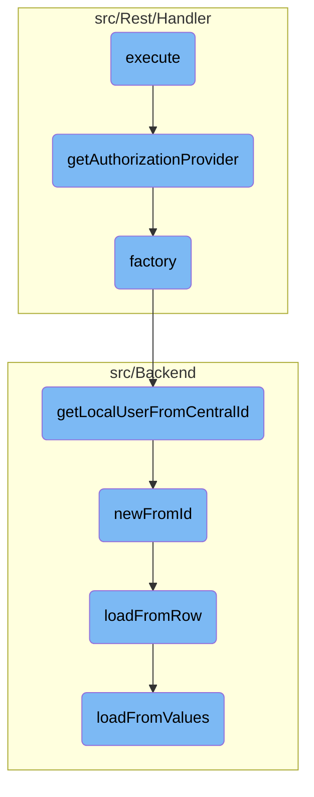

This document explains the process of handling an authorization request. The process involves initiating the request, retrieving the authorization provider, and managing user data.

The flow starts by creating a new response object and handling any queued errors. It then retrieves the authorization provider and attempts to get access tokens. If any exceptions occur, they are caught and handled appropriately. The authorization provider is determined by the grant type, and the corresponding grant class is used to get an instance of the authorization provider. The user data is retrieved using the central ID and local user information, and the user data is loaded from the database.

# Flow drill down



<SwmSnippet path="/src/Rest/Handler/AccessToken.php" line="38">

---

## Handling the Authorization Provider

The <SwmToken path="src/Rest/Handler/AccessToken.php" pos="38:5:5" line-data="	public function execute() {">`execute`</SwmToken> function initiates the process by creating a new <SwmToken path="src/Rest/Handler/AccessToken.php" pos="39:2:2" line-data="		$response = new Response();">`response`</SwmToken> object and handling any queued errors. It then retrieves the authorization provider using the <SwmToken path="src/Rest/Handler/AccessToken.php" pos="49:9:9" line-data="			$authProvider = $this-&gt;getAuthorizationProvider();">`getAuthorizationProvider`</SwmToken> function and attempts to get access tokens. If any exceptions occur, they are caught and handled appropriately.

```hack
	public function execute() {
		$response = new Response();

		try {
			if ( $this->queuedError ) {
				throw $this->queuedError;
			}
			$request = ServerRequest::fromGlobals()->withParsedBody(
				$this->getValidatedBody()
			);

			$authProvider = $this->getAuthorizationProvider();
			return $authProvider->getAccessTokens( $request, $response );
		} catch ( OAuthServerException $exception ) {
			return $this->errorResponse( $exception, $response );
		} catch ( Throwable $exception ) {
			MWExceptionHandler::logException( $exception );
			return $this->errorResponse(
				OAuthServerException::serverError( $exception->getMessage(), $exception ),
				$response
			);
```

---

</SwmSnippet>

<SwmSnippet path="/src/Rest/Handler/AuthenticationHandler.php" line="83">

---

## Retrieving the Authorization Provider

The <SwmToken path="src/Rest/Handler/AuthenticationHandler.php" pos="83:5:5" line-data="	protected function getAuthorizationProvider() {">`getAuthorizationProvider`</SwmToken> function determines the grant type and retrieves the corresponding grant class. It then calls the <SwmToken path="src/Rest/Handler/AuthenticationHandler.php" pos="87:21:21" line-data="		if ( !$class || !is_callable( [ $class, &#39;factory&#39; ] ) ) {">`factory`</SwmToken> method of the grant class to get an instance of the authorization provider.

```hack
	protected function getAuthorizationProvider() {
		$grantType = $this->getGrantType();

		$class = $this->getGrantClass( $grantType );
		if ( !$class || !is_callable( [ $class, 'factory' ] ) ) {
			throw new LogicException( 'Could not find grant class factory' );
		}

		/** @var AccessTokenProvider|AuthorizationCodeAuthorization $authProvider */
		$authProvider = $class::factory();
		'@phan-var AccessTokenProvider|AuthorizationCodeAuthorization $authProvider';
		return $authProvider;
	}
```

---

</SwmSnippet>

<SwmSnippet path="/src/Rest/Handler/AuthenticationHandler.php" line="44">

---

### Creating the Authorization Provider

The <SwmToken path="src/Rest/Handler/AuthenticationHandler.php" pos="44:7:7" line-data="	public static function factory() {">`factory`</SwmToken> function creates an instance of <SwmToken path="src/Rest/Handler/AccessToken.php" pos="19:6:6" line-data="class AccessToken extends AuthenticationHandler {">`AuthenticationHandler`</SwmToken> by retrieving the central ID of the current user and getting the local user from the central ID. It also fetches the configuration for <SwmToken path="src/Rest/Handler/AccessToken.php" pos="3:6:6" line-data="namespace MediaWiki\Extension\OAuth\Rest\Handler;">`OAuth`</SwmToken>.

```hack
	public static function factory() {
		$centralId = Utils::getCentralIdFromLocalUser( RequestContext::getMain()->getUser() );
		$user = $centralId ? Utils::getLocalUserFromCentralId( $centralId ) : User::newFromId( 0 );
		$config = MediaWikiServices::getInstance()->getConfigFactory()->makeConfig( 'mwoauth' );
		// @phan-suppress-next-line PhanTypeInstantiateAbstractStatic
		return new static( $user, $config );
```

---

</SwmSnippet>

<SwmSnippet path="/src/Backend/Utils.php" line="301">

---

## Retrieving the Local User

The <SwmToken path="src/Backend/Utils.php" pos="301:7:7" line-data="	public static function getLocalUserFromCentralId( $userId ) {">`getLocalUserFromCentralId`</SwmToken> function retrieves a local <SwmToken path="src/Backend/Utils.php" pos="309:2:2" line-data="			$user = $lookup-&gt;localUserFromCentralId( $userId );">`user`</SwmToken> object given a central wiki user ID. It uses the central ID lookup service to find the local user and ensures the user is attached.

```hack
	public static function getLocalUserFromCentralId( $userId ) {
		global $wgMWOAuthSharedUserIDs, $wgMWOAuthSharedUserSource;

		// global ID required via hook
		if ( $wgMWOAuthSharedUserIDs ) {
			$lookup = MediaWikiServices::getInstance()
				->getCentralIdLookupFactory()
				->getLookup( $wgMWOAuthSharedUserSource );
			$user = $lookup->localUserFromCentralId( $userId );
			if ( $user === null || !$lookup->isAttached( $user ) ) {
				return false;
			}
			return User::newFromIdentity( $user );
		}

		return User::newFromId( $userId );
	}
```

---

</SwmSnippet>

<SwmSnippet path="/src/Backend/MWOAuthDAO.php" line="103">

---

## Loading User Data

The <SwmToken path="src/Backend/MWOAuthDAO.php" pos="103:9:9" line-data="	final public static function newFromId( IDatabase $db, $id, $flags = 0 ) {">`newFromId`</SwmToken> function retrieves a user record from the database using the user ID. It then creates an instance of the user class and loads the user data from the database row.

```hack
	final public static function newFromId( IDatabase $db, $id, $flags = 0 ) {
		$queryBuilder = $db->newSelectQueryBuilder()
			->select( array_values( static::getFieldColumnMap() ) )
			->from( static::getTable() )
			->where( [ static::getIdColumn() => (int)$id ] )
			->caller( __METHOD__ );
		if ( $flags & IDBAccessObject::READ_LOCKING ) {
			$queryBuilder->forUpdate();
		}
		$row = $queryBuilder->fetchRow();

		if ( $row ) {
			$class = static::getConsumerClass( (array)$row );
			$consumer = new $class();
			$consumer->loadFromRow( $db, $row );
			return $consumer;
		} else {
			return false;
		}
	}
```

---

</SwmSnippet>

<SwmSnippet path="/src/Backend/MWOAuthDAO.php" line="380">

---

### Loading Data from Database Row

The <SwmToken path="src/Backend/MWOAuthDAO.php" pos="380:7:7" line-data="	final protected function loadFromRow( IDatabase $db, $row ) {">`loadFromRow`</SwmToken> function decodes the database row and maps the values to the user object fields. It then calls <SwmToken path="src/Backend/MWOAuthDAO.php" pos="386:4:4" line-data="		$this-&gt;loadFromValues( $values );">`loadFromValues`</SwmToken> to finalize the loading process.

```hack
	final protected function loadFromRow( IDatabase $db, $row ) {
		$row = $this->decodeRow( $db, (array)$row );
		$values = [];
		foreach ( static::getFieldColumnMap() as $field => $column ) {
			$values[$field] = $row[$column];
		}
		$this->loadFromValues( $values );
		$this->daoOrigin = 'db';
		$this->daoPending = false;
	}
```

---

</SwmSnippet>

<SwmSnippet path="/src/Backend/MWOAuthDAO.php" line="356">

---

### Finalizing Data Loading

The <SwmToken path="src/Backend/MWOAuthDAO.php" pos="356:7:7" line-data="	final protected function loadFromValues( array $values ) {">`loadFromValues`</SwmToken> function ensures all required fields are present in the values array and assigns them to the user object. It also normalizes the values and sets the origin and pending status of the data.

```hack
	final protected function loadFromValues( array $values ) {
		foreach ( static::getFieldColumnMap() as $field => $column ) {
			if ( !array_key_exists( $field, $values ) ) {
				throw new MWException( get_class( $this ) . " requires '$field' field." );
			}
			$this->$field = $values[$field];
		}
		$this->normalizeValues();
		$this->daoOrigin = 'new';
		$this->daoPending = true;
	}
```

---

</SwmSnippet>

&nbsp;

*This is an auto-generated document by Swimm AI 🌊 and has not yet been verified by a human*

<SwmMeta version="3.0.0" repo-id="Z2l0aHViJTNBJTNBbWVkaWF3aWtpLWV4dGVuc2lvbnMtT0F1dGglM0ElM0FTd2ltbS1EZW1v" repo-name="mediawiki-extensions-OAuth"><sup>Powered by [Swimm](/)</sup></SwmMeta>
