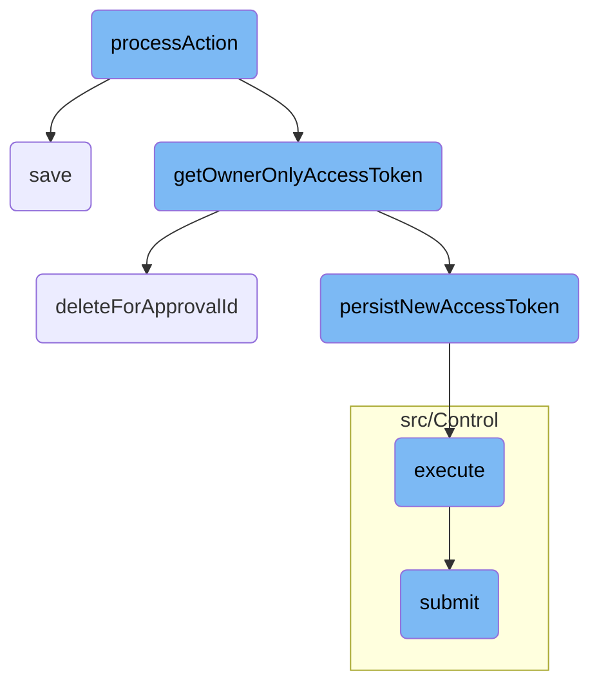
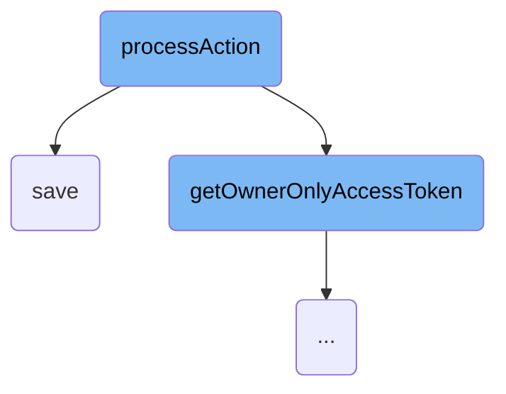
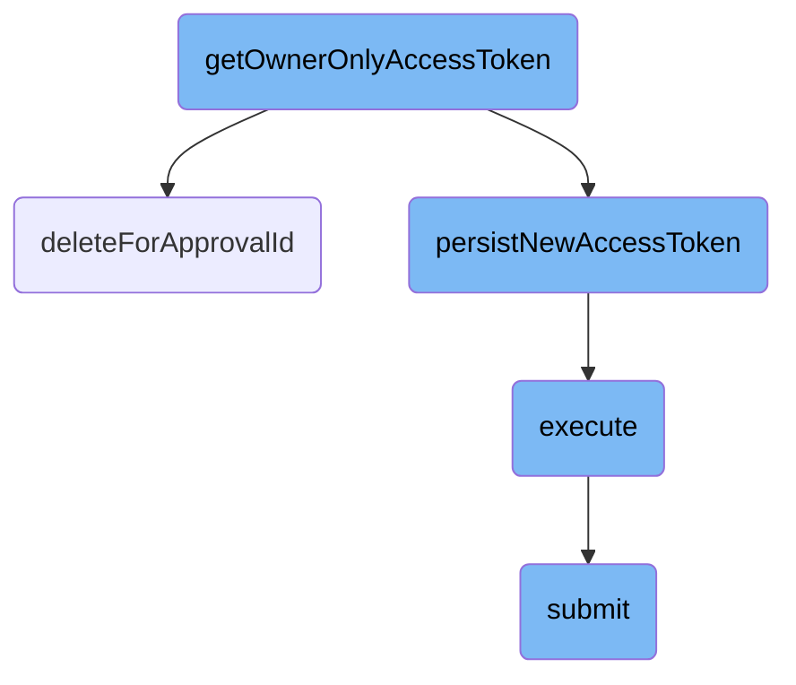

This document explains the flow of handling different actions for <SwmToken path="src/Control/ConsumerSubmitControl.php" pos="3:6:6" line-data="namespace MediaWiki\Extension\OAuth\Control;">`OAuth`</SwmToken> consumers. The process involves checking user permissions, validating input data, and performing actions such as proposing a new consumer, updating an existing one, or approving a consumer.

The flow starts by checking if the user has the necessary permissions and if their email is confirmed. If the user is proposing a new consumer, it checks if a consumer with the same name and version already exists. If not, it creates a new consumer record and logs the action. If the consumer is in <SwmToken path="src/Control/ConsumerSubmitControl.php" pos="286:5:7" line-data="				// Handle owner-only mode">`owner-only`</SwmToken> mode, it automatically accepts it for the user and generates an access token. The flow also includes saving consumer data to the database, generating an <SwmToken path="src/Control/ConsumerSubmitControl.php" pos="286:5:7" line-data="				// Handle owner-only mode">`owner-only`</SwmToken> access token, deleting existing tokens if required, and persisting the new access token.

Here is a high level diagram of the flow, showing only the most important functions:



# Flow drill down

First, we'll zoom into this section of the flow:



<SwmSnippet path="/src/Control/ConsumerSubmitControl.php" line="237">

---

## Handling Different Actions for <SwmToken path="src/Control/ConsumerSubmitControl.php" pos="3:6:6" line-data="namespace MediaWiki\Extension\OAuth\Control;">`OAuth`</SwmToken> Consumers

The <SwmToken path="src/Control/ConsumerSubmitControl.php" pos="237:5:5" line-data="	protected function processAction( $action ) {">`processAction`</SwmToken> function handles various actions related to <SwmToken path="src/Control/ConsumerSubmitControl.php" pos="3:6:6" line-data="namespace MediaWiki\Extension\OAuth\Control;">`OAuth`</SwmToken> consumers. It checks user permissions, validates input data, and performs actions such as proposing a new consumer, updating an existing one, or approving a consumer. For example, when proposing a new consumer, it checks if the user has the right permissions, if the email is confirmed, and if the consumer already exists. It then creates a new consumer record and logs the action.

```hack
	protected function processAction( $action ) {
		$context = $this->getContext();
		// proposer or admin
		$user = $this->getUser();
		$dbw = $this->dbw;

		$centralUserId = Utils::getCentralIdFromLocalUser( $user );
		if ( !$centralUserId ) {
			return $this->failure( 'permission_denied', 'badaccess-group0' );
		}

		$permissionManager = MediaWikiServices::getInstance()->getPermissionManager();

		switch ( $action ) {
			case 'propose':
				if ( !$permissionManager->userHasRight( $user, 'mwoauthproposeconsumer' ) ) {
					return $this->failure( 'permission_denied', 'badaccess-group0' );
				} elseif ( !$user->isEmailConfirmed() ) {
					return $this->failure( 'email_not_confirmed', 'mwoauth-consumer-email-unconfirmed' );
				} elseif ( $user->getEmail() !== $this->vals['email'] ) {
					// @TODO: allow any email and don't set emailAuthenticated below
```

---

</SwmSnippet>

<SwmSnippet path="/src/Control/ConsumerSubmitControl.php" line="251">

---

### Proposing a New Consumer

When proposing a new consumer, the function first checks if the user has the 'mwoauthproposeconsumer' right and if their email is confirmed. It then checks if a consumer with the same name and version already exists. If not, it creates a new consumer record with the provided details and logs the action. If the consumer is in <SwmToken path="src/Control/ConsumerSubmitControl.php" pos="286:5:7" line-data="				// Handle owner-only mode">`owner-only`</SwmToken> mode, it automatically accepts it for the user and generates an access token.

```hack
			case 'propose':
				if ( !$permissionManager->userHasRight( $user, 'mwoauthproposeconsumer' ) ) {
					return $this->failure( 'permission_denied', 'badaccess-group0' );
				} elseif ( !$user->isEmailConfirmed() ) {
					return $this->failure( 'email_not_confirmed', 'mwoauth-consumer-email-unconfirmed' );
				} elseif ( $user->getEmail() !== $this->vals['email'] ) {
					// @TODO: allow any email and don't set emailAuthenticated below
					return $this->failure( 'email_mismatched', 'mwoauth-consumer-email-mismatched' );
				}

				if ( Consumer::newFromNameVersionUser(
					$dbw, $this->vals['name'], $this->vals['version'], $centralUserId
				) ) {
					return $this->failure( 'consumer_exists', 'mwoauth-consumer-alreadyexists' );
				}

				$wikiNames = Utils::getAllWikiNames();
				$dbKey = array_search( $this->vals['wiki'], $wikiNames );
				if ( $dbKey !== false ) {
					$this->vals['wiki'] = $dbKey;
				}
```

---

</SwmSnippet>

<SwmSnippet path="/src/Backend/MWOAuthDAO.php" line="186">

---

## Saving Consumer Data

The <SwmToken path="src/Backend/MWOAuthDAO.php" pos="186:5:5" line-data="	public function save( IDatabase $dbw ) {">`save`</SwmToken> function in <SwmToken path="src/Backend/MWOAuthDAO.php" pos="40:4:4" line-data="abstract class MWOAuthDAO {">`MWOAuthDAO`</SwmToken> is responsible for saving consumer data to the database. It checks if the database is in <SwmToken path="src/Backend/MWOAuthDAO.php" pos="192:31:33" line-data="			throw new DBReadOnlyError( $dbw, __CLASS__ . &quot;: tried to save while db is read-only&quot; );">`read-only`</SwmToken> mode and then either updates an existing record or inserts a new one. If the object has changed, it performs an update; otherwise, it inserts a new record and updates the <SwmToken path="src/Backend/MWOAuthDAO.php" pos="215:3:5" line-data="				// auto-increment field should be omitted, not set null, for">`auto-increment`</SwmToken> field if necessary.

```hack
	public function save( IDatabase $dbw ) {
		global $wgMWOAuthReadOnly;

		$uniqueId = $this->getIdValue();
		$idColumn = static::getIdColumn();
		if ( $wgMWOAuthReadOnly ) {
			throw new DBReadOnlyError( $dbw, __CLASS__ . ": tried to save while db is read-only" );
		}
		if ( $this->daoOrigin === 'db' ) {
			if ( $this->daoPending ) {
				$this->logger->debug( get_class( $this ) . ': performing DB update; object changed.' );
				$dbw->newUpdateQueryBuilder()
					->update( static::getTable() )
					->set( $this->getRowArray( $dbw ) )
					->where( [ $idColumn => $uniqueId ] )
					->caller( __METHOD__ )
					->execute();
				$this->daoPending = false;
				return $dbw->affectedRows() > 0;
			} else {
				$this->logger->debug( get_class( $this ) . ': skipping DB update; object unchanged.' );
```

---

</SwmSnippet>

Now, lets zoom into this section of the flow:



<SwmSnippet path="/src/Entity/ClientEntity.php" line="144">

---

## Creating <SwmToken path="src/Control/ConsumerSubmitControl.php" pos="286:5:7" line-data="				// Handle owner-only mode">`owner-only`</SwmToken> Access Token

The <SwmToken path="src/Entity/ClientEntity.php" pos="156:5:5" line-data="	public function getOwnerOnlyAccessToken(">`getOwnerOnlyAccessToken`</SwmToken> function is responsible for generating an access token that is restricted to a single user. It ensures that the client is only allowed the <SwmToken path="src/Entity/ClientEntity.php" pos="159:7:7" line-data="		$grantType = &#39;client_credentials&#39;;">`client_credentials`</SwmToken> grant type, deletes existing tokens if required, and creates a new access token with specific claims and an expiry date. This token is then persisted for future use.

```hack
	/**
	 * Get the access token to be used with a single user
	 * Should never be called outside of client registration/manage code
	 *
	 * @param ConsumerAcceptance $approval
	 * @param bool $revokeExisting Delete all existing tokens
	 *
	 * @return AccessTokenEntityInterface
	 * @throws MWOAuthException
	 * @throws OAuthServerException
	 * @throws Exception
	 */
	public function getOwnerOnlyAccessToken(
		ConsumerAcceptance $approval, $revokeExisting = false
	) {
		$grantType = 'client_credentials';
		if (
			count( $this->getAllowedGrants() ) !== 1 ||
			$this->getAllowedGrants()[0] !== $grantType
		) {
			// make sure client is allowed *only* client_credentials grant,
```

---

</SwmSnippet>

<SwmSnippet path="/src/Repository/AccessTokenRepository.php" line="111">

---

### Deleting Existing Tokens

The <SwmToken path="src/Repository/AccessTokenRepository.php" pos="116:5:5" line-data="	public function deleteForApprovalId( $approvalId ) {">`deleteForApprovalId`</SwmToken> function deletes all existing access tokens associated with a specific approval ID. This is used when the <SwmToken path="src/Entity/ClientEntity.php" pos="149:9:9" line-data="	 * @param bool $revokeExisting Delete all existing tokens">`revokeExisting`</SwmToken> parameter is true in the <SwmToken path="src/Entity/ClientEntity.php" pos="156:5:5" line-data="	public function getOwnerOnlyAccessToken(">`getOwnerOnlyAccessToken`</SwmToken> function to ensure that only one valid token exists at a time.

```hack
	/**
	 * Delete all access tokens issued with provided approval
	 *
	 * @param int $approvalId
	 */
	public function deleteForApprovalId( $approvalId ) {
		$this->getDB( DB_PRIMARY )->newDeleteQueryBuilder()
			->deleteFrom( $this->getTableName() )
			->where( [ static::FIELD_ACCEPTANCE_ID => $approvalId ] )
			->caller( __METHOD__ )
			->execute();
	}
```

---

</SwmSnippet>

<SwmSnippet path="/src/Repository/AccessTokenRepository.php" line="54">

---

### Persisting New Access Token

The <SwmToken path="src/Repository/AccessTokenRepository.php" pos="61:5:5" line-data="	public function persistNewAccessToken( AccessTokenEntityInterface $accessTokenEntity ) {">`persistNewAccessToken`</SwmToken> function saves the newly created access token to the database. It first checks if the token identifier already exists to avoid duplicates and then inserts the token data into the database.

```hack
	/**
	 * Persists a new access token to permanent storage.
	 *
	 * @param AccessTokenEntityInterface|AccessTokenEntity $accessTokenEntity
	 *
	 * @throws UniqueTokenIdentifierConstraintViolationException
	 */
	public function persistNewAccessToken( AccessTokenEntityInterface $accessTokenEntity ) {
		if ( $this->identifierExists( $accessTokenEntity->getIdentifier() ) ) {
			throw UniqueTokenIdentifierConstraintViolationException::create();
		}

		$data = $this->getDbDataFromTokenEntity( $accessTokenEntity );

		$this->getDB( DB_PRIMARY )->newInsertQueryBuilder()
			->insertInto( $this->getTableName() )
			->row( $data )
			->caller( __METHOD__ )
			->execute();
	}
```

---

</SwmSnippet>

<SwmSnippet path="/src/Rest/Handler/AbstractClientHandler.php" line="24">

---

## Executing the Client Handler

The <SwmToken path="src/Rest/Handler/AbstractClientHandler.php" pos="28:5:5" line-data="	public function execute(): ResponseInterface {">`execute`</SwmToken> function in the client handler processes the request after user authentication. It creates a response based on the client data and the newly created access token, ensuring that the client receives the necessary credentials and token information.

```hack
	/**
	 * @return ResponseInterface
	 * @throws HttpException
	 */
	public function execute(): ResponseInterface {
		// At this point we assume user is authenticated and has valid session
		// Authentication can be achieved over CentralAuth or Access token in authorization header
		$responseFactory = $this->getResponseFactory();
		$params = $this->getUnifiedParams();

		$control = new ConsumerSubmitControl(
			RequestContext::getMain(),
			$params,
			Utils::getCentralDB( DB_PRIMARY )
		);

		$status = $control->submit();
		if ( $status->isGood() ) {
			$value = $status->getValue();
			if ( isset( $value['result']['consumer'] ) ) {
				/** @var ClientEntity $client */
```

---

</SwmSnippet>

<SwmSnippet path="/src/Control/SubmitControl.php" line="58">

---

## Submitting the Control

The <SwmToken path="src/Control/SubmitControl.php" pos="59:11:11" line-data="	 * Attempt to validate and submit this data">`submit`</SwmToken> function validates and processes the submission data. It checks permissions, validates fields, and routes the submission to the appropriate internal function. This ensures that the action is correctly handled and any errors are appropriately managed.

```hack
	/**
	 * Attempt to validate and submit this data
	 *
	 * This will check basic permissions, validate the action and parameters
	 * and route the submission handling to the internal subclass function.
	 *
	 * @throws MWException
	 * @return Status
	 */
	public function submit() {
		$status = $this->checkBasePermissions();
		if ( !$status->isOK() ) {
			return $status;
		}

		$action = $this->vals['action'];
		$required = $this->getRequiredFields();
		if ( !isset( $required[$action] ) ) {
			// @TODO: check for field-specific message first
			return $this->failure( 'invalid_field_action', 'mwoauth-invalid-field', 'action' );
		}
```

---

</SwmSnippet>

&nbsp;

*This is an auto-generated document by Swimm AI 🌊 and has not yet been verified by a human*

<SwmMeta version="3.0.0" repo-id="Z2l0aHViJTNBJTNBbWVkaWF3aWtpLWV4dGVuc2lvbnMtT0F1dGglM0ElM0FTd2ltbS1EZW1v" repo-name="mediawiki-extensions-OAuth"><sup>Powered by [Swimm](/)</sup></SwmMeta>
