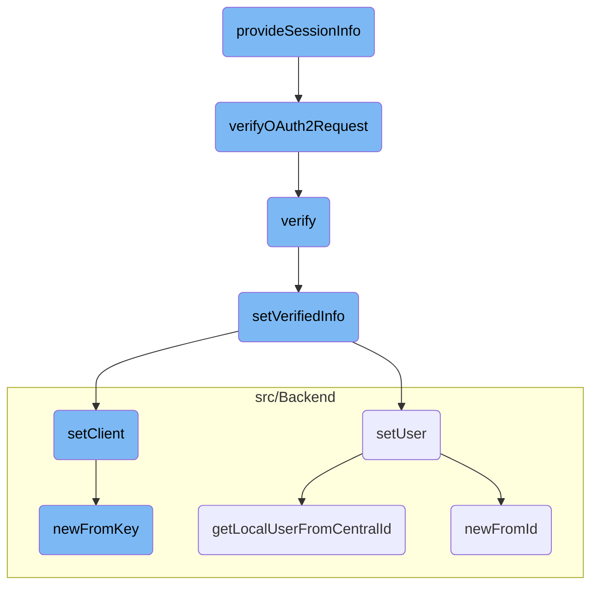

This document explains the process of handling <SwmToken path="src/SessionProvider.php" pos="71:7:7" line-data="			// Not an OAuth request">`OAuth`</SwmToken> requests and providing session information. The process involves verifying the <SwmToken path="src/SessionProvider.php" pos="71:7:7" line-data="			// Not an OAuth request">`OAuth`</SwmToken> request, setting verified information, and ensuring the user and client details are correctly processed.

The flow starts by checking if the incoming request is an <SwmToken path="src/SessionProvider.php" pos="71:7:7" line-data="			// Not an OAuth request">`OAuth`</SwmToken> request. If it is, the system verifies the request and extracts necessary information such as user and client details. This information is then used to create a session, ensuring that the user is authenticated and authorized to access the requested resources.

# Flow drill down



<SwmSnippet path="/src/SessionProvider.php" line="68">

---

## <SwmToken path="src/SessionProvider.php" pos="68:5:5" line-data="	public function provideSessionInfo( WebRequest $request ) {">`provideSessionInfo`</SwmToken>

The <SwmToken path="src/SessionProvider.php" pos="68:5:5" line-data="	public function provideSessionInfo( WebRequest $request ) {">`provideSessionInfo`</SwmToken> function is responsible for determining if a request is an <SwmToken path="src/SessionProvider.php" pos="71:7:7" line-data="			// Not an OAuth request">`OAuth`</SwmToken> request and processing it accordingly. It verifies the <SwmToken path="src/SessionProvider.php" pos="71:7:7" line-data="			// Not an OAuth request">`OAuth`</SwmToken> version, checks if the request is <SwmToken path="src/SessionProvider.php" pos="75:13:15" line-data="		// OAuth is restricted to be API-only.">`API-only`</SwmToken>, and handles various OAuth-specific checks and exceptions. If the request is valid, it creates a <SwmToken path="src/SessionProvider.php" pos="26:6:6" line-data="use MediaWiki\Session\SessionInfo;">`SessionInfo`</SwmToken> object with user and consumer details.

```hack
	public function provideSessionInfo( WebRequest $request ) {
		$oauthVersion = $this->getOAuthVersionFromRequest( $request );
		if ( $oauthVersion === null ) {
			// Not an OAuth request
			return null;
		}

		// OAuth is restricted to be API-only.
		if ( !defined( 'MW_API' ) && !defined( 'MW_REST_API' ) ) {
			$globalRequest = RequestContext::getMain()->getRequest();
			if ( $request !== $globalRequest ) {
				// We are looking at something other than the global request. No easy way to
				// find out the title, and showing an error should be handled in the global
				// request anyway. Bail out.
				return null;
			}
			// The global Title object is not set up yet.
			$title = Title::newFromText( $request->getText( 'title' ) );
			if ( $title && $title->isSpecial( 'OAuth' ) ) {
				// Some Special:OAuth subpages expect an OAuth request header, but process it
				// manually, not via SessionManager. We mustn't break those.
```

---

</SwmSnippet>

<SwmSnippet path="/src/SessionProvider.php" line="264">

---

## <SwmToken path="src/SessionProvider.php" pos="270:5:5" line-data="	private function verifyOAuth2Request( ResourceServer &amp;$resourceServer, WebRequest $request ) {">`verifyOAuth2Request`</SwmToken>

The <SwmToken path="src/SessionProvider.php" pos="270:5:5" line-data="	private function verifyOAuth2Request( ResourceServer &amp;$resourceServer, WebRequest $request ) {">`verifyOAuth2Request`</SwmToken> function verifies the <SwmToken path="src/SessionProvider.php" pos="137:11:11" line-data="					throw new MWOAuthException( &#39;mwoauth-oauth2-error-create-at-no-user-approval&#39; );">`oauth2`</SwmToken> request by checking the authorization header and ensuring the access token is valid. If the token is valid, it returns the access token ID; otherwise, it throws an exception.

```hack
	/**
	 * @param ResourceServer &$resourceServer
	 * @param WebRequest $request
	 * @return string
	 * @throws MWOAuthException
	 */
	private function verifyOAuth2Request( ResourceServer &$resourceServer, WebRequest $request ) {
		$request = ServerRequest::fromGlobals()->withHeader(
			'authorization',
			$request->getHeader( 'authorization' )
		);

		$response = new Response();
		$valid = false;
		$resourceServer->verify(
			$request,
			$response,
			static function ( $request, $response ) use ( &$valid ) {
				$valid = true;
			}
		);
```

---

</SwmSnippet>

<SwmSnippet path="/src/ResourceServer.php" line="75">

---

## verify

The <SwmToken path="src/ResourceServer.php" pos="81:5:5" line-data="	public function verify( $request, $response, $callback ) {">`verify`</SwmToken> function in <SwmToken path="src/SessionProvider.php" pos="265:6:6" line-data="	 * @param ResourceServer &amp;$resourceServer">`ResourceServer`</SwmToken> is used to verify the <SwmToken path="src/SessionProvider.php" pos="71:7:7" line-data="			// Not an OAuth request">`OAuth`</SwmToken> request. It invokes middleware to process the request and sets the verified information using the <SwmToken path="src/ResourceServer.php" pos="88:4:4" line-data="				$this-&gt;setVerifiedInfo( $request );">`setVerifiedInfo`</SwmToken> function.

```hack
	/**
	 * @param ServerRequestInterface $request
	 * @param ResponseInterface $response
	 * @param callable $callback
	 * @return ResponseInterface
	 */
	public function verify( $request, $response, $callback ) {
		$this->verified = false;

		return $this->middleware->__invoke(
			$request,
			$response,
			function ( $request, $response ) use ( $callback ) {
				$this->setVerifiedInfo( $request );
				return $callback( $request, $response );
			}
		);
	}
```

---

</SwmSnippet>

<SwmSnippet path="/src/ResourceServer.php" line="149">

---

## <SwmToken path="src/ResourceServer.php" pos="155:5:5" line-data="	public function setVerifiedInfo( ServerRequestInterface $request ) {">`setVerifiedInfo`</SwmToken>

The <SwmToken path="src/ResourceServer.php" pos="155:5:5" line-data="	public function setVerifiedInfo( ServerRequestInterface $request ) {">`setVerifiedInfo`</SwmToken> function extracts and sets the relevant information from the verified request, including user, client, scopes, and access token ID. This function ensures that all necessary details are available for further processing.

```hack
	/**
	 * Read out the verified request and get relevant information
	 *
	 * @param ServerRequestInterface $request
	 * @throws HttpException
	 */
	public function setVerifiedInfo( ServerRequestInterface $request ) {
		$this->setUser( $request );
		$this->setClient( $request );
		$this->setScopes( $request );
		$this->setAccessTokenId( $request );

		$this->verified = true;
	}
```

---

</SwmSnippet>

<SwmSnippet path="/src/ResourceServer.php" line="164">

---

### <SwmToken path="src/ResourceServer.php" pos="170:5:5" line-data="	private function setUser( ServerRequestInterface $request ) {">`setUser`</SwmToken>

The <SwmToken path="src/ResourceServer.php" pos="170:5:5" line-data="	private function setUser( ServerRequestInterface $request ) {">`setUser`</SwmToken> function sets the authorized user in the global context. It retrieves the user ID from the request and fetches the corresponding local user. If no user ID is present, it sets an anonymous user.

```hack
	/**
	 * Set authorized user to the global context
	 *
	 * @param ServerRequestInterface $request
	 * @throws HttpException
	 */
	private function setUser( ServerRequestInterface $request ) {
		$userId = $request->getAttribute( 'oauth_user_id', 0 );
		if ( !$userId ) {
			// Set anon user when no user id is present in the AT (machine grant)
			$this->user = User::newFromId( 0 );
			return;
		}

		try {
			$user = Utils::getLocalUserFromCentralId( $userId );
		} catch ( MWException $ex ) {
			throw new HttpException( $ex->getMessage(), 403 );
		}

		$this->user = $user;
```

---

</SwmSnippet>

<SwmSnippet path="/src/ResourceServer.php" line="187">

---

### <SwmToken path="src/ResourceServer.php" pos="193:5:5" line-data="	private function setClient( ServerRequestInterface $request ) {">`setClient`</SwmToken>

The <SwmToken path="src/ResourceServer.php" pos="193:5:5" line-data="	private function setClient( ServerRequestInterface $request ) {">`setClient`</SwmToken> function sets the client entity from the validated request. It retrieves the client ID from the request and ensures the client is valid and uses <SwmToken path="src/SessionProvider.php" pos="137:11:11" line-data="					throw new MWOAuthException( &#39;mwoauth-oauth2-error-create-at-no-user-approval&#39; );">`oauth2`</SwmToken>.

```hack
	/**
	 * Set the ClientEntity from validated request
	 *
	 * @param ServerRequestInterface $request
	 * @throws HttpException
	 */
	private function setClient( ServerRequestInterface $request ) {
		$this->client = ClientEntity::newFromKey(
			Utils::getCentralDB( DB_REPLICA ),
			$request->getAttribute( 'oauth_client_id' )
		);
		if ( !$this->client || $this->client->getOAuthVersion() !== Consumer::OAUTH_VERSION_2 ) {
			throw new HttpException( 'Client represented by given access token is invalid', 403 );
		}
	}
```

---

</SwmSnippet>

<SwmSnippet path="/src/Backend/Consumer.php" line="215">

---

## <SwmToken path="src/Backend/Consumer.php" pos="221:7:7" line-data="	public static function newFromKey( IDatabase $db, $key, $flags = 0 ) {">`newFromKey`</SwmToken>

The <SwmToken path="src/Backend/Consumer.php" pos="221:7:7" line-data="	public static function newFromKey( IDatabase $db, $key, $flags = 0 ) {">`newFromKey`</SwmToken> function retrieves a <SwmToken path="src/Backend/Consumer.php" pos="219:6:6" line-data="	 * @return Consumer|false">`Consumer`</SwmToken> object based on the provided key from the database. It constructs a query to fetch the consumer details and returns the consumer object if found.

```hack
	/**
	 * @param IDatabase $db
	 * @param string|null $key
	 * @param int $flags IDBAccessObject::READ_* bitfield
	 * @return Consumer|false
	 */
	public static function newFromKey( IDatabase $db, $key, $flags = 0 ) {
		$queryBuilder = $db->newSelectQueryBuilder()
			->select( array_values( static::getFieldColumnMap() ) )
			->from( static::getTable() )
			->where( [ 'oarc_consumer_key' => (string)$key ] )
			->caller( __METHOD__ );
		if ( $flags & IDBAccessObject::READ_LOCKING ) {
			$queryBuilder->forUpdate();
		}
		$row = $queryBuilder->fetchRow();

		if ( $row ) {
			return static::newFromRow( $db, $row );
		} else {
			return false;
```

---

</SwmSnippet>

<SwmSnippet path="/src/Backend/Utils.php" line="295">

---

## <SwmToken path="src/Backend/Utils.php" pos="301:7:7" line-data="	public static function getLocalUserFromCentralId( $userId ) {">`getLocalUserFromCentralId`</SwmToken>

The <SwmToken path="src/Backend/Utils.php" pos="301:7:7" line-data="	public static function getLocalUserFromCentralId( $userId ) {">`getLocalUserFromCentralId`</SwmToken> function retrieves a local <SwmToken path="src/Backend/Utils.php" pos="296:11:11" line-data="	 * Given a central wiki user ID, get a local User object">`user`</SwmToken> object based on a central wiki user ID. It uses a central ID lookup service to find and return the corresponding local user.

```hack
	/**
	 * Given a central wiki user ID, get a local User object
	 *
	 * @param int $userId
	 * @return User|false False if not found
	 */
	public static function getLocalUserFromCentralId( $userId ) {
		global $wgMWOAuthSharedUserIDs, $wgMWOAuthSharedUserSource;

		// global ID required via hook
		if ( $wgMWOAuthSharedUserIDs ) {
			$lookup = MediaWikiServices::getInstance()
				->getCentralIdLookupFactory()
				->getLookup( $wgMWOAuthSharedUserSource );
			$user = $lookup->localUserFromCentralId( $userId );
			if ( $user === null || !$lookup->isAttached( $user ) ) {
				return false;
			}
			return User::newFromIdentity( $user );
		}

```

---

</SwmSnippet>

<SwmSnippet path="/src/Backend/MWOAuthDAO.php" line="96">

---

## <SwmToken path="src/Backend/MWOAuthDAO.php" pos="103:9:9" line-data="	final public static function newFromId( IDatabase $db, $id, $flags = 0 ) {">`newFromId`</SwmToken>

The <SwmToken path="src/Backend/MWOAuthDAO.php" pos="103:9:9" line-data="	final public static function newFromId( IDatabase $db, $id, $flags = 0 ) {">`newFromId`</SwmToken> function retrieves a consumer object based on the provided ID from the database. It constructs a query to fetch the consumer details and returns the consumer object if found.

```hack
	/**
	 * @param IDatabase $db
	 * @param int $id
	 * @param int $flags IDBAccessObject::READ_* bitfield
	 * @return static|bool Returns false if not found
	 * @throws DBError
	 */
	final public static function newFromId( IDatabase $db, $id, $flags = 0 ) {
		$queryBuilder = $db->newSelectQueryBuilder()
			->select( array_values( static::getFieldColumnMap() ) )
			->from( static::getTable() )
			->where( [ static::getIdColumn() => (int)$id ] )
			->caller( __METHOD__ );
		if ( $flags & IDBAccessObject::READ_LOCKING ) {
			$queryBuilder->forUpdate();
		}
		$row = $queryBuilder->fetchRow();

		if ( $row ) {
			$class = static::getConsumerClass( (array)$row );
			$consumer = new $class();
```

---

</SwmSnippet>

&nbsp;

*This is an auto-generated document by Swimm AI 🌊 and has not yet been verified by a human*

<SwmMeta version="3.0.0" repo-id="Z2l0aHViJTNBJTNBbWVkaWF3aWtpLWV4dGVuc2lvbnMtT0F1dGglM0ElM0FTd2ltbS1EZW1v" repo-name="mediawiki-extensions-OAuth"><sup>Powered by [Swimm](/)</sup></SwmMeta>
