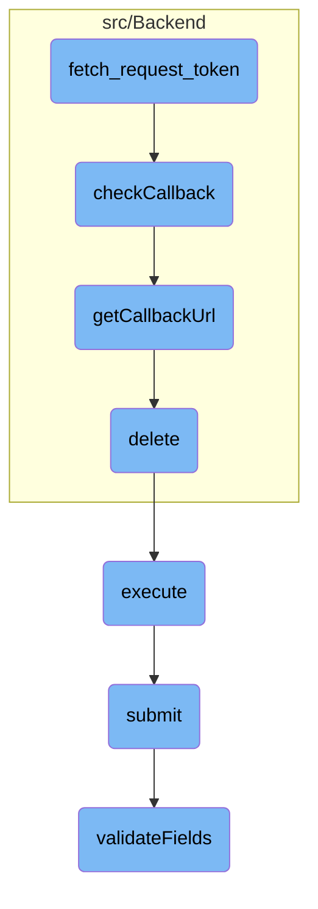

This document explains the process of handling request tokens. The process involves several steps to ensure the security and validity of the request, including checking the consumer's credentials, validating the callback URL, and executing the request.

The flow starts with processing a request token, ensuring the consumer is valid and not <SwmToken path="src/Backend/MWOAuthServer.php" pos="39:11:13" line-data="		// Consumer must not be owner-only">`owner-only`</SwmToken>. Then, it checks the callback URL to make sure it's either 'oob' or a valid prefix of the registered URL. After that, it retrieves the callback URL from the cache and deletes it to ensure it's used only once. Finally, the request is executed, assuming the user is authenticated, and the request data is validated and submitted.

# Flow drill down



<SwmSnippet path="/src/Backend/MWOAuthServer.php" line="25">

---

## Generating a New Request Token

The <SwmToken path="src/Backend/MWOAuthServer.php" pos="33:5:5" line-data="	public function fetch_request_token( &amp;$request ) {">`fetch_request_token`</SwmToken> function processes a request token request and returns the request token on success. It ensures that the consumer is not <SwmToken path="src/Backend/MWOAuthServer.php" pos="39:11:13" line-data="		// Consumer must not be owner-only">`owner-only`</SwmToken> and has a valid secret or RSA key. It also checks the source IP and validates the request signature before generating a new request token.

```hack
	/**
	 * Process a request_token request returns the request token on success. This
	 * also checks the IP restriction, which the OAuthServer method did not.
	 *
	 * @param MWOAuthRequest &$request
	 * @return MWOAuthToken
	 * @throws MWOAuthException
	 */
	public function fetch_request_token( &$request ) {
		$this->get_version( $request );

		/** @var Consumer $consumer */
		$consumer = $this->get_consumer( $request );

		// Consumer must not be owner-only
		if ( $consumer->getOwnerOnly() ) {
			throw new MWOAuthException( 'mwoauthserver-consumer-owner-only', [
				'consumer_name' => $consumer->getName(),
				'update_url' => SpecialPage::getTitleFor(
					'OAuthConsumerRegistration', 'update/' . $consumer->getConsumerKey()
				),
```

---

</SwmSnippet>

<SwmSnippet path="/src/Backend/MWOAuthServer.php" line="85">

---

## Validating the Callback URL

The <SwmToken path="src/Backend/MWOAuthServer.php" pos="77:4:4" line-data="		$this-&gt;checkCallback( $consumer, $callback );">`checkCallback`</SwmToken> function ensures that the callback URL is either 'oob' (out-of-band) or a valid prefix of the registered callback URL. It throws an exception if the callback is invalid, ensuring that only authorized callbacks are accepted.

```hack
	/**
	 * Ensure the callback is "oob" or that the registered callback is a valid
	 * prefix of the supplied callback. It throws an exception if callback is
	 * invalid.
	 *
	 * In MediaWiki, we require the callback to be established at
	 * registration. OAuth 1.0a (rfc5849, section 2.1) specifies that
	 * oauth_callback is required for the temporary credentials, and "If the
	 * client is unable to receive callbacks or a callback URI has been
	 * established via other means, the parameter value MUST be set to "oob"
	 * (case sensitive), to indicate an out-of-band configuration." Otherwise,
	 * client can provide a callback and the configured callback must be
	 * a prefix of the supplied callback. The matching performed here is based
	 * on parsed URL components rather than strict string matching. Protocol
	 * upgrades from http to https are also allowed, and the registered callback
	 * can be made to match any port number, by specifying port 1. (This is
	 * less secure, and only meant for demo consumers for local development.)
	 *
	 * @param Consumer $consumer
	 * @param string $callback
	 * @return void
```

---

</SwmSnippet>

<SwmSnippet path="/src/Backend/MWOAuthDataStore.php" line="216">

---

## Retrieving the Callback URL

The <SwmToken path="src/Backend/MWOAuthDataStore.php" pos="227:5:5" line-data="	public function getCallbackUrl( $consumerKey, $requestKey ) {">`getCallbackUrl`</SwmToken> function retrieves the stored callback URL parameter given by the consumer during the initiation phase. It throws an exception if the callback URL parameter does not exist in the cache, ensuring that only valid callbacks are processed.

```hack
	/**
	 * Return a stored callback URL parameter given by the consumer in /initiate.
	 * It throws an exception if callback URL parameter does not exist in the cache.
	 * A stored callback URL parameter is deleted from the cache once read for the first
	 * time.
	 *
	 * @param string $consumerKey
	 * @param string $requestKey original request key from /initiate
	 * @throws MWOAuthException
	 * @return string|false the stored callback URL parameter
	 */
	public function getCallbackUrl( $consumerKey, $requestKey ) {
		$cacheKey = Utils::getCacheKey( 'callback', $consumerKey, 'request', $requestKey );
		$callback = $this->tokenCache->get( $cacheKey );
		if ( $callback === null || !is_string( $callback ) ) {
			throw new MWOAuthException( 'mwoauthdatastore-callback-not-found', [
				'consumer' => $consumerKey,
			] );
		}
		$this->tokenCache->delete( $cacheKey );
		return $callback;
```

---

</SwmSnippet>

<SwmSnippet path="/src/Backend/MWOAuthDAO.php" line="233">

---

## Deleting the Callback URL from Cache

The <SwmToken path="src/Backend/MWOAuthDAO.php" pos="238:5:5" line-data="	public function delete( IDatabase $dbw ) {">`delete`</SwmToken> function removes the stored callback URL parameter from the cache once it has been read for the first time. This ensures that the callback URL is used only once, enhancing security.

```hack
	/**
	 * @param IDatabase $dbw
	 * @return bool
	 * @throws DBReadOnlyError
	 */
	public function delete( IDatabase $dbw ) {
		global $wgMWOAuthReadOnly;

		$uniqueId = $this->getIdValue();
		$idColumn = static::getIdColumn();
		if ( $wgMWOAuthReadOnly ) {
			throw new DBReadOnlyError( $dbw, __CLASS__ . ": tried to delete while db is read-only" );
		}
		if ( $this->daoOrigin === 'db' ) {
			$dbw->newDeleteQueryBuilder()
				->deleteFrom( static::getTable() )
				->where( [ $idColumn => $uniqueId ] )
				->caller( __METHOD__ )
				->execute();
			$this->daoPending = true;
			return $dbw->affectedRows() > 0;
```

---

</SwmSnippet>

<SwmSnippet path="/src/Rest/Handler/AbstractClientHandler.php" line="24">

---

## Executing the Request

The <SwmToken path="src/Rest/Handler/AbstractClientHandler.php" pos="28:5:5" line-data="	public function execute(): ResponseInterface {">`execute`</SwmToken> function handles the execution of the request. It assumes the user is authenticated and has a valid session, then processes the request and returns a JSON response with the consumer details.

```hack
	/**
	 * @return ResponseInterface
	 * @throws HttpException
	 */
	public function execute(): ResponseInterface {
		// At this point we assume user is authenticated and has valid session
		// Authentication can be achieved over CentralAuth or Access token in authorization header
		$responseFactory = $this->getResponseFactory();
		$params = $this->getUnifiedParams();

		$control = new ConsumerSubmitControl(
			RequestContext::getMain(),
			$params,
			Utils::getCentralDB( DB_PRIMARY )
		);

		$status = $control->submit();
		if ( $status->isGood() ) {
			$value = $status->getValue();
			if ( isset( $value['result']['consumer'] ) ) {
				/** @var ClientEntity $client */
```

---

</SwmSnippet>

<SwmSnippet path="/src/Control/SubmitControl.php" line="58">

---

## Submitting the Request

The <SwmToken path="src/Control/SubmitControl.php" pos="59:11:11" line-data="	 * Attempt to validate and submit this data">`submit`</SwmToken> function validates and submits the request data. It checks basic permissions, validates the action and parameters, and routes the submission handling to the appropriate internal function.

```hack
	/**
	 * Attempt to validate and submit this data
	 *
	 * This will check basic permissions, validate the action and parameters
	 * and route the submission handling to the internal subclass function.
	 *
	 * @throws MWException
	 * @return Status
	 */
	public function submit() {
		$status = $this->checkBasePermissions();
		if ( !$status->isOK() ) {
			return $status;
		}

		$action = $this->vals['action'];
		$required = $this->getRequiredFields();
		if ( !isset( $required[$action] ) ) {
			// @TODO: check for field-specific message first
			return $this->failure( 'invalid_field_action', 'mwoauth-invalid-field', 'action' );
		}
```

---

</SwmSnippet>

<SwmSnippet path="/src/Control/SubmitControl.php" line="253">

---

## Validating Required Fields

The <SwmToken path="src/Control/SubmitControl.php" pos="260:5:5" line-data="	protected function validateFields( array $required ) {">`validateFields`</SwmToken> function checks that the action is valid and that the required fields are present and correctly formatted. It returns a status indicating whether the validation was successful or not.

```hack
	/**
	 * Check that the action is valid and that the required fields are valid
	 *
	 * @param array $required (field => regex or callback)
	 * @phan-param array<string,string|callable(mixed,array):bool|StatusValue> $required
	 * @return Status
	 */
	protected function validateFields( array $required ) {
		foreach ( $required as $field => $validator ) {
			if ( !isset( $this->vals[$field] ) ) {
				return $this->failure( "missing_field_$field", 'mwoauth-missing-field', $field );
			} elseif ( !is_scalar( $this->vals[$field] )
				&& !in_array( $field, [ 'restrictions', 'oauth2GrantTypes' ], true )
			) {
				return $this->failure( "invalid_field_$field", 'mwoauth-invalid-field', $field );
			}
			if ( is_string( $this->vals[$field] ) ) {
				$this->vals[$field] = trim( $this->vals[$field] );
			}
			$validationResult = $this->getValidationResult( $validator, $this->vals[$field], $this->vals );
			if ( $validationResult === false ) {
```

---

</SwmSnippet>

&nbsp;

*This is an auto-generated document by Swimm AI 🌊 and has not yet been verified by a human*

<SwmMeta version="3.0.0" repo-id="Z2l0aHViJTNBJTNBbWVkaWF3aWtpLWV4dGVuc2lvbnMtT0F1dGglM0ElM0FTd2ltbS1EZW1v" repo-name="mediawiki-extensions-OAuth"><sup>Powered by [Swimm](/)</sup></SwmMeta>
