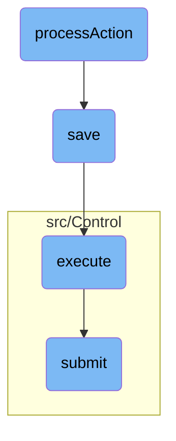

In this document, we will explain the process of handling user actions such as 'accept', 'update', and 'renounce'. The process involves checking user permissions, validating the consumer key, saving the consumer data, executing the submission, and finally submitting the data.

The flow starts with handling user actions like 'accept', 'update', and 'renounce'. First, it checks if the user has the necessary permissions and validates the consumer key. If everything is in order, it saves the consumer data to the database. Next, it initiates the submission process by creating a control object and calling its submit method. Finally, it validates the action and parameters, checks permissions again, and routes the submission to the appropriate internal function, returning the status of the submission.

# Flow drill down



<SwmSnippet path="/src/Control/ConsumerAcceptanceSubmitControl.php" line="110">

---

## Handling User Actions

The <SwmToken path="src/Control/ConsumerAcceptanceSubmitControl.php" pos="110:5:5" line-data="	protected function processAction( $action ) {">`processAction`</SwmToken> function handles different user actions such as 'accept', 'update', and 'renounce'. It checks user permissions, validates the consumer key, and logs the actions performed by the user. For example, when a user accepts an <SwmToken path="src/Control/ConsumerAcceptanceSubmitControl.php" pos="22:6:6" line-data="namespace MediaWiki\Extension\OAuth\Control;">`OAuth`</SwmToken> consumer, the function authorizes the consumer and logs the action.

```hack
	protected function processAction( $action ) {
		// proposer or admin
		$user = $this->getUser();
		$dbw = $this->dbw;

		$centralUserId = Utils::getCentralIdFromLocalUser( $user );
		if ( !$centralUserId ) {
			return $this->failure( 'permission_denied', 'badaccess-group0' );
		}

		switch ( $action ) {
			case 'accept':
				$payload = [];
				$identifier = $this->isOAuth2() ? 'client_id' : 'consumerKey';
				$cmr = Consumer::newFromKey( $this->dbw, $this->vals[$identifier] );
				if ( !$cmr ) {
					return $this->failure( 'invalid_consumer_key', 'mwoauth-invalid-consumer-key' );
				} elseif ( !$cmr->isUsableBy( $user ) ) {
					return $this->failure( 'permission_denied', 'badaccess-group0' );
				}

```

---

</SwmSnippet>

<SwmSnippet path="/src/Backend/MWOAuthDAO.php" line="181">

---

## Saving Consumer Data

The <SwmToken path="src/Backend/MWOAuthDAO.php" pos="186:5:5" line-data="	public function save( IDatabase $dbw ) {">`save`</SwmToken> function is responsible for saving the consumer data to the database. It checks if the database is in <SwmToken path="src/Backend/MWOAuthDAO.php" pos="192:31:33" line-data="			throw new DBReadOnlyError( $dbw, __CLASS__ . &quot;: tried to save while db is read-only&quot; );">`read-only`</SwmToken> mode and performs either an update or an insert operation based on whether the consumer data already exists in the database.

```hack
	/**
	 * @param IDatabase $dbw
	 * @return bool
	 * @throws DBReadOnlyError
	 */
	public function save( IDatabase $dbw ) {
		global $wgMWOAuthReadOnly;

		$uniqueId = $this->getIdValue();
		$idColumn = static::getIdColumn();
		if ( $wgMWOAuthReadOnly ) {
			throw new DBReadOnlyError( $dbw, __CLASS__ . ": tried to save while db is read-only" );
		}
		if ( $this->daoOrigin === 'db' ) {
			if ( $this->daoPending ) {
				$this->logger->debug( get_class( $this ) . ': performing DB update; object changed.' );
				$dbw->newUpdateQueryBuilder()
					->update( static::getTable() )
					->set( $this->getRowArray( $dbw ) )
					->where( [ $idColumn => $uniqueId ] )
					->caller( __METHOD__ )
```

---

</SwmSnippet>

<SwmSnippet path="/src/Rest/Handler/AbstractClientHandler.php" line="24">

---

## Executing the Submission

The <SwmToken path="src/Rest/Handler/AbstractClientHandler.php" pos="28:5:5" line-data="	public function execute(): ResponseInterface {">`execute`</SwmToken> function initiates the submission process by creating a <SwmToken path="src/Rest/Handler/AbstractClientHandler.php" pos="34:8:8" line-data="		$control = new ConsumerSubmitControl(">`ConsumerSubmitControl`</SwmToken> object and calling its <SwmToken path="src/Rest/Handler/AbstractClientHandler.php" pos="40:9:9" line-data="		$status = $control-&gt;submit();">`submit`</SwmToken> method. It handles the response based on the status of the submission, returning a JSON response if successful or throwing an exception if there is an error.

```hack
	/**
	 * @return ResponseInterface
	 * @throws HttpException
	 */
	public function execute(): ResponseInterface {
		// At this point we assume user is authenticated and has valid session
		// Authentication can be achieved over CentralAuth or Access token in authorization header
		$responseFactory = $this->getResponseFactory();
		$params = $this->getUnifiedParams();

		$control = new ConsumerSubmitControl(
			RequestContext::getMain(),
			$params,
			Utils::getCentralDB( DB_PRIMARY )
		);

		$status = $control->submit();
		if ( $status->isGood() ) {
			$value = $status->getValue();
			if ( isset( $value['result']['consumer'] ) ) {
				/** @var ClientEntity $client */
```

---

</SwmSnippet>

<SwmSnippet path="/src/Control/SubmitControl.php" line="58">

---

## Submitting the Data

The <SwmToken path="src/Control/SubmitControl.php" pos="59:11:11" line-data="	 * Attempt to validate and submit this data">`submit`</SwmToken> function validates the action and parameters, checks permissions, and routes the submission to the appropriate internal function. It calls <SwmToken path="src/Control/ConsumerAcceptanceSubmitControl.php" pos="110:5:5" line-data="	protected function processAction( $action ) {">`processAction`</SwmToken> to handle the specific action and returns the status of the submission.

```hack
	/**
	 * Attempt to validate and submit this data
	 *
	 * This will check basic permissions, validate the action and parameters
	 * and route the submission handling to the internal subclass function.
	 *
	 * @throws MWException
	 * @return Status
	 */
	public function submit() {
		$status = $this->checkBasePermissions();
		if ( !$status->isOK() ) {
			return $status;
		}

		$action = $this->vals['action'];
		$required = $this->getRequiredFields();
		if ( !isset( $required[$action] ) ) {
			// @TODO: check for field-specific message first
			return $this->failure( 'invalid_field_action', 'mwoauth-invalid-field', 'action' );
		}
```

---

</SwmSnippet>

&nbsp;

*This is an auto-generated document by Swimm AI 🌊 and has not yet been verified by a human*

<SwmMeta version="3.0.0" repo-id="Z2l0aHViJTNBJTNBbWVkaWF3aWtpLWV4dGVuc2lvbnMtT0F1dGglM0ElM0FTd2ltbS1EZW1v" repo-name="mediawiki-extensions-OAuth"><sup>Powered by [Swimm](/)</sup></SwmMeta>
