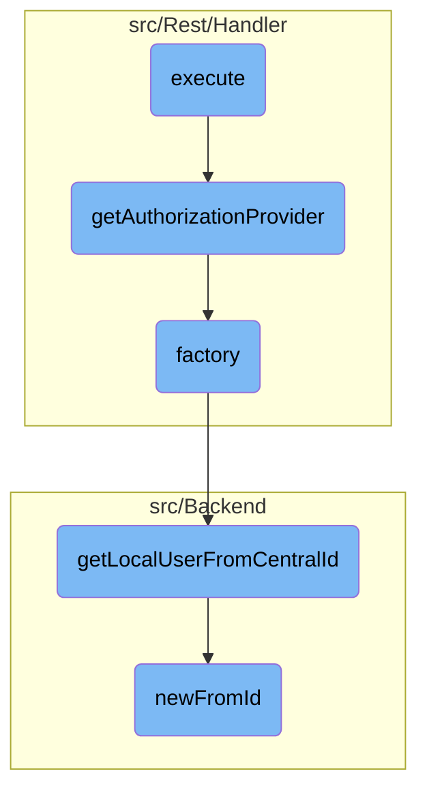

In this document, we will explain the process of handling user authentication and authorization. The process involves creating a response object, checking for errors, redirecting unauthenticated users to the login page, initializing the authorization provider, and processing the authorization request.

The flow starts by creating a response object and checking for any errors. If there are errors, they are handled accordingly. If the user is not authenticated, they are redirected to the login page. Once authenticated, the authorization provider is initialized, and the authorization request is processed. If user approval is needed, it is handled; otherwise, the request is directly authorized.

# Flow drill down



<SwmSnippet path="/src/Rest/Handler/Authorize.php" line="34">

---

## Handling User Authentication and Authorization

The <SwmToken path="src/Rest/Handler/Authorize.php" pos="34:5:5" line-data="	public function execute() {">`execute`</SwmToken> function is responsible for handling the main logic of user authentication and authorization. It starts by creating a new response object and then checks for any queued errors. If the user is not authenticated, it redirects them to the login page. It then initializes the authorization provider and processes the authorization request. If user approval is needed, it handles the approval process; otherwise, it directly authorizes the request.

```hack
	public function execute() {
		$response = new Response();

		try {
			if ( $this->queuedError ) {
				throw $this->queuedError;
			}
			$request = ServerRequest::fromGlobals()->withQueryParams(
				$this->getValidatedParams()
			);
			// Note: Owner-only clients can only use client_credentials grant
			// so would be rejected from this endpoint with invalid_client error
			// automatically, no need for additional checks
			if ( !$this->user instanceof User || !$this->user->isNamed() ) {
				return $this->getLoginRedirectResponse();
			}

			$authProvider = $this->getAuthorizationProvider();
			$authProvider->setUser( $this->user );
			/** @var AuthorizationRequest $authRequest */
			$authRequest = $authProvider->init( $request );
```

---

</SwmSnippet>

<SwmSnippet path="/src/Rest/Handler/AuthenticationHandler.php" line="83">

---

### Getting Authorization Provider

The <SwmToken path="src/Rest/Handler/AuthenticationHandler.php" pos="83:5:5" line-data="	protected function getAuthorizationProvider() {">`getAuthorizationProvider`</SwmToken> function retrieves the appropriate authorization provider based on the grant type. It ensures that the provider class has a factory method and then calls this method to get an instance of the provider.

```hack
	protected function getAuthorizationProvider() {
		$grantType = $this->getGrantType();

		$class = $this->getGrantClass( $grantType );
		if ( !$class || !is_callable( [ $class, 'factory' ] ) ) {
			throw new LogicException( 'Could not find grant class factory' );
		}

		/** @var AccessTokenProvider|AuthorizationCodeAuthorization $authProvider */
		$authProvider = $class::factory();
		'@phan-var AccessTokenProvider|AuthorizationCodeAuthorization $authProvider';
		return $authProvider;
	}
```

---

</SwmSnippet>

<SwmSnippet path="/src/Rest/Handler/AuthenticationHandler.php" line="44">

---

### Creating Authentication Handler

The <SwmToken path="src/Rest/Handler/AuthenticationHandler.php" pos="44:7:7" line-data="	public static function factory() {">`factory`</SwmToken> function creates an instance of the <SwmToken path="src/Rest/Handler/Authorize.php" pos="28:6:6" line-data="class Authorize extends AuthenticationHandler {">`AuthenticationHandler`</SwmToken>. It retrieves the central user ID and then gets the local user object. It also fetches the configuration settings required for <SwmToken path="src/Rest/Handler/Authorize.php" pos="3:6:6" line-data="namespace MediaWiki\Extension\OAuth\Rest\Handler;">`OAuth`</SwmToken>.

```hack
	public static function factory() {
		$centralId = Utils::getCentralIdFromLocalUser( RequestContext::getMain()->getUser() );
		$user = $centralId ? Utils::getLocalUserFromCentralId( $centralId ) : User::newFromId( 0 );
		$config = MediaWikiServices::getInstance()->getConfigFactory()->makeConfig( 'mwoauth' );
		// @phan-suppress-next-line PhanTypeInstantiateAbstractStatic
		return new static( $user, $config );
```

---

</SwmSnippet>

<SwmSnippet path="/src/Backend/Utils.php" line="301">

---

### Getting Local User from Central ID

The <SwmToken path="src/Backend/Utils.php" pos="301:7:7" line-data="	public static function getLocalUserFromCentralId( $userId ) {">`getLocalUserFromCentralId`</SwmToken> function retrieves a local user object based on a central wiki user ID. It uses a central ID lookup service to find the local user and ensures that the user is attached. If the user is found, it returns a new user object; otherwise, it returns false.

```hack
	public static function getLocalUserFromCentralId( $userId ) {
		global $wgMWOAuthSharedUserIDs, $wgMWOAuthSharedUserSource;

		// global ID required via hook
		if ( $wgMWOAuthSharedUserIDs ) {
			$lookup = MediaWikiServices::getInstance()
				->getCentralIdLookupFactory()
				->getLookup( $wgMWOAuthSharedUserSource );
			$user = $lookup->localUserFromCentralId( $userId );
			if ( $user === null || !$lookup->isAttached( $user ) ) {
				return false;
			}
			return User::newFromIdentity( $user );
		}

		return User::newFromId( $userId );
	}
```

---

</SwmSnippet>

<SwmSnippet path="/src/Backend/MWOAuthDAO.php" line="103">

---

### Creating User from ID

The <SwmToken path="src/Backend/MWOAuthDAO.php" pos="103:9:9" line-data="	final public static function newFromId( IDatabase $db, $id, $flags = 0 ) {">`newFromId`</SwmToken> function creates a new user object from a given ID. It constructs a database query to fetch the user data and then initializes a new user object with this data. If the user is not found, it returns false.

```hack
	final public static function newFromId( IDatabase $db, $id, $flags = 0 ) {
		$queryBuilder = $db->newSelectQueryBuilder()
			->select( array_values( static::getFieldColumnMap() ) )
			->from( static::getTable() )
			->where( [ static::getIdColumn() => (int)$id ] )
			->caller( __METHOD__ );
		if ( $flags & IDBAccessObject::READ_LOCKING ) {
			$queryBuilder->forUpdate();
		}
		$row = $queryBuilder->fetchRow();

		if ( $row ) {
			$class = static::getConsumerClass( (array)$row );
			$consumer = new $class();
			$consumer->loadFromRow( $db, $row );
			return $consumer;
		} else {
			return false;
		}
	}
```

---

</SwmSnippet>

&nbsp;

*This is an auto-generated document by Swimm AI 🌊 and has not yet been verified by a human*

<SwmMeta version="3.0.0" repo-id="Z2l0aHViJTNBJTNBbWVkaWF3aWtpLWV4dGVuc2lvbnMtT0F1dGglM0ElM0FTd2ltbS1EZW1v" repo-name="mediawiki-extensions-OAuth"><sup>Powered by [Swimm](/)</sup></SwmMeta>
